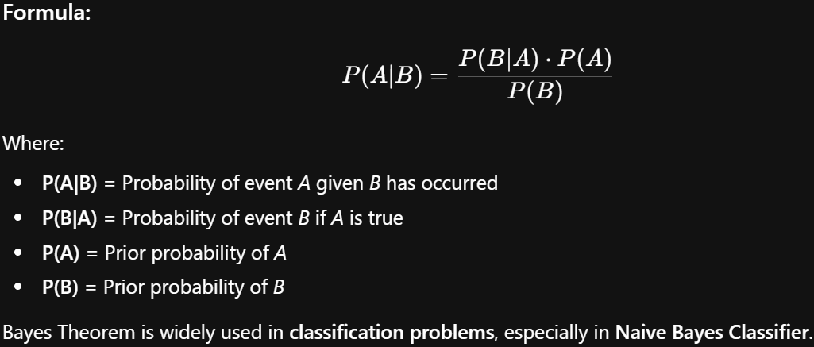

# BIA


# UNIT 1

1. What is BI and it's main purpose
### What is Business Intelligence (BI)?

**Business Intelligence (BI)** is a technology-driven process of collecting, analyzing, and presenting data to help business leaders and workers make better, more informed decisions.

Instead of relying on gut feelings or guesswork, BI uses software and services to transform raw, messy data into clear visual reports, dashboards, and charts. It encompasses a wide variety of tools, applications, and methodologies, including data mining, online analytical processing (OLAP), querying, and reporting.

- **In simple terms:** BI is the bridge between **Data** (raw numbers) and **Action** (business strategy).
    

---

### The Main Purpose of BI

The absolute primary purpose of BI is to **support better business decision-making**. It takes historical and current data and turns it into actionable insights.

Here are the specific goals that drive the purpose of BI:

- **1. Improve Operational Efficiency:** BI helps companies see exactly where they are wasting time or money. For example, a logistics company can use BI to analyze delivery routes and identify the most fuel-efficient paths.
    
- **2. Identify Market Trends:** By analyzing customer data over time, BI can highlight shifts in consumer behavior. A retailer might notice that a specific product suddenly spikes in sales every time it rains, allowing them to adjust inventory proactively.
    
- **3. Drive Revenue and Profit:** BI helps businesses identify their most profitable customers, products, or regions. It allows marketing teams to target campaigns more effectively and sales teams to focus on high-yield opportunities.
    
- **4. Gain a Competitive Advantage:** A company that knows exactly how long its supply chain takes, what its customers want, and where the market is going will easily outperform a competitor operating in the dark.
    
- **5. Establish a "Single Source of Truth":** In many companies, different departments have different spreadsheets with conflicting numbers. BI centralizes data into a single data warehouse, ensuring that the CEO, the Marketing Director, and the Sales Manager are all looking at the exact same, accurate numbers.
    

---

2. What is BI? Expand how it enables effective and timely decisions

### What is Business Intelligence (BI)?

**Business Intelligence (BI)** is a technology-driven process of collecting, analyzing, and presenting data to help business leaders and workers make better, more informed decisions.

Instead of relying on gut feelings or guesswork, BI uses software and services to transform raw, messy data into clear visual reports, dashboards, and charts. It encompasses a wide variety of tools, applications, and methodologies, including data mining, online analytical processing (OLAP), querying, and reporting.

---

### How BI Enables Effective and Timely Decisions

BI eliminates the traditional "guesswork" of management by providing concrete evidence. Here is exactly how BI systems ensure decisions are both highly effective and delivered on time:

#### 1. Real-Time Data Automation (The "Timely" Aspect)

- **The Old Way:** A manager asks for a sales report. The IT team extracts the data, an analyst puts it into Excel, builds a chart, and emails it three days later. By then, the opportunity might have passed.
    
- **The BI Way:** BI tools connect directly to live databases. Dashboards update automatically in real-time or on a set schedule (e.g., hourly). If a supply chain bottleneck occurs on a Tuesday morning, the operations manager sees the red flag on their dashboard on Tuesday morning, allowing for an immediate fix.
    

#### 2. Visualizing Complex Data (The "Effective" Aspect)

- Human brains process visual information significantly faster than rows of text or numbers. BI platforms use data visualization (charts, heat maps, scatter plots) to highlight anomalies immediately.
    
- **Example:** Instead of scrolling through 10,000 rows of regional sales data to find the underperforming state, a BI map will simply highlight that state in red. The decision-maker instantly knows where to focus their attention.
    

#### 3. Establishing a "Single Source of Truth"

- In many companies, different departments have different spreadsheets with conflicting numbers. BI centralizes data into a single data warehouse, ensuring that the CEO, the Marketing Director, and the Sales Manager are all looking at the exact same, accurate numbers.
    

#### 4. Self-Service Analytics

- Modern BI platforms (like Tableau or Power BI) are designed to be user-friendly. They enable "Self-Service BI," meaning non-technical users (like a Marketing Director) can drag-and-drop metrics to build their own custom reports instantly.
    
- This removes the IT department as a bottleneck, dramatically speeding up the time it takes to get answers to business questions.
    

#### 5. Trend Identification and "What-If" Analysis

- BI doesn't just show what happened today; it overlays today's data with historical trends. This allows leaders to spot long-term patterns (e.g., "Our server load always spikes 40% in the third week of November").
    
- Many BI systems also allow for scenario modeling. Decision-makers can adjust variables in the dashboard (e.g., "What happens to our profit margin if we increase shipping costs by 2%?") to simulate the outcome before actually making the decision.
    

---

3.

### Data vs. Information vs. Knowledge

| **Feature**          | **Data**                                                                          | **Information**                                                                              | **Knowledge**                                                                                                  |
| -------------------- | --------------------------------------------------------------------------------- | -------------------------------------------------------------------------------------------- | -------------------------------------------------------------------------------------------------------------- |
| **Definition**       | Raw, unorganized facts, numbers, or symbols straight from the source.             | Data that has been processed, structured, and given context.                                 | The application of information combined with experience, rules, and understanding to make decisions.           |
| **Meaning**          | Lacks context; has no inherent meaning or usefulness on its own.                  | Has specific meaning and purpose; answers basic questions like _Who, What, Where, and When_. | Highly contextual and actionable; answers the deeper questions of _How and Why_.                               |
| **Format**           | Isolated numbers, characters, raw text, or raw sensor readings.                   | Formatted reports, BI dashboards, charts, or summarized sentences.                           | Business strategies, best practices, human expertise, or predictive models.                                    |
| **Example**          | "1500", "Product A", "December"                                                   | "We sold 1,500 units of Product A in December."                                              | "Product A always spikes in December due to holidays; we must increase our supply chain capacity by November." |
| **Processing Stage** | **Input:** The raw material that needs to be processed by a database or computer. | **Output:** The organized result of computer processing or an ETL pipeline.                  | **Application:** Requires human cognition, experience, or advanced Machine Learning to create.                 |
| **Transferability**  | Very easy to transfer (e.g., sending a CSV file).                                 | Easy to transfer (e.g., emailing a PDF report or sharing a dashboard).                       | Difficult to transfer (requires training, learning, and experience to pass on to someone else).                |

---

4. Explain All the components of BI Architecture
![[IMG-20260303-191026.png]]

### 1. Data Sources (The Raw Material)

This is where the data originates. A modern business generates data from dozens of disconnected systems. The BI architecture must be able to connect to all of them.

- **Operational Systems:** CRM software (like Salesforce), ERP systems, HR databases, and billing systems.
    
- **Flat Files:** Excel spreadsheets, CSV files, and text documents.
    
- **External Data:** Web analytics (Google Analytics), social media APIs, or purchased third-party market data.
    
- **Machine/Log Data:** Server logs, IoT sensor data, and application event streams.
    

### 2. Data Integration / ETL (The Pipeline)

Raw data is messy and incompatible. The **ETL (Extract, Transform, Load)** process acts as the plumbing that moves data from the sources to the storage center while cleaning it up along the way.

- **Extract:** Pulling the data out of the various source systems without disrupting their daily operations.
    
- **Transform:** Cleaning the data. This involves filtering out noise, handling missing values, standardizing formats (e.g., changing all dates to MM/DD/YYYY), and resolving inconsistencies.
    
- **Load:** Writing the cleaned, standardized data into the central storage system.
    
Example: - **Cloud Provider Native:** [AWS Glue](https://aws.amazon.com/glue/)[Google Cloud Dataflow](https://cloud.google.com/products/dataflow)Azure Data Factory

### 3. Data Storage (The Warehouse)

Once the data is cleaned, it needs a permanent, centralized home optimized for analytics, not just daily operations.

- **Data Warehouse (DW):** A massive, central repository that stores historical, structured data from across the entire enterprise. It acts as the "Single Source of Truth."
    
- **Data Marts:** Smaller, specialized subsets of the Data Warehouse built for a specific department (e.g., a Data Mart exclusively for the HR team or the Marketing team).
    
- _(Note: Modern architectures also use **Data Lakes** here to store massive amounts of unstructured data before it is processed)._
    ==cloud-based solutions like [Amazon Redshift](https://www.google.com/search?q=Amazon+Redshift&sca_esv=ff24eace6b27a26e&biw=1639&bih=797&ei=QuemacXrJtGf4-EPy6WByAE&oq=examples+of+Data+&gs_lp=Egxnd3Mtd2l6LXNlcnAiEWV4YW1wbGVzIG9mIERhdGEgKgIIADILEAAYgAQYkQIYigUyCxAAGIAEGJECGIoFMgsQABiABBiRAhiKBTILEAAYgAQYkQIYigUyBRAAGIAEMgUQABiABDIFEAAYgAQyBRAAGIAEMgUQABiABDIFEAAYgARIjydQtBFY0htwAXgBkAEAmAHFAqABkwuqAQcwLjUuMS4xuAEDyAEA-AEBmAIIoALHC8ICChAAGLADGNYEGEfCAgoQABiABBhDGIoFwgIGEAAYFhgewgIIEAAYgAQYsQOYAwCIBgGQBgiSBwcxLjUuMS4xoAfnKbIHBzAuNS4xLjG4B8MLwgcHMC4yLjUuMcgHJ4AIAA&sclient=gws-wiz-serp&ved=2ahUKEwjdzoSJ8IOTAxW-zjgGHc_XJ7YQgK4QegYIAQgAEA8), [Google BigQuery](https://www.google.com/search?q=Google+BigQuery&sca_esv=ff24eace6b27a26e&biw=1639&bih=797&ei=QuemacXrJtGf4-EPy6WByAE&oq=examples+of+Data+&gs_lp=Egxnd3Mtd2l6LXNlcnAiEWV4YW1wbGVzIG9mIERhdGEgKgIIADILEAAYgAQYkQIYigUyCxAAGIAEGJECGIoFMgsQABiABBiRAhiKBTILEAAYgAQYkQIYigUyBRAAGIAEMgUQABiABDIFEAAYgAQyBRAAGIAEMgUQABiABDIFEAAYgARIjydQtBFY0htwAXgBkAEAmAHFAqABkwuqAQcwLjUuMS4xuAEDyAEA-AEBmAIIoALHC8ICChAAGLADGNYEGEfCAgoQABiABBhDGIoFwgIGEAAYFhgewgIIEAAYgAQYsQOYAwCIBgGQBgiSBwcxLjUuMS4xoAfnKbIHBzAuNS4xLjG4B8MLwgcHMC4yLjUuMcgHJ4AIAA&sclient=gws-wiz-serp&ved=2ahUKEwjdzoSJ8IOTAxW-zjgGHc_XJ7YQgK4QegYIAQgAEBA), [Snowflake](https://www.google.com/search?q=Snowflake&sca_esv=ff24eace6b27a26e&biw=1639&bih=797&ei=QuemacXrJtGf4-EPy6WByAE&oq=examples+of+Data+&gs_lp=Egxnd3Mtd2l6LXNlcnAiEWV4YW1wbGVzIG9mIERhdGEgKgIIADILEAAYgAQYkQIYigUyCxAAGIAEGJECGIoFMgsQABiABBiRAhiKBTILEAAYgAQYkQIYigUyBRAAGIAEMgUQABiABDIFEAAYgAQyBRAAGIAEMgUQABiABDIFEAAYgARIjydQtBFY0htwAXgBkAEAmAHFAqABkwuqAQcwLjUuMS4xuAEDyAEA-AEBmAIIoALHC8ICChAAGLADGNYEGEfCAgoQABiABBhDGIoFwgIGEAAYFhgewgIIEAAYgAQYsQOYAwCIBgGQBgiSBwcxLjUuMS4xoAfnKbIHBzAuNS4xLjG4B8MLwgcHMC4yLjUuMcgHJ4AIAA&sclient=gws-wiz-serp&ved=2ahUKEwjdzoSJ8IOTAxW-zjgGHc_XJ7YQgK4QegYIAQgAEBE), and [Microsoft Azure Synapse](https://www.google.com/search?q=Microsoft+Azure+Synapse&sca_esv=ff24eace6b27a26e&biw=1639&bih=797&ei=QuemacXrJtGf4-EPy6WByAE&oq=examples+of+Data+&gs_lp=Egxnd3Mtd2l6LXNlcnAiEWV4YW1wbGVzIG9mIERhdGEgKgIIADILEAAYgAQYkQIYigUyCxAAGIAEGJECGIoFMgsQABiABBiRAhiKBTILEAAYgAQYkQIYigUyBRAAGIAEMgUQABiABDIFEAAYgAQyBRAAGIAEMgUQABiABDIFEAAYgARIjydQtBFY0htwAXgBkAEAmAHFAqABkwuqAQcwLjUuMS4xuAEDyAEA-AEBmAIIoALHC8ICChAAGLADGNYEGEfCAgoQABiABBhDGIoFwgIGEAAYFhgewgIIEAAYgAQYsQOYAwCIBgGQBgiSBwcxLjUuMS4xoAfnKbIHBzAuNS4xLjG4B8MLwgcHMC4yLjUuMcgHJ4AIAA&sclient=gws-wiz-serp&ved=2ahUKEwjdzoSJ8IOTAxW-zjgGHc_XJ7YQgK4QegYIAQgAEBI)==,

### 4. Analytical Layer / OLAP (The Engine)

Also known as the semantic layer, this component sits between the database and the end-user. It organizes the data so it can be queried incredibly fast.

- **OLAP (Online Analytical Processing):** Instead of storing data in standard 2D tables, OLAP organizes data into multidimensional "cubes." This allows a user to instantly calculate complex queries (e.g., "Show me sales by region, by month, by product category"). 
  Examples:  Amazon Redshift, [Snowflake](https://www.snowflake.com/en/fundamentals/online-analytical-processing/), [Google BigQuery](https://www.youtube.com/watch?v=6-VVu68hbgw).
    
- **Data Models:** This layer defines the business rules, ensuring that when a user asks for "Gross Profit," the system knows the exact mathematical formula to use.
    

### 5. Presentation Layer (The Front-End)

This is the only part of the BI architecture that most business users actually see. It is the software used to visualize the data and make decisions.

- **Dashboards:** Real-time, interactive visual displays (like Power BI, Tableau, or Qlik) using charts, graphs, and gauges to show KPIs (Key Performance Indicators) at a glance.
    
- **Static Reports:** Standardized, paginated documents (like PDFs or Excel exports) generated daily, weekly, or monthly.
    
- **Self-Service BI:** Interfaces that allow non-technical managers to drag and drop variables to create their own custom charts without needing the IT department.
    

---

5. Write a short note on bi cycle
### The Business Intelligence Cycle

The BI Cycle is a continuous, closed-loop process that organizations use to transform raw data into actionable business strategies.

Unlike a straight assembly line that has a distinct end, the BI cycle is iterative. The actions a business takes based on today's data will generate _new_ data tomorrow, which then feeds right back into the beginning of the cycle.

Here are the five core stages of the BI Cycle:

**1. Direction and Planning**

- **The Goal:** Before looking at any data, business leaders must define the exact problem they want to solve or the question they want answered (e.g., "Why did our customer retention drop in Q3?" or "How can we optimize our supply chain?").
    
- **The Action:** Setting Key Performance Indicators ([[KPI]]) and deciding what specific data will be needed.
    

**2. Data Collection**

- **The Goal:** Gathering the raw material needed to answer the business question.
    
- **The Action:** Extracting data from internal sources (like CRM or ERP systems) and external sources (like market research or social media), and storing it in a central Data Warehouse.
    

**3. Data Processing and Analysis**

- **The Goal:** Turning the raw, messy data into structured information.
    
- **The Action:** This involves the ETL process (cleaning and formatting the data) followed by data mining and analytical modeling. Analysts look for trends, correlations, and anomalies that answer the questions asked in Step 1.
    

**4. Data Dissemination (Distribution)**

- **The Goal:** Getting the right insights to the right people at the right time.
    
- **The Action:** Presenting the analyzed data through visual, easy-to-understand formats like dashboards, static reports, or scorecards so that executives and managers can easily digest the findings.
    

**5. Decision Making and Action**

- **The Goal:** Applying the insights to the real world.
    
- **The Action:** Management uses the reports to make an informed, data-driven business decision (e.g., changing a marketing strategy, discontinuing a product, or shifting a budget). The results of this action will be measured, starting the cycle all over again.
    

---

6. Explain the diff phases in development of BI Systems

Developing a Business Intelligence (BI) system is a complex software engineering project. Because BI deals with massive amounts of sensitive, cross-departmental data, it follows a highly structured lifecycle.

Here are the six standard phases in the development of a BI system:

### 1. Business Planning and Requirement Gathering

Before touching any data or software, the technical team must sit down with business stakeholders to understand the exact goals of the system.

- **Define the Objectives:** What business problems are we trying to solve? (e.g., "We need to track customer churn" or "We need real-time supply chain visibility.")
    
- **Identify KPIs:** What Key Performance Indicators[[KPI]] will measure success?
    
- **Source System Analysis:** Identifying where the necessary data currently lives (e.g., which CRM, ERP, or flat files contain the data).
    

### 2. Architecture and Data Modeling

This is the blueprint phase where engineers design how the data will be stored and organized.

- **Infrastructure Design:** Deciding whether the Data Warehouse will be hosted on-premise or in the cloud.
    
- **Dimensional Modeling:** Organizing the data into specific structures optimized for fast querying. This involves designing "Fact tables" (the numbers, like sales revenue) and "Dimension tables" (the context, like time, location, or product).
    

### 3. ETL Design and Development (The Heaviest Phase)

Extract, Transform, Load (ETL) is usually the most time-consuming phase of BI development. Engineers build the actual pipelines that move data from the source to the warehouse.

- **Extract:** Pulling the data out of the various source systems without disrupting their daily operations.
    
- **Transform:** Cleaning the data. This involves filtering out noise, handling missing values, standardizing formats (e.g., changing all dates to MM/DD/YYYY), and resolving inconsistencies.
    
- **Load:** Writing the cleaned, standardized data into the central storage system.
    

### 4. BI Application and Dashboard Development

Once the data is clean and stored in the warehouse, the front-end development begins. This is what the end-users will actually see and interact with.

- **Semantic Layer Creation:** Building OLAP cubes or data models so users can query the data easily without knowing SQL.
    
- **Dashboard Design:** Creating the visual interface (using tools like Power BI, Tableau, or custom applications) with charts, graphs, and drop-down filters.
    

### 5. Testing and Deployment

Because business decisions will be made based on this data, the testing phase is extremely rigorous.

- **Data Validation:** Analysts manually run calculations to ensure the numbers on the new BI dashboard match the numbers from the legacy systems.
    
- **User Acceptance Testing (UAT):** Business users test-drive the dashboards to ensure they are intuitive and actually answer their questions.
    
- **Deployment:** Rolling the system out to the company and training the staff on how to use it.
    

### 6. Maintenance and Evolution

A BI system is never truly "finished." As the business grows, the system must adapt.

- **Performance Monitoring:** Ensuring queries run quickly as the data volume grows.
    
- **Adding New Sources:** Integrating new software or datasets as the company acquires them.
    

---

7. What are Open Loop Control and Closed Loop Control System. Explain with example

### What is a Control System?

A control system manages, commands, directs, or regulates the behavior of other devices or systems. The fundamental difference between the two types comes down to one word: **Feedback**.

---

### 1. Open Loop Control System (No Feedback)

An open-loop system executes its process completely blind to the actual output. It runs based on a predetermined input or timer, assuming that the desired result will be achieved. It never checks to see if the job was actually done correctly.

- **Key Characteristic:** The control action is entirely independent of the output.
    
- **Pros:** Simple to build, cheaper, and requires less maintenance.
    
- **Cons:** Cannot correct errors, handle unexpected disturbances, or adapt to changes.
    

**Everyday Example: A Basic Toaster**

You set a toaster for 2 minutes. The toaster applies heat for exactly 2 minutes and then pops up. It does not have a sensor to check if the bread is perfectly golden brown or completely burnt to a crisp; it just executes the timer.

**Technical/Infrastructure Example: A Scheduled Cron Job**

Imagine a bash script scheduled via cron to scale up cloud servers every morning at 8:00 AM to handle expected traffic. The script simply adds the servers. It does not check if there is _actually_ high traffic that day, nor does it verify if the servers booted up successfully. It just fires the command and forgets about it.

---

### 2. Closed Loop Control System (With Feedback)

A closed-loop system continuously monitors its own output and feeds that information back into the system to adjust its behavior. It compares the **Actual State** to the **Desired State** and takes corrective action to fix any differences (the "error").

- **Key Characteristic:** The control action is heavily dependent on the output.
    
- **Pros:** Highly accurate, self-correcting, and can handle unpredictable external changes.
    
- **Cons:** More complex, more expensive, and can potentially become unstable if the feedback loop is delayed.
    

**Everyday Example: Air Conditioner with a Thermostat**

You set the AC to 22°C (Desired State). The AC turns on. A built-in thermometer constantly measures the actual room temperature (Feedback). Once the room hits 22°C, the system detects this and turns the compressor off. If someone opens a window and the room warms up, the system detects the variance and turns itself back on.

**Technical/Infrastructure Example: Kubernetes & Auto-Scaling**

Modern container orchestration is built entirely on closed-loop control systems. If you write a deployment manifest asking for 3 replicas of a Node.js microservice (Desired State), the Kubernetes controller constantly watches the cluster. If one of those pods suddenly crashes due to an Out of Memory (OOM) error, the actual state drops to 2. The controller detects this variance via its feedback loop and immediately spins up a new pod to bring the count back to 3.

---
8.
## Difference between Open-Loop Control System and Closed-Loop Control System


|Basis of Difference|Open Loop Control System|Closed Loop Control System|
|---|---|---|
|Definition|A control system in which there is no feedback path is provided is called an _open loop control system._|The control system in which there is a feedback path present is called a _closed loop control system_.|
|Also called|Open loop control system is also called non-feedback control system.|Closed loop control system is also called a feedback control system.|
|Control action|In open loop control system, the control action is independent of the output of the overall system.|In closed loop control system, the control action is dependent on the output of the system.|
|Design complexity|The design and construction of an open loop control system is quite simple.|Closed loop control system has comparatively complex design and construction.|
|Main Components|The major components of an open loop control system are ? controller and plant.|The main components of a closed loop control system are ? Controller, plant or process, feedback element and error detector (comparator).|
|Response|Open loop control system has fast response because there is no measurement and feedback of output.|The response of the closed loop control system is slow due to presence of feedback.|
|Reliability|The reliability of open loop control system is less.|The closed loop control system is more reliable.|
|Accuracy|The accuracy of open loop control system depends upon the system calibration and therefore, may be less.|Closed loop control system is comparatively accurate because the feedback maintains its accuracy.|
|Stability (in terms of output)|The stability of open loop control system is more, i.e., the output of the open loop system remains constant.|Closed loop control system is comparatively less stable.|
|Optimization|The open loop control system is not optimized.|Closed loop control system is optimized to produce the desired output.|
|Maintenance|Open loop control system requires less maintenance.|Comparatively more maintenance is needed in closed loop control system.|
|Implementation|Open loop control system is easy to implement.|The implementation of a closed loop control system is relatively difficult.|
|Cost|Open loop control system is less expensive.|The cost of the closed loop control system is relatively high.|
|Noise|Open loop control system has more internal noise.|In closed loop system, the internal noise in the system is less.|
|Examples|Common practical examples of open loop control systems are ? automatic traffic light system, automatic washing machine, immersion heater, etc.|Examples of closed loop control systems include: ACs, fridge, toaster, rocket launching system, radar tracking system, etc.|

---

9.What are the phases of Decision Making Process of DSS

A **DSS (Decision Support System)** is an interactive, computer-based information system designed to help managers and business professionals make decisions, especially when dealing with "unstructured" or "semi-structured" problems

Here is the standard framework for the decision-making process within a Decision Support System (DSS).

This model was originally established by Nobel laureate Herbert Simon and remains the foundational blueprint for how DSS software is designed to help humans solve problems. It is broken down into four distinct phases:

### 1. The Intelligence Phase (Find the Problem)

Before a decision can be made, you have to know that a decision _needs_ to be made. This phase is all about scanning the business environment to identify problems or opportunities.

- **The Goal:** To answer the question, _"What is the problem?"_
    
- **What happens here:** The DSS continuously monitors raw data from internal and external sources (like sales databases or market feeds). It looks for anomalies, trends, or deviations from the norm.
    
- **Example:** A supply chain DSS alerts a manager that raw material costs for a specific supplier have suddenly spiked by 15% over the last week. The problem has been identified.
    

### 2. The Design Phase (Invent the Solutions)

Once the problem is identified, the system helps the decision-maker brainstorm and construct possible solutions. This is where the mathematical and analytical models of the DSS do the heavy lifting.

- **The Goal:** To answer the question, _"What are my options?"_
    
- **What happens here:** The DSS uses its "Model Base" to simulate different scenarios. It establishes the variables, the constraints, and the relationships between the data.
    
- **Example:** The manager uses the DSS to map out three alternatives:
    
    1. Absorb the 15% cost increase.
        
    2. Switch to a cheaper, slower supplier.
        
    3. Raise the final retail price of the product to offset the cost.
        

### 3. The Choice Phase (Pick the Best Option)

This is the critical point where the actual decision is made. The DSS does not usually make the final choice itself; instead, it ranks the alternatives generated in the Design Phase to help the human make the best choice.

- **The Goal:** To answer the question, _"Which option is the best?"_
    
- **What happens here:** The user performs "What-If" analysis or "Goal-Seeking" analysis within the DSS to evaluate the exact consequences of each alternative. They compare the risks, costs, and benefits.
    
- **Example:** The DSS calculates that switching to the slower supplier will delay shipments and cost the company more in lost sales than simply absorbing the 15% material cost increase. Based on this data, the manager chooses option 1.
    

### 4. The Implementation Phase (Take Action and Monitor)

The decision-making process does not end once a choice is made. The final phase involves putting the solution into effect and using the DSS to track if it actually worked.

- **The Goal:** To answer the question, _"Did the solution work?"_
    
- **What happens here:** The decision is executed in the real world. The DSS loops back to the Intelligence Phase, constantly monitoring the new data to see if the original problem was resolved or if a new problem was created.
    
- **Example:** The manager absorbs the cost, and the DSS tracks the profit margins over the next month to ensure the company remains financially healthy despite the change.
    

---

10 Explain the advantages of a DSS
Adopting a Decision Support System (DSS) fundamentally shifts how a business operates, moving management away from guessing and toward evidence-based strategies.

Here is a structured breakdown of the primary advantages an organization gains from implementing a DSS:

### 1. Faster  Decision-Making

- **The Advantage:** A DSS automates the incredibly time-consuming process of gathering, cleaning, and formatting data from multiple departments.
    
- **The Impact:** Managers no longer have to wait days for IT to generate a report. They can access real-time dashboards and run complex calculations instantly, allowing them to respond to crises or market changes immediately.
    

### 2. Improved Decision Quality and Accuracy

- **The Advantage:** Human brains are prone to cognitive bias, fatigue, and mathematical errors. A DSS relies on hard data and proven algorithms.
    
- **The Impact:** It significantly reduces the risk of making "gut-feeling" decisions that lead to financial losses. It ensures that choices are backed by a single, accurate source of truth.
    

### 3. Advanced Scenario Modeling (Risk Mitigation)

- **The Advantage:** A DSS allows users to test out decisions in a virtual environment before spending a single dollar in the real world.
    
- **The Impact:** Through tools like "What-If" analysis, leaders can safely explore the potential negative consequences of a decision (e.g., "What happens to our profit if the cost of raw steel goes up by 10% next month?").
    

### 4. Cost Reduction and Resource Optimization

- **The Advantage:** DSS models are excellent at finding the most efficient way to do something, whether it is routing delivery trucks or scheduling factory shifts.
    
- **The Impact:** By optimizing these variables, a company can drastically reduce wasted time, fuel, labor, and excess inventory, leading to a direct increase in the bottom line.
    

### 5. Enhanced Interpersonal Communication

- **The Advantage:** In large companies, different departments often argue because they are looking at different spreadsheets. A DSS centralizes the data.
    
- **The Impact:** When Marketing, Sales, and Finance are all looking at the exact same dashboard, meetings become much more productive. It aligns the entire management team around the same facts.
    

### 6. Sustained Competitive Advantage

- **The Advantage:** A company equipped with a DSS can spot market trends, customer behavior shifts, and supply chain bottlenecks long before their competitors do.
    
- **The Impact:** This agility allows the business to launch new products, adjust pricing, or secure raw materials faster than rivals who are still manually processing their data.
    

---

**11 Explain the phases to develop a Decision support system

Here are the six standard phases to develop a DSS:

### 1.  Problem Definition

Before writing any code or extracting any data, the development team must understand the exact business problem that needs solving.

- **The Goal:** Define the scope and purpose of the DSS.
    
- **What happens here:** The team identifies the specific decisions the system will support (e.g., "We need a system to help us dynamically price airline tickets based on demand"). They conduct a feasibility study to ensure the organization has the budget, technology, and data available to actually build it.
    

### 2. Requirements Gathering

This phase bridges the gap between the business managers (the end-users) and the IT team.

- **The Goal:** Determine exactly _what_ data and formulas are required to make the decision.
    
- **What happens here:** Developers interview the managers to understand their cognitive process. They identify where the internal and external data currently lives, what specific mathematical models are needed (e.g., statistical forecasting, linear programming), and what level of technical skill the end-users possess.
    

### 3. System Design (The Blueprint)

A DSS is famously composed of three distinct architectures. In this phase, engineers design the blueprint for all three:

- **The Database:** Designing how historical and real-time data will be extracted, cleaned, and stored specifically for analytical querying.
    
- **The Model Base:** Designing the mathematical engine. This involves selecting the exact algorithms, statistical models, and "What-If" rule sets the system will use to generate its recommendations.
    
- **The User Interface (UI):** Designing the dashboards, controls, and visual reports so that a non-technical manager can easily manipulate the data and models.
    

### 4. Implementation and Prototyping (Building)

This is the physical construction phase where the blueprint is turned into a working software application.

- **The Goal:** Build an initial, working version of the DSS.
    
- **What happens here:** Data engineers build the ETL pipelines to connect the databases. Data scientists program the mathematical models. Because DSS development is iterative, developers usually build a basic **prototype** first and hand it to the managers to test, rather than trying to build the perfect final system all at once.
    

### 5. Testing and Validation

Because a DSS dictates major business strategies, a math error or bad data pull can be catastrophic. Testing is rigorous.

- **The Goal:** Ensure the system is accurate, fast, and actually helpful.
    
- **What happens here:** The team performs **Model Validation** by feeding the DSS historical data to see if it correctly predicts what actually happened in the past. Finally, **User Acceptance Testing (UAT)** is conducted, where managers test-drive the software to ensure the interface is intuitive and the recommendations make sense.
    

### 6. Deployment, Training, and Maintenance

The system goes live, but the work is not over. A DSS must evolve as the business environment changes.

- **The Goal:** Roll the system out and keep it relevant.
    
- **What happens here:** Managers are trained on how to run their scenarios. Over time, the IT team performs maintenance by feeding the system new data sources, tweaking the mathematical models as market conditions change, and adding new features based on user requests.
    

---

12 Explain the factors that affect the degress of success of DSS

Here is a structured breakdown of the key factors that determine whether a Decision Support System (DSS) becomes a critical business tool or an expensive failure.

The success of a DSS does not rely solely on the technology; it is heavily dependent on human and organizational factors.

### 1. Data and Technical Factors

No matter how advanced the software is, a DSS will fail if the underlying foundation is flawed.

- **Data Quality (The GIGO Principle):** Garbage In, Garbage Out. If the data feeding the DSS is incomplete, noisy, or inconsistent, the recommendations will be completely wrong. High-quality, validated data is the most critical success factor.
    
- **System Responsiveness:** Managers use a DSS to make fast decisions. If running a complex "What-If" scenario takes three hours to load, users will abandon the system and go back to guessing.
    
- **Flexibility and Adaptability:** Business environments change constantly. A successful DSS must be built so that its mathematical models and data sources can be easily updated without rebuilding the entire system from scratch.
    

### 2. Human and User Factors

A DSS is only successful if the decision-makers actually trust and use it.

- **User Involvement During Development:** If IT builds the DSS in isolation without consulting the managers who will actually use it, the system will likely solve the wrong problems. High user involvement during the _Design Phase_ guarantees the system fits their actual cognitive workflow.
    
- **Ease of Use (User Interface):** Most executives are not data scientists. The dashboard must be intuitive, visual, and allow for drag-and-drop scenario testing without requiring knowledge of SQL or coding.
    
- **Adequate Training:** Users must be trained not just on which buttons to click, but on how to properly interpret the statistical models and output.
    

### 3. Organizational and Management Factors

The corporate environment plays a massive role in DSS adoption.

- **Top Management Support:** A DSS often requires a culture shift—moving a company from "gut-feeling" decisions to data-driven ones. Without strong backing and funding from the CEO or executive board, adoption will stall.
    
- **Clear Business Objectives:** A DSS built just for the sake of having new technology will fail. It must be strictly aligned with a specific, measurable business goal (e.g., "Reduce supply chain delays by 15%").
    
- **Trust in the System:** If the corporate culture heavily penalizes managers when a data-driven decision goes slightly wrong, managers will refuse to use the DSS out of fear, relying instead on "safe," traditional methods.
    

---

# UNIT  2

1.

What is Mathematical Model to represent a system? Explain the structure of
any mathematical model with example

a **Mathematical Model** is a simplified, symbolic representation of a business process or system. It uses mathematical equations to describe the relationships between various business factors, allowing organizations to analyze data, predict trends, and optimize decision-making.
In BI, we don't just model physical objects; we model **market behaviors, revenue streams, and customer lifecycles.
The Structure of a Mathematical Model**
Every mathematical model in Business Intelligence consists of four core building blocks. Let's explain these using the example of a **Sales Revenue Prediction Model**.

**1. Decision Variables (x)**
These are the quantities that the business can control or wants to determine. They are the "inputs" that drive the result.
• **Example:** The amount of money spent on advertising, the unit price of a product, or the number of sales representatives hired.

**2. Parameters and Constants**
These are fixed values that describe the environment in which the business operates. They are usually derived from historical data stored in a Data Warehouse.
• **Example:** The historical conversion rate (e.g., 5%), the cost of manufacturing a single unit, or a fixed tax rate.

**3. Functional Relationships (The Objective Function)**
This is the mathematical formula that connects the variables and parameters to produce a result. In BI, this is often an **Objective Function**—the goal you want to maximize (like profit) or minimize (like cost).

Example: TotalRevenue=(Price×UnitsSold)−AdvertisingSpend.

### **4. Constraints**

These are the real-world limits that restrict the possible values of the variables. Business resources are never infinite.

- **Example:** A maximum marketing budget of $50,000, a production capacity of 10,000 units per month, or a legal requirement to keep a minimum amount of stock.


---

2.

Explain the mathematical model classification on the basis of types, evolution
over time, and availability of information

In Business Intelligence and systems engineering, mathematical models are classified into different categories to help analysts choose the right tool for a specific problem. These classifications determine how a model handles complexity, change, and uncertainty.

---

### **1. Classification Based on Types (Nature of the Model)**

This classification looks at whether the model represents a single moment in time and whether it deals with fixed or random values.

- **Static vs. Dynamic Models:**
- **Static:** A static model represents a system or dataset at a specific, fixed point in time. Once the report or model is generated, the data does not change unless you manually trigger a refresh or create a new version.
- *BI Example:* A balance sheet or a snapshot of inventory at the end of the month.
- **Dynamic:** A dynamic model is connected to live or frequently updated data sources. It is designed to change as the underlying business environment changes.
- *BI Example:* A sales forecast model that shows how revenue changes day-by-day.
- **Deterministic vs. Stochastic Models:**
- **Deterministic:** 
A deterministic model operates on the principle of **certainty**. If you provide the same set of inputs, you will **always** get the exact same output. It assumes that the relationships between variables are fixed and known.


• **Best For:** Scenarios with clear-cut rules and no "random" variables.
• **BI Examples:**
    ◦ **Financial Reporting:** Calculating total tax based on a fixed percentage.
    ◦ **Inventory Level:** Your current stock is simply Starting Stock - Sales + Shipments.
    ◦ **Rule-based Attribution:** A "Last-Click" marketing model that always gives 100% credit to the final touchpoint. 

**Key takeaway:** These are transparent and easy to audit, but they can be "brittle" because they don't account for real-world surprises.

## 2. Stochastic Models (The "Simulation")

A stochastic model (also called a **Probabilistic model**) incorporates **randomness and probability**. It acknowledges that we cannot predict the future with 100% certainty. Instead of one answer, it gives you a **range of possible outcomes** and the likelihood of each.

- **Best For:** Forecasting, risk assessment, and complex systems.
- **BI Examples:**
    - **Demand Forecasting:** Predicting next month's sales by accounting for weather, economic shifts, and random consumer behavior.
    - **Monte Carlo Simulations:** Running thousands of "what-if" scenarios to see the likelihood of a project finishing on time.
    - **Fraud Detection:** Assigning a "risk score" (e.g., 85% likely to be fraud) rather than a simple yes/no.

---

### **2. Classification Based on Evolution Over Time**

This focuses on how the state of the system changes as time progresses.

- **Discrete Models:** The state of the system changes only at specific, separated points in time.
- *BI Example:* A bank account balance that only changes when a transaction (deposit or withdrawal) occurs.
- **Continuous Models:** The state changes constantly and smoothly over time. These are often represented by differential equations.
- *BI Example:* The rate of change in market penetration for a new product as it spreads through a population.

---

### **3. Classification Based on Availability of Information**

This is critical in Business Intelligence as it relates to how much we know about the "inner workings" of the system versus just seeing the inputs and outputs.

- **White-Box Models (Transparent):** All internal structures and logical relationships are fully known and visible. The math is based on established physical or business laws.
- *BI Example:* An accounting model where every formula (Revenue - Cost = Profit) is clear and fixed.
- **Black-Box Models (Opaque):** The internal logic is hidden or too complex to understand. We only see what goes in and what comes out.
- *BI Example:* A Deep Learning neural network used to predict customer behavior where the millions of internal weights are not easily explainable by humans.
- **Grey-Box Models:** A hybrid where some parts of the system are known through logic, but other parts must be estimated or "trained" using data.
- *BI Example:* A marketing model where we know the basic formula for reach, but use machine learning to estimate the "unpredictable" human emotional response.

---

### **Summary Table**

| Basis of Classification | Category 1 | Category 2 |
| --- | --- | --- |
| **Type/Nature** | **Deterministic** (Fixed) | **Stochastic** (Random/Probabilistic) |
| **Evolution over Time** | **Discrete** (Step-by-step) | **Continuous** (Constant flow) |
| **Information Availability** | **White-Box** (Full logic) | **Black-Box** (Data-driven/Hidden) |

**Would you like me to explain how a "Black-Box" model can be converted into a "White-Box" model using Explainable AI (XAI) techniques?**

---

3. 

Explain Iconic, Analogue and Symbolic mathematical model with example of
each.

## **Iconic, Analogue, and Symbolic Mathematical Models**

In **Business Intelligence**, mathematical models are used to represent real-world business systems in different ways to support analysis and decision-making. Based on the **method of representation**, models are classified as **Iconic, Analogue, and Symbolic models**.

---

### **1. Iconic Model**

An **iconic model** is a **physical or visual representation** of a real system that looks similar to the actual object but is usually smaller or simplified.

**Example:**

- A **scaled model of a warehouse layout** used to plan storage and logistics
- A **dashboard mock-up** showing KPIs before implementation

📌 Used when **visual understanding** is important.

---

### **2. Analogue Model**

An **analogue model** represents a system using **one set of properties to simulate another**, without .looking exactly like the real system. It shows **relationships and behavior** rather than physical appearance.

**Example:**

- A **line graph showing sales trends over time**
- Network flow diagrams representing data movement in BI systems

📌 Used to understand **patterns, trends, and relationships**.

---

### **3. Symbolic Model**

A **symbolic model** uses **mathematical symbols, equations, and logical expressions** to represent real-world systems.

**Example:**

- **Profit = Revenue − Cost**
- Regression equations used to predict customer demand

📌 Used for **precise analysis, prediction, and optimization**.

---

4.Explain deterministic, probabilistic, uncertain model with example of each

- **Deterministic vs. Stochastic Models:**
- **Deterministic:** 
A deterministic model operates on the principle of **certainty**. If you provide the same set of inputs, you will **always** get the exact same output. It assumes that the relationships between variables are fixed and known.


• **Best For:** Scenarios with clear-cut rules and no "random" variables.
• **BI Examples:**
    ◦ **Financial Reporting:** Calculating total tax based on a fixed percentage.
    ◦ **Inventory Level:** Your current stock is simply $Starting Stock - Sales + Shipments$.
    ◦ **Rule-based Attribution:** A "Last-Click" marketing model that always gives 100% credit to the final touchpoint. 

**Key takeaway:** These are transparent and easy to audit, but they can be "brittle" because they don't account for real-world surprises.

## 2. Stochastic Models (The "Simulation")

A stochastic model (also called a **Probabilistic model**) incorporates **randomness and probability**. It acknowledges that we cannot predict the future with 100% certainty. Instead of one answer, it gives you a **range of possible outcomes** and the likelihood of each.

- **Best For:** Forecasting, risk assessment, and complex systems.
- **BI Examples:**
    - **Demand Forecasting:** Predicting next month's sales by accounting for weather, economic shifts, and random consumer behavior.
    - **Monte Carlo Simulations:** Running thousands of "what-if" scenarios to see the likelihood of a project finishing on time.
    - **Fraud Detection:** Assigning a "risk score" (e.g., 85% likely to be fraud) rather than a simple yes/no.

An **uncertain model** is used when information is incomplete, vague, or unavailable, and probabilities cannot be reliably assigned to outcomes. These models rely heavily on assumptions, expert judgment, or qualitative analysis rather than precise data. Uncertain models are common in situations involving new products, emerging markets, or disruptive technologies where historical data does not exist. 

For example, predicting customer acceptance of a completely new technology involves uncertainty because there is no prior data to accurately estimate outcomes or probabilities.

---

5.Explain static and dynamic model with example of each.

### **1. Static Model**

 A static model represents a system or dataset at a specific, fixed point in time. Once the report or model is generated, the data does not change unless you manually trigger a refresh or create a new version.

- **Key Characteristic:** Time is not a variable in the equations. The model assumes a "steady state" where inputs and outputs occur simultaneously or within the same fixed period.

- **Purpose:** Used for analysis where the goal is to understand a current situation, a fixed structure, or a specific "make-or-buy" decision.

- **Business Intelligence Example:** **An Annual Income Statement.**
    - This document summarizes the financial health of a company over a fixed year. It doesn't show the daily fluctuations of cash flow or real-time sales; it simply provides the final "state" of profit, loss, and expenses for that specific time block.

---

### **2. Dynamic Model**

 A dynamic model is connected to live or frequently updated data sources. It is designed to change as the underlying business environment changes.

- **Key Characteristic:** Time is a critical independent variable. The model accounts for "lagged effects" (where an action today affects an outcome tomorrow) and internal memory of previous states.
  
- **Purpose:** Used for forecasting, capacity planning, and simulating complex environments where conditions vary constantly.

- **Business Intelligence Example:** **A Supermarket Checkout Simulation.**
    - To determine how many staff members are needed, a static model of "average customers per day" isn't enough. A dynamic model tracks how many customers arrive *every hour* (e.g., peak times at 5 PM vs. slow times at 10 AM). It shows the buildup of queues and the movement of people through the store over the course of a day.

---

6.

What are the steps of development of mathematical model to represent
business intelligence system? Explain each step in detail.

Developing a mathematical model for a Business Intelligence (BI) system is a structured process that transforms raw business problems into logical, solvable equations. This process ensures that the resulting insights are technically sound and practically useful for decision-makers.

The following steps outline the lifecycle of model development in a BI context:

---

### **1. Problem Identification and Definition**

The first and most critical step is to clearly define the business problem you are trying to solve. You must identify the "Objective" what are we trying to maximize (e.g., profit, market share) or minimize (e.g., operational costs, customer churn)? Without a precise definition, the model will lack focus.

- **BI Detail:** At this stage, you determine if the model will be used for descriptive, predictive, or prescriptive analytics.

### **2. System Analysis and Data Collection**

Once the problem is defined, you must analyze the system to identify all factors that influence it. This involves gathering historical data from Data Warehouses or ERP systems. You must identify the **Variables** (things that change, like sales volume) and **Parameters** (fixed values, like tax rates).

- **BI Detail:** This step often involves "Data Profiling" to ensure the information used to build the model is accurate and complete.

### **3. Formulation of the Mathematical Model**

This is where you translate the business logic into mathematical language. You create an **Objective Function** (the primary goal) and a set of **Constraints** (the limits, such as budget or production capacity).

- **BI Detail:** You choose the model type (e.g., Linear Programming, Regression, or a Stochastic model) based on the nature of the business problem.

### **4. Model Solution and Testing**

In this step, you apply mathematical algorithms or software tools (like Python, R, or specialized BI solvers) to find a solution. You test the model using a "Sample Data Set" to see if the outputs make sense.

- **BI Detail:** Analysts often perform **Sensitivity Analysis** here—changing one variable (like increasing the price by 5%) to see how much it impacts the final result.

### **5. Model Validation**

Validation involves comparing the model’s predictions against real-world historical results. If the model says you should have made $1M last year, but you actually made $500k, the model is "invalid" and needs recalibration.

- **BI Detail:** This is often done using "Backtesting," where the model is run against past data to see how accurately it would have predicted the outcomes.

### **6. Implementation and Integration**

Once validated, the model is integrated into the BI ecosystem. It is connected to live data feeds so it can provide real-time insights. The mathematical outputs are often converted into visual elements like charts, gauges, or heatmaps on an executive dashboard.

- **BI Detail:** The model becomes part of a **Decision Support System (DSS)**, helping managers make data-driven choices.

### **7. Monitoring and Maintenance**

Business environments change constantly (new competitors, inflation, shifting trends). A model that worked last year might be inaccurate today. The model must be monitored for "Model Drift" and updated periodically with new parameters.

- **BI Detail:** This creates a feedback loop where new performance data is used to further refine the model in Step 1.

---

### **Summary Table: The Modeling Lifecycle**

| **Step** | **Core Activity** | **BI Output** |
| --- | --- | --- |
| **Identification** | Define the goal. | Clear Project Scope. |
| **Formulation** | Write the equations. | The "Objective Function." |
| **Testing** | Run the math. | Initial Solution. |
| **Validation** | Check against history. | Confidence Score / Accuracy. |
| **Implementation** | Deploy to dashboard. | Actionable Business Insight. |

**Would you like me to walk through a specific example, such as developing a "Customer Lifetime Value" (CLV) model using these steps?**

---
 

## 7.Define Data Mining. Explain various activities/steps involved in Data Mining Process


**Data Mining** is the process of discovering hidden patterns, correlations, and useful information from large sets of raw data. It is a subfield of computer science and statistics that combines machine learning, artificial intelligence, and database management to transform "data" into "actionable knowledge."

In Business Intelligence, data mining allows companies to predict customer behavior, identify fraud, and optimize their supply chains.

---

### **The Data Mining Process (CRISP-DM)**

The most widely used framework for data mining is the **CRISP-DM** (Cross-Industry Standard Process for Data Mining). It consists of six major steps:

### **1. Business Understanding**

Before touching any data, you must define what the business is trying to achieve. This involves identifying the primary goal (e.g., "Why are customers leaving our service?") and converting it into a data mining problem definition.

- **Key Activity:** Define success metrics and project requirements.

### **2. Data Understanding**

In this stage, you collect initial data and explore it to get "familiar" with it. You look for data quality issues, discover first insights, or detect interesting subsets to form hypotheses.

- **Key Activity:** Data collection, data description, and initial exploration.

### **3. Data Preparation (The "Cleaning" Phase)**

This is often the most time-consuming step (occupying up to 80% of the project). Raw data is rarely perfect; it must be selected, cleaned, and transformed into a format suitable for modeling.

- **Key Activity:** Handling missing values, removing outliers, and "Data Normalization" (scaling numbers to a standard range).

### **4. Modeling**

This is the "heart" of data mining. Various mathematical algorithms (like Decision Trees, Neural Networks, or Clustering) are applied to the prepared data to find patterns.

- **Key Activity:** Selecting the right algorithm and "tuning" the parameters to get the most accurate results.

### **5. Evaluation**

Once a model is built, it must be tested to ensure it actually solves the business problem defined in Step 1. You check if the patterns discovered are real or just "noise" in the data.

- **Key Activity:** Testing the model against a "control" data set to verify its accuracy.

### **6. Deployment**

The final step is to take the insights or the model and put them into the "real world." This could mean creating a dashboard for executives or integrating an automated fraud-detection script into a banking system.

- **Key Activity:** Creating a final report and setting up a monitoring plan to ensure the model stays accurate over time.

---

### **The Iterative Nature of Data Mining**

Data mining is not a one-way street; it is a **cycle**. If the results in the *Evaluation* phase don't meet business needs, the team often goes back to the *Business Understanding* or *Data Preparation* phase to try a different approach.

### **Common Data Mining Activities (Techniques)**

| Activity | Description | Example |
| --- | --- | --- |
| **Classification** | Sorting data into predefined categories. | Identifying an email as "Spam" or "Not Spam." |
| **Clustering** | Grouping similar items together without predefined labels. | Segmenting customers based on similar buying habits. |
| **Association** | Finding rules that link one item to another. | Realizing that people who buy diapers also often buy beer. |
| **Regression** | Predicting a specific numerical value. | Forecasting next month’s revenue based on ad spend. |

**Would you like me to explain a specific algorithm, such as "Association Rule Mining" or "Clustering," in more detail?**

---

8.

Explain detailed applications of Data Mining in various domains. 

Data mining has become a cornerstone of modern business intelligence, allowing organizations to move from reactive decision-making to proactive, data-driven strategies.1 By uncovering hidden patterns in vast datasets, different industries can solve domain-specific challenges.2

---

### **1. Retail and E-commerce**

In the retail sector, data mining is used to understand the "buying DNA" of customers to increase sales and loyalty.

- **Market Basket Analysis:** Using association rule mining to discover which products are frequently bought together. This informs store layouts and "frequently bought together" recommendations.
- **Customer Segmentation:** Clustering customers based on their purchase history, age, and location to create highly targeted marketing campaigns.
- **Inventory Forecasting:** Predicting future demand for products to prevent overstocking or stockouts.

---

### **2. Banking and Finance**

The financial sector relies on data mining for risk mitigation and the detection of sophisticated anomalies.

- **Fraud Detection:** Identifying patterns that deviate from a customer's normal spending behavior to flag potentially stolen credit cards in real-time.
- **Credit Scoring:** Analyzing a borrower's past financial behavior, employment history, and spending habits to determine the risk level of a loan application.
- **Stock Market Analysis:** Utilizing time-series data mining to identify trends and patterns in stock prices for algorithmic trading.

---

### **3. Healthcare and Medicine**

Data mining in healthcare saves lives by improving diagnostic accuracy and optimizing hospital operations.

- **Predictive Diagnostics:** Analyzing patient symptoms and historical medical records to predict the likelihood of chronic diseases like diabetes or heart disease.
- **Drug Discovery:** Scanning large chemical databases to identify potential drug candidates that could react with specific biological targets.
- **Resource Allocation:** Predicting patient admission rates to ensure hospitals have the correct number of beds and staff available during peak seasons.

---

### **4. Telecommunications**

In a highly competitive market, telecom companies use data mining to protect their subscriber base.

- **Churn Prediction:** Identifying "at-risk" customers who are likely to switch to a competitor by analyzing drop-call rates, customer service interactions, and billing patterns.
- **Network Optimization:** Analyzing traffic patterns to determine where to install new cell towers or upgrade existing infrastructure to prevent congestion.
- **Cross-selling:** Identifying which mobile customers are most likely to subscribe to additional services like home internet or streaming packages.

---

### **5. Manufacturing and Industrial Engineering**

Data mining is the backbone of "Industry 4.0," focusing on efficiency and quality control.

- **Predictive Maintenance:** Analyzing sensor data from machinery to predict when a part is likely to fail, allowing for repairs before a breakdown occurs.18
- **Quality Control:** Identifying the specific variables in the manufacturing process (temperature, pressure, speed) that lead to defective products.
- **Supply Chain Optimization:** Mining data from suppliers and logistics partners to identify bottlenecks in the delivery of raw materials.

---

### **Summary of Techniques by Domain**

| **Domain** | **Primary Activity** | **Core Benefit** |
| --- | --- | --- |
| **Retail** | Association Rules | Increased Cross-selling |
| **Finance19** | Anomaly Detection20 | Reduced Financial Loss21 |
| **Healthcare** | Classification | Improved Patient Outcomes |
| **Telecom22** | Churn Analysis23 | Higher Customer Retention24 |
| **Manufacturing** | Regression | Reduced Operational Downtime |

**Would you like me to explain how a specific technique, like "Churn Prediction," is mathematically modeled in the telecom industry?**


---

DATA VALIDATION

9.What are the three primary reasons the quality of input data might prove unsatisfactory?
Based on the text you provided, the three primary reasons the quality of input data might prove unsatisfactory are **incompleteness, noise, and inconsistency**.

Here is the expansion of each concept directly from the text:

### 1. Incompleteness

Incompleteness occurs when records contain missing values for one or more attributes. This can happen for several reasons across the data lifecycle:

- **Human/Process Error:** Data was simply not recorded systematically at the source, or the information was not available at the exact time the transaction took place.
    
- **Hardware Failure:** The recording devices malfunctioned and failed to capture the data.
    
- **Intentional Deletion:** Data was deliberately removed during an earlier stage of data gathering because it was deemed incorrect at the time.
    
- **Transfer Failures:** Data was lost or failed to transfer when moving it from the main operational databases to a specific data mart for analysis.
    

### 2. Noise

Noise refers to data that contains erroneous or anomalous values, which are commonly called **outliers**. The text identifies two main causes for noise:

- **Device Malfunctions:** Similar to incompleteness, errors can be introduced if the devices used for measuring, recording, or transmitting the data are malfunctioning.
    
- **Measurement Unit Issues:** If the data is recorded in heterogeneous (different) measurement units, the process of converting them all into a single standard unit can cause inaccuracies and anomalies.
    

### 3. Inconsistency

Inconsistency happens when there are discrepancies in the data because the underlying rules for how the data is represented have changed over time.

- **The Cause:** It is usually triggered by changes in the coding system used to represent the data.
    
- **The Example:** If a company revises the product codes for its manufactured goods on a certain date, but fails to go back and transform all the old historical data to match the new encoding scheme, the database will appear inconsistent. A BI system might accidentally read the old product and the new product as two completely different items.
    

---

10. What are the techniques to correct incomplete data
When dealing with incomplete data (missing values), data engineers and analysts use several specific techniques to "fill in the blanks" or manage the gaps so that the Business Intelligence tools can still function accurately.

Here are the most common techniques used to correct incomplete data:

### 1. Deletion (Dropping the Data)

Sometimes the safest way to handle missing data is to simply remove it, ensuring it doesn't skew your analysis.

- **Listwise Deletion (Row Removal):** If a specific record (like a customer profile) is missing crucial values, you delete the entire row. This is only recommended if the dataset is very large and the missing data is a very small percentage.
    
- **Column Deletion:** If a specific attribute (like "Secondary Fax Number") is missing in 90% of your records, you drop the entire column from the database because it provides no analytical value.
    

### 2. Basic Imputation (Substitution)

Imputation means replacing the missing value with a substituted value based on a logical rule.

- **Global Constant:** Replacing all missing values with a specific label like "Unknown," "N/A," or "0". This is simple but can sometimes trick a BI tool into thinking "Unknown" is a valid category.
    
- **Mean / Median Substitution:** For numerical data (like age or income), you calculate the average (mean) or middle value (median) of all the other records and insert it into the blank space.
    
- **Mode Substitution:** For categorical data (like color or city), you fill the blank with the most frequently occurring value (the mode) in that column.
    

### 3. Predictive Imputation (Advanced)

Instead of just taking the average, this method uses algorithms to guess what the missing value _should_ be based on the other information available in that specific record.

- **Regression Analysis:** Using a mathematical formula to predict the missing value based on the relationship between other variables (e.g., predicting a missing "Weight" value based on the person's "Height" and "Age").
    
- **K-Nearest Neighbors (KNN):** The system looks at the most similar complete records (the "neighbors") and uses their values to fill in the missing data of the incomplete record.
    

### 4. Time-Series specific fixes

If the data is collected over time (like daily temperature or stock prices), there are specific ways to fill the gaps:

- **Forward Fill:** Taking the last known valid value and carrying it forward into the missing slot.
    
- **Interpolation:** Drawing a mathematical line between the data point _before_ the missing value and the data point _after_ it, and filling the blank with the estimated middle point.
    

---

11.What is Data Reduction. Expand on the below methods (Samping, Feature Selection, Principal Component analysis, Data discretization)

### What is Data Reduction?

**Data Reduction** is the process of shrinking a massive dataset into a much smaller volume while ensuring that the new, compressed dataset still produces the exact same (or almost exactly the same) analytical results.

When dealing with massive enterprise databases, running complex data mining algorithms can take an impractical amount of time and computing power. Data reduction strips away the "fat"—the redundant, irrelevant, or overly granular data leaving only the essential information needed for decision-making.

Here is an expansion of the four main methods used to achieve this:

---

### 1. Sampling (Reducing the Rows)

Instead of analyzing the entire database (the population), sampling involves selecting a smaller, representative subset of the data to analyze.

- **How it works:** If you have 10 million customer transaction records, analyzing all of them might crash your system. Instead, you randomly select 100,000 records.
    
- **The Goal:** As long as the sample is chosen correctly (often using techniques like Simple Random Sampling or Stratified Sampling), the statistical patterns found in the 100,000 records will accurately reflect the trends of the full 10 million.
    

### 2. Feature Selection (Reducing the Columns)

Also known as Attribute Subset Selection, this method involves identifying and removing columns (features) that are irrelevant, redundant, or provide no predictive value to the analysis.

- **How it works:** Imagine you are analyzing data to predict housing prices. Columns like "Square Footage," "Number of Bedrooms," and "Zip Code" are highly relevant features. However, a column detailing "The Name of the Previous Owner" has zero impact on the mathematical price prediction.
    
- **The Goal:** By dropping the useless columns, you reduce the dimensionality of the dataset, making the data mining algorithms run significantly faster and often more accurately.
    

### 3. Principal Component Analysis / PCA (Combining the Columns)

PCA is a more advanced, mathematical form of dimensionality reduction. Instead of just dropping columns, it compresses multiple overlapping variables into a smaller set of entirely new, composite variables called "Principal Components."

- **How it works:** If a dataset has "Height in Inches," "Height in Centimeters," and "Weight," these variables are highly correlated (they overlap in what they tell us about a person's size). PCA uses linear algebra to merge these into a single new mathematical component (e.g., "Size Index") that captures almost all the original variance without the redundancy.
    
- **The Goal:** To drastically reduce the number of variables in a dataset while retaining the maximum amount of original information.
    

### 4. Data Discretization (Simplifying the Values)

Discretization reduces the complexity of the data by transforming continuous, exact numerical values into broader, discrete categories or intervals (often called "bins").

- **How it works:** Instead of a database having thousands of unique, exact ages for customers (e.g., 18, 19, 24, 37, 42, 65), discretization groups them into standard ranges (e.g., "Youth: 18-25", "Adult: 26-45", "Senior: 46+").
    
- **The Goal:** It drastically reduces the number of unique values the computer has to process. This makes the data much easier to handle for certain data mining algorithms, particularly classification models like Decision Trees.


---


---


# UNIT 3

Supervised vs Unsupervised Machine Learning

| **Parameters**               | **Supervised machine learning**                                                                                                            | **Unsupervised machine learning**                                                  |
| ---------------------------- | ------------------------------------------------------------------------------------------------------------------------------------------ | ---------------------------------------------------------------------------------- |
| **Input Data**               | They are trained on labeled data.                                                                                                          | They are trained on unlabeled data.                                                |
| **Computational Complexity** | Simpler method                                                                                                                             | Computationally complex                                                            |
| **Accuracy**                 | Highly accurate                                                                                                                            | Less accurate                                                                      |
| **No. of classes**           | No. of classes is known                                                                                                                    | No. of classes is not known                                                        |
| **Data Analysis**            | Uses offline analysis                                                                                                                      | Uses real-time analysis of data                                                    |
| **Algorithms used**          | Linear and Logistics regression, KNN Random forest, multi-class classification, decision tree, Support Vector Machine, Neural Network etc. | K-Means clustering, Hierarchical clustering, Apriori algorithm etc.                |
| **Output**                   | Desired output is given.                                                                                                                   | Desired output is not given.                                                       |
| **Training data**            | Use training data to infer model.                                                                                                          | No training data is used.                                                          |
| **Complex model**            | It is not possible to learn larger and more complex models with supervised learning.                                                       | It is possible to learn larger and more complex models with unsupervised learning. |
| **Model**                    | We can test our model.                                                                                                                     | We can not test our model.                                                         |
| **Supervision**              | Supervised learning needs supervision to train the model.                                                                                  | Unsupervised learning does not need any supervision to train the model.            |
| **Classification**           | Divided into two types:                                                                                                                    |                                                                                    |
1. Regression
2. Classification | Divided into two types:
1. Clustering
2. Association |
| **Feedback** | It has feedback mechanism. | It has no feedback mechanism. |
| **Time Consumption** | It's more time consuming. | It's less time consuming. |
| **Example** | Optical character recognition. | Find a face in an image. |

With data growing every day, supervised and unsupervised learning will keep evolving w


## 1.Explain the Criteria using which Classification methods can be Evaluated. Expand on the below
Accuracy 
Speed
Robustness
Scalability
Interpretability 

### 1. Accuracy

- **The Concept:** The fundamental measure of how often the classifier makes the correct prediction when presented with new, unseen data.
    
- **The Expansion:** While it seems like the most important metric, accuracy can be misleading in Business Intelligence, especially with imbalanced datasets (e.g., if 99% of credit card transactions are legitimate, a model that simply guesses "Legitimate" every single time will be 99% accurate, but completely useless at catching fraud). Therefore, analysts evaluate accuracy using deeper metrics like Precision, Recall, and the F1-Score to ensure the model is truly identifying the correct patterns.
    

### 2. Speed

- **The Concept:** The computational time required by the model, broken down into two distinct phases: Training time and Inference (prediction) time.
    
- **The Expansion:** * **Training Speed:** How long it takes the algorithm to build the model using historical data. Some models, like Neural Networks, can take days or weeks to train.
    
    - **Prediction Speed:** Once the model is built, how fast can it classify a _new_ piece of data? If a BI system is used for real-time high-frequency stock trading, the prediction speed must be in milliseconds, making slower models unacceptable regardless of their accuracy.
        

### 3. Robustness

- **The Concept:** A model's ability to maintain high accuracy even when fed imperfect, noisy, or incomplete data.
    
- **The Expansion:** Real-world business data is rarely perfectly clean. Customers leave forms blank, sensors malfunction, and typos occur. A highly robust model (like a Random Forest) can handle missing values and extreme outliers without its predictions falling apart. A "brittle" model will crash or output wildly incorrect classifications the moment it encounters data that doesn't perfectly match its training environment.
    

### 4. Scalability

- **The Concept:** The model's ability to efficiently process massive and continually growing volumes of data (Big Data) without requiring an exponential increase in computing power or memory.
    
- **The Expansion:** An algorithm might work perfectly and quickly on a spreadsheet of 10,000 customer records. However, if that same algorithm requires completely unaffordable amounts of RAM to process 100 million records, it is not scalable. As a business grows, its BI classification models must be able to scale linearly with the expanding data warehouse.
    

### 5. Interpretability

- **The Concept:** Also known as "Explainability," this is the degree to which a human being can easily understand the logic behind the model's decision.
    
- **The Expansion:** This is often the deciding factor in corporate environments. If an AI model denies a customer a mortgage, the bank must be able to explain exactly _why_ to comply with financial regulations. Heuristic models like **Decision Trees** have perfect interpretability because you can trace the exact IF-THEN rules it used. Conversely, Deep Neural Networks have terrible interpretability; they act as "Black Boxes" where even the programmers cannot fully explain how the model arrived at its conclusion.
    

---

## 2. What is the classification problem in business intelligence. Explain with an example.

### **What is Classification?**

In Business Intelligence (BI), **classification** is a supervised machine learning task that categorizes data into predefined classes or labels based on patterns learned from historical data. It helps businesses make **predictive decisions** by assigning new observations to known categories.

## 🧠 **Simple Example (Easy to Understand)**

### **Example: Customer Churn Prediction**

A telecom company wants to know whether a customer is likely to **leave (churn)** or **stay**.

### **Dataset contains:**

- Age
- Monthly bill
- Customer support calls
- Usage pattern
- Contract type

### **Class labels:**

- **0 = Will Stay**
- **1 = Will Churn**

### **Classification Problem:**

> Given a customer's data, predict if they will churn (1) or not (0).
> 

### **Why BI uses this:**

- Company can target customers likely to leave
- Offer discounts / improve service
- Reduce customer loss and increase revenue

---

## ⭐ Another Example: Email Spam Detection (Business Use Case)

Emails are labeled as:

- **Spam**
- **Not Spam**

A classification model learns patterns from thousands of emails.

When a new email arrives, BI systems classify it automatically.

---

## 3.What is the Bayes Theorem? Explain with example probability based classification of records in the database using Bayes Theorem.

## **Bayes Theorem (5-Marks Answer)**

## **Definition**

**Bayes Theorem** is a mathematical rule used to calculate the probability of an event based on prior knowledge of related conditions.

It helps in updating the probability of a hypothesis when new evidence is given.



## ⭐ **Probability-Based Classification Using Bayes Theorem (Example)**

### **Problem:**

A company stores customer records in its database.

Each customer is classified as either:

- **“Buyer” (B)** – customer who will buy
- **“Non-Buyer” (NB)** – customer who will not buy

The company wants to classify a new customer based on age.

### **Database Summary:**

| Category | Total | Age < 30 |
| --- | --- | --- |
| Buyers (B) | 40 | 30 |
| Non-Buyers (NB) | 60 | 10 |
| **Total Customers** | **100** | **40** |

We want to classify a **new customer (Age < 30)**.


OR 

### What is Bayes Theorem?

**Bayes Theorem** is a fundamental mathematical formula used to calculate **conditional probability**. It allows you to update the predicted probability of an event happening based on new evidence or prior knowledge of conditions related to that event.

Here is the formal equation:

$$P(A|B) = \frac{P(B|A) \cdot P(A)}{P(B)}$$

**What the terms mean:**

- **$P(A|B)$ (Posterior Probability):** The probability that hypothesis $A$ is true, _given_ that the data $B$ has occurred. This is what we are trying to calculate.
    
- **$P(B|A)$ (Likelihood):** The probability of seeing the data $B$, _given_ that hypothesis $A$ is true.
    
- **$P(A)$ (Prior Probability):** The initial probability that hypothesis $A$ is true, before we even look at the new data.
    
- **$P(B)$ (Marginal Probability):** The total probability of the data $B$ occurring under all possible scenarios. (In classification, we often ignore this denominator because it remains exactly the same for all classes being compared).
    

---

## ⭐ **Probability-Based Classification Using Bayes Theorem (Example)**

### **Problem:**

A company stores customer records in its database.

Each customer is classified as either:

- **“Buyer” (B)** – customer who will buy
- **“Non-Buyer” (NB)** – customer who will not buy

The company wants to classify a new customer based on age.

### **Database Summary:**

| Category | Total | Age < 30 |
| --- | --- | --- |
| Buyers (B) | 40 | 30 |
| Non-Buyers (NB) | 60 | 10 |
| **Total Customers** | **100** | **40** |

We want to classify a **new customer (Age < 30)**.


---


## 4. What is linear regression? Explain with an example. 

## ⭐ **What is Linear Regression?**

**Linear Regression** is a statistical and machine-learning technique used to model the relationship between a **dependent variable (Y)** and one or more **independent variables (X)**.

It assumes that the relationship between X and Y is **linear**, meaning it can be represented by a straight line.


## ⭐ **Purpose of Linear Regression**

- Predict future values
- Identify relationships between variables
- Understand trends and patterns
- Used in Business Intelligence, finance, marketing, forecasting, etc.

---

## ⭐ **Example of Linear Regression (Easy to Understand)**

### **Problem:**

A company wants to predict the **sales** based on **advertising spend**.

### **Dataset:**

| Advertising (X) in ₹1000 | Sales (Y) in ₹1000 |
| --- | --- |
| 10 | 25 |
| 20 | 40 |
| 30 | 60 |
| 40 | 70 |


OR

DEFINITION
**Linear Regression** is a foundational statistical and supervised machine learning algorithm used to predict a **continuous numerical value** (like price, temperature, or age).

It does this by analyzing historical data to find the mathematical relationship between an independent variable (the input, $x$) and a dependent variable (the output you want to predict, $y$). The algorithm's ultimate goal is to draw a straight **"Line of Best Fit"** directly through the center of the historical data points.

### The Mathematical Formula

It uses the classic algebraic equation for a straight line:

$$y = \beta_0 + \beta_1x$$

- **$y$**: The value you are trying to predict.
    
- **$x$**: The data point you already know.
    
- **$\beta_1$ (Slope)**: How much $y$ changes for every one-unit increase in $x$.
    
- **$\beta_0$ (Intercept)**: The baseline value of $y$ when $x$ is zero.
    

### A Quick Exam Example: Exam Scores vs. Study Time

Instead of house prices, let's use a smaller example that fits perfectly on a test paper.

Imagine you want to predict a student's final exam score based on how many hours they studied.

- **Independent Variable ($x$):** Hours studied.
    
- **Dependent Variable ($y$):** Final exam score out of 100.
    

You feed the algorithm historical data from past students. The model calculates the Line of Best Fit and gives you these parameters:

- The baseline score for someone who studies zero hours ($\beta_0$) is **40**.
    
- Every hour of studying adds **5 points** to the score ($\beta_1$).
    

Your model's equation is: **Predicted Score = 40 + (5 * Hours Studied)**

If a new student comes to you and says they studied for **6 hours**, you simply plug it into your model:

- Score = 40 + (5 * 6)
    
- Score = 40 + 30
    
- **Predicted Score = 70**
    


---

5.What is logistic regression? Explain with an example. 

## ⭐ **What is Logistic Regression?**

### What is Logistic Regression?

**Logistic Regression** is a supervised machine learning algorithm used primarily for **binary classification**. Despite having the word "regression" in its name, it is not used to predict exact numbers (like Linear Regression does). Instead, it is used to predict the probability that an observation belongs to one of two distinct categories (e.g., Yes/No, Pass/Fail, Spam/Not Spam).

### How It Works (The Sigmoid Curve)

Instead of drawing a straight line through data, Logistic Regression takes the input data and passes it through a mathematical formula called the **Sigmoid function** (or Logistic function).

This function squashes any input number—no matter how large or how negative—into a value strictly between **0 and 1**.

$$P(y=1) = \frac{1}{1 + e^{-(\beta_0 + \beta_1x)}}$$

Because the output is always between 0 and 1, we treat it as a **probability percentage**.

- If the formula outputs **0.80**, it means there is an 80% probability the item belongs to the "Yes" category.
    
- The algorithm then uses a **Threshold** (usually set at 0.5 or 50%). If the probability is $\ge 0.5$, it classifies the item as a "Yes" (or 1). If it is $< 0.5$, it classifies it as a "No" (or 0).
    

Visually, instead of a straight line, this creates an **S-shaped curve** on a graph.

Instead, it uses a **sigmoid (S-shaped) curve** to predict the **probability** that an input belongs to a particular class.


## ⭐ **Example of Logistic Regression (Simple Business Example)**

### **Problem:**

A bank wants to predict whether a customer will **default on a loan** (1 = default, 0 = no default) based on their **income**.

### **Sample Data:**

| Income (X) | Default (Y) |
| --- | --- |
| 20,000 | 1 |
| 25,000 | 1 |
| 40,000 | 0 |
| 50,000 | 0 |

The bank builds a logistic regression model:


OR

Here is a structured, exam-ready explanation of Logistic Regression, complete with a clear example.

### What is Logistic Regression?

**Logistic Regression** is a supervised machine learning algorithm used primarily for **binary classification**. Despite having the word "regression" in its name, it is not used to predict exact numbers (like Linear Regression does). Instead, it is used to predict the probability that an observation belongs to one of two distinct categories (e.g., Yes/No, Pass/Fail, Spam/Not Spam).

+1

### How It Works (The Sigmoid Curve)

Instead of drawing a straight line through data, Logistic Regression takes the input data and passes it through a mathematical formula called the **Sigmoid function** (or Logistic function).

This function squashes any input number—no matter how large or how negative—into a value strictly between **0 and 1**.

$$P(y=1) = \frac{1}{1 + e^{-(\beta_0 + \beta_1x)}}$$

Because the output is always between 0 and 1, we treat it as a **probability percentage**.

- If the formula outputs **0.80**, it means there is an 80% probability the item belongs to the "Yes" category.
    
- The algorithm then uses a **Threshold** (usually set at 0.5 or 50%). If the probability is $\ge 0.5$, it classifies the item as a "Yes" (or 1). If it is $< 0.5$, it classifies it as a "No" (or 0).
    
    +1
    

Visually, instead of a straight line, this creates an **S-shaped curve** on a graph.

---

### A Real-World Exam Example: Pass or Fail

Let's contrast this with the Linear Regression example we used earlier (predicting an exact exam score of 70).

Imagine you are a professor, and instead of predicting the exact score, you just want a model that predicts whether a student will **Pass (1)** or **Fail (0)** the class based on how many hours they studied.

**1. The Historical Data (Training)**

You feed the algorithm the data of past students:

- Student A studied 2 hours and Failed (0).
    
- Student B studied 8 hours and Passed (1).
    
- Student C studied 5 hours and Passed (1).
    
- Student D studied 1 hour and Failed (0).
    

**2. Building the Curve**

The Logistic Regression algorithm plots these points (which are all sitting at either exactly 0 or exactly 1 on the Y-axis) and draws an S-shaped probability curve through them.

**3. Making a Prediction**

A new student comes to you and says they studied for **4 hours**. You plug "4" into your Logistic Regression model.

- The model calculates the math and outputs a probability score of **0.65**.
    
- This means there is a **65% chance** the student will pass.
    
- Because 0.65 is greater than the standard 0.5 threshold, the model officially classifies this student as **"Pass"**.
    

If another student studied for only **2 hours**, the model might output a probability of **0.20**. Because 0.20 is below the threshold, the model classifies that student as **"Fail"**.


---
## 6. What is the difference between logistic and linear regression? In which situation linear and logistic regression will be applicable? Explain with an example.


| **Feature / Aspect**                    | **Linear Regression**                                                                                                                                                                                                                  | **Logistic Regression**                                                                                                                                                                                                   |
| --------------------------------------- | -------------------------------------------------------------------------------------------------------------------------------------------------------------------------------------------------------------------------------------- | ------------------------------------------------------------------------------------------------------------------------------------------------------------------------------------------------------------------------- |
| **Core Purpose**                        | To predict a specific, continuous numerical value based on input variables.                                                                                                                                                            | To classify data into distinct categories (predicting a probability).                                                                                                                                                     |
| **Output Type**                         | **Continuous** (e.g., any number like 150.5, -10, or 1,000,000).                                                                                                                                                                       | **Categorical / Probability** (Always outputs a value between 0 and 1).                                                                                                                                                   |
| **Machine Learning Type**               | Supervised Learning (Regression)                                                                                                                                                                                                       | Supervised Learning (Classification)                                                                                                                                                                                      |
| **Visual Shape**                        | A straight **Line of Best Fit** drawn through scattered data points.                                                                                                                                                                   | An S-shaped **Sigmoid Curve** that plateaus at 0 and 1.                                                                                                                                                                   |
| **Mathematical Equation**               | Equation of a line:<br><br>  <br><br>$y = \beta_0 + \beta_1x$                                                                                                                                                                          | The Sigmoid function:<br><br>  <br><br>$P(y=1) = \frac{1}{1 + e^{-(\beta_0 + \beta_1x)}}$                                                                                                                                 |
| **Evaluation Metrics**                  | Mean Absolute Error (MAE), Root Mean Squared Error (RMSE).                                                                                                                                                                             | Confusion Matrix, Accuracy, Precision, Recall, AUC-ROC.                                                                                                                                                                   |
| **Applicable Situations (When to Use)** | When the answer to your business question is **"How much?" or "How many?"** It requires a linear relationship between the input and the numerical output.                                                                              | When the answer to your business question is **"Which category?" or "Yes or No?"** It requires a binary or discrete outcome based on the inputs.                                                                          |
| **Real-World Examples**                 | - Predicting the exact **selling price** of a house based on square footage.<br><br>  <br><br>- Forecasting the exact **temperature** tomorrow.<br><br>  <br><br>- Estimating a student's exact **exam score** based on hours studied. | - Predicting if an email is **Spam or Not Spam**.<br><br>  <br><br>- Determining if a bank transaction is **Fraudulent or Legitimate**.<br><br>  <br><br>- Diagnosing if a patient has a **disease** (Positive/Negative). |

## ⭐ **When to Use Linear Regression**

Use it when the **dependent variable is continuous**.

### **Example (Simple):**

Predicting **house price** based on **area**.

- Input (X): House area
- Output (Y): Price in ₹
- Linear because price is a continuous number.

---

## ⭐ **When to Use Logistic Regression**

Use it when the **dependent variable is categorical**, usually binary.

### **Example (Simple):**

Predicting whether a **student will pass or fail** based on **study hours**.

- Output (Y): Pass = 1, Fail = 0
- Model predicts probability of passing.
- Logistic because result is *yes/no*.

---

## 7.How the evaluation of classification/prediction algorithms is done? Explain various evaluation metrics

Once an algorithm is built (using the Holdout Method we just discussed), you must mathematically prove how well it performs.

The evaluation of classification algorithms is built entirely on a foundation called the **Confusion Matrix**. From that matrix, we derive several specific mathematical metrics.


### The Foundation: The Confusion Matrix

Before calculating any metrics, the system compares its predictions against the actual, known answers in the Test Set. For a binary classification (e.g., predicting if an email is "Spam" or "Not Spam"), it plots the results into four categories:

- **True Positives (TP):** The model correctly predicted the positive class (It guessed Spam, and it _was_ Spam).
    
- **True Negatives (TN):** The model correctly predicted the negative class (It guessed Not Spam, and it _was_ Not Spam).
    
- **False Positives (FP):** The model incorrectly predicted the positive class (It guessed Spam, but it was actually a normal email). This is a **Type I Error**.
    
- **False Negatives (FN):** The model incorrectly predicted the negative class (It guessed Not Spam, but it was actually a malicious Spam email). This is a **Type II Error**.
    

---

### Key Evaluation Metrics for Classification

Using the four values from the Confusion Matrix, we calculate the following evaluation metrics:

**1. Accuracy**

- **What it measures:** The overall percentage of totally correct predictions out of all predictions made.
    
- **The Formula:** $Accuracy = \frac{TP + TN}{TP + TN + FP + FN}$
    
- **When to use it:** When your dataset is perfectly balanced (e.g., you have exactly 500 Spam emails and 500 Normal emails). It is a terrible metric for imbalanced data.
    

**2. Precision (Exactness)**

- **What it measures:** Out of all the items the model _claimed_ were positive, how many were actually positive? It measures the quality of a positive prediction.
    
- **The Formula:**
    
    $Precision = \frac{TP}{TP + FP}$
    
- **When to use it:** When False Positives are highly costly. For example, if a model flags an innocent customer as a "Fraudster," the bank might freeze their account and lose the customer forever. You want high precision to ensure that when you cry "Fraud," you are absolutely right.
    

**3. Recall / Sensitivity (Completeness)**

- **What it measures:** Out of all the actual positive items that existed in the real world, how many did the model successfully find?
    
- **The Formula:**
    
    $Recall = \frac{TP}{TP + FN}$
    
- **When to use it:** When False Negatives are highly dangerous. For example, in a medical model predicting cancer, a False Negative means telling a sick patient they are healthy. You want high recall to ensure you catch every single possible case, even if it means accidentally flagging a few healthy people (lowering precision).
    

**4. F1-Score**

- **What it measures:** The harmonic mean of Precision and Recall. It provides a single, balanced score that punishes extreme values.
    
- **The Formula:**
    
    $F1 = 2 \times \frac{Precision \times Recall}{Precision + Recall}$
    
- **When to use it:** When you have an uneven class distribution and you need to find a perfect balance between Precision and Recall.
    

---

### Evaluation Metrics for Prediction (Regression)

If your exam uses "Prediction" to mean forecasting a continuous number (like predicting tomorrow's exact stock price in dollars, rather than just categorizing it as "Up" or "Down"), you cannot use a Confusion Matrix. Instead, you measure the error distance between the prediction and the actual number:

- **Mean Absolute Error (MAE):** The average magnitude of the errors in a set of predictions, without considering their direction.
    
- **Root Mean Squared Error (RMSE):** Similar to MAE, but it squares the errors before averaging them. This heavily penalizes the model for making massive, outlier mistakes.
    

---


Explain following with formula/example/diagram etc.
## **1. Confusion Matrix**


The evaluation of classification algorithms is built entirely on a foundation called the **Confusion Matrix**. From that matrix, we derive several specific mathematical metrics.


### The Foundation: The Confusion Matrix

Before calculating any metrics, the system compares its predictions against the actual, known answers in the Test Set. For a binary classification (e.g., predicting if an email is "Spam" or "Not Spam"), it plots the results into four categories:

- **True Positives (TP):** The model correctly predicted the positive class (It guessed Spam, and it _was_ Spam).
    
- **True Negatives (TN):** The model correctly predicted the negative class (It guessed Not Spam, and it _was_ Not Spam).
    
- **False Positives (FP):** The model incorrectly predicted the positive class (It guessed Spam, but it was actually a normal email). This is a **Type I Error**.
    
- **False Negatives (FN):** The model incorrectly predicted the negative class (It guessed Not Spam, but it was actually a malicious Spam email). This is a **Type II Error**.

A table showing the performance of a classification model by comparing predicted vs actual labels.

**Our Example Confusion Matrix:**

|  | **Predicted Positive** | **Predicted Negative** | **Total** |
| --- | --- | --- | --- |
| **Actual Positive** | TP = 15 | FN = 5 | 20 |
| **Actual Negative** | FP = 10 | TN = 70 | 80 |
| **Total** | 25 | 75 | 100 |

Where:

- **TP (True Positive):** 15 patients correctly predicted as diseased
- **FP (False Positive):** 10 healthy patients wrongly predicted as diseased
- **FN (False Negative):** 5 diseased patients missed by prediction
- **TN (True Negative):** 70 healthy patients correctly identified

---

## **2. True Positive Rate (TPR) / Recall / Sensitivity**

**What it measures:** How well the model identifies actual positives


## **8. Area Under ROC Curve (AUC-ROC)**

### **ROC Curve (Receiver Operating Characteristic)**

A plot of **TPR (y-axis)** vs **FPR (x-axis)** at various classification thresholds.

**Example with different thresholds:**

| **Threshold** | **TPR** | **FPR** |
| --- | --- | --- |
| Very Strict | 0.30 | 0.02 |
| Moderate | 0.75 | 0.125 |
| Very Loose | 0.95 | 0.40 |

**Plotting these gives the ROC curve:**


---

## 8.Explain the concept of neutral network, its advantages and disadvantages.


### The Concept of a Neural Network

An **Artificial Neural Network (ANN)** is a machine learning model heavily inspired by the biological structure and functioning of the human brain. Instead of following a strict, human-programmed set of IF-THEN rules, a neural network learns by analyzing massive amounts of data, recognizing highly complex, hidden patterns on its own.

A standard neural network is built using interconnected nodes (artificial neurons) arranged into three main types of layers:

- **Input Layer:** This layer simply receives the raw data (e.g., the individual pixels of an image, or the rows of a customer database) and passes it inside.
    
- **Hidden Layers:** This is the "brain" of the network. Data flows through these intermediate layers where neurons apply mathematical weights, biases, and activation functions to process the information. (When a network has multiple hidden layers, it is called **Deep Learning**).
    
- **Output Layer:** The final layer that consolidates the processed information and delivers the ultimate prediction or classification (e.g., "This image is a dog" or "This credit card transaction is fraudulent").

![[IMG-20260307-204202.png]]

---

### Advantages of Neural Networks

- **Handling Complex, Non-Linear Data:** They excel at modeling incredibly intricate, messy relationships in data that traditional algorithms (like linear regression or decision trees) completely fail to map.
    
- **Unstructured Data Champions:** They are the undisputed kings of processing unstructured data. They power almost all modern breakthroughs in image recognition, natural language processing (text), and speech recognition.
    
- **Continuous Improvement:** Their accuracy scales brilliantly with data. While traditional algorithms eventually "plateau" and stop improving no matter how much data you add, deep neural networks continue to get smarter as you feed them larger datasets.
    
- **Fault Tolerance:** Because the knowledge is mathematically distributed across the entire network of neurons, the model is highly robust. If a few data points are missing or noisy, the network can still generate a highly accurate prediction.
    

---

### Disadvantages of Neural Networks

- **The "Black Box" Problem (Zero Interpretability):** This is their biggest flaw in the business world. A neural network can give you the correct answer, but it is practically impossible to explain _how_ or _why_ it made that specific decision. If an AI denies a customer a loan, banking regulators will not accept "the neural network said so" as a legal explanation.
    
- **Massive Data Requirements:** They are incredibly data-hungry. To train a neural network effectively from scratch, you need thousands (or millions) of labeled examples. If you only have a small dataset, the network will perform terribly compared to a simpler model like Naïve Bayes.
    
- **Computationally Expensive:** Training a deep neural network requires immense processing power. They rely on expensive, specialized hardware like GPUs (Graphics Processing Units) and can take days or even weeks of continuous computing to fully train.
    
- **Prone to Overfitting:** If the network is not carefully monitored and tuned during training, it will simply memorize the training data rather than actually learning the underlying patterns. When this happens, it becomes completely useless at predicting new, real-world data.
    

---

## 9.What is clustering? Explain various use cases in detail

### What is Clustering?

**Clustering** is an **unsupervised machine learning technique** used to group a set of unlabeled data points into distinct categories (called clusters) based on their natural similarities.

The algorithm is not told what to look for in advance; there are no predefined classes or target variables. Instead, it measures the mathematical distance or density between data points. The ultimate goal of a clustering algorithm is twofold:

1. **High Intra-cluster Similarity:** Data points inside the same cluster should be as similar to each other as possible.
    
2. **Low Inter-cluster Similarity:** The separate clusters should be as distinct and far apart from each other as possible.
    

---

### Detailed Use Cases of Clustering

Because it excels at finding hidden patterns in massive piles of raw data, clustering is used across almost every major industry. Here are the primary use cases you should know for your exam:

**1. Marketing and Retail (Customer Segmentation)**

- **The Problem:** A massive e-commerce company has millions of customers but cannot afford to create a personalized marketing campaign for every single person.
    
- **The Clustering Solution:** The algorithm analyzes purchasing history, browsing time, age, and average spend. It groups the customers into distinct clusters, such as "Bargain Hunters," "Brand Loyalists," and "High-Spend Impulse Buyers."
    
- **The Business Value:** The marketing team can now send highly targeted discount emails to the Bargain Hunters while sending exclusive, early-access product reveals to the Brand Loyalists, maximizing sales.
    

**2. Cybersecurity and Fraud Detection**

- **The Problem:** As we discussed with Network IDS and firewalls, attackers constantly invent new "zero-day" attacks that do not match any known malware signatures.
    
- **The Clustering Solution:** A security system clusters all normal daily network traffic based on bandwidth, login times, and IP locations. When a hacker breaches the network and starts downloading massive databases at 3:00 AM, that behavior does not fit into any of the "normal" clusters. It is isolated as a standalone, anomalous data point.
    
- **The Business Value:** The system instantly flags this outlier as potential fraud or an intrusion, catching new attacks without needing a predefined rule.
    

**3. Search Engines and Document Organizing**

- **The Problem:** A news aggregator website scrapes tens of thousands of articles every day and needs to organize them without a human reading every single one.
    
- **The Clustering Solution:** The algorithm analyzes the frequency of specific words in the text. It automatically clusters articles containing words like "touchdown," "draft," and "quarterback" into a "Sports" cluster, while grouping articles with "stocks," "inflation," and "Federal Reserve" into a "Finance" cluster.
    
- **The Business Value:** Users can easily browse automatically generated news categories, and search engines can quickly return the most relevant, similar documents to a user's search query.
    

**4. Urban Planning and Logistics**

- **The Problem:** A delivery company like FedEx or Amazon needs to figure out where to build their next set of distribution warehouses to minimize driving time.
    
- **The Clustering Solution:** The company feeds the algorithm the GPS coordinates of every single package they delivered over the last year. The algorithm uses spatial clustering to group the highest density of delivery addresses.
    
- **The Business Value:** The mathematical center of those massive, high-density clusters represents the absolute optimal, most cost-effective physical location to build a new warehouse or position a fleet of delivery trucks.
    

**5. Biology and Medical Imaging**

- **The Problem:** Medical researchers need to analyze tissue scans to identify different types of cells.
    
- **The Clustering Solution:** By analyzing the pixel intensity, texture, and color of an MRI or PET scan, clustering algorithms can group similar pixels together.
    
- **The Business Value:** This allows the software to automatically separate healthy brain tissue from a clustered mass of abnormal pixels, helping doctors detect early-stage tumors.
    


---

## 10. What are support vector machines? Explain the Concept of support vector classfiication with example


### What is a Support Vector Machine (SVM)?

A **Support Vector Machine (SVM)** is a powerful, supervised machine learning algorithm primarily used for **Classification** (though it can also be used for regression).

Unlike a Decision Tree that uses IF-THEN rules, or Naïve Bayes that uses probability, an SVM acts as a geometric boundary. Its primary goal is to take a dataset with different categories and draw the absolute best, most optimal line (or boundary) directly down the middle to separate the classes as cleanly as possible.

### The Concept of Support Vector Classification

To understand how SVM classification works, you must understand three core vocabulary terms:

**1. The Hyperplane (The Boundary)**

In a simple 2D graph, the boundary that separates the classes is just a straight line. However, in machine learning, data often has dozens of dimensions. In SVM terminology, this separating boundary is called a **Hyperplane**.

- The mathematical equation for this hyperplane is:
    
    $$w \cdot x + b = 0$$
    
- If a new data point falls on one side of the hyperplane, it is classified as Class A. If it falls on the other, it is Class B.
    

**2. The Margin (The Street)**

An infinite number of lines could technically separate two clusters of data. SVM doesn't just want _any_ line; it wants the _best_ line. The best line is the one that has the maximum possible distance between itself and the data points of both classes. This distance is called the **Margin**. You can think of the hyperplane as the median strip on a highway, and the margin as the width of the lanes. SVM wants to build the widest highway possible.


**3. The Support Vectors (The Critical Points)**

These are the most important elements of the algorithm. **Support Vectors** are the specific, individual data points that sit right on the very edge of the margin. They are the points closest to the hyperplane.

- They are called "Support" vectors because they literally hold up and define the margin.
    
- If you deleted all the other data points far away from the boundary, the hyperplane would not change. But if you moved a Support Vector, the entire boundary would shift.
    

---

### Diagram of Support Vector Classification

Since I cannot draw on your exam paper, here is a clear conceptual diagram you can easily sketch. Imagine we are classifying circles and squares based on two features (X and Y).

Plaintext

```
       Y-Axis
         |
         |      (Class A: Squares)
         |         [ ]      [ ]
         |             [ ] 
         |        [ ]<--- (Support Vector)
         | - - - - / - - - - - - - - - - - Positive Margin
         |        /     ^
         |       /      | (Maximum Margin)
         |      /       v
         |=============*================ Optimal Hyperplane
         |    /        
         |   /       
         | -/- - - - - - - - - - - - - - Negative Margin
         | /      (O)<--- (Support Vector)
         |            (O)
         |      (O)          (Class B: Circles)
         |           (O)
         |_________________________________ X-Axis
```

**How to explain this diagram on an exam:**

1. **The Optimal Hyperplane** (the thick double line) cleanly separates the Squares (Class A) from the Circles (Class B).
    
2. The **Support Vectors** are the specific Square and Circle that are closest to the boundary.
    
3. The **Margin** (the space between the dashed lines) is maximized. The SVM algorithm calculates the placement of the Hyperplane specifically to ensure that the distance from the line to the nearest Square is exactly equal to the distance from the line to the nearest Circle.
![[IMG-20260302-195537.png]]
    

![[IMG-20260223-160304.png]]


                     OR

In the world of Business Intelligence (BI), a **Support Vector Machine (SVM)** is a powerful machine learning model primarily used for **classification**—sorting data into distinct categories so business leaders can make targeted decisions.

To understand SVM, imagine you have a spreadsheet full of customer data, and you want to separate the customers who will buy a premium product from those who will not. If you plotted these customers on a graph, an SVM's job is to draw the absolute best line (called a **hyperplane**) right down the middle of the two groups.

What makes SVM special is that it doesn't just draw _any_ line; it draws the line that has the widest possible gap (or **margin**) between the two categories. The data points that sit right on the edge of this gap are called the "support vectors," because they are the critical points that support and define the boundary.

Here is how BI teams use this mathematical concept to solve real-world corporate problems:

### 1. Customer Churn Prediction

- **The Business Problem:** A telecom or SaaS company wants to know which customers are likely to cancel their subscriptions next month so they can offer them retention discounts.
    
- **The SVM Solution:** A BI analyst feeds the SVM historical data (usage frequency, support tickets, billing history). The SVM draws a boundary separating "loyal customers" from "churn risks." When new customer data is evaluated, the model instantly flags the users falling on the "churn" side of the line.
    

### 2. Credit Risk and Default Scoring

- **The Business Problem:** A bank needs a fast, reliable way to decide whether to approve or reject a loan application.
    
- **The SVM Solution:** By analyzing thousands of past loans (income levels, credit history, debt-to-income ratios), the SVM creates a strict boundary between "safe investments" and "high-risk defaults."
    

### 3. Fraud Detection

- **The Business Problem:** Credit card companies must instantly identify whether a swiped transaction is legitimate or stolen.
    
- **The SVM Solution:** Fraudulent transactions usually look very different from normal spending habits. SVM is highly effective at operating in complex, multi-dimensional data spaces to isolate these rare, anomalous data points and block the transaction before the money is lost.
    

### 4. Sentiment Analysis on Customer Feedback

- **The Business Problem:** A retail brand receives thousands of social media comments and product reviews a day and needs an automated way to know if public perception is good or bad.
    
- **The SVM Solution:** BI tools use SVM to classify text. It reads the incoming reviews and automatically sorts them into "Positive," "Neutral," or "Negative" buckets, allowing executives to track brand health on a real-time dashboard.

---


## 11.Explain partition-based clustering methods with exampl


### What is Partition-Based Clustering?

**Partition-Based Clustering** is an algorithm that takes a dataset of $N$ objects and divides it into $K$ distinct, non-overlapping groups (partitions).

The core philosophy of this method is **iterative relocation**. It doesn't just group things once and stop; it makes an initial guess, evaluates how good that guess was, and then constantly moves data points back and forth between clusters until it finds the absolute mathematically optimal grouping.

**The Golden Rules of Partitioning:**

1. Every cluster must contain at least one data point.
    
2. Every data point must belong to exactly one cluster (no overlapping).
    
3. The user must explicitly tell the algorithm the value of $K$ (the number of clusters) before it starts.
    

### How it Works: The K-Means Algorithm

To explain this on an exam, outline the specific steps the K-Means algorithm takes to build these partitions:

1. **Initialization:** You decide you want $K$ clusters (e.g., $K=3$). The algorithm randomly drops 3 "Centroids" (imaginary center points) into the middle of your scattered data.
    
2. **Assignment:** The algorithm measures the distance from every single data point to all 3 centroids. It assigns each data point to whichever centroid is closest to it. You now have 3 rough, initial clusters.
    
3. **Recalculation:** The algorithm looks at the data points inside Cluster 1 and calculates their actual mathematical center. It then moves Centroid 1 to that new, exact center. It repeats this for Clusters 2 and 3.
    
4. **Iteration:** Because the centroids just moved, some data points might now be closer to a different centroid. The algorithm re-assigns the points based on the new distances.
    
5. **Convergence:** It repeats Steps 3 and 4 over and over until the centroids stop moving completely. The clusters are now locked in and finalized.
    

---

### A Real-World Example: E-Commerce Microservices

Imagine you are analyzing the performance of an e-commerce platform running on a containerized architecture (like Kubernetes). You have 100 different microservices (inventory, payment, user profiles, etc.) and you want to cluster them based on two continuous variables:

- **X-Axis:** Average CPU Usage (%)
    
- **Y-Axis:** Average Memory Consumption (MB)
    

You don't know which services are behaving similarly, so you run a partition-based clustering algorithm and set **$K=3$**.

1. **The Algorithm Starts:** It randomly places 3 centroids on the graph and assigns the microservices to them based on distance.
    
2. **The Iteration:** It recalculates the centers and shifts the boundaries until the 3 groups are mathematically perfectly separated.
    
3. **The Result:** The algorithm outputs 3 distinct partitions. As the system architect, you look at the clusters and realize what the algorithm found:
    
    - **Cluster 1 (Low CPU, Low Memory):** Your lightweight frontend routing and API gateway services.
        
    - **Cluster 2 (High CPU, Low Memory):** Your heavy computational services (like the recommendation engine processing algorithms).
        
    - **Cluster 3 (Low CPU, High Memory):** Your data-heavy services (like the inventory catalog caching massive amounts of product images in RAM).
        

By partitioning the data, you can now automatically apply different auto-scaling rules or server hardware to each specific cluster without manually analyzing all 100 services.

### Pros and Cons for Your Exam

- **Pros:** It is incredibly fast and highly scalable for massive datasets compared to Hierarchical clustering.
    
- **Cons:** It forces you to guess the value of $K$ blindly before you start. It is also extremely sensitive to outliers (a single bizarre data point can drag the centroid way off its true center).
    

OR

In Business Intelligence (BI), **Partition-Based Clustering** is an unsupervised machine learning technique used to divide a massive, chaotic dataset into a specific number of distinct, non-overlapping groups (called partitions or clusters).

Unlike the Support Vector Machine (SVM) which needs historical, labeled data to predict an outcome—clustering is **unsupervised**. This means you feed it raw, unlabeled data, and the algorithm automatically discovers hidden structures and naturally groups the data points based on their similarities.

The most famous and widely used algorithm in this category is **K-Means**.

Here is how partition-based clustering works, followed by how it is actively used in BI applications:

### How It Works (The K-Means Example)

1. **Define "K":** The BI analyst decides how many groups they want to create (e.g., $k=3$).
    
2. **Place Centroids:** The algorithm drops 3 random "center points" (centroids) into the dataset.
    
3. **Measure & Assign:** It measures the distance between every single data point and these centroids, assigning each piece of data to the closest center.
    
4. **Optimize:** It recalculates and moves the center points over and over until the groups are perfectly optimized—meaning the data within a cluster is as similar as possible, and the separate clusters are as different as possible.
    

---

### Real-World BI Applications

BI teams use partition-based clustering when they have too much data to analyze manually and need to find natural groupings to drive business strategy.

**1. Customer Segmentation (Marketing & Sales)**

- **The Business Problem:** A massive e-commerce company wants to run targeted marketing campaigns, but sending the same email to 10 million users is inefficient.
    
- **The Clustering Solution:** The BI team feeds customer data (annual spend, website visits, age) into a K-Means algorithm. The algorithm automatically partitions the database into groups like "High-Spend Loyalists," "Bargain Hunters," and "Dormant Users." The BI dashboard updates these clusters daily so marketing can send highly personalized discounts to the right group.
    

**2. Supply Chain and Logistics Optimization**

- **The Business Problem:** A delivery company needs to figure out exactly where to build three new regional distribution warehouses to minimize driving time.
    
- **The Clustering Solution:** The analyst inputs the GPS coordinates of all their daily delivery drops for the past year and sets the algorithm to partition the data into 3 clusters ($k=3$). The algorithm groups the delivery zones, and the resulting 3 "centroids" mathematically reveal the absolute most efficient geographical locations to build the new warehouses.
    

**3. Inventory Categorization**

- **The Business Problem:** A retail chain has 50,000 unique products and needs to decide which items should be kept in stock at all times versus which should be special-order only.
    
- **The Clustering Solution:** The clustering algorithm evaluates product sales velocity, profit margin, and seasonality, partitioning the inventory into "Fast-Moving Staples," "Seasonal Hits," and "Slow-Moving Dead Stock," allowing automated BI tools to adjust reordering thresholds without human intervention.

---

## 12.Explain hierarchal clustering methods with examples

This is the perfect contrast to Partition-based clustering (like K-Means). While K-Means forces you to guess the number of clusters ($K$) blindly before you start, **Hierarchical Clustering** takes a completely different approach. It builds a visual tree of data, allowing you to see the relationships before you decide how many groups you want.

Here is a structured, exam-ready explanation of hierarchical clustering methods and a practical example.

### What is Hierarchical Clustering?

**Hierarchical Clustering** is an unsupervised machine learning algorithm that groups similar data points into a tree-like structure called a **Dendrogram**.

Instead of moving data points around between flat partitions, this method establishes a hierarchy of clusters. You can look at the final dendrogram and draw a horizontal line across it at any level to choose exactly how many clusters make the most sense for your business problem.

### The Two Main Approaches

You must mention these two specific directional methods to score full marks on an exam:

**1. Agglomerative (The "Bottom-Up" Approach)**

- **How it works:** This is the most common method. It starts by treating every single data point in your dataset as its own isolated, individual cluster.
    
- **The Process:** The algorithm finds the two clusters that are closest together (most similar) and merges them into a single new cluster. It repeats this process continuously, merging the next closest pairs, until every single data point is merged into one massive, single cluster at the very top of the tree.
    

**2. Divisive (The "Top-Down" Approach)**

- **How it works:** This is the exact opposite. It starts with all your data points grouped together in one giant cluster.
    
- **The Process:** The algorithm finds the most dissimilar data points within the giant cluster and splits them apart. It continues to recursively divide the clusters into smaller and smaller pieces until every data point is left completely isolated on its own.
    

---

### A Real-World Example: Network Intrusion Detection

Imagine you are analyzing raw logs for an Intrusion Detection System. You have captured 500 distinct network traffic flows that look highly suspicious, but they do not match any known signatures. You want to group these potential attacks to see if they belong to specific "Zero-Day" malware families based on metrics like _packet size_, _connection duration_, and _port numbers targeted_.

You decide to use **Agglomerative Hierarchical Clustering**:

1. **The Start:** The algorithm treats all 500 suspicious network flows as 500 individual clusters.
    
2. **The Merging:** It notices that Flow A and Flow B both targeted Port 22 with the exact same tiny packet size. It merges them. It then merges other highly similar traffic flows.
    
3. **Building the Tree:** As it continues, it merges smaller attack clusters into larger attack "families."
    
4. **The Result (The Dendrogram):** You look at the final tree output. You draw a line near the top, which cleanly cuts the tree into three main branches.
    
5. **The Analysis:** You investigate the three branches and realize the algorithm perfectly separated the traffic into three new attack types:
    
    - **Cluster 1:** Automated SSH Brute-Force attacks.
        
    - **Cluster 2:** Slow-and-low DDoS probing.
        
    - **Cluster 3:** SQL Injection attempts.
        

Because you used a hierarchical method, you didn't need to tell the algorithm you were looking for exactly 3 types of attacks; the natural tree structure revealed it to you.

### Pros and Cons for Your Exam

- **Pros:** You do not need to pre-specify the number of clusters ($K$). The resulting dendrogram is highly visual and easy to explain to stakeholders.
    
- **Cons:** It is incredibly computationally expensive and slow. While K-Means can handle millions of rows easily, hierarchical clustering will crash most standard computers if you give it too much data. Furthermore, once the algorithm merges two clusters together, it cannot "undo" that step later, even if it was a mistake.
    

---

# UNIT 4

## 1.What are the key strategies in relational marketing that businesses can use to improve customer retention, and how do these strategies contribute to building long-term loyalty ?


In the realm of Business Intelligence (BI), **Relational Marketing** is the shift from focusing on single, isolated transactions to focusing on the lifetime value of a customer. Instead of just trying to make a quick sale, the goal is to use data to build a continuous, engaging relationship.

For a business, acquiring a new customer is significantly more expensive than keeping an existing one. Here are the key strategies BI enables, and how they translate from business concepts into actual system architecture to drive long-term loyalty.

---

### Key Strategies in Relational Marketing

**1. Data-Driven Personalization**

- **The Strategy:** Businesses use BI tools to analyze a customer's past purchases, browsing behavior, and demographics to tailor exactly what the customer sees. This includes personalized product recommendations, custom email content, and targeted discounts.
    
- **How it Builds Loyalty:** Customers feel understood. When an e-commerce platform consistently shows them items they actually want, it removes the friction of searching, making the platform their default choice.
    

**2. Proactive Customer Service**

- **The Strategy:** Instead of waiting for a customer to complain, companies use predictive analytics to identify and solve problems before the customer even notices them. This includes auto-notifying users about a shipping delay or sending a troubleshooting guide when a smart device reports an error.
    
- **How it Builds Loyalty:** It builds immense trust. When a company owns its mistakes and fixes them proactively, it proves to the customer that the brand cares about their experience, not just their wallet.
    

**3. Two-Way Feedback Loops**

- **The Strategy:** Relational marketing relies heavily on listening. Brands actively solicit feedback through Net Promoter Score (NPS) surveys, social media listening tools, and focus groups, and then visibly implement those suggestions into their products.
    
- **How it Builds Loyalty:** Customers develop a sense of psychological ownership over the brand. If they feel their voice directly influenced a new feature or policy, they become deeply invested in the company's success.
    

**4. Omnichannel Consistency**

- **The Strategy:** Ensuring that the customer receives the exact same high-quality experience whether they are shopping on a mobile app, interacting with a chatbot, calling customer support, or walking into a physical store.
    
- **How it Builds Loyalty:** It removes frustration. If a customer adds an item to their cart on their phone, they expect it to be there when they log in on their laptop. Seamless integration proves the brand is reliable.
    

**5. Value-Added Content & Education**

- **The Strategy:** Providing customers with free, highly useful information that helps them get more out of the product they bought. This includes webinars, tutorials, community forums, and industry reports.
    
- **How it Builds Loyalty:** It positions the brand as an expert partner rather than just a vendor.


---


## 2. Explain the concept of supply chain optimization and role of each supply chain component.

**Supply Chain Optimization** is the continuous process of operating a supply chain at peak efficiency. The goal is to deliver the right product, to the right place, at the exact right time, while minimizing costs and maximizing profit.

In the context of Business Intelligence (BI), optimization means shifting from a reactive physical process to a proactive, data-driven system. Instead of waiting for a warehouse to run out of stock, BI tools analyze historical trends, seasonal demand, and even weather patterns to automatically order materials before a shortage ever occurs.

Here is a breakdown of the core components of a supply chain and the role each plays in the broader ecosystem.

---

### The 5 Core Components of a Supply Chain

1. Suppliers (The Source)
What they do: Suppliers are the starting line of the physical supply chain. They extract, harvest, or produce the raw materials and individual components needed to build a product. A single product might require dozens of different suppliers (e.g., a smartphone needs one supplier for glass, another for lithium, and another for microchips).


2. Manufacturers (The Creators)
What they do: This is the factory. Manufacturers purchase the raw materials from the suppliers and use labor and machinery to assemble them into the final, finished product. This is where production models like Batch, JIT, or Continuous production take place.


3. Warehouses (The Storage Hubs)
What they do: Once products are manufactured, they rarely go straight to the customer. Warehouses are large, climate-controlled facilities designed to safely store finished goods or semi-finished inventory until it is demanded further down the chain.


4. Distributors (The Middlemen / Wholesalers)
What they do: Distributors act as the bridge between the manufacturer and the retail stores. Instead of a factory trying to ship 10 boxes of cereal to 5,000 different grocery stores, the factory ships 50,000 boxes to a single Distributor. The Distributor then breaks that massive bulk shipment down and manages the complex logistics of trucking smaller quantities to individual local shops.


5. Retailers (The Customer Interface)
What they do: These are the physical storefronts or e-commerce websites (like Target, a local grocery store, or Amazon). They buy products from the distributors and sell them directly to the end consumer.

---

## 3.What is supply chain optimization?

***Supply Chain Optimization** is the continuous process of operating a supply chain at peak efficiency. The goal is to deliver the right product, to the right place, at the exact right time, while minimizing costs and maximizing profit.

In the context of Business Intelligence (BI), optimization means shifting from a reactive physical process to a proactive, data-driven system. Instead of waiting for a warehouse to run out of stock, BI tools analyze historical trends, seasonal demand, and even weather patterns to automatically order materials before a shortage ever occurs.

### Core Objectives

- **Cost Reduction:** Minimizing expenses related to manufacturing, warehousing, transportation, and raw material procurement.
    
- **Inventory Efficiency:** Keeping exactly enough stock on hand to meet demand without overpaying for storage space or risking unsold "dead" stock.
    
- **Speed and Reliability:** Ensuring products flow continuously from origin to the final consumer without bottlenecks, delays, or stockouts.
    

### How It Works in Practice

Optimization usually targets three primary analytical areas:

1. **Demand Forecasting:** Analyzing historical sales data, market trends, and external factors (like seasonality or economic shifts) to predict exactly what customers will want next month or next year.
    
2. **Network Design:** Determining the most geographically efficient locations for factories and distribution centers to minimize shipping distances and transit times.
    
3. **Routing and Logistics:** Calculating the fastest, cheapest, and most fuel-efficient paths for trucks, ships, and planes to deliver the physical goods day-to-day.
    

---

## 4. Explain benefits of Supply chain optimization.
Optimizing a supply chain transforms it from a pure operational cost center into a massive competitive advantage. When a business leverages data to streamline its physical and digital operations, the benefits ripple across the entire organization.

Here are the primary benefits of Supply Chain Optimization:

### 1. Significant Cost Reduction

- **Reduced Inventory Costs:** By accurately forecasting demand, companies avoid over-ordering. This minimizes the money tied up in unsold stock and reduces the overhead required to store it in massive warehouses.
    
- **Lower Logistics Expenses:** Optimized routing algorithms ensure trucks take the fastest, most fuel-efficient paths, maximizing the number of deliveries per trip and cutting transportation costs.
    

### 2. Improved Customer Satisfaction

- **On-Time, In-Full (OTIF) Deliveries:** Customers expect their orders quickly and accurately. Optimization ensures the right products are always staged in the closest regional fulfillment center, drastically reducing shipping times and out-of-stock frustrations.
    
- **Transparency:** Modern optimization provides real-time tracking, giving customers exact delivery windows, which builds immense brand trust.
    

### 3. Agility and Risk Mitigation

- **Proactive Problem Solving:** Global supply chains are highly vulnerable to disruptions (natural disasters, port strikes, geopolitical issues). An optimized supply chain uses predictive analytics to spot these bottlenecks early and automatically pivot to backup suppliers or alternative shipping routes before the customer ever feels the impact.
    

### 4. Increased Revenue and Profit Margins

- **Preventing Lost Sales:** Every time a customer wants to buy a product but it is out of stock, that is permanently lost revenue. Optimization keeps stock levels perfectly balanced to capture every possible sale.
    
- **Dynamic Pricing:** By having a real-time view of both supply availability and market demand, businesses can adjust pricing dynamically to maximize margins on scarce items or move excess inventory quickly.
    

### 5. Enhanced Vendor and Supplier Relationships

- **Data-Driven Collaboration:** When a company shares its optimized demand forecasts with its suppliers, those suppliers can plan their own manufacturing schedules more efficiently. This creates a smoother, more predictable partnership and often leads to bulk-discount negotiations.
    

---

## 5. **Explain transportation model, assignment model and network model used
for optimization of logistics planning.
In logistics planning, businesses use mathematical algorithms (a field called Operations Research) to find the absolute most cost-effective and efficient ways to move goods. Instead of humans guessing the best routes, Business Intelligence tools run these three foundational models to optimize the supply chain.

Here is a breakdown of how each model works and its specific role in logistics:

### 1. The Transportation Model (Moving Goods)

- **What it is:** A model specifically designed to find the cheapest possible way to ship a single type of product from multiple origins (sources) to multiple destinations.
    
- **How it works:** The algorithm looks at three constraints: the maximum _supply_ available at each factory, the exact _demand_ required at each warehouse, and the specific _shipping cost_ of every possible route between them. It then calculates the exact quantity of goods that should travel down each path to minimize the total freight bill.
    
- **Logistics Use Case:** A company has 3 factories and 5 regional distribution centers. The Transportation Model dictates exactly how many pallets Factory A should send to Center 1 versus Center 2 to ensure all demand is met at the lowest overall cost.
    

### 2. The Assignment Model (Matching Resources to Tasks)

- **What it is:** A specialized, highly constrained version of the transportation model. Instead of moving quantities of goods, it focuses on exactly matching one resource to one task (a strict 1-to-1 ratio) to minimize total time or cost.
    
- **How it works:** It assumes you have an equal number of resources and tasks (e.g., $n$ drivers and $n$ routes). Because every driver might take a slightly different amount of time to complete a specific route, the model calculates the single best pairing for the entire group to keep the total collective hours as low as possible.
    
- **Logistics Use Case:** You have 10 delivery trucks and 10 delivery zones for the day. The Assignment Model dictates exactly which truck takes which zone to ensure the entire fleet finishes their shifts as early as possible.
    

### 3. The Network Model (Mapping the Infrastructure)

- **What it is:** A broader, highly visual mathematical model that represents a logistics system as a web of "nodes" (physical locations like warehouses or cities) connected by "arcs" (the roads, rail lines, or flight paths between them).
    
- **How it works:** The Network Model encompasses several specific algorithms used to navigate complex physical webs:
    
    - **Shortest Path Problem:** Finding the absolute quickest or shortest route from Point A to Point B through a complex city grid (this is the foundational math behind GPS routing).
        
    - **Maximum Flow Problem:** Calculating the absolute maximum volume of goods that can pass through a transit network (like a series of shipping ports or rail yards) without causing a massive bottleneck.
        
    - **Minimum Spanning Tree:** Finding the cheapest way to physically connect a group of separate distribution centers together using the least amount of total road distance.
        
- **Logistics Use Case:** Designing the overarching layout of a national delivery network, determining where to build new fulfillment centers, or dynamically rerouting a fleet of trucks around a major highway closure.
    

---

## 6.What is Revenue management system?

A **Revenue Management System (RMS)** is a software solution that uses data analytics to predict consumer demand and automatically adjust prices and inventory to maximize a company's total profit.

It operates on a single, famous core philosophy: **"Selling the right product, to the right customer, at the right time, for the right price, through the right channel."**

While Supply Chain Optimization focuses on minimizing the _costs_ of physical goods, an RMS focuses entirely on maximizing the _income_ from those goods or services. It is the engine behind dynamic pricing (like when flight prices change every hour, or Uber charges more during a rainstorm).

Here is a breakdown of how a modern RMS functions:

### 1. Demand Forecasting (Predicting the Future)

- **What it does:** The RMS ingests massive amounts of Business Intelligence data—historical sales, seasonal trends, competitor pricing, and even local weather or events—to predict exactly how much demand there will be for a product on a specific day.
    
- **The Goal:** To know ahead of time if a product will sell out quickly (meaning the price should be raised) or if it will sit empty (meaning the price should be dropped to stimulate sales).
    

### 2. Dynamic Pricing (The Algorithm)

- **What it does:** Based on the forecast, the RMS automatically calculates the optimal price for a product at any given second. If demand suddenly spikes, the system automatically raises the price to capture higher margins.
    
- **The Goal:** To avoid leaving money on the table. If 100 people are willing to pay $500 for a hotel room, the RMS ensures the room isn't accidentally sold for $200.
    

### 3. Inventory Control and Real-Time Execution

- **What it does:** The RMS decides exactly how much inventory should be made available at specific price tiers.
    
- **How it works under the hood:** To execute these rapid price changes without crashing during traffic spikes, modern e-commerce platforms decouple these functions. Instead of a monolithic database struggling to keep up, an isolated, asynchronous Inventory Service broadcasts stock updates as events through message brokers like Kafka. The RMS ingests those events instantly, recalculates the optimal price, and pushes the new price to an in-memory store like Redis. This ensures that thousands of users browsing the site see the updated, dynamic pricing in less than a millisecond without overwhelming the backend infrastructure.
    

### Common Industry Examples

- **Airlines & Hotels:** The pioneers of RMS. They sell "perishable" inventory (an empty seat on a departed flight has a value of $0). The RMS dynamically changes the ticket price based on how many seats are left and how close it is to takeoff.
    
- **E-Commerce & Retail:** Adjusting the price of online goods dynamically based on competitor stock levels and the user's current browsing session.
    

---

Explain the concepts of demand forecasting and dynamic pricing with
respect to the Revenue Management System.

In a Revenue Management System (RMS), **Demand Forecasting** and **Dynamic Pricing** act as the brain and the muscle of the operation. They work together in a continuous loop to ensure a business extracts the maximum possible revenue from a fixed or limited amount of inventory.

Here is a detailed breakdown of how each concept functions within an RMS.

### 1. Demand Forecasting (The Brain)

Demand forecasting is the predictive engine of the RMS. It is the mathematical process of estimating exactly how much of a product or service customers will want to buy at various points in the future.

- **Micro-Level Prediction:** Unlike a general business forecast (e.g., "We will sell 10,000 hotel rooms this year"), an RMS forecasts demand at a micro-level. It predicts demand for specific dates, specific customer segments, and specific price points (e.g., "We will sell 45 standard rooms on October 12th to leisure travelers, but only if the price is under $150").
    
- **The Data Inputs:** The RMS algorithms ingest a massive combination of variables to make these predictions:
    
    - **Historical Data:** How did this exact product sell on this exact day last year?
        
    - **Booking Velocity:** Are sales currently coming in faster or slower than the historical average?
        
    - **External Factors:** Local weather forecasts, upcoming holidays, major city events (like a concert or sports game), and competitor pricing.
        
- **The Output:** The forecast generates a "baseline curve" that tells the business exactly how inventory _should_ deplete over time if everything goes according to plan.
    

### 2. Dynamic Pricing (The Muscle)

If forecasting is the plan, dynamic pricing is the execution. It is the automated process of constantly adjusting the selling price in real-time based on the rules and predictions set by the forecast.

- **Real-Time Calibration:** The RMS constantly compares the _actual_ real-time sales against the _forecasted_ sales.
    
    - If a hotel is filling up faster than the forecast predicted, the RMS automatically raises the price of the remaining rooms to capture the high demand (maximizing profit margins).
        
    - If the hotel is booking slower than expected, the RMS lowers the price to stimulate demand and ensure the rooms do not sit empty (minimizing lost revenue).
        
- **Price Discrimination:** Dynamic pricing allows a business to charge different prices to different types of customers based on their willingness to pay. A business traveler booking a flight 24 hours before takeoff is highly price-insensitive (they _must_ fly), so the RMS dynamically prices that last-minute seat at a premium. A family booking a vacation six months in advance is price-sensitive, so the RMS offers them a lower rate to guarantee early occupancy.
    
- **Perishable Inventory:** Dynamic pricing is most aggressive when the inventory is "perishable." An empty seat on a departing flight or an unbooked hotel room at midnight drops to a value of $0. The RMS uses dynamic pricing to ensure that inventory is sold _before_ it expires, even if it means heavily discounting it at the last second.
    

### The Synergy

The RMS requires both to function. Without Demand Forecasting, Dynamic Pricing is just randomly changing numbers without a strategy. Without Dynamic Pricing, a highly accurate Demand Forecast is useless because the business cannot react fast enough to capture the changing market.

---

**Write a short note on salesforce management
**Salesforce Management** is the strategic planning, direction, and control of a company's personal selling activities. It involves building, guiding, and maintaining an effective team of sales representatives to achieve revenue targets, expand market share, and build strong customer relationships.

Rather than just telling representatives to "sell more," effective salesforce management builds a structured, repeatable engine for revenue generation.

### Key Components of Salesforce Management

- **Strategy and Structure:** Designing the sales organization to maximize market coverage. This includes dividing the market into manageable territories based on geography, product lines, or customer size (e.g., assigning specific reps to Enterprise clients versus Small Businesses).
    
- **Recruiting and Training:** Sourcing candidates with the right sales aptitude and providing continuous training on product knowledge, negotiation tactics, and the company's internal software systems.
    
- **Compensation and Motivation:** Designing a financial structure (a mix of base salary, commissions, and bonuses) that incentivizes high performance and directly aligns the sales team's daily activities with the company's broader financial objectives.
    
- **Direction and Supervision:** Guiding daily activities, setting realistic but challenging quotas, and helping representatives manage their time and sales pipelines effectively.
    
- **Evaluation and Control:** Tracking performance metrics to assess individual and team success. This involves analyzing won/lost deals to identify areas where representatives need coaching.
    

### The Role of Business Intelligence (BI)

Historically, sales management relied heavily on intuition and manual reporting. Today, it is deeply integrated with BI and Customer Relationship Management (CRM) software (like Salesforce, HubSpot, or Dynamics).

BI tools allow sales managers to track the exact health of the sales pipeline in real-time. They can use predictive analytics to forecast end-of-quarter revenue, identify exactly where deals are stalling in the funnel, and automatically flag high-value prospects that require immediate attention from a senior representative.

---

Explain the concept of dynamic pricing system with respect to the
example of Indigo Airline's Revenue Management System.
In the airline industry, a seat on a flight is a highly perishable commodity. Once an IndiGo flight takes off from Mumbai to Delhi, any empty seat on that plane drops to a value of exactly zero. You cannot store it and sell it tomorrow.

Because IndiGo operates as a Low-Cost Carrier (LCC) with razor-thin margins, its Revenue Management System (RMS) relies entirely on **Dynamic Pricing**—constantly adjusting fares in real-time to ensure every flight reaches maximum profitability.

Here is how the dynamic pricing concepts apply specifically to a high-volume carrier like IndiGo.

### 1. Time-Based Price Discrimination (The Booking Curve)

IndiGo’s RMS knows that different customers have completely different price sensitivities based on _when_ they book.

- **Leisure Travelers (Early Bookers):** A family planning a vacation will book months in advance. They are highly price-sensitive and will switch to SpiceJet or Air India Express if the fare is too high. The RMS automatically prices these early seats low to guarantee a baseline "load factor" (occupancy).
    
- **Business/Distressed Travelers (Late Bookers):** A corporate executive who needs to fly to Delhi tomorrow morning for an emergency meeting is entirely price-insensitive. The RMS holds back a certain number of seats specifically for the last 48 hours and dynamically surges the price by 300% or more, knowing this customer _must_ pay it.
    

### 2. Velocity and Load Factor (Real-Time Calibration)

The RMS does not just set a schedule; it constantly monitors the "booking velocity" against historical forecasts.

- Let's say IndiGo's historical data predicts that a Friday evening flight should be 50% full by Wednesday.
    
- If a sudden event occurs (like a major conference in Delhi) and the flight hits 70% capacity by Monday, the RMS detects this abnormal velocity.
    
- It automatically triggers a dynamic price increase for the remaining 30% of seats to capture the unexpected high demand, maximizing the revenue for that specific flight.
    

### 3. Competitor Monitoring and External Triggers

Dynamic pricing algorithms continuously scrape competitor websites. If a competing airline suddenly cancels its evening flight on the same route, IndiGo’s RMS instantly registers the sudden drop in market supply and surges its own prices for the remaining seats, capitalizing on the stranded passengers.

### The Technical Execution: How the Prices Actually Change

To execute this, an airline cannot rely on a traditional, monolithic database. If 10,000 users are searching for the Mumbai-Delhi route simultaneously, running complex pricing algorithms on every search would crash the system.

Instead, the RMS relies on modern distributed systems. Seat availability and pricing are often handled by independent microservices.

- When a user books a ticket, the **Inventory Service** instantly publishes a "seat reserved" event to a high-throughput message broker like Kafka.
    
- The **Pricing Engine** consumes this event, recalculates the flight's new load factor, and runs the dynamic pricing algorithm to generate the new fare.
    
- This updated fare is immediately pushed to a fast, in-memory data store like Redis.
    
- When the next user searches for that flight just milliseconds later, the frontend API simply reads the pre-calculated, updated price from the Redis cache, ensuring instantaneous response times without lag.
    

---

**Explain the concepts of Capacity management and Yield management
with respect to the Revenue Management System.
In any Revenue Management System (RMS), a business is constantly trying to solve a specific puzzle: how to make the absolute most money possible when they have a fixed, perishable amount of inventory to sell (like seats on a flight, rooms in a hotel, or advertising space on a website).

To solve this, the RMS pulls two distinct but deeply connected levers: **Capacity Management** (controlling the supply) and **Yield Management** (controlling the price).

Here is a breakdown of how they function and interact.

### 1. Capacity Management (The Supply Lever)

Capacity Management is the process of deciding **how much** inventory to make available, and **who** gets to buy it. It assumes you cannot easily build a new hotel or add a new plane, so you must optimize the space you already have.

- **Inventory Allocation (Fencing):** An RMS doesn't just put all 200 hotel rooms on sale at once. It logically divides them. It might allocate 100 rooms for discount leisure travelers (booking months in advance) and "fence off" the remaining 100 rooms, refusing to sell them until the week of the date, knowing high-paying corporate travelers will need them.
    
- **Overbooking:** This is a crucial capacity strategy. Because historical BI data shows that exactly 5% of passengers will simply not show up for a specific flight, the RMS automatically increases the "virtual capacity" of a 100-seat plane and sells 105 tickets. This ensures the physical capacity hits exactly 100%, preventing empty, unprofitable seats.
    
- **Nesting:** If the demand for luxury/premium inventory is low, the RMS can temporarily downgrade that capacity to sell it to lower-tier customers, ensuring it doesn't go to waste.
    

### 2. Yield Management (The Price Lever)

If Capacity Management dictates _who_ gets the product, Yield Management dictates **how much** they are going to pay for it. "Yield" refers to the actual revenue generated per available unit.

- **Price Discrimination:** Yield management relies on the fact that different customers value the exact same product differently. A business traveler values a Tuesday morning flight much higher than a vacationing student does. The RMS charges the business traveler $500 and the student $150 for the exact same physical seat.
    
- **Dynamic Pricing Calibration:** The RMS continuously adjusts prices based on the capacity data. If Capacity Management notices that 80% of the allocated discount rooms have sold out faster than forecasted, Yield Management instantly raises the price on the remaining 20% to maximize the revenue (yield) on those final units.
    

---

### Summary Comparison

|**Feature**|**Capacity Management**|**Yield Management**|
|---|---|---|
|**Primary Goal**|Optimize the physical or virtual supply.|Maximize the revenue per unit of supply.|
|**The Core Question**|"How many units should we allocate to this market segment?"|"What is the maximum price this market segment is willing to pay?"|
|**Key Tactics**|Inventory allocation, overbooking, rate fencing, nesting.|Dynamic pricing, surge pricing, price discrimination.|
|**Example Action**|Holding back 10 seats on a flight specifically for last-minute buyers.|Charging $800 for those 10 seats because the buyers are desperate.|

---

Explain following common production models used for planning manufacturing processes
efficiently. Explain each one in detail.
Economic Order Quantity (EOQ)
2. Just-In-Time (JIT)

In manufacturing and operations management, efficiency is driven by how well a company manages its inventory and production schedules. Storing too much inventory costs money, but running out of materials halts production entirely.

To solve this, organizations rely on mathematical and strategic production models. Here is a detailed breakdown of two of the most foundational models: **Economic Order Quantity (EOQ)** and **Just-In-Time (JIT)**.

---

### 1. Economic Order Quantity (EOQ)

**Economic Order Quantity (EOQ)** is a traditional, formula-based inventory management model. Its primary goal is to find the absolute mathematically perfect number of units a company should order to minimize the total costs associated with buying, delivering, and storing inventory.

It is designed to solve a constant tug-of-war between two specific costs:

- **Ordering Costs (Setup Costs):** The administrative and shipping costs of placing an order. If you order small batches frequently, these costs skyrocket.
    
- **Holding Costs (Carrying Costs):** The cost of storing inventory (warehouse rent, insurance, depreciation). If you order massive batches to save on shipping, your holding costs skyrocket.
    

**The EOQ Formula**

EOQ finds the exact intersection where these two costs are at their lowest combined point. It is calculated using the following formula:

$$EOQ = \sqrt{\frac{2DS}{H}}$$

- **$D$:** Annual Demand (How many units you need per year)
    
- **$S$:** Setup or Ordering Cost (The flat cost to place a single order)
    
- **$H$:** Holding Cost (The cost to store one unit for one year)
    

**How it Works in Practice:**

If a bicycle manufacturer needs 10,000 tires a year, they plug their shipping and warehouse costs into the formula. The EOQ might tell them to order exactly 833 tires at a time, 12 times a year.

**Strengths and Limitations:**

- **Pros:** It provides a highly specific, data-driven number that prevents over-ordering and under-ordering, ensuring steady cash flow.
    
- **Cons:** It is entirely based on the assumption that demand is perfectly constant all year round and that delivery times are always instant. It struggles to account for seasonal spikes, sudden supply chain disruptions, or volume discounts.
    

---

### 2. Just-In-Time (JIT)

**Just-In-Time (JIT)** is a lean manufacturing philosophy originally developed by Toyota in the 1970s. Unlike EOQ, which focuses on finding the cheapest way to _store_ inventory, JIT aims to eliminate the need to store inventory altogether.

The core principle of JIT is that raw materials should arrive at the factory floor at the exact moment they are needed for production, and finished products should be completed at the exact moment a customer buys them.

**Key Principles of JIT:**

- **Zero Inventory (or close to it):** Warehouses are seen as a waste of space and money. Raw materials are not ordered "just in case."
    
- **Pull System:** Production is driven by actual customer demand, not forecasts. A workstation only requests materials from the previous station when it has finished its current task (often using a visual signaling system called _Kanban_).
    
- **Deep Supplier Integration:** Because the factory keeps no backup stock, it requires absolute, unshakeable trust in its suppliers. Suppliers must be able to deliver perfect quality parts multiple times a day with zero delays.
    
- **Continuous Quality:** Since there is no backup inventory, a single defective part can halt the entire assembly line. Therefore, quality control must be flawless at every single step.
    

**How it Works in Practice:**

A car factory using JIT does not keep a warehouse full of windshields. Instead, when a car chassis rolls onto the assembly line, an automated signal is sent to the supplier, who delivers the exact windshield needed directly to the factory floor just as the worker is ready to install it.

**Strengths and Limitations:**

- **Pros:** It drastically reduces warehousing costs, prevents products from becoming obsolete sitting on shelves, and frees up massive amounts of capital that would otherwise be tied up in dead stock.
    
- **Cons:** It is incredibly fragile. Because there are no safety buffers, a single disruption—like a delayed shipping vessel, a supplier strike, or a sudden spike in demand—can instantly paralyze the entire manufacturing operation.
    

---

**Explain Batch production model with an example

In manufacturing, **Batch Production** sits right in the middle between making single, customized items one at a time (Job Production) and churning out a continuous, never-ending stream of identical products (Mass/Continuous Production).

### What is Batch Production?

Batch production is a method where identical or similar items are manufactured together in specific groups, or "batches."

The defining rule of this model is that **the entire batch must complete one stage of the manufacturing process before any item in that batch can move on to the next stage.** Once a batch is completely finished, the machinery is cleaned, recalibrated, or retooled so the factory can start producing a batch of a different product.

### A Real-World Example: A Commercial Bakery

Imagine a factory that produces different types of cookies for grocery stores. They do not have a dedicated, 24/7 assembly line just for chocolate chip cookies, because they also need to make oatmeal and peanut butter cookies using the same equipment.

Here is how batch production works on their floor:

1. **Stage 1 (Mixing):** The workers mix a giant vat of dough to create exactly 5,000 chocolate chip cookies. The entire batch of dough must be mixed before moving on.
    
2. **Stage 2 (Baking):** The dough is cut and sent through the industrial ovens.
    
3. **Stage 3 (Packaging):** The 5,000 baked cookies are boxed and sealed.
    
4. **The Changeover:** Once the chocolate chip batch is completely finished, the machines are halted. The workers wash the vats, change the molds, and load new ingredients.
    
5. **The Next Batch:** They begin Stage 1 again, this time mixing dough for a batch of 3,000 oatmeal raisin cookies.
    

Other common industries that rely heavily on batch production include pharmaceuticals (making a batch of a specific vaccine), clothing manufacturing (making 500 medium-sized red t-shirts before switching to large blue t-shirts), and craft breweries.

### Strengths and Limitations

**The Pros:**

- **High Flexibility:** It allows a single factory to produce a wide variety of goods using the exact same machinery, simply by changing the setup between batches.
    
- **Cost-Effective for Medium Volumes:** It is much cheaper than setting up a dedicated, continuous assembly line for a product that doesn't have enough customer demand to justify running 24/7.
    
- **Batch-Level Quality Control:** If a mistake happens (e.g., the oven temperature was too high), it only ruins that specific batch, rather than thousands of continuously flowing products.
    

**The Cons:**

- **Downtime (The Changeover Penalty):** Every time the factory switches from one product to another, the machines must be stopped, cleaned, and reset. This "dead time" produces no revenue.
    
- **Work-In-Process (WIP) Inventory:** Because an entire batch must wait for a stage to finish before moving to the next, half-finished goods tend to pile up on the factory floor, requiring extra physical storage space.
    
- **Bottlenecks:** If the baking stage takes twice as long as the mixing stage, the mixing equipment will sit idle waiting for the ovens to clear out the current batch.
    

---

**Explain Open Rate in email marketing. Provide the formula of Open Rate calculation.
Explain it with example.

In email marketing and Business Intelligence, the **Open Rate** is a fundamental Key Performance Indicator (KPI) that measures the percentage of subscribers who actually opened a specific email campaign out of the total number of people who successfully received it.

Marketers use the Open Rate as the primary metric to judge two things: the effectiveness of the email's **Subject Line** (did it grab their attention?) and the overall health of the subscriber list (are these people actually interested in the brand?).

### The Open Rate Formula

To calculate the open rate accurately, you cannot just divide the opens by the total emails sent. You must first subtract the "bounced" emails (emails that failed to deliver because the address was fake, misspelled, or the inbox was full).

The mathematical formula is:

$$Open\ Rate = \left( \frac{\text{Unique Opens}}{\text{Emails Sent} - \text{Bounced Emails}} \right) \times 100$$

- **Unique Opens:** The number of distinct individuals who opened the email. If one person opens the same email 5 times, it only counts as 1 unique open.
    
- **Emails Sent - Bounced Emails:** This is also known as the total number of **Delivered Emails**.
    

### A Real-World Example

Imagine a clothing brand is launching a new summer sale and sends out a promotional email campaign.

1. **The Send:** The marketing team sends the email to exactly **10,000** subscribers on their mailing list.
    
2. **The Bounces:** The email platform reports that **500** emails bounced because those users deleted their accounts or had full inboxes. This means exactly **9,500** emails were successfully delivered to real inboxes.
    
3. **The Opens:** Over the next 24 hours, the analytics dashboard tracks that **1,900** unique people clicked on the subject line and opened the email.
    

Using the formula, the calculation looks like this:

$$Open\ Rate = \left( \frac{1900}{10000 - 500} \right) \times 100$$

$$Open\ Rate = \left( \frac{1900}{9500} \right) \times 100$$

$$Open\ Rate = 0.20 \times 100$$

$$Open\ Rate = 20\%$$

In this scenario, the brand achieved a 20% open rate, which is generally considered a strong, healthy benchmark in the e-commerce industry.

---

**Explain Close Rate in email marketing. Provide the formula of Close Rate calculation.
Explain it with example.

In the context of email marketing, it is important to clarify a slight overlap in terminology. In traditional sales, you have a **"Close Rate"** (how many leads you successfully turn into paying customers). However, in digital marketing and Business Intelligence, the exact equivalent of this metric is officially called the **Conversion Rate**.

Whether your professor or analytics dashboard calls it a Close Rate or a Conversion Rate, it measures the exact same thing: the percentage of email recipients who clicked on a link in your email and then successfully completed a specific, desired action (like making a purchase, filling out a form, or downloading a whitepaper).

While the Open Rate measures if they _looked_ at the email, and the Click-Through Rate measures if they _visited_ your website, the Close Rate (Conversion Rate) is the ultimate metric. It tells you if the campaign actually made the company money.

### The Close Rate (Conversion Rate) Formula

The standard way to calculate this metric is to divide the total number of people who completed the final action by the total number of emails that were successfully delivered, and then multiply by 100 to get a percentage.

$$\text{Conversion Rate} = \left( \frac{\text{Number of Completed Actions}}{\text{Total Emails Delivered}} \right) \times 100$$

_(Note: Some highly aggressive sales teams calculate their "Close Rate" by dividing the number of purchases by the number of people who actually opened the email, but the formula above is the standard marketing industry benchmark)._

### A Real-World Example

Imagine an online software company sends out a promotional email to their free users, trying to "close the deal" and get them to upgrade to a $50/month premium subscription.

1. **The Delivery:** The email platform successfully delivers the campaign to **5,000** inboxes.
    
2. **The Engagement:** Out of those 5,000 people, 1,000 open the email, and 200 of them click the link to visit the pricing page on the website.
    
3. **The Close (Conversion):** Out of everyone who visited the site, **50** users actually enter their credit card information and purchase the premium subscription.
    

Using the formula, the calculation looks like this:

$$\text{Conversion Rate} = \left( \frac{50}{5000} \right) \times 100$$

$$\text{Conversion Rate} = 0.01 \times 100$$

$$\text{Conversion Rate} = 1\%$$

In this scenario, the email campaign achieved a 1% close/conversion rate. For e-commerce and SaaS companies, a 1% to 2% conversion rate on a cold email campaign is generally considered a highly successful, profitable outcome.

---

**What are various types of loyalty programs conducted to establish customer's long-term
association with the brand?

In Customer Relationship Management (CRM) and Business Intelligence, a loyalty program is a strategic marketing approach designed to incentivize customers to continue shopping with a specific brand instead of moving to a competitor.

Here are the five most common and effective types of loyalty programs used to build long-term retention:

### 1. Points-Based Programs

- **How it works:** This is the most common and simplest model. Customers earn a specific amount of "points" for every dollar or rupee they spend. Once they accumulate enough points, they can redeem them for a free product, a discount, or a special perk.
    
- **Best for:** Businesses with frequent, low-cost purchases (like coffee shops or grocery stores).
    
- **Example:** The Starbucks Rewards app, where buying daily coffee earns "Stars" that eventually pay for a free drink.
    

### 2. Tiered (Status-Based) Programs

- **How it works:** This program gamifies loyalty. Customers start at a basic level and unlock higher "tiers" (e.g., Silver, Gold, Platinum) as they spend more money over a year. Higher tiers offer progressively better, permanent benefits that basic members do not get, creating a psychological desire to maintain that elite status.
    
- **Best for:** High-commitment, higher-price-point businesses like airlines, hotels, or luxury cosmetics.
    
- **Example:** Airline frequent flyer programs where reaching "Platinum" status grants you free airport lounge access and automatic seat upgrades for the rest of the year.
    

### 3. Paid (VIP) Programs

- **How it works:** Instead of earning rewards slowly over time, customers pay an upfront, recurring subscription fee to instantly unlock exclusive, ongoing benefits. It creates an immediate "sunk cost" psychology, making the customer want to buy exclusively from that brand to make sure they get their money's worth out of the fee.
    
- **Best for:** E-commerce and businesses that can offer high-value logistical perks.
    
- **Example:** Amazon Prime. Customers pay an annual fee to get free, fast shipping, which establishes a massive barrier to them ever shopping at a competing online retailer.
    

### 4. Value-Based Programs

- **How it works:** Not all rewards are financial. In a value-based program, the brand promises to donate a percentage of the customer's purchase to a charity or social cause that aligns with the customer's personal ethics. The customer feels a sense of shared purpose with the brand.
    
- **Best for:** Mission-driven brands targeting highly socially conscious demographics.
    
- **Example:** Patagonia or TOMS Shoes, where buying a product directly funds environmental conservation or donates clothing to people in need.
    

### 5. Coalition (Partner) Programs

- **How it works:** Multiple different brands team up to create a single, shared loyalty network. Customers can earn points at a gas station and then spend those exact same points at an affiliated grocery store or pharmacy.
    
- **Best for:** Everyday consumer businesses wanting to share customer data and broaden their appeal.
    
- **Example:** The Tata Neu pass, where points earned buying groceries (BigBasket) can be used to book a hotel (Taj) or buy electronics (Croma).
    

---

**Explain the objectives of logistic models in business. Explain each objective of logistic
model building with example.

In Business Intelligence and data science, building a **Logistic Regression Model** is done to solve problems that have a binary outcome (e.g., Yes/No, Win/Loss, Churn/Retain).

When a business invests the time and money to build and train one of these mathematical models, they are generally trying to achieve four primary strategic goals.

Here are the core objectives of logistic model building, complete with real-world examples:

### 1. Classification (Automating Decisions)

- **Explanation:** The most basic objective of a logistic model is to ingest a new piece of data and automatically sort it into one of two distinct categories without requiring a human to manually review it.
    
- **Example:** An email provider builds a logistic model to evaluate incoming messages. Based on factors like the sender's IP address and specific keywords, the model instantly classifies the email as either "Spam" (and routes it to the junk folder) or "Not Spam" (and sends it to the inbox).
    

### 2. Predicting Probabilities (Risk Assessment)

- **Explanation:** A logistic model doesn't just output a rigid Yes or No; its underlying formula (the sigmoid curve) calculates the exact percentage likelihood of an event occurring. Businesses use this objective to gauge and manage risk.
    
- **Example:** A bank uses a logistic model to evaluate loan applications. Instead of just saying "Reject," the model calculates that a specific applicant has an 82% probability of defaulting on the loan. The bank can then use that specific probability to decide if they should offer the loan but at a much higher interest rate to offset the risk.
    

### 3. Feature Importance (Driver Analysis)

- **Explanation:** Businesses build these models to understand the "Why" behind an outcome. By looking at the mathematical weights (coefficients) the model assigns to different variables, leadership can see exactly which factors have the biggest impact on driving success or failure.
    
- **Example:** A marketing team builds a model to predict if a user will purchase a premium software subscription. The model's weights reveal that "Attending a live webinar" is five times more influential in driving a sale than "Downloading a PDF." The company now knows to stop spending money making PDFs and start hosting more webinars.
    

### 4. Resource Allocation

- **Explanation:** Companies have limited budgets, limited time, and a limited workforce. A major objective of predictive modeling is identifying exactly where to deploy those limited resources to get the highest possible return on investment or to prevent catastrophic failures.
    
- **Example:** A Cloud Infrastructure team manages hundreds of AWS servers and Kubernetes clusters. They build a logistic model to predict which specific nodes have the highest probability of suffering an Out-of-Memory (OOM) crash in the next 24 hours. Instead of the engineering team wasting time blindly monitoring the entire network, they can efficiently allocate their on-call resources to proactively patch only the highest-risk servers.
    

---

**Next Step:** Since logistic models are widely used for classification, would you like me to explain how a BI team uses a **Confusion Matrix** (True Positives, False Positives, etc.) to calculate if their new model is actually accurate enough to deploy into production?