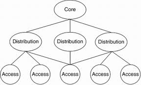

# ENS

# UNIT 1

PBM vs PPDIOO

The core difference is that PPDIOO is a detailed expansion of the PBM framework, specifically tailored to the complex process of designing and maintaining large-scale network infrastructure.

1. PBM (Plan-Build-Manage) Lifecycle
The PBM model is a high-level, general framework for IT service management and operations. It describes the three essential phases of any major IT project or system.
2. PPDIOO (Prepare, Plan, Design, Implement, Operate, Optimize) Lifecycle
PPDIOO is a detailed, prescriptive methodology developed by Cisco to guide network engineers and managers through the full cycle of network infrastructure services. It refines the "Build" and "Manage" stages of the PBM model into highly specific, iterative phases.

Mapping PPDIOO to PBM
3. Detailed Comparison and Working
In essence, PPDIOO is the methodology that defines the structured steps and deliverables required to execute the high-level goals set in the PBM framework, specifically for complex network systems.

---

1.PBM Network lifecycle

The PBM model is a high-level, general framework for IT service management and operations. It describes the three essential phases of any major IT project or system.

## 1. ⚙️ Plan Phase

The **Plan** phase is the strategic starting point. It is entirely focused on defining **why** the network change is necessary, **what** the business goals are, and **how** the project will be executed.

### Key Activities:

- **Business Requirements Analysis:** Understanding the organizational goals, current challenges, and the expected Return on Investment (ROI) for the network upgrade or deployment.
- **Technology Strategy:** Defining the high-level technical direction. This involves assessing new technologies (like SD-WAN, Cloud integration, IoT) and their fitness for the business needs.

## 2. 🔨 Build Phase

The **Build** phase is the execution stage where the design is finalized and the network is physically and logically implemented. This phase is where the **Design** and **Implement** stages of the PPDIOO model take place.

### Key Activities:

- **Detailed Design:** Translating the high-level plan into specific engineering blueprints. This includes selecting hardware, developing the IP addressing scheme, choosing routing protocols, and writing security policies.
- **Procurement and Staging:** Purchasing necessary hardware (routers, switches, firewalls) and setting them up in a lab environment for initial configuration and testing.

## 3. 🛠️ Manage Phase

The **Manage** phase covers the entire operational life of the network after deployment. It is about ensuring the network continues to meet performance and security expectations throughout its lifespan and actively seeking ways to improve it. This phase covers the **Operate** and **Optimize** stages of the PPDIOO model.

### Key Activities:

- **Operations and Monitoring (Operate):** Day-to-day management, including fault detection, troubleshooting, network security monitoring, and maintaining Service Level Agreements (SLAs).
- **Maintenance and Support:** Applying patches, managing configurations, performing backups, and handling break/fix scenarios.

---

2.PPDIOO 

The PPDIOO (Prepare, Plan, Design, Implement, Operate, Optimize) Lifecycle is Cisco's comprehensive, structured methodology for designing, implementing, and managing network and infrastructure services. It provides a roadmap for engineers to ensure that network solutions meet business requirements and operate optimally throughout their entire lifespan.

## 1. 📋 Prepare Phase

The Prepare phase is the highest-level, strategic starting point. It establishes the organizational intent and financial justification for the project.

- **Goal:** To establish the business case, organizational strategy, and financial feasibility for the proposed network change.
- **Focus:** **Why** and **What** are the big-picture goals?
- **Key Activities:**
    - **Business Requirements Analysis (BRD):** Identifying organizational goals (e.g., merging two company networks, supporting a massive cloud migration, reducing operational costs).
    - **High-Level Strategy:** Defining the broad technology direction and assessing the required skills and resources.
    - **Financial Scoping:** Performing an initial financial analysis (cost vs. expected ROI) to secure executive buy-in and funding.
- **Output/Deliverables:** Project Charter, Business Requirements Document (BRD), initial financial analysis, and organizational readiness assessment.

## 2. 📝 Plan Phase

The Plan phase translates the strategic vision from the Prepare phase into a detailed, managed project plan and a high-level technical scope.

- **Goal:** To develop the high-level network architecture, assess the existing environment, and create a comprehensive project plan.
- **Focus:** **How** will the project be managed and what is the scope?
- **Key Activities:**
    - **Current State Assessment:** Performing detailed site surveys and audits of the existing network infrastructure, applications, and operations.
    - **High-Level Design (HLD):** Developing the target network architecture, defining the overall topology, and deciding on core services (e.g., "We will use SD-WAN," or "We need a 40G data center backbone").
    - **Project Management:** Creating a detailed project schedule, defining tasks, allocating personnel, and establishing risk management and communication protocols.
- **Output/Deliverables:** Detailed Project Plan, High-Level Design (HLD), existing site survey documentation, and risk mitigation plan.

## 3. 📐 Design Phase

The Design phase is where the architectural vision is converted into the precise technical blueprints needed for implementation. This is the last and most critical planning phase.

- **Goal:** To create the detailed, component-level network design that meets all technical and business requirements.
- **Focus:** **Exactly what** hardware and logical configuration will be used?
- **Key Activities:**
    - **Component Selection:** Choosing specific hardware models (SKUs), software versions, and technologies (e.g., selecting OSPF vs. EIGRP, or specifying Cisco ACI).
    - **Logical Design:** Creating detailed schemes for IP addressing, Quality of Service (QoS), routing protocols, and Network Management System (NMS) integration.
    - **Security Design:** Developing firewall rules, access control policies, and intrusion prevention strategies.
    - **Verification Planning:** Creating detailed test plans and acceptance criteria to ensure the implemented design works as intended.
- **Deliverables:** Detailed Design Document (DDD), Bill of Materials (BOM), Final Topology Diagrams, Configuration Guidelines, and Acceptance Test Plan.

## 4. 🚀 Implement Phase

The Implement phase is the execution stage. It involves the physical and logical deployment of the network according to the detailed blueprints created in the Design phase.

- **Goal:** To successfully install, configure, and integrate the network components into the production environment.
- **Focus:** **Build** the network exactly as designed.
- **Key Activities:**
    - **Staging and Integration:** Pre-configuring and testing hardware and software in a controlled lab or staging environment before deployment.
    - **Migration and Cutover:** Executing the detailed plan for integrating the new infrastructure, often requiring carefully managed change windows to minimize disruption to live services.
    - **Verification and Acceptance Testing:** Running the formal test plans created during the Design phase to ensure the network is functional, performs correctly, and meets the acceptance criteria.
    - **Documentation Handover:** Updating operational manuals and ensuring the engineering team transitions knowledge to the operations team.
- **Deliverables:** Verified production network, Updated Configuration Files, Post-Implementation Report, and operational run-books.

## 5. 🛠️ Operate Phase

The Operate phase is the longest phase of the lifecycle, representing the day-to-day management and maintenance of the live network infrastructure.

- **Goal:** To maintain network stability, reliability, and security, ensuring all Service Level Agreements (SLAs) are met.
- **Focus:** **Run** the network and manage incidents.
- **Key Activities:**
    - **Fault Management:** Monitoring the network for outages, detecting errors, isolating issues, and performing necessary repairs (troubleshooting).
    - **Performance Monitoring:** Continuously tracking key performance indicators (KPIs) like latency, jitter, utilization, and throughput.
    - **Security Management:** Monitoring security logs, managing firewall policies, and applying security patches to mitigate risks.
    - **Asset and Configuration Management:** Keeping an accurate inventory of hardware/software and managing configuration changes.
- **Deliverables:** Performance Reports, Incident Logs, SLA Compliance Reports, and Configuration Backup History.

## 6. 🔄 Optimize Phase

The Optimize phase is the continuous feedback mechanism that ensures the network evolves and improves over time. It is driven by data gathered during the Operate phase.

- **Goal:** To proactively improve network performance, increase capacity, and identify and resolve chronic issues or bottlenecks.
- **Focus:** **Improve** the network based on performance data.
- **Key Activities:**
    - **Capacity Planning:** Analyzing historical utilization and growth trends to accurately forecast future needs for bandwidth, processing power, and storage.
    - **Problem Resolution:** Addressing chronic or systemic issues found in fault logs by designing and implementing small-scale, proactive fixes.
    - **Technology Review:** Evaluating emerging technologies or minor design changes that can enhance efficiency or reduce operational costs.
    - **Feedback Loop:** Generating recommendations for major overhauls or new technology rollouts, which then feed back into the **Prepare** or **Plan** phase, restarting the entire PPDIOO cycle.
- **Deliverables:** Capacity Planning Reports, Recommendations for Redesign, and documented network improvements.

---

DESIGN METHODOLOGY for PBM

3.STEPS OF IDENTIFY CUSTOMER REQUIREMENTS

### **Step 1: Identify Network Applications and Services**

The first step in identifying customer design requirements is to understand the **applications and services** that the network must support. Networks exist primarily to enable applications such as email, web services, VoIP, video conferencing, cloud applications, ERP systems, databases, and remote access. Each application has different requirements in terms of bandwidth, latency, availability, security, and reliability. For example, voice and video applications require low latency and jitter, while data backup applications require high bandwidth but can tolerate delays. By identifying all current and future applications, the network designer can ensure the network is capable of supporting business operations effectively.

---

### **Step 2: Define the Organizational Goals**

Organizational goals are the business objectives (like improving productivity, reducing costs, or enabling expansion) that the network must support. These goals, defined by management, dictate the network design to ensure it aligns with and directly contributes to business success, rather than being purely a technical exercise. For example, a goal of rapid growth necessitates a scalable and flexible network.

---

### **Step 3: Define the Possible Organizational Constraints**

Organizational constraints are **non-technical limitations** (such as budget restrictions, project timelines, staffing limitations, or company policies) that directly impact the network design. Identifying these constraints early is crucial for the designer to make **realistic decisions** and avoid proposing solutions that the business cannot implement due to financial, personnel, or regulatory limitations.

---

### **Step 4: Define the Technical Goals**

Technical goals translate business requirements into **measurable network objectives** (such as performance targets, 99.99% availability, scalability, and security needs). They ensure the network meets service-level expectations and directly **guide the selection of architecture, protocols, and technologies**.

---

### **Step 5: Define the Possible Technical Constraints**

Technical constraints are **limitations imposed by existing technology or infrastructure**. These may include legacy hardware, outdated cabling, limited IP address space, compatibility issues, or lack of support for modern protocols. For example, an existing network may rely on older switches that do not support advanced security or QoS features. Recognizing these constraints allows designers to decide whether to work within existing limitations or propose upgrades. This step ensures the final network design is technically feasible and cost-effective.

2.  CHARACTERIZING THE EXISTING NETWORK

 4.Steps involved in gathering information about an existing network

## **Steps Involved in Gathering Information About an Existing Network**

Gathering information about an existing network is a crucial activity in the **network design methodology**, as it helps the designer understand the current environment before proposing any changes or new designs. This process generally involves **three main steps**.

---

### **Step 1: Identify Properties of the Existing Network**

The first step is to **identify basic network properties** (topology, technologies, and supported applications) using existing documentation and input from IT staff and business users. The designer collects high-level details about site locations, network devices, LAN/WAN technologies, IP addressing, and routing protocols to understand the network's structure and how it supports business operations.

---

### **Step 2: Perform a Network Audit**

Following the identification of basic properties, a **network audit** is performed to gather **detailed and accurate information**. This step validates and expands existing documentation using manual methods (like device commands) and automated tools (like SNMP, NetFlow, and Syslog). The audit collects crucial operational data, including device lists, hardware specs, software versions, interface speeds, and CPU/memory utilization, helping to uncover performance issues and outdated components.

---

### **Step 3: Analyze the Gathered Information**

The final step is to **analyze the collected audit information** to understand the network's current performance, reliability, scalability, and security posture. This analysis identifies weaknesses, risks, and areas needing improvement (like overloaded links or outdated technology). The results are then used as crucial input for the subsequent network design stages, ensuring the new design addresses existing limitations and aligns with business requirements.

---

5.NETWORK AUDIT AND IT’S ROLE

A **network audit** is a systematic process of **examining, verifying, and documenting** an existing network’s infrastructure, configuration, performance, and security. It provides an accurate and up-to-date view of how the current network is operating. A network audit is an essential step in network design because it ensures that design decisions are based on **real data** rather than assumptions or outdated documentation.

---

### **What a Network Audit Involves**

A network audit collects detailed information about:

- Network devices and their roles
- Hardware specifications and software versions
- Device configurations
- Interface speeds and link utilization
- CPU and memory usage
- WAN technologies and carrier details
- Security configurations and access controls
- Network traffic patterns and application usage

This information is gathered using documentation, management tools, auditing tools (SNMP, NetFlow, Syslog), and manual device commands.

---

### **Role of Network Audit in Network Design**

The primary role of a network audit in network design is to **establish a reliable baseline** of the existing network. It helps designers understand current network performance, identify bottlenecks, and detect single points of failure. By knowing how the network behaves under normal and peak conditions, designers can create solutions that improve performance, availability, and scalability.

A network audit also reveals **technical constraints**, such as outdated hardware, limited bandwidth, or unsupported protocols, which must be considered during the design phase. Additionally, it helps identify security gaps, compliance issues, and areas where policy enforcement is weak.

Another important role of a network audit is to support **capacity planning and future growth**. By analyzing traffic patterns and resource utilization, designers can predict future requirements and design a network that can scale without major redesign.

---

## **6.Top-Down Approach in Network Engineering**

The **top-down approach** in network engineering is a design methodology in which the network is designed by first understanding the **organizational and application requirements** before selecting network technologies and devices. This approach is used during the **Design phase of the PBM lifecycle** and ensures that the network supports business goals rather than being driven by hardware or vendor choices.

In a top-down approach, the design process begins at the **upper layers of the OSI model** and gradually moves downward. The focus is initially on **what the network must do**, not **how it will be built**

### **Application and Organizational Requirements First**

The first step in a top-down design is the **analysis of application and organizational requirements**. Networks exist to support applications such as email, web services, VoIP, video conferencing, and cloud services. Each application has specific requirements related to bandwidth, latency, reliability, and security. At the same time, organizational goals such as scalability, availability, cost control, and security are identified. These requirements form the foundation of the network design.

---

### **Design from the Top of the OSI Model**

Once requirements are understood, the design proceeds **from the top layers of the OSI model downward**.

- **Upper OSI layers (Application, Presentation, Session):**
    
    Requirements for applications, data formats, encryption, session management, and user interaction are defined. This ensures that applications function correctly and meet performance expectations.
    
- **Lower OSI layers (Transport, Network, Data Link, Physical):**
    
    After defining application needs, the underlying infrastructure is designed to support them. This includes selecting transport protocols, routing and switching technologies, IP addressing, link speeds, cabling, and physical hardware. Infrastructure choices are made **only after** understanding upper-layer requirements.
    

This approach ensures that technology decisions are **driven by needs**, not assumptions.

---

### **Gathering Additional Network Data**

During the top-down design process, additional data is gathered from the existing network environment. This includes current topology, traffic patterns, performance metrics, and limitations. This information helps refine the design and ensures compatibility with existing systems.

---

7.NETWORK TESTING

 A **Prototype Test** is conducted first, involving only a subset of the full design tested in a completely **isolated, non-production environment**; its primary benefit is allowing the testing of new technologies, such as IPsec, and the discovery of design flaws without any risk of disrupting the existing operational network. Following a successful prototype, 

a **Pilot Test** is conducted by deploying the new solution to an **actual production network location** (a pilot site), which serves as a live test environment; this crucial step allows real-world problems—like unexpected interactions with live applications or user traffic—to be discovered and resolved before the solution is rolled out to all locations across the enterprise. In both scenarios, success validates the design for implementation, while failure forces a necessary correction and retesting cycle.

---

8.Architecture of Hierarchial netwrok model

Hierarchical Network Model
The Hierarchical Network Model is a Cisco-recommended design framework that divides a network into three logical layers: Access, Distribution, and Core. This layered approach simplifies network design, improves scalability, enhances performance, and makes troubleshooting easier by assigning specific roles to each layer.

1️⃣ Access Layer
The Access Layer is the entry point of the network where end devices connect. This layer provides network access to devices such as computers, printers, IP phones, wireless access points, and IoT devices. Its primary function is to control how devices gain access to the network and what level of access they are allowed.

At this layer, features such as VLAN assignment, port security, authentication (802.1X), Power over Ethernet (PoE), and basic Quality of Service (QoS) are implemented. The access layer is responsible for preventing unauthorized access and ensuring that user traffic enters the network efficiently and securely. Because it directly interacts with users, reliability and ease of management are important considerations at this layer.

2️⃣ Distribution Layer
The Distribution Layer acts as the boundary and control layer between the Access Layer and the Core Layer. Its main role is to aggregate traffic from multiple access layer switches and apply network policies before forwarding traffic to the core.

This layer is responsible for routing between VLANs, policy enforcement, access control lists (ACLs), traffic filtering, QoS policies, and redundancy. It is also where routing decisions are made and where broadcast domains are controlled. By centralizing policy implementation, the distribution layer helps maintain consistency, improves security, and simplifies network management.

3️⃣ Core Layer
The Core Layer is the backbone of the network and is designed to provide fast, reliable, and highly available data transport across the entire network. Its primary purpose is to move large amounts of data quickly between distribution layer devices.

At the core layer, the focus is on high-speed switching, low latency, high availability, and fault tolerance. Complex operations such as access control or packet filtering are avoided at this layer to ensure maximum performance. Core devices are typically high-capacity switches with redundant links and power supplies, ensuring minimal downtime and maximum network stability.

---

# UNIT  2

| **Feature** | **100BASE-TX** | **100BASE-T4** |
| --- | --- | --- |
| **Cabling Requirement** | **Category 5 or 6** UTP (Data Grade) | **Category 3, 4, or 5** UTP (Voice/Lower Grade) |
| **Number of Pairs Used** | **2 Pairs** (1 for Transmit, 1 for Receive) | **4 Pairs** (3 for Data, 1 for Collision Detect) |
| **Duplex Capability** | Supports **Full-Duplex** | Supports **Half-Duplex Only** |
| **Encoding Scheme** | **4B5B** Coding | **8B6T** Coding |
| **Primary Use Case** | Modern, high-speed data networks | Upgrading older CAT 3 buildings without recabling |
| **Maximum Distance** | 100 Meters | 100 Meters |
| **Popularity** | Industry Standard (Widely used) | Obsolete (Rarely deployed) |

---

Why Fast Ethernet has stricter timing than 10 Mbps Ethernet

**1. Maintaining the CSMA/CD Protocol**
Fast Ethernet (1$802.3u$) was designed to preserve the original **CSMA/CD** (Carrier Sense Multiple Access with Collision Detect) mechanism used in 2$10$ Mbps Ethernet.3 For this protocol to work, a transmitting station must be able to detect a collision *before* it finishes sending its frame.

**2. Reduced Bit Time**
In networking, "Bit Time" is the duration it takes for one bit to be injected into the medium.4

• **$10$ Mbps Ethernet:** Bit time is $0.1$ microseconds.
• $100$ Mbps Ethernet: Bit time is $0.01$ microseconds.
Because Fast Ethernet transmits data $10$ times faster, each bit is $10$ times "shorter" in duration.
**3. The Constant Minimum Frame Size**
To ensure compatibility, the **minimum Ethernet frame size** remained unchanged at **$512$ bits** ($64$ bytes).
• At $10$ Mbps, it takes $51.2$ microseconds to transmit these $512$ bits ($512 \times 0.1 \mu s$).
• At $100$ Mbps, it takes only **$5.12$ microseconds** to transmit the same frame ($512 \times 0.01 \mu s$).
**4. Impact on Round-Trip Delay (The 5.12 $\mu s$ Rule)**
The "Collision Domain" depends on the signal traveling from one end of the cable to the other and back within the transmission time of the shortest frame.
• Since the $100$ Mbps frame is sent $10$ times faster, the "window of opportunity" to detect a collision is $10$ times smaller ($5.12 \mu s$ instead of $51.2 \mu s$).
• If a collision signal (jam signal) returns after $5.12 \mu s$, the sender would have already finished transmitting and would not know the frame was corrupted.
**5. Resulting Network Constraints**
Because of this strict $5.12 \mu s$ round-trip limit, Fast Ethernet has much tighter physical design rules:
• **Cable Lengths:** Maximum cable segments are generally limited to 5$100$ meters.6

• **Network Diameter:** The total distance across a collision domain is significantly reduced compared to $10$ Mbps.
• **Repeater Limits:** Fast Ethernet allows fewer repeaters (hubs) between two stations to minimize the latency they add to the round-trip signal.7

---

Overview of EtherChannel

EtherChannel is a port-link aggregation technology used primarily on Cisco switches. It allows you to group several physical Ethernet links into one single **logical link** to provide fault tolerance and high-speed bandwidth between switches, routers, and servers.

### **Key Concepts of EtherChannel**

- **Bandwidth Aggregation:** It combines the speed of multiple interfaces. For example, grouping four 1Gbps links creates a single logical 4Gbps pipe.
- **Redundancy and Fault Tolerance:** If one physical link in the bundle fails, the traffic is automatically redistributed across the remaining links in milliseconds without disrupting the network.
- **Loop Prevention (Spanning Tree):** Normally, the Spanning Tree Protocol (STP) would block redundant links to prevent loops. EtherChannel treats the bundle as a single port, so STP doesn't block the individual physical connections.
- **Load Balancing:** Traffic is distributed across the physical links using a hashing algorithm based on parameters like source/destination MAC addresses or IP addresses.

---

LAN HARDWARE

### **1. Repeaters**

A **Repeater** is a two-port device used to extend the reach of a network segment.

- **Function:** As electrical signals travel along a cable, they weaken due to resistance and noise (a process called **attenuation**). A repeater receives a weakened signal, cleans it by removing noise, and **regenerates** it to its original strength before retransmitting it.
- **Intelligence:** It has zero "intelligence." It does not read MAC addresses or IP addresses; it simply copies bits from one port and pushes them out of the other.
- **Key Limitation:** It does not filter traffic. If a collision occurs on one side, it is repeated to the other side, meaning both sides belong to the same **collision domain**.

---

### **2. Hubs**

A **Hub** is essentially a **multi-port repeater**. It acts as a central connection point in a star topology.

- **Function:** When a packet (signal) arrives at one port, the hub "broadcasts" it by copying it to **all other ports**. Every device connected to the hub receives the data, but only the intended recipient (based on the MAC address) actually processes it; others discard it.
- **Types of Hubs:**
    - **Active Hubs:** Like repeaters, they have a power supply and regenerate/amplify the signal.
    - **Passive Hubs:** They simply act as a physical connection point for wires without boosting the signal.
- **Efficiency:** Hubs are highly inefficient because they share the total bandwidth among all connected devices. If you have a 100 Mbps hub with 10 devices, they all compete for that 100 Mbps.
- **Security:** Since all data is sent to all ports, hubs are insecure; any device can potentially "sniff" traffic intended for another device.

---

BRIDGES

A **Bridge** is a Layer 2 (Data Link Layer) device used to connect and filter traffic between two or more network segments. While they are less common in modern networks—having been largely evolved into the high-speed **Switches** we use today—they were revolutionary for their "intelligence" compared to hubs.

### **How a Bridge Works**

Unlike a hub, which blindly broadcasts data to everyone, a bridge is **MAC-address aware**. It builds a **MAC Address Table** by "listening" to the traffic on each port.

- **Learning:** When a frame arrives, the bridge records the source MAC address and the port it came from.
- **Filtering:** If a device on Segment A sends data to another device on Segment A, the bridge "filters" the frame, preventing it from crossing to Segment B. This keeps local traffic local.
- **Forwarding:** If a device on Segment A sends data to a device it knows is on Segment B, it "forwards" the frame only to that specific segment.
- **Flooding:** If the bridge doesn't know where a MAC address is yet, it sends the frame to all ports (except the source) until it learns the location.

Why Bridges are Important
Collision Domain Separation: Bridges break one large collision domain into smaller ones. This means a collision on one side of the bridge does not affect the other side, greatly improving performance.

Broadcast Domains: Note that while bridges split collision domains, they extend broadcast domains. A broadcast message (like an ARP request) will still pass through the bridge to all segments.

Spanning Tree Protocol (STP): Bridges use STP to prevent "network loops" where data circles endlessly between redundant connections, which could crash the network.

---

How Bridges use STP

---

SWITCHES

A **Network Switch** is a specialized hardware device that connects multiple devices (like computers, printers, and servers) within a **Local Area Network (LAN)**. It acts as a central hub for communication, intelligently directing data only to the specific device it is intended for.

Unlike its predecessor, the Hub, a switch is considered an **"intelligent"** device because it doesn't just broadcast data to everyone—it makes precise forwarding decisions.

---

### **1. How a Switch Works: The "Learning" Process**

A switch operates at **Layer 2 (Data Link Layer)** of the OSI model. Its core intelligence comes from building a **MAC Address Table** (also known as a CAM table).

- **Learning:** When a device sends a data frame, the switch looks at the **Source MAC Address** and records which physical port it came from.
- **Forwarding:** When data arrives for a specific destination, the switch checks its table. If it knows which port that MAC address is connected to, it sends the data **only to that port**.
- **Flooding:** If the switch doesn't know the destination yet (or if it's a broadcast), it sends the data to all ports except the one it came from. Once the destination device replies, the switch "learns" its location for next time.

---

### **2. Key Advantages of Switches**

- **Micro-segmentation:** Every port on a switch is its own **Collision Domain**. This means two devices can talk to each other without interfering with others, effectively eliminating data collisions.
- **Full-Duplex Communication:** Switches allow devices to send and receive data at the same time, doubling the potential throughput compared to half-duplex hubs.
- **Dedicated Bandwidth:** If you have a 1 Gbps switch, every port gets a dedicated 1 Gbps path, rather than sharing that speed across the entire network.
- **Traffic Management:** Modern "Managed Switches" allow administrators to prioritize certain types of traffic (like Video or Voice) and create **VLANs** (Virtual LANs) to group devices logically.

| **Feature** | **Bridge** | **Switch** |
| --- | --- | --- |
| **OSI Layer** | Operates at **Layer 2** (Data Link). | Operates at **Layer 2** (some also at Layer 3). |
| **Processing** | **Software-based**: Uses the CPU to make forwarding decisions. | **Hardware-based**: Uses **ASICs** (Application Specific Integrated Circuits) for speed. |
| **Port Density** | Low (typically **2 to 4 ports**). | High (typically **24 to 48+ ports**). |
| **Collision Domains** | Splits a network into a few collision domains. | Provides **Micro-segmentation** (each port is its own collision domain). |
| **Throughput** | Lower; usually handles one frame at a time. | Higher; handles **multiple simultaneous** conversations (Wire speed). |
| **Duplex Support** | Primarily Half-Duplex. | Supports **Full-Duplex** on all ports. |
| **Logic** | Store-and-Forward only. | Supports Store-and-Forward, **Cut-Through**, and Fragment-Free. |
| **Network Role** | Used to connect two LAN segments. | Used to connect individual end devices (PC, Server, etc.). |

---

ROUTER

A **Router** is a sophisticated networking device that operates at **Layer 3 (Network Layer)** of the OSI model. Its primary job is to connect different networks—such as connecting your home Local Area Network (LAN) to the Internet (a Wide Area Network or WAN).

While switches connect devices *within* a network using MAC addresses, routers connect *networks* to each other using **IP addresses**.

---

### **1. How a Router Works: The Routing Table**

A router acts as a "traffic controller" for data packets. It uses a **Routing Table** to determine the best path for a packet to reach its destination.

- **Path Determination:** When a packet arrives, the router examines the destination IP address. It consults its routing table to find which neighboring router or network is the next "hop" on the way to that destination.
- **Switching/Forwarding:** Once the path is decided, the router "switches" the packet from the incoming interface to the correct outgoing interface.
- **Static vs. Dynamic Routing:** Routers can learn paths manually (Static) or automatically through protocols like **OSPF, BGP, or RIP** (Dynamic).

---

### **2. Key Functions of a Router**

- **Inter-Network Communication:** It is the only device that can move data between different network architectures (e.g., from an Ethernet LAN to a Fiber WAN).
- **Broadcast Domain Separation:** Unlike switches, routers **do not forward broadcasts**. This prevents "broadcast storms" from spreading across the entire internet, keeping local traffic contained.
- **Security (NAT and Firewalls):** Most modern routers use **Network Address Translation (NAT)**, which allows multiple devices in a home to share a single public IP address. They also act as the first line of defense using built-in firewalls.
- **Quality of Service (QoS):** Routers can prioritize sensitive traffic, such as ensuring a Zoom call or VoIP phone gets more bandwidth than a background file download.

| **Feature** | **Switch** | **Router** |
| --- | --- | --- |
| **OSI Layer** | Operates at **Layer 2** (Data Link Layer). | Operates at **Layer 3** (Network Layer). |
| **Addressing** | Uses physical **MAC Addresses**. | Uses logical **IP Addresses**. |
| **Primary Goal** | Connects devices within a single network. | Connects multiple networks to each other. |
| **Data Unit** | Handles data as **Frames**. | Handles data as **Packets**. |
| **Broadcast Domain** | Has one broadcast domain (spreads broadcasts to all ports). | Breaks broadcast domains (stops broadcasts at each port). |
| **Routing Table** | Uses a **MAC Address Table** (CAM table). | Uses a **Routing Table** for path calculation. |
| **Collision Domain** | Each port is a separate collision domain. | Each port is a separate collision domain. |
| **Security** | Minimal (relies on VLANs/Port Security). | High (NAT, Firewalls, and Access Control Lists). |
| **Deployment** | Used in LANs (Offices, Data Centers). | Used at the Edge (Gateways, Internet Backbone). |

---

L3 SWITCH

A **Layer 3 Switch** (also known as a **Multilayer Switch**) is a high-performance networking device that combines the capabilities of a traditional Layer 2 switch with the routing intelligence of a Layer 3 router.

While a standard switch only understands physical MAC addresses, an L3 switch can read logical **IP addresses**, allowing it to route traffic between different subnets or VLANs at "wire speed."

### **1. How it Works: "Route Once, Switch Many"**

An L3 switch bridges the gap between switching and routing by using specialized hardware called **ASICs** (Application-Specific Integrated Circuits).

- **The Process:** When the first packet of a data stream arrives, the switch uses its internal "Routing Processor" (CPU) to determine the best path.
- **Hardware Offloading:** Once the path is known, it is programmed directly into the ASIC hardware.
- **Result:** All subsequent packets in that same flow are "switched" at high speed by the hardware rather than being processed by the slower CPU. This makes L3 switches significantly faster for local routing than traditional routers.

### **2. Key Feature: Inter-VLAN Routing**

In a traditional network, a "Router-on-a-Stick" configuration was used where all traffic between VLANs had to leave the switch, go to a router, and come back. An L3 switch eliminates this bottleneck.

- It uses **SVIs (Switched Virtual Interfaces)** to act as the default gateway for each VLAN.
- Traffic moving from the "Sales VLAN" to the "Accounting VLAN" is routed internally within the switch, reducing latency and freeing up the external router for internet-bound traffic.

---

CAMPUS LAN DESIGN AND IT”S DESGIN FACTORS

A **Campus LAN** (Local Area Network) is a network infrastructure that interconnects multiple LANs across a specific, limited geographical area. It is typically owned and managed by a single organization, such as a university, a corporate headquarters, or a government facility.

Unlike a standard LAN which might cover a single floor or building, a Campus LAN bridges the gap between a single-building network and a Wide Area Network (WAN), providing high-speed connectivity (often 10/40/100 Gbps) between departments, research labs, and administrative offices.

### **Key Design Factors for Campus LAN**

When designing a Campus LAN, engineers must look beyond simple connectivity and focus on long-term stability and business needs. The following five factors are the most critical:

- **1. Hierarchical Design (The Three-Tier Model):** Modern designs move away from "flat" networks to a modular hierarchy consisting of **Access, Distribution, and Core layers**. This makes the network easier to troubleshoot and scale.
    - *Why it matters:* It isolates failures so that a problem in one building doesn't take down the entire campus.
- **2. High Availability and Redundancy:** Critical services (like library databases or payroll) must be accessible 24/7. This involves using redundant hardware, dual-homed links (two cables for every connection), and protocols like **HSRP/VRRP** for gateway redundancy.
    - *Why it matters:* It ensures the network remains functional even if a switch or a fiber optic cable fails.
- **3. Scalability and Flexibility:** A campus network must be built with "tomorrow in mind." This means using modular switches that can accept more ports and choosing cabling (like Multi-mode or Single-mode fiber) that can support future speed upgrades (e.g., moving from 10Gbps to 100Gbps).
    - *Why it matters:* It prevents expensive "forklift upgrades" (replacing everything) as the organization grows.
- **4. Security and Access Control:** Campus networks often have diverse users (students, guests, employees). Design factors include **VLAN Segmentation** to keep departments separate and **Network Access Control (NAC)** to ensure only authorized devices can connect.
    - *Why it matters:* It protects sensitive data and prevents a virus on a guest's laptop from spreading to the corporate servers.
- **5. Performance and Quality of Service (QoS):** With the rise of video conferencing and VoIP (IP phones), the network must be able to prioritize time-sensitive traffic over standard data like email or file downloads.
    - *Why it matters:* It ensures that a large file transfer doesn't cause a high-priority video call to lag or drop.

---

In modern networking, the **Cisco Three-Layer Hierarchical Model** is the gold standard for designing a Campus LAN. By breaking the network into three distinct layers, administrators can ensure the network is scalable, reliable, and easy to troubleshoot.

---

### **1. The Access Layer**

The Access Layer is the "front door" of the network. It is where end-user devices (PCs, printers, IP phones, and wireless access points) connect to the network.

- **Primary Function:** To provide a connection point for end devices and handle local security.
- **Key Features:** * **Port Security:** Limiting which MAC addresses can connect.
    - **VLAN Assignment:** Sorting users into their virtual networks.
    - **Power over Ethernet (PoE):** Powering devices like VoIP phones and cameras through the data cable.

### **2. The Distribution Layer**

The Distribution Layer acts as the "bridge" between the Access and Core layers. It aggregates the data from all the Access Layer switches and routes it toward the Core.

- **Primary Function:** Policy-based connectivity and routing. It is the "smart" layer where data is filtered and managed.
- **Key Features:** * **Inter-VLAN Routing:** Allowing different departments (VLANs) to talk to each other.
    - **Access Control Lists (ACLs):** Implementing security policies to permit or deny specific traffic.
    - **Redundancy:** Ensuring there are multiple paths so that if one switch fails, the network stays up.

### **3. The Core Layer**

The Core Layer is the "backbone" of the network. Its only job is to move massive amounts of data as fast as possible between different parts of the campus or out to the internet.

- **Primary Function:** High-speed switching and transport.
- **Key Features:** * **High Availability:** It must be designed with "zero downtime" in mind because a failure here affects the entire organization.
    - **No "Policy" Processing:** To maintain maximum speed, the Core Layer avoids complex tasks like ACL filtering or packet inspection (leaving those to the Distribution layer).
    - **Low Latency:** Optimized for pure speed.

What is the access layer and the best practices to be followed at this layer

The **Access Layer** is the perimeter of your network infrastructure. It represents the point where end-user devices—such as laptops, IP phones, printers, and cameras—physically or wirelessly connect to the campus network.

In the hierarchical design model, the access layer switches provide the "on-ramp" for traffic before it is sent to the Distribution and Core layers for routing and high-speed transport.

### **Key Functions of the Access Layer**

- **Device Connectivity:** Managing physical port connections and providing **Power over Ethernet (PoE)** for devices like VoIP phones and Access Points.
- **VLAN Assignment:** Segmenting users into logical groups (e.g., Finance, HR, Guest) to control traffic flow.
- **Edge Security:** Serving as the first line of defense to prevent unauthorized access and Layer 2 attacks.
- **Traffic Marking (QoS):** Identifying time-sensitive traffic (like voice or video) so it can be prioritized as it travels deeper into the network.

### **Best Practices for the Access Layer**

To ensure stability, security, and performance, the following best practices should be implemented at the network edge:

### **1. Layer 2 Security Hardening**

- **Port Security:** Limit the number of MAC addresses allowed on a single port to prevent "MAC Flooding" attacks. Configure the switch to shut down the port if an unauthorized device is plugged in.
- **DHCP Snooping:** Divide ports into "Trusted" (uplinks to servers) and "Untrusted" (user ports). This prevents **Rogue DHCP Servers** from handing out incorrect IP addresses to users.
- **Dynamic ARP Inspection (DAI):** Use the binding table created by DHCP Snooping to validate ARP packets. This prevents **ARP Spoofing** and Man-in-the-Middle attacks.
- **BPDU Guard:** Enable this on all ports connected to end-user devices. If someone accidentally plugs in another switch, BPDU Guard will shut down the port to prevent a **Spanning Tree loop**.

### **2. Performance and Availability**

- **VLAN Segmentation:** Never leave all users in "VLAN 1." Move users into functional VLANs to keep broadcast traffic small and manageable.
- **Speed/Duplex Consistency:** Hard-code speed and duplex settings for critical infrastructure (like servers or uplinks), but use **Auto-negotiation** for standard user ports to avoid "duplex mismatch" errors.
- **Uplink Redundancy:** Use **EtherChannel** (LACP) to bundle multiple physical links into a single logical path to the Distribution layer. This provides both higher bandwidth and automatic failover if one cable fails.

### **3. Management and Housekeeping**

- **Disable Unused Ports:** Shut down any physical ports that are not currently in use. This simple step is one of the most effective ways to prevent unauthorized physical access.
- **Voice VLANs:** Use a dedicated Voice VLAN for IP phones. This allows you to apply separate security and QoS policies to voice traffic without affecting data traffic on the same physical cable.
- **Consistency:** Ensure that all access switches across the campus use a standardized configuration template for passwords, SSH access, and logging.

---

What is the distribution layer and the best practices to be followed at this layer

The **Distribution Layer** (also known as the **Aggregation Layer**) acts as the "smart" middleman in the hierarchical network model. It bridges the high-speed backbone (Core) and the user-facing Access layer.

Think of it as the policy-enforcement point where traffic is routed, filtered, and managed before it moves deeper into the network.

### **Key Functions of the Distribution Layer**

- **Inter-VLAN Routing:** This is the primary role of the distribution layer. It handles the routing of traffic between different VLANs (e.g., routing a file from the HR VLAN to the Sales VLAN).
- **Aggregation of Access Links:** It collects all the links coming up from the various access switches in a building or department and funnels them into the Core.
- **Security and Policy Enforcement:** It uses Access Control Lists (ACLs) to determine which users can access which servers or subnets.
- **Broadcast Domain Definition:** It serves as the boundary where Layer 2 (switching) ends and Layer 3 (routing) begins, preventing broadcast traffic from spreading across the entire campus.

---

### **Best Practices for the Distribution Layer**

Because the Distribution layer is the "brain" of the department or building network, its configuration must prioritize reliability and efficient routing.

### **1. High Availability and Redundancy**

- **First Hop Redundancy Protocols (FHRP):** Use protocols like **HSRP** (Cisco proprietary) or **VRRP** (open standard). This allows two distribution switches to share a single "Virtual IP" that acts as the default gateway for users. If one switch fails, the other takes over in seconds.
- **Dual-Homing:** Every access switch should have two physical uplinks—one connected to "Distribution Switch A" and the other to "Distribution Switch B."

### **3. Security and Quality of Service (QoS)**

- **Access Control Lists (ACLs):** Implement security policies at this layer. Since the distribution switch knows the IP addresses of the traffic, it is the best place to block unauthorized inter-departmental traffic.
    - **QoS Congestion Management:** While the Access layer *marks* traffic (e.g., "this is Voice"), the Distribution layer *enforces* it. It ensures that voice and video packets are prioritized over bulk data transfers if the uplinks to the Core become congested.

### **2. Efficient Routing and Traffic Control**

- **Route Summarization:** Instead of sending 50 small subnets to the Core, the distribution layer should "summarize" them into one large network advertisement (e.g., $10.1.0.0/16$). This keeps the Core's routing table small and fast.
- **Limit Layer 2 Over Distribution:** Modern best practices suggest moving the "Layer 2 / Layer 3 boundary" to the distribution switches. Avoid extending VLANs across the core; instead, use Layer 3 routing between distribution blocks to improve stability and prevent spanning-tree loops.

### **4. Scalability**

- **Modular Growth:** Use switches that allow for "building block" growth. When a new building is added to the campus, it should be added as a new "Distribution Block" without requiring changes to the existing Core or other buildings.

---

### **Summary Table: Access vs. Distribution**

| **Feature** | **Access Layer** | **Distribution Layer** |
| --- | --- | --- |
| **Primary Goal** | User Connectivity | Policy & Routing |
| **Traffic Type** | Local Data (Layer 2) | Inter-VLAN Data (Layer 3) |
| **Redundancy** | Optional (Single-homed) | Mandatory (Dual-homed) |
| **Security** | Port Security/DHCP Snooping | ACLs / Firewalls |

**Would you like me to explain "First Hop Redundancy Protocols" (HSRP/VRRP) in more detail?**

---

What is the Core layer and the best practices to be followed at this layer

The **Core Layer** is the high-speed backbone of the hierarchical network design, functioning as the critical "highway" that interconnects different distribution layer blocks. Its primary purpose is to switch traffic as fast as possible between major segments of the network, such as connecting various buildings in a campus or linking the campus to the Data Center and the Internet edge.

### **Best Practices for the Core Layer**

- **Prioritize High-Speed Throughput and Low Latency:** The core should be designed for "wire-speed" performance using high-end Layer 3 switches or routers that can handle massive traffic volumes without causing bottlenecks.
- **Maintain Absolute Simplicity in Configuration:** Avoid applying complex policies, such as Access Control Lists (ACLs) or deep packet inspection, at this layer because these processes consume CPU cycles and increase latency.
- **Implement Full Redundancy and High Availability:** Use dual-homed links and redundant hardware components to ensure that the network backbone has no single point of failure, as a core outage would disconnect the entire organization.
- **Design for Limited and Predictable Scaling:** Use a small number of very high-capacity devices rather than many smaller ones to keep the network diameter short and the routing table efficient.
- **Utilize Fast-Converging Routing Protocols:** Deploy advanced routing protocols like OSPF or IS-IS that can detect a link failure and recalculate a new path in milliseconds to maintain continuous connectivity.
- **Avoid Extending Layer 2 VLANs into the Core:** The boundary between the Core and Distribution should be strictly Layer 3 (routed) to prevent Spanning Tree loops from spreading and to contain network faults within specific blocks.
- **Ensure Adequate Power and Physical Security:** Because the core switches are the most critical assets, they should be housed in secure data centers with redundant power supplies (UPS) and climate control to prevent hardware failure.

---

BROADCAST STORMS

A **Broadcast Storm** is a state in which a network is overwhelmed by an endless loop of broadcast frames. It occurs when broadcast packets are multiplied and recirculated at such a high frequency that they consume all available bandwidth and CPU resources of the connected switches.

In a healthy network, broadcast traffic (like ARP requests) is normal. However, in a storm, these packets circulate so fast that the network effectively "freezes," preventing legitimate data from being transmitted.

---

### **How a Broadcast Storm Occurs**

- **Layer 2 Loops:** The most common cause is a physical loop in a switched network where two switches are connected via multiple active paths without a protocol like **Spanning Tree (STP)** to manage them.
- **Endless Multiplication:** Unlike Layer 3 IP packets (which have a "Time to Live" or TTL field), Layer 2 Ethernet frames have no mechanism to expire. They will loop forever until a link is physically broken or a switch is turned off.
- **Switch Resource Exhaustion:** As the storm grows, every switch in the broadcast domain must process every frame. The switches' CPUs eventually reach 100% utilization, making them unable to process the MAC address table or management traffic.
- **Bandwidth Saturation:** The circulating frames quickly fill the capacity of the Ethernet cables (e.g., 1Gbps or 10Gbps), leaving no room for actual user data.

---

### **Common Causes**

- **Switching Loops:** Connecting two ports of a switch to each other or creating a loop between two different switches.
- **Disabled STP:** If a network administrator manually disables Spanning Tree Protocol on ports where it is needed, the safety mechanism that blocks loops is removed.

---

STP WORKING

The **Spanning Tree Protocol (STP)** is a Layer 2 network protocol designed to prevent loops in a bridged (switched) network. It ensures there is only one logical path between any two nodes by identifying redundant paths and placing them in a "blocking" state.

Here is the step-by-step process of how STP establishes a loop-free topology:

### **1. Election of the Root Bridge**

The Root Bridge is the "center" of the network and the reference point for all other calculations.

- **The Process:** Every switch starts by sending **BPDUs** (Bridge Protocol Data Units) claiming to be the root.
- **The Winner:** The switch with the **lowest Bridge ID (BID)** is elected. The BID consists of a **Priority** (default is 32,768) and the switch's **MAC address**. If priorities are tied, the lowest MAC address wins.
- **Result:** Every other switch in the network becomes a "Non-Root Bridge."

### **2. Determining Port Roles**

Once the Root Bridge is elected, every switch must determine which of its ports will be used to send and receive data.

- **Root Port (RP):** Every Non-Root Bridge selects exactly **one** Root Port. This is the port that has the "lowest path cost" to reach the Root Bridge.
- **Designated Port (DP):** On every physical network segment (link), the port with the best path to the Root Bridge is chosen to forward traffic. All ports on the Root Bridge itself are always Designated Ports.
- **Non-Designated (Blocked) Port:** Any port that is not a Root Port or a Designated Port is placed into a **Blocking state**. This breaks the physical loop.

### **3. Path Cost Calculation**

STP calculates the "best" path based on the speed of the links. Higher-speed links have lower costs, making them more attractive.

- **10 Mbps:** Cost of 100
- **100 Mbps:** Cost of 19
- **1 Gbps:** Cost of 4
- **10 Gbps:** Cost of 2

### **4. Port State Transitions**

To prevent a loop from occurring during the time it takes the protocol to "think," ports go through several states before they start forwarding data:

1. **Blocking:** Only receives BPDUs; does not forward data or learn MAC addresses.
2. **Listening:** Processes BPDUs to ensure there is no loop (approx. 15 seconds).
3. **Learning:** Begins building the MAC address table but does not yet forward data (approx. 15 seconds).
4. **Forwarding:** Fully operational and sending/receiving user data.

### **5. Topology Changes**

If a physical link fails (e.g., a cable is cut), the switches detect the loss of BPDUs. They then "re-converge" by re-calculating the Root Ports and transitioning a previously Blocked port into the Forwarding state. This allows the network to automatically "heal" itself.

---

**Summary of STP Rules**

- One Root Bridge per network.
- One Root Port per Non-Root Bridge.
- One Designated Port per segment.
- All other ports are Blocked.

---

VLAN AND TRUNK CONSIDERATION

These recommendations are part of the "best practices" for Layer 2 security and network stability. Expanding on these points helps explain *why* these configurations prevent common network attacks and performance issues.

---

### **1. Use IEEE 802.1Q instead of Cisco ISL**

- **Expansion:** **802.1Q** is the industry-standard trunking protocol, whereas **ISL (Inter-Switch Link)** is an older, Cisco-proprietary method.
- **The Difference:** ISL encapsulates the entire Ethernet frame, adding a 30-byte overhead. 802.1Q uses **internal tagging**, inserting a small 4-byte tag into the existing Ethernet header.
- **Why it matters:** Because 802.1Q is an open standard, it allows Cisco switches to communicate with switches from other vendors (like Juniper, HP, or Dell). Since ISL is obsolete, modern Cisco hardware often doesn't even support it, making 802.1Q the only viable choice for high-speed, multi-vendor environments.

---

### **2. Do Not Use VLAN 1 for Management**

- **Expansion:** By default, every port on a Cisco switch belongs to VLAN 1, and all control traffic (like CDP, PAgP, and VTP) is sent over VLAN 1.
- **The Risk:** Since every port is in VLAN 1 by default, an attacker can easily plug into any empty port and attempt to access the switch's management interface (Telnet/SSH/HTTP). This makes the switch vulnerable to "VLAN Hopping" and unauthorized access.
- **The Fix:** You should create a unique, dedicated **Management VLAN** (e.g., VLAN 99) that is not used by any end-user devices. This isolates the management traffic from regular user traffic.

---

### **3. Manual Pruning vs. Automatic Pruning**

- **Expansion:** By default, a trunk link carries traffic for **all** VLANs in the network. "Pruning" is the process of removing unnecessary VLAN traffic from a trunk link.
- **The Problem with Automatic:** VTP (VLAN Trunking Protocol) pruning is automatic but can be unpredictable. If a switch miscommunicates, it might accidentally prune a VLAN that is actually needed, causing a network outage.
- **The Manual Advantage:** Using the command `switchport trunk allowed vlan [ids]` is more secure. It ensures that only the specific VLANs you intend to allow can cross that link. This saves bandwidth and increases security by ensuring broadcast traffic from one building doesn't leak into another where it isn't needed.

---

### **4. Disable Dynamic Trunking Protocol (DTP)**

- **Expansion:** DTP is a proprietary protocol that allows two switches to "negotiate" whether they should be a trunk.
- **The Security Risk:** If a port is left in "Dynamic Desirable" or "Dynamic Auto" mode, an attacker can use software on their laptop to "spoof" a switch. They can trick your switch into forming a trunk link with their laptop, giving the attacker access to **all VLANs** on your network.
- **Best Practice:** Always hard-code your ports. Use `switchport mode trunk` and `switchport nonegotiate` on links between switches, and `switchport mode access` on user ports. This eliminates the chance of a "negotiation" being exploited by a hacker.

---

### **Summary Table**

| **Recommendation** | **Why?** | **Best Practice Command** |
| --- | --- | --- |
| **802.1Q** | Vendor compatibility & lower overhead. | `switchport trunk encapsulation dot1q` |
| **Move Mgmt VLAN** | Prevents unauthorized access to switch. | `int vlan 99` (instead of 1) |
| **Manual Pruning** | Bandwidth efficiency & total control. | `switchport trunk allowed vlan 10,20` |
| **Disable DTP** | Prevents VLAN Hopping attacks. | `switchport nonegotiate` |

**Would you like me to show you a full CLI configuration example for a secure trunk port incorporating all these points?**

---

Explain the 3 layers of Enterprise DC architecture
DC foundation
DC Services AND user service

In enterprise architecture, the Data Center (DC) is typically viewed as a multi-layered stack that separates physical infrastructure from the intelligent services and the applications used by the business. This framework ensures that the data center is scalable, manageable, and secure.

The three primary layers are the **DC Foundation**, **DC Services**, and **User Services**.

---

### **1. DC Foundation (The Infrastructure Layer)**

The Foundation layer is the "engine room" of the data center. It consists of the physical and virtualized building blocks required to host any digital resource.

- **Physical Infrastructure:** This includes the facility itself—racks, cabling (Fiber/Copper), and the environment (Power, UPS, Generators, and CRAC cooling units).
- **Computing Resources:** The physical servers (Rack-mount, Blade, or Mainframes) that provide CPU and RAM.
- **Storage Resources:** The systems where data lives, such as **SAN (Storage Area Network)** for high-speed block storage or **NAS (Network Attached Storage)** for file sharing.
- **Network Fabric:** The switches and routers (often in a Spine-Leaf or 3-Tier design) that provide the connectivity between servers and the outside world.
- **Virtualization:** The software layer (Hypervisors like VMware or Hyper-V) that abstracts the physical hardware into virtual machines (VMs) and containers.

---

### **2. DC Services (The Intelligence Layer)**

The Services layer sits on top of the foundation and adds "intelligence" to the raw infrastructure. It focuses on making the data center secure, efficient, and resilient.

- **Infrastructure Services:** Includes vital network protocols like **DNS** (for naming), **DHCP** (for IP addressing), and **NTP** (for time synchronization).
- **Security Services:** Features that protect the data, such as **Firewalls**, **Intrusion Prevention Systems (IPS)**, and **Micro-segmentation** (which isolates workloads from each other).
- **Application Delivery Services:** Includes **Load Balancers** (to distribute traffic across servers) and **SSL Offloading** (to handle encryption tasks so servers don't have to).
- **Business Continuity:** Includes **Backup and Recovery** services and **Data Replication**, ensuring that if a server fails, a copy of the data is available elsewhere.
- **Management & Orchestration:** Tools that automate the deployment of resources, often through **Software-Defined Networking (SDN)**.

---

### **3. User Services (The Application Layer)**

The User Services layer is what the business actually "sees" and interacts with. These are the end-products delivered by the data center to fulfill organizational goals.

- **Business Applications:** The heavy-duty software that runs the company, such as **ERP** (Enterprise Resource Planning), **CRM** (Customer Relationship Management), and Financial databases.
- **Productivity & Collaboration:** Services like **Email (Exchange)**, file sharing, and internal communication tools (like Teams or Slack servers).
- **Desktop Services:** **VDI (Virtual Desktop Infrastructure)**, which allows employees to access their work computer remotely from any device.
- **External/Customer Services:** Web servers, E-commerce platforms, and customer-facing APIs that generate revenue for the company.
- **Advanced Analytics:** Workloads for **Big Data**, **AI/Machine Learning**, and high-performance computing (HPC) that provide business insights.

---

### **Summary Table**

| **Layer** | **Focus** | **Key Components** |
| --- | --- | --- |
| **User Services** | Business Outcomes | ERP, CRM, Email, AI, VDI, E-commerce |
| **DC Services** | Efficiency & Security | Load Balancers, Firewalls, DNS, Backups, SDN |
| **DC Foundation** | Raw Infrastructure | Servers, Storage, Networking, Cooling, VMs |

**Would you like me to explain how "Software-Defined Networking (SDN)" helps bridge the gap between the Foundation and Services layers?**

---

DATA CENTER FOUNDATION COMPONENTS

The Data Center Foundation is built upon these three pillars to transform rigid, hardware-heavy environments into flexible, high-performance resource pools.

### **Virtualization**

Virtualization is the technology that abstracts physical hardware resources—such as CPU, memory, and storage—from the operating systems and applications that use them. By using a software layer known as a hypervisor, a single physical server can be divided into multiple "Virtual Machines" (VMs), each running its own independent operating system. This component is the primary driver of hardware efficiency, as it allows organizations to achieve much higher utilization rates from their physical equipment while enabling features like live migration and rapid server deployment.

### **Unified Fabric**

Unified Fabric refers to the integration of different types of network traffic, specifically data traffic (Ethernet) and storage traffic (Fibre Channel), onto a single high-speed physical wire. Traditionally, data centers required separate adapters and cables for LAN and SAN connectivity, but Unified Fabric uses technologies like Fibre Channel over Ethernet (FCoE) to consolidate these into one path. This convergence significantly reduces the number of cables, network interface cards, and switches required in the data center, which lowers both complexity and the cost of cooling and power.

### **Unified Computing**

Unified Computing is an architectural approach that integrates computing hardware with networking and storage access into a single, cohesive management system. Rather than managing servers and switches as separate silos, Unified Computing platforms (like Cisco UCS) use "Service Profiles" to define the identity, configuration, and connectivity of a server in software. This allows for a stateless computing environment where a server's profile can be moved from one physical blade to another in minutes, ensuring that hardware can be replaced or scaled without manually reconfiguring the network or storage settings.

---

DC Network Programmability

SDN

**Software-Defined Networking (SDN)** is a modern approach to networking that decouples the system that makes decisions about where traffic is sent (the control plane) from the underlying hardware that forwards the traffic to its destination (the data plane).

In traditional networking, each switch or router acts as an independent "brain," making its own decisions. In SDN, the "intelligence" is centralized in a software-based controller, allowing administrators to manage the entire network as a single entity rather than configuring devices one by one.

---

### **The Three-Layer SDN Architecture**

The SDN architecture is divided into three distinct functional layers, connected by specific interfaces called "Northbound" and "Southbound" APIs.

### **1. Application Layer**

The Application Layer consists of network applications and services that define the behavior of the network. These are software programs that communicate their requirements to the SDN controller.

- **Examples:** Firewalls, Load Balancers, Network Monitoring tools, or Quality of Service (QoS) applications.
- **Role:** Instead of manually configuring a firewall on every switch, an application can tell the controller to "block all traffic from Finance to HR," and the controller handles the implementation.

### **2. Control Layer (The Brain)**

The Control Layer is the "heart" of the SDN architecture. It consists of the **SDN Controller**, which is a centralized software platform.

- **Role:** It maintains a global view of the network topology. It receives requirements from the Application Layer and translates them into specific instructions (flows) for the hardware.
- **Northbound Interface:** This is the API (usually RESTful) used by the controller to communicate "up" to the Application Layer.
- **Southbound Interface:** This is the protocol (such as **OpenFlow** or NETCONF) used by the controller to communicate "down" to the physical hardware.

### **3. Infrastructure Layer (The Data Plane)**

The Infrastructure Layer consists of the physical (or virtual) networking devices, such as switches and routers.

- **Role:** These devices are now "dumb" in the sense that they no longer make independent routing decisions. They simply follow the instructions provided by the controller.
- **Function:** They receive data packets and forward them out of the correct port based on the flow tables programmed into them by the SDN controller.

APIs

Application programming interfaces (APIs) are used for communication between SDN
controllers and network devices. Northbound APIs communicate with SDN applications,
and southbound APIs communicate with network elements. For example, OpenFlow is
an industry-standard API that works with white label-based switches, and NETCONF is
a protocol used for the configuration of devices with XML-formatted messages that also
uses APIs.

---

CHALLENGES IN THE DATA CENTER

### **1. Power Required**

The electricity needed to run a data center is massive, often consuming as much power as a small city. This challenge isn't just about the power used by the servers themselves (the "active load"), but also the overhead for **cooling systems** and power conversion losses. As processors become more powerful, they generate more heat, requiring even more energy for high-density cooling. High power consumption directly impacts the bottom line and complicates sustainability or "green" initiatives.

### **2. Physical Rack Space Usage**

Physical space is finite and expensive. As businesses grow, the "sprawl" of physical servers can quickly fill up data center floors. Managing this requires a focus on **density**—trying to fit more computing power into the same 42U rack. When rack space is poorly managed, it leads to disorganized cabling and inefficient airflow, which can cause "hot spots" that damage equipment and decrease the lifespan of the hardware.

### **3. Limits to Scale**

Traditional data centers often face "hard limits" where they cannot grow without a massive, expensive overhaul (a "forklift upgrade"). Scaling is often limited by the **upstream infrastructure**, such as the maximum capacity of the building's power grid, the total cooling capacity of the HVAC system, or the throughput limits of the core network switches. If the architecture isn't modular, adding a few new servers might require replacing the entire network backbone.

### **4. Management (Resources, Firmware)**

Maintaining a consistent environment across hundreds or thousands of servers is a logistical nightmare. **Firmware management** is particularly challenging; ensuring that every network card, BIOS, and RAID controller is on a compatible, secure version is critical for stability. Without automated tools, tracking which physical resources (CPU, RAM, Disk) are assigned to which business unit often leads to "zombie servers"—resources that are powered on but doing no actual work.

### **5. Server Security**

In a data center, security must be handled at multiple layers. Beyond physical access to the building, administrators must worry about **hardware-level vulnerabilities** (like firmware rootkits) and internal lateral movement. If one server is compromised, an attacker might try to "hop" to other servers on the same segment. Protecting the "east-west" traffic between servers requires complex firewalls and constant monitoring to prevent data breaches.

### **6. Virtualization Support**

While virtualization solves many problems, it introduces its own set of challenges. Not all legacy hardware handles high-density virtualization well, and "virtualization sprawl" can occur when VMs are created too easily without proper oversight. Furthermore, the network must be "VM-aware"; when a virtual machine moves from one physical host to another (Live Migration), the network settings and security policies must follow it automatically to prevent downtime.

### **7. Management Effort Required**

This refers to the **human cost** of operations. In traditional environments, an administrator might spend 80% of their time on "keep the lights on" (KTLO) tasks—manually patching, configuring ports, and troubleshooting hardware—and only 20% on innovation. High management effort leads to human error, which is the leading cause of data center outages. Reducing this effort requires a shift toward **Automation and Infrastructure as Code (IaC)**.

---

DC Facility Consideration

### **1. Architectural and Mechanical Specifications**

These considerations focus on the physical "bones" of the building and the internal structure required to hold heavy IT equipment.

- **Space Available:** This refers not just to the total square footage, but to the **layout efficiency**. It includes white space (where the racks go) and grey space (where the UPS, batteries, and cooling units live). It also factors in "clearance" for technicians to move equipment in and out of aisles safely.
- **Load Capacity:** IT hardware is extremely dense and heavy. The **floor loading specification** must be high enough to support fully loaded 42U racks, which can weigh over 2,000 lbs each. This often requires reinforced concrete slabs or specialized raised-floor systems with heavy-duty pedestals.
- **Power and Cooling Capacity:** This is the most critical constraint. You must have enough **kVA (kilovolt-amperes)** to power the equipment and enough **BTUs or Tons of cooling** to remove the heat generated. It includes "N+1" redundancy, meaning if one power feed or cooling unit fails, the facility can still operate at full load.
- **Cabling Infrastructure:** This involves the "highways" for data and power. Best practices include using **overhead cable trays** or under-floor conduits to separate power cables from data cables (to prevent electromagnetic interference) and ensuring a structured labeling system for thousands of fiber and copper connections.

---

### **2. Environmental Conditions**

Sensors must monitor these levels 24/7, as deviations can lead to hardware failure or "whisker" growth on electronic components.

- **Operating Temperature:** Modern data centers typically follow **ASHRAE guidelines**, maintaining an intake temperature usually between **18°C and 27°C**. Effective management requires a Hot Aisle/Cold Aisle configuration to ensure that cold air goes into the server intake and hot air is exhausted away efficiently.
- **Humidity Level:** Maintaining the "Goldilocks zone" of humidity is vital. If the air is **too dry**, it increases the risk of **Static Electricity (ESD)**, which can fry circuit boards. If it is **too humid**, it can cause **condensation and corrosion** on sensitive metal components.

---

### **3. Physical Security**

Digital security is useless if an unauthorized person can physically touch a server or pull a power cord.

- **Access to the Site:** This involves a multi-layered "defense-in-depth" strategy. It starts with perimeter fencing and bollards, moving to **biometric scanners** (fingerprint or iris) and two-factor authentication (badge + PIN) for entry into the actual data halls.
- **Fire Suppression:** Standard water sprinklers are avoided because they destroy electronics. Instead, data centers use **Clean Agent systems** (like FM-200 or Novec 1230) or **Pre-action systems**. These gases extinguish fires by removing heat or oxygen without leaving a residue or damaging the hardware.
- **Security Alarms:** This includes 24/7 CCTV monitoring with motion detection and **rack-level sensors**. If a specific server cabinet is opened without authorization, an alarm is triggered in the Network Operations Center (NOC).

---

### **4. Capacity Limits**

Understanding these "ceilings" is essential for long-term growth and preventing unplanned outages.

- **Space for Employees:** While the data hall is for machines, the facility must include **NOC (Network Operations Center)** rooms, staging areas (for unboxing and configuring new gear), and secure storage for spare parts.
- **Expansion Potential:** A major consideration is "Stranded Capacity." This happens when you have plenty of physical floor space left but have exhausted your power or cooling limit. Effective design ensures that space, power, and cooling are consumed at the same rate.

---

VIRTUALIZATION

**Virtualization** is the process of creating a software-based (or virtual) representation of something, such as virtual applications, servers, storage, and networks. It is the single most effective way to reduce IT expenses while boosting efficiency and agility for all size businesses.

At its core, virtualization uses software called a **Hypervisor** to thin-partition a single physical computer or server into several virtual machines (VMs). Each VM acts like an independent computer, running its own operating system and applications.

---

### **How Virtualization Works**

1. **The Physical Host:** This is the actual hardware (CPU, RAM, Disk) located in the data center.
2. **The Hypervisor:** This is the "traffic cop" software (such as VMware ESXi, Microsoft Hyper-V, or KVM). It sits between the hardware and the VMs, allocating resources dynamically.
3. **The Virtual Machines (Guests):** These are the isolated containers that run Windows, Linux, or specific applications. They believe they have their own dedicated hardware.

---

### **Key Benefits of Virtualization**

- **Server Consolidation (Cost Savings):** By running multiple VMs on one physical server, you reduce the total number of physical servers needed. This leads to lower costs for hardware, maintenance, and power/cooling.
- **Increased Utilization:** Traditional servers often use only **5–15%** of their total capacity. Virtualization allows you to pool those resources, typically pushing utilization to **60–80%** or higher.
- **Rapid Provisioning:** In a physical world, setting up a new server involves ordering hardware, waiting for shipping, and manual installation. In a virtual world, a new server can be "spun up" from a template in minutes.
- **High Availability and Disaster Recovery:** Virtualization allows for "Live Migration" (moving a running VM from one physical host to another with zero downtime). It also makes backups easier, as a VM is just a set of files that can be copied to a remote site.
- **Isolation and Security:** If one virtual machine is compromised or crashes, the other VMs on the same physical host remain unaffected. This provides a safe environment for testing new software or legacy applications.
- **Legacy Support:** Virtualization allows you to run old operating systems (like Windows XP or older versions of Linux) on modern hardware that would otherwise not support them.
- **Reduced Environmental Impact:** Fewer physical servers mean less electronic waste and a significantly smaller carbon footprint due to reduced energy consumption.

---

TYPES OF VIRTUALIZATION

### **1. Server Virtualization**

Server virtualization is the process of masking server resources—including the number and identity of individual physical servers, processors, and operating systems—from server users.

- **How it works:** A software layer called a **Hypervisor** is installed on the physical hardware. It allows the hardware to be divided into multiple **Virtual Machines (VMs)**.
- **Key Concept:** One physical "host" runs many "guest" operating systems simultaneously.
- **Main Benefit:** It eliminates "server sprawl" by allowing a single powerful server to do the work of 20 smaller ones, significantly reducing power, cooling, and space requirements.

---

### **2. Network Virtualization**

Network virtualization is the process of combining hardware and software network resources and network functionality into a single, software-based administrative entity—a **virtual network**.

- **How it works:** It decouples the network services (like switching, routing, and firewalls) from the underlying physical hardware. It is often achieved through **Software-Defined Networking (SDN)** or by creating "overlays" (tunnels) on top of physical wires.
- **Key Concept:** It allows the creation of logical network topologies that are independent of the physical cabling.
- **Main Benefit:** It enables "Micro-segmentation" and the ability to move virtual machines across a data center without having to reconfigure physical switch ports or change IP addresses.

---

VIRTUALIZATION TECHNOLOGIES

### **1. VSS (Virtual Switching System)**

VSS is a Cisco-proprietary clustering technology that allows two physical Cisco Catalyst switches to be combined into a **single logical switch**.

- **How it Works:** The two switches are connected via a "Virtual Switch Link" (VSL). One switch acts as the "Active" supervisor, and the other acts as the "Hot Standby." From a management perspective, they share a single configuration file and one IP address for management.
- **Key Benefit:** It eliminates the need for Spanning Tree Protocol (STP) between the two switches because they are logically one device. It allows for **MEC (Multichassis EtherChannel)**, where a downstream device can connect to both switches simultaneously for increased bandwidth and instant failover.

### **2. VRF (Virtual Routing and Forwarding)**

VRF is a technology that allows multiple instances of a **routing table** to exist within the same router at the same time.

- **How it Works:** Much like a VLAN creates multiple isolated Layer 2 networks on one switch, a VRF creates multiple isolated Layer 3 networks on one router. Traffic in "VRF A" is completely invisible to traffic in "VRF B," even if they use the exact same IP addresses.
- **Key Benefit:** It is essential for **Multi-tenancy**. Internet Service Providers (ISPs) use VRFs to carry traffic for many different customers over the same physical core network without the customers' data ever mixing or leaking.

### **3. vPC (Virtual Port Channel)**

vPC is a feature primarily found on Cisco Nexus data center switches. It allows links that are physically connected to two different Cisco Nexus switches to appear as a **single Port Channel** to a third device (like a server or another switch).

- **How it Works:** Unlike VSS, the two Nexus switches remain distinct devices with separate control planes and management. They use a "Peer Link" to synchronize their state and appear as a single logical entity only to the downstream device.
- **Key Benefit:** It provides hardware-level redundancy and loop-free topology without blocking any ports. If one Nexus switch fails, the traffic continues to flow through the second switch via the remaining link in the Port Channel with zero millisecond convergence time.

---

# UNIT 3

1. Explain Various Technology Standards(IEEE 802.11a, IEEE 802.11b, IEEE 802.11g, IEEE 802.11n, 802.11ac Wave 2
In the world of Enterprise Networking, the **IEEE 802.11** family (commonly known as Wi-Fi) has evolved through several generations to meet the demand for higher speeds and more connected devices.

Here is an explanation of these specific standards, ranging from the early pioneers to modern enterprise-grade technology.

---

### 1. IEEE 802.11b (The Pioneer)

- **Released:** 1999
    
- **Frequency:** 2.4 GHz
    
- **Max Speed:** 11 Mbps
    
- **Description:** This was the first widely adopted Wi-Fi standard. Because it operates on the crowded **2.4 GHz** band, it is prone to interference from microwave ovens and cordless phones. While slow by today's standards, it revolutionized wireless connectivity in offices.
    

### 2. IEEE 802.11a (The High-Speed Alternative)

- **Released:** 1999
    
- **Frequency:** 5 GHz
    
- **Max Speed:** 54 Mbps
    
- **Description:** Released around the same time as 11b, this standard used the **5 GHz** band. This meant less interference and higher speeds, but its range was much shorter because higher frequency waves struggle to pass through walls.
    

### 3. IEEE 802.11g (The Best of Both Worlds)

- **Released:** 2003
    
- **Frequency:** 2.4 GHz
    
- **Max Speed:** 54 Mbps
    
- **Description:** This combined the high speed of 11a with the superior range of 11b. It was fully backward compatible with 802.11b, making it the dominant standard for nearly a decade.
    

### 4. IEEE 802.11n (Wi-Fi 4)

- **Released:** 2009
    
- **Frequency:** 2.4 GHz and 5 GHz
    
- **Max Speed:** 600 Mbps (theoretically)
    
- **Description:** This introduced **MIMO (Multiple Input Multiple Output)**, using multiple antennas to send and receive data simultaneously. It was the first "dual-band" standard, allowing enterprises to use both frequencies for better performance.
    

### 5. 802.11ac Wave 2 (Wi-Fi 5)

- **Released:** 2013 (Wave 1) / 2016 (Wave 2)
    
- **Frequency:** 5 GHz (exclusively)
    
- **Max Speed:** Up to 3.47 Gbps
    
- **Description:** **Wave 2** is a significant upgrade over the original 11ac. Its "superpower" is **MU-MIMO (Multi-User MIMO)**, which allows an Access Point to talk to multiple devices at the exact same time, rather than switching back and forth between them. This is critical for high-density environments like stadiums or large offices.
    

---

### Comparison Table

|**Standard**|**Frequency**|**Max Theoretical Speed**|**Main Technology**|
|---|---|---|---|
|**802.11b**|2.4 GHz|11 Mbps|DSSS|
|**802.11a**|5 GHz|54 Mbps|OFDM|
|**802.11g**|2.4 GHz|54 Mbps|OFDM|
|**802.11n**|2.4 / 5 GHz|600 Mbps|MIMO|
|**802.11ac Wave 2**|5 GHz|3.47 Gbps|MU-MIMO / 160MHz Channels|

---

### Explain Unified Wireless Network components.

In enterprise environments, a Unified Wireless Network (a model heavily defined and pioneered by the Cisco Unified Wireless Network architecture) shifts away from standalone, independently configured access points toward a centralized, intelligent, and highly scalable system.

Here are the primary components that make up a Unified Wireless Network architecture:

- **Client Devices:** These include PC cards and other client adapters that connect desktop and mobile devices to the wireless network. To ensure secure and simplified connections, software supplicants provide a single authentication framework across multiple device types to access both wired and wireless networks.
    
- **Access Points (APs):** These are the physical radios (such as Cisco Aironet access points and bridges) that connect wireless devices to the wired network infrastructure. They are responsible for providing ubiquitous network access to client devices.
    
- **Network Unification (Wireless LAN Controllers):** This acts as the central "brain" of the wireless network. Utilizing platforms like wireless LAN controllers, integrated switches, and routers, this component delivers comprehensive wireless network services. It handles system-wide tasks such as dynamic RF (Radio Frequency) management and self-configuration.
    
- **Network Management:** These are cost-effective management tools that provide a complete, centralized view of the entire wireless LAN. Instead of configuring devices one by one, administrators use this component for easier planning, configuration, and management from a single central location.
    
- **Mobility Services:** These consist of specialized appliances and technologies that enable advanced applications to run smoothly over the wireless network. The core mobility services usually include guest access, location tracking, wireless voice over IP (VoIP), and wireless intrusion detection and prevention.
    

---

Explain What is WLAN Authentication and it's methods(EAP-Transport Layer Security (EAP-TLS),Protected Extensible Authentication Protocol (PEAP), EAP-Tunneled TLS (EAP-TTLS), CISCO LEAP, EAP-FAST

In an enterprise environment, **WLAN Authentication** goes far beyond typing in a shared Wi-Fi password. It is the strict process of verifying the exact identity of a user or device before granting them access to the Wireless Local Area Network.

Enterprises typically handle this using the **802.1X** framework combined with a backend authentication server (like RADIUS). To pass credentials securely through the air, they use **EAP (Extensible Authentication Protocol)**. Think of EAP as a secure delivery truck; the different "methods" are the specific types of armored vaults placed inside that truck.

Here is the breakdown of the major EAP authentication methods used in enterprise networks.

---

### 1. EAP-TLS (Transport Layer Security)

- **How it works:** This is the gold standard for wireless security. It requires **mutual authentication** using digital certificates. The network server must present a valid certificate to the client, and the client device must present a valid certificate back to the server.
    
- **Pros:** Extremely secure. Because it relies entirely on certificates, there are no passwords for a hacker to steal or guess.
    
- **Cons:** High administrative burden. IT must manually deploy and manage a digital certificate on every single laptop, phone, or tablet that needs Wi-Fi access (known as Public Key Infrastructure or PKI).
    

### 2. PEAP (Protected Extensible Authentication Protocol)

- **How it works:** Developed by Cisco, Microsoft, and RSA, PEAP is the most widely deployed enterprise Wi-Fi standard. It solves the headache of EAP-TLS by only requiring a certificate on the **server side**.
    
- **The Process:** The server uses its certificate to build an encrypted TLS "tunnel" to the user's device. Once that safe tunnel is established, the user simply authenticates using their standard Active Directory username and password (usually via MS-CHAPv2) inside the tunnel.
    
- **Pros:** Highly secure and much easier to deploy than EAP-TLS since client devices don't need certificates.
    

### 3. EAP-TTLS (Tunneled TLS)

- **How it works:** Co-developed by Funk Software and Certicom, EAP-TTLS is very similar to PEAP. It also uses a server-side certificate to create a secure, encrypted tunnel before the user enters their credentials.
    
- **The Difference:** While PEAP usually relies on MS-CHAPv2 for the password check, EAP-TTLS is more flexible. It can securely transport older, legacy authentication protocols (like PAP or standard CHAP) inside its tunnel. It is widely supported on Android and Apple devices, but historically required third-party software on older Windows machines.
    

### 4. Cisco LEAP (Lightweight EAP)

- **How it works:** Created by Cisco before the 802.1X standard was fully finalized, LEAP provided mutual authentication using standard usernames and passwords, relying on dynamic WEP keys.
    
- **The Reality:** LEAP is heavily **deprecated**. It was discovered to be highly vulnerable to offline dictionary attacks (where a hacker captures the authentication handshake out of the air and cracks the password later). You will only see this referenced in history books or deeply outdated legacy systems.
    

### 5. EAP-FAST (Flexible Authentication via Secure Tunneling)

- **How it works:** Cisco developed EAP-FAST specifically to replace the compromised LEAP protocol.
    
- **The Difference:** It achieves the security of an encrypted tunnel without requiring digital certificates on the server _or_ the client. Instead, it uses a **PAC (Protected Access Credential)**—a strongly generated text file that the server issues to the client device upon its first successful connection. The device uses this PAC file to instantly establish a secure tunnel for all future logins.
    

---

**Next Step:** Understanding how these credentials move through the air is only half the battle. Would you like to map out the exact **802.1X Authentication Flow** (showing the step-by-step communication between the Client, the Access Point, and the RADIUS Server)?

---

![[IMG-20260226-135246.png]]

What is WLAN Controller and explain it's 3 main components(WLANs, Interfaces, Ports)
In an enterprise environment, a **Wireless LAN Controller (WLC)** acts as the central command center for the entire wireless network. Instead of an IT administrator manually logging into 500 different Access Points (APs) to change a password or update a setting, they log into the single WLC. The WLC automatically pushes configurations, manages radio frequencies, handles security policies, and coordinates seamless roaming for users moving between APs.

To understand how data flows through a WLC, you have to understand its three core architectural components: **Ports**, **Interfaces**, and **WLANs**. They work together like a funnel, connecting the physical hardware to the wireless users.

---

### 1. Ports (The Physical Hardware)

Ports are the actual, physical plugs on the outside of the WLC hardware appliance. They are exactly like the ports on a standard network switch.

- **Distribution System (DS) Ports:** These are the primary data ports (usually Gigabit or 10-Gigabit Ethernet). They connect the WLC to the core enterprise network. All regular user traffic, as well as management traffic for the APs, flows through these physical cables.
    
- **Service Port:** A dedicated physical port used strictly for "out-of-band" management. If the main network crashes, an administrator can still plug directly into this port to access the WLC and fix the issue.
    
- **Console Port:** A standard serial port used for initial setup or physical command-line access.
    

### 2. Interfaces (The Logical Pathways)

If Ports are the physical cables, Interfaces are the invisible "logical" software pathways built on top of those cables. You map Interfaces to physical Ports to organize different types of network traffic.

- **Management Interface:** The main IP address of the WLC used by IT to log in and configure the system. It also handles the backend communication with the authentication servers (like RADIUS).
    
- **Virtual Interface:** A unique, fake IP address used by the WLC strictly for mobility management (helping devices roam smoothly between APs) and intercepting traffic for web authentication (like a hotel guest portal).
    
- **Dynamic Interfaces:** These are the most common. A Dynamic Interface is essentially a VLAN (Virtual Local Area Network) created for user data. You might create one Dynamic Interface for "Employees" and a completely separate one for "Guests," keeping their data isolated from each other.
    

### 3. WLANs (The User-Facing Networks)

A WLAN (Wireless Local Area Network) is the actual Wi-Fi network that a user sees broadcasted in the air. This is the final piece of the puzzle that ties everything else together.

- **The SSID:** The WLAN is defined by its Service Set Identifier (SSID), which is the human-readable name of the network (e.g., "Corp-Secure" or "Guest-WiFi").
    
- **The Security Policy:** Each WLAN is assigned its own security rules. The "Corp-Secure" WLAN might require PEAP authentication, while the "Guest-WiFi" WLAN just requires a web portal click.
    
- **The Mapping:** A WLAN binds the SSID directly to a specific **Dynamic Interface**. When a user connects to the "Guest" WLAN, the controller automatically drops their traffic into the "Guest" Dynamic Interface, which is then routed out of a physical **Port** to the internet.
    

---

**Next Step:** Now that you know how the WLC is structured internally, would you like to explore the **CAPWAP (Control and Provisioning of Wireless Access Points)** protocol, which is the exact method the physical Access Points use to discover and talk to the WLC?

---

Explain WLAN Roaming Types
Intracontroller Roaming
L2 Intracontroller Roaming
L3 Intracontroller Roaming
Mobility Groups

In enterprise Wi-Fi, **roaming** is the process where a wireless device (like a laptop or smartphone) moves out of the range of one Access Point (AP) and connects to another without dropping its connection.

Before we dive in, I want to gently clarify one networking term: you mentioned "L2/L3 _Intracontroller_ Roaming." In standard enterprise architectures (like Cisco's), moving between APs on the _same_ controller is always just called Intracontroller roaming. The concepts of **Layer 2 (L2)** and **Layer 3 (L3)** specifically apply to **Intercontroller** roaming (when a user moves between APs connected to _different_ controllers).

Here is the breakdown of exactly how these roaming types function.

---

### 1. Intracontroller Roaming (Single Controller)

- **The Scenario:** A user walks down the hall, moving from AP-1 to AP-2. Both of these APs are plugged into and managed by the **exact same Wireless LAN Controller (WLC)**.
    
- **How it works:** This is the simplest and fastest type of roaming. Because the WLC manages both APs, it already has the user's IP address, MAC address, and security credentials in its database.
    
- **The Result:** The WLC simply updates its internal table, noting that the client's traffic should now be sent out of AP-2 instead of AP-1. The user experiences zero interruption.
    

### 2. Layer 2 Intercontroller Roaming (Different Controllers, Same Subnet)

- **The Scenario:** A user walks to a new building, moving from AP-1 (managed by WLC-1) to AP-3 (managed by WLC-2). Both WLCs are configured on the **same network subnet/VLAN**.
    
- **How it works:** Because the new WLC is on the same subnet, the client device does not need to request a new IP address. WLC-1 and WLC-2 communicate with each other. WLC-1 passes the client's security credentials to WLC-2.
    
- **The Result:** WLC-2 takes complete control of the client. WLC-1 deletes the client from its database. The transition is seamless.
    

### 3. Layer 3 Intercontroller Roaming (Different Controllers, Different Subnets)

- **The Scenario:** A user walks to a completely different campus sector. They move from WLC-1 (Subnet A) to WLC-2 (Subnet B).
    
- **The Problem:** Normally, moving to a new subnet means the device must drop its current IP address and request a new one via DHCP. If this happens, active applications (like a VoIP phone call or a large file download) will immediately crash and disconnect.
    
- **How it works (The Fix):** To prevent the connection from dropping, the controllers use an **Anchor and Foreign** setup.
    
    - **WLC-1** becomes the "Anchor." It holds onto the client's original IP address.
        
    - **WLC-2** becomes the "Foreign" controller.
        
    - WLC-2 builds a secure, invisible tunnel (usually an EoIP or CAPWAP tunnel) back to WLC-1. All of the user's data is sent through this tunnel back to the original controller before going out to the internet.
        
- **The Result:** The client gets to keep its original IP address from Subnet A, even though it is physically sitting in Subnet B. The VoIP call does not drop.
    

### 4. Mobility Groups

- **The Definition:** A Mobility Group is simply a logical group of multiple WLCs that have been configured to share information with each other.
    
- **How it works:** For Layer 2 or Layer 3 Intercontroller roaming to work, the controllers _must_ belong to the same Mobility Group. If they aren't in the same group, they won't trust each other or share client data.
    
- **The Benefit:** By grouping controllers together, an enterprise can scale its wireless network across massive areas (like a university with dozens of controllers and thousands of APs) while ensuring users can walk anywhere on campus without ever dropping their connection.
    

---

Explain WAN Transport technologies
In enterprise networking, while core technologies like MPLS and fiber optic lines handle the heavy lifting, remote branches and smaller offices often rely on different types of access links to connect to the Wide Area Network.

Here is a breakdown of the specific WAN transport technologies you listed, moving from the foundational architectures to modern access methods.

---

### 1. Time Division Multiplexing (TDM)

- **What it is:** TDM is not a physical cable, but rather the foundational technology used to transmit multiple signals simultaneously over a single traditional WAN circuit (like a T1 or E1 leased line).
    
- **How it works:** It literally divides the timeline of a connection into fixed, microscopic "time slots." For example, it gives Channel A the first millisecond, Channel B the second, and Channel C the third, repeating this infinitely.
    
- **Enterprise Use Case:** Because TDM guarantees a dedicated time slot for traffic, it provides extremely consistent, predictable performance with zero variation (jitter). It was historically the absolute best way to carry sensitive voice (phone) traffic before modern IP networks took over.
    

### 2. ISDN (Integrated Services Digital Network)

- **What it is:** A legacy circuit-switched technology that allowed the transmission of digital voice, video, and data over traditional copper telephone lines.
    
- **How it works:** ISDN came in two main flavors: **BRI** (Basic Rate Interface), which offered two 64 Kbps channels for small offices, and **PRI** (Primary Rate Interface), which bundled 23 or 30 channels together for larger enterprise PBX phone systems. It established a dedicated digital circuit for the duration of a call or data session.
    
- **Enterprise Use Case:** ISDN was revolutionary in the 1990s as an upgrade to slow, analog dial-up modems. Today, it is largely obsolete and being actively decommissioned worldwide in favor of VoIP and SIP trunking.
    

### 3. DSL (Digital Subscriber Line)

- **What it is:** A broadband technology that uses the same copper wires as traditional telephone lines to deliver high-speed data.
    
- **How it works:** DSL transmits data at higher frequencies than the human voice, allowing you to use the phone and the internet simultaneously. The most common type is **ADSL** (Asymmetric DSL), where download speeds are much faster than upload speeds.
    
- **Enterprise Use Case:** It is highly distance-sensitive—the further a branch office is from the telecom provider's central office, the slower the connection. It is primarily used today as a cheap, secondary backup link for small remote offices.
    

### 4. Cable (Broadband)

- **What it is:** A broadband technology that delivers internet access over the same coaxial cables used for cable television.
    
- **How it works:** Cable modems use the DOCSIS (Data Over Cable Service Interface Specification) standard to achieve very high speeds, often significantly outpacing DSL.
    
- **Enterprise Use Case:** Unlike DSL, which provides a dedicated line to the provider, Cable is a **shared medium**. This means your office shares network capacity with everyone else in the surrounding neighborhood. Speeds can drop significantly during peak usage hours. Enterprises use it frequently for basic internet access or as an SD-WAN transport, but never for guaranteed, mission-critical traffic.
    

### 5. Wireless WAN (WWAN)

- **What it is:** Connecting a remote site to the enterprise network using radio frequencies instead of physical cables.
    
- **How it works:** This category includes cellular networks (4G LTE and 5G), fixed wireless access (like point-to-point microwave antennas bridging two buildings), and Satellite internet.
    
- **Enterprise Use Case:** Wireless WANs are absolute lifesavers in three specific scenarios:
    
    1. **Failover:** If a backhoe digs up the primary fiber optic cable outside an office, a 5G router can instantly take over to keep the business online.
        
    2. **Remote Terrain:** For oil rigs, mining sites, or rural outposts where running physical cables is impossible.
        
    3. **Agility:** Setting up a secure corporate network for a temporary "pop-up" retail store or a short-term construction site without waiting months for an ISP to lay cables.
        

---

Explain Traditional WAN Technologies
To understand how enterprise networks grew into the massive, high-speed infrastructures we use today, we have to look at the three foundational categories of **Traditional WAN Technologies**.

These legacy methods defined how companies connected remote offices before the internet became the default transport layer. Here is the breakdown of how they work, categorized exactly as you requested.

---

### 1. Circuit-Switched Networks (The "Phone Call" Method)

Circuit switching works exactly like a traditional telephone call. When Router A wants to talk to Router B, the telecom provider's equipment physically switches relays to build a dedicated, end-to-end path between them.

- **How it works:** The connection must be fully established before any data can be sent. Once the session is over, the circuit is "hung up" and torn down, freeing up the line for someone else. You are typically billed for the "minutes" the circuit is active.
    
- **Key Technologies:**
    
    - **PSTN (Public Switched Telephone Network):** Standard analog dial-up modems. Extremely slow (56 Kbps) but available anywhere with a phone jack.
        
    - **ISDN (Integrated Services Digital Network):** The digital upgrade to PSTN. It allowed voice and data to transmit simultaneously and connected much faster than analog dial-up.
        

### 2. Leased Lines (The "Private Pipe" Method)

Unlike circuit-switched networks that have to dial and connect, a Leased Line (or Point-to-Point link) is a permanent, physical wire dedicated entirely to your company. It is "always on."

- **How it works:** You lease a dedicated cable from a telecom provider that runs straight from your headquarters to your branch office. Because you do not share this wire with anyone else, the security and reliability are absolute.
    
- **Key Technologies:**
    
    - **T-Carrier (T1 / T3) and E-Carrier (E1 / E3):** These are the standard digital lines. A T1 line provides exactly 1.544 Mbps of bandwidth 24/7.
        
- **The Drawback:** They are incredibly expensive and do not scale. If an enterprise opens 50 new branches, buying 50 separate physical cables across the country to connect them all is a logistical and financial nightmare.
    

### 3. Packet & Cell-Switched Networks (The "Shared Highway")

To solve the massive cost of Leased Lines, telecom providers built large, shared core networks. Instead of buying a private wire from New York to London, a company just pays to connect their office to the provider's local "cloud," and the provider routes the data across their shared infrastructure.

- **Packet-Switched (Variable Size):** * Data is chopped up into "packets" of varying sizes depending on the data type.
    
    - **Frame Relay:** The most famous packet-switched technology. It created "Virtual Circuits" through the provider's network. It was highly cost-effective but lacked built-in mechanisms to guarantee smooth delivery for sensitive traffic like voice calls.
        
- **Cell-Switched (Fixed Size):** * Instead of variable-sized packets, data is chopped into tiny, strictly uniform pieces called "cells" (exactly 53 bytes each).
    
    - **ATM (Asynchronous Transfer Mode):** Because every cell was exactly the same size, the provider's hardware could process and switch them at blistering speeds with zero traffic jams. This made ATM the premium choice for guaranteeing perfect, lag-free voice and video traffic, though it was less efficient for basic computer data.
        

---

### Direct Comparison

|**Technology Category**|**Connection Type**|**Bandwidth**|**Cost Profile**|
|---|---|---|---|
|**Circuit-Switched**|Temporary / Dial-up|Low|Billed by the minute|
|**Leased Lines**|Permanent / Always-on|Guaranteed / Fixed|Very High (Flat monthly rate)|
|**Packet Switched**|Virtual / Shared|Variable / Burstable|Medium (Cheaper than leased lines)|
|**Cell Switched**|Virtual / Shared|High-Speed / Predictable|High (Premium for voice/video routing)|

---

**Next Step:** Frame Relay and ATM both had distinct advantages, but managing both was a headache. Would you like me to explain how the networking industry combined the best features of both to create **MPLS (Multiprotocol Label Switching)**, which became the modern standard for enterprise WANs?

---

Explain Key Design Principles that can help serve as the basis for developing network designs(HA, scalabillity, Security, Performance, Cost, Manageability

When building or upgrading an enterprise network, engineers do not just plug cables together and hope for the best. They follow strict design principles to ensure the network aligns with the actual needs of the business.

Think of these six design principles as the blueprint for evaluating any network architecture. If a design fails in any of these areas, it will eventually cause massive headaches for the organization.

Here is the breakdown of the key network design principles:

---

### 1. High Availability (HA)

- **What it means:** The network must be accessible and operational whenever users need it, minimizing planned and unplanned downtime. In an enterprise, network outages equal lost money.
    
- **How it is achieved:** By eliminating "single points of failure." This means implementing **redundancy**. If a router dies, a backup router instantly takes over. If a fiber cable is cut, traffic automatically reroutes to a secondary path. Technologies like dual power supplies, backup WAN links, and failover protocols (like HSRP) are standard.
    

### 2. Scalability

- **What it means:** The network must be able to grow (adding new users, locations, or applications) without requiring a complete, from-scratch redesign.
    
- **How it is achieved:** Through a **modular design approach**. Instead of buying one massive switch for the whole building, engineers use a hierarchical model (Access, Distribution, and Core layers). If a new department opens, you just add another Access switch and plug it into the existing Distribution layer without disrupting the rest of the network.
    

### 3. Security

- **What it means:** Protecting the confidentiality, integrity, and availability of data as it travels across the network. A network is useless if it is easily compromised.
    
- **How it is achieved:** Security must be layered. This includes perimeter defenses (Next-Generation Firewalls and Intrusion Prevention Systems), secure transport (IPsec VPNs), and internal controls like **Network Access Control (NAC)** and 802.1X to ensure only authorized devices can connect to the Wi-Fi or wired ports.
    

### 4. Performance

- **What it means:** The network must deliver data fast enough to provide a seamless user experience, regardless of the application being used.
    
- **How it is achieved:** Performance is not just about raw bandwidth (speed); it is also about minimizing latency (delay). Engineers use **Quality of Service (QoS)** to prioritize critical, delay-sensitive traffic. For example, QoS ensures that a live VoIP phone call gets priority over someone downloading a massive Windows update.
    

### 5. Cost

- **What it means:** The design must fit within the financial realities of the business. You could design an indestructible, lightning-fast network, but if it bankrupts the company, it is a bad design.
    
- **How it is achieved:** By balancing technical requirements against budget constraints. This involves looking at both **CapEx** (Capital Expenditure: the upfront cost of hardware) and **OpEx** (Operational Expenditure: the ongoing cost of licensing, power, and maintenance). For example, choosing a cheaper SD-WAN internet solution over expensive private MPLS lines to save on monthly OpEx.
    

### 6. Manageability

- **What it means:** The network must be easy for the IT staff to monitor, configure, update, and troubleshoot.
    
- **How it is achieved:** As networks scale to hundreds of devices, managing them individually via command line is impossible. Manageability is achieved through **centralized controllers** (like the Wireless LAN Controllers we discussed earlier), standard monitoring protocols (SNMP), and modern network automation tools that allow an admin to push a configuration change to 50 switches simultaneously.
    

---

### Principle Summary Table

|**Design Principle**|**The Core Question it Answers**|
|---|---|
|**High Availability**|Will it stay online if a piece of hardware breaks?|
|**Scalability**|Can we double the number of users easily next year?|
|**Security**|Is our proprietary corporate data safe from interception?|
|**Performance**|Will our voice and video calls be clear and lag-free?|
|**Cost**|Does this architecture provide a good Return on Investment (ROI)?|
|**Manageability**|Can our IT team easily monitor and fix this network?|

---

Explain Enterprise VPN types (IP Security, Generic Routing Encapsulation, Dynamic Multipoint VPN,  IPSec VTI, GETVPN

In enterprise networking, when we talk about sending sensitive corporate data over public networks (like the internet) or shared networks (like an MPLS cloud), we use **Site-to-Site VPNs**.

Instead of relying on a single, one-size-fits-all VPN, network engineers choose from specific VPN technologies based on scalability, routing needs, and the underlying transport. Here is the breakdown of the major enterprise VPN types you listed:

---

### 1. IPsec (IP Security)

- **What it is:** The foundational security framework used to encrypt and authenticate IP packets. It is not a single protocol, but a suite of protocols (like ESP, AH, and IKE).
    
- **How it works:** Traditional IPsec (often called "crypto map" IPsec) builds a rigid, secure tunnel between two specific points (e.g., HQ and Branch A).
    
- **The Drawback:** Pure IPsec is purely a security tool; it is **not a routing tool**. It fundamentally cannot carry multicast or broadcast traffic. This means you cannot run standard dynamic routing protocols (like OSPF or EIGRP) directly over a pure IPsec tunnel.
    

### 2. GRE (Generic Routing Encapsulation)

- **What it is:** A tunneling protocol developed by Cisco that essentially wraps a passenger packet (like an IPv4 or IPv6 packet) inside a new delivery packet.
    
- **How it works:** Unlike pure IPsec, GRE **does** support multicast and broadcast traffic. This makes it perfect for running dynamic routing protocols between remote sites.
    
- **The Drawback:** GRE has absolutely **zero security**. Everything sent inside a GRE tunnel is completely unencrypted cleartext.
    
- **The Enterprise Solution:** Engineers historically combined the two, creating **GRE over IPsec**. GRE provided the routing capabilities, and IPsec encrypted the GRE tunnel.
    

### 3. IPsec VTI (Virtual Tunnel Interface)

- **What it is:** An evolution of traditional "crypto map" IPsec designed to greatly simplify configuration.
    
- **How it works:** Instead of tying complex encryption rules to a physical interface, VTI creates a routable, virtual interface (just like a loopback or VLAN interface). You simply apply the IPsec profile directly to this virtual interface.
    
- **The Benefit:** The massive advantage of VTI is that it natively supports multicast traffic _without_ needing to use GRE. It provides the routing flexibility of GRE combined with the built-in security of IPsec in one simplified step.
    

### 4. DMVPN (Dynamic Multipoint VPN)

- **What it is:** A highly scalable Cisco technology used to connect thousands of remote branch offices together over the public internet.
    
- **How it works:** In a traditional Hub-and-Spoke network, if Branch A wants to talk to Branch B, the traffic must travel all the way to HQ (the Hub) and back out. DMVPN changes this. Using a technology called **mGRE (Multipoint GRE)** combined with **NHRP (Next Hop Resolution Protocol)**, DMVPN allows Branch A and Branch B to dynamically build a temporary, direct IPsec tunnel to each other on-demand.
    
- **The Benefit:** It drastically reduces the traffic load on the HQ routers and provides the fastest possible path for branch-to-branch communication (like a VoIP call between two remote offices).
    

### 5. GETVPN (Group Encrypted Transport VPN)

- **What it is:** A highly unique Cisco technology designed specifically for securing traffic over private enterprise WANs, like MPLS.
    
- **How it works:** Unlike every other technology on this list, GETVPN **does not use tunnels**. Instead, a central "Key Server" distributes encryption keys to all authorized routers in the group. When a router sends data, it encrypts the payload but leaves the original IP header completely untouched.
    
- **The Benefit:** Because there is no tunnel hiding the original IP addresses, the service provider's MPLS network can still perfectly read the headers to apply native **Quality of Service (QoS)** for voice and video. It provides Any-to-Any encrypted connectivity with near-zero network overhead.
    

---

### VPN Technology Comparison

|**VPN Type**|**Encrypts Data?**|**Supports Multicast / Routing?**|**Creates Tunnels?**|**Primary Enterprise Use Case**|
|---|---|---|---|---|
|**Pure IPsec**|Yes|No|Yes|Simple, static point-to-point security.|
|**GRE**|No|Yes|Yes|Unsecured routing across networks.|
|**IPsec VTI**|Yes|Yes|Yes|Simplified, secure point-to-point routing.|
|**DMVPN**|Yes|Yes|Yes|Scalable, dynamic branch-to-branch connectivity over the internet.|
|**GETVPN**|Yes|Yes|**No**|Securing Any-to-Any traffic over a private MPLS network.|

---

Explain Remote Site Connectivity Options(Leased Lines, SP Managed VPN over private Networks, Enterprise managed vPN over Internet)
When an enterprise expands, connecting remote branch offices back to headquarters (or to a central data center) is one of the most critical architectural decisions an IT team will make.

The choice ultimately comes down to a balancing act between **Cost, Control, and Performance**. Here is a breakdown of the three primary models for remote site connectivity.

---

### 1. Leased Lines (The Private Physical Path)

This is the most traditional and straightforward method of connecting two sites. The enterprise pays a telecom provider for a dedicated, physical cable that runs directly between Location A and Location B.

- **How it works:** Technologies like T1/E1 lines or modern Metro Ethernet provide a continuous, always-on connection. You are not sharing this specific wire or bandwidth with anyone else.
    
- **The Pros:** * **Ultimate Security:** Because the circuit is physically isolated, it is inherently secure from outside internet threats.
    
    - **Guaranteed Performance:** You get exactly the bandwidth you pay for, with near-zero latency or jitter.
        
- **The Cons:** * **Cost:** It is the most expensive option by a wide margin.
    
    - **Inflexibility:** Installing a new fiber line to a remote office can take months of construction and permitting.
        

### 2. Service Provider (SP) Managed VPN over Private Networks

Instead of buying a private wire, the enterprise connects to a Service Provider's large, shared core network (like an MPLS cloud). The provider then logically separates the enterprise's traffic from all other customers.

- **How it works:** The enterprise essentially outsources the WAN routing to the ISP. The ISP uses technologies like **MPLS L3VPN** to create private, virtual tunnels across their backbone. The SP owns and manages the routers at the edge of the enterprise's network (Customer Edge or CE routers).
    
- **The Pros:**
    
    - **Strict SLAs:** The provider guarantees Quality of Service (QoS), ensuring sensitive traffic like VoIP phone calls always get priority.
        
    - **Reduced IT Burden:** The enterprise IT team does not have to engineer complex WAN routing protocols; the provider handles the heavy lifting.
        
- **The Cons:**
    
    - **Vendor Lock-in:** You are completely dependent on that specific provider's infrastructure and pricing.
        

### 3. Enterprise Managed VPN over the Internet

This is the modern, highly popular "Do-It-Yourself" approach. The enterprise buys standard, cheap public internet connections for all their remote sites and uses their own hardware to build a secure, encrypted overlay network.

- **How it works:** The enterprise IT team configures their own edge routers or firewalls to build **IPsec** or **DMVPN** tunnels over the public internet. The data is secured using heavy encryption before it ever leaves the building.
    
- **The Pros:**
    
    - **Highly Cost-Effective:** Standard internet broadband is a fraction of the cost of Leased Lines or MPLS.
        
    - **Ultimate Agility:** You can spin up a new remote site anywhere in the world in minutes, as long as it has a basic internet connection. You have total administrative control.
        
- **The Cons:**
    
    - **No QoS Guarantees:** The public internet is "best effort." If a major ISP has a traffic jam, your corporate data slows down, and there is nothing you can do about it.
        
    - **High Management Burden:** Your internal IT team is 100% responsible for configuring, securing, and troubleshooting the complex VPN tunnels.
        

---

### Direct Comparison Summary

|**Connectivity Option**|**Cost**|**Who Manages the Routing?**|**QoS / Reliability**|**Security**|
|---|---|---|---|---|
|**Leased Lines**|Very High|Enterprise|Guaranteed (Excellent)|Physical Isolation|
|**SP Managed VPN (MPLS)**|High|Service Provider|Guaranteed via SLA|Logical Isolation|
|**Enterprise Managed VPN**|Low|Enterprise|Best Effort (Internet)|High (Requires Encryption)|

---

Describe WAN Desgined Methodologies
Designing an Enterprise WAN to connect multiple cities or countries is not about buying hardware and hoping it works. It requires strict, standardized methodologies to ensure the network actually solves business problems, stays within budget, and can scale over time.

In enterprise networking, engineers rely on two primary methodologies to design and manage a WAN: the **Top-Down Approach** and the **Network Lifecycle Model (PPDIOO)**.

Here is the breakdown of how these methodologies work.

---

### 1. The Top-Down Design Methodology

Many amateur engineers use a "Bottom-Up" approach: they buy the fastest, most expensive routers they can afford (OSI Layer 1-3) and then try to fit the company's software onto them. This almost always leads to wasted money and network bottlenecks.

Professional WAN design uses the **Top-Down Approach**, which starts at the Application Layer (Layer 7) and works its way down to the physical cables.

- **Step 1: Identify Business Requirements:** What is the company trying to achieve? (e.g., "We need our London and New York offices to collaborate on 4K video editing in real-time.")
    
- **Step 2: Identify Application Requirements:** What specific software will be used, and what does it need to function? (e.g., The video software requires extremely low latency and 500 Mbps of continuous bandwidth).
    
- **Step 3: Logical Design:** Determine the network architecture, IP addressing scheme, and security policies (e.g., We need an MPLS connection with strict Quality of Service guarantees).
    
- **Step 4: Physical Design (Hardware):** Only at the very end do you select the actual routers, switches, and WAN transport links that meet the requirements discovered in the first three steps.
    

---

### 2. The PPDIOO Lifecycle Methodology

Created by Cisco, the PPDIOO model is the gold standard for the continuous lifecycle of an enterprise network. It breaks the design and management process into six distinct phases.

- **1. Prepare:** This is the executive phase. You define the business goals, anticipate future growth, and create the financial justification (ROI) for the new WAN.
    
- **2. Plan:** You audit the existing network. If you are upgrading from standard internet to a dedicated MPLS WAN, you must determine if the current branch office routers can actually support the new technology. You identify all the "gaps" between what you have and what you need.
    
- **3. Design:** This is where the engineering happens. You create comprehensive blueprints, including logical topology maps, IP subnetting charts, routing protocols (like OSPF or BGP), and security policies.
    
- **4. Implement:** The actual rollout. You purchase the equipment, install the circuits, configure the routers, and integrate the new WAN with the existing network without causing widespread downtime.
    
- **5. Operate:** The day-to-day management of the completed WAN. This involves monitoring network health, managing bandwidth usage, and fixing user connectivity issues.
    
- **6. Optimize:** A network is never truly "finished." In this phase, you proactively analyze the operating data to find inefficiencies. If a specific branch office is constantly maxing out its WAN link, you optimize the network by upgrading their bandwidth or tweaking QoS settings, which naturally leads back to the **Prepare** phase for the next upgrade.
    

---

### Summary Table

|**Methodology**|**Primary Focus**|**Best Used For**|
|---|---|---|
|**Top-Down Design**|Aligning technology with business goals.|The initial brainstorming and architecture phase.|
|**PPDIOO Lifecycle**|Managing the network from conception to retirement.|Structuring the actual project rollout and ongoing IT operations.|

---

Explain what is DMZ and DMZ connectivity types
In enterprise networking, a **DMZ (Demilitarized Zone)** is a physical or logical subnetwork that acts as a secure buffer zone between a company's private internal network (the LAN) and an untrusted external network (usually the public Internet).

Think of it like the lobby of a corporate building. The public is allowed into the lobby to speak with the receptionist or drop off a package, but they cannot pass through the locked doors into the actual employee offices.

### Why do we need a DMZ?

Enterprises have certain servers that the public _must_ be able to access, such as Web servers, Email servers, and DNS servers. If you place these servers directly on your internal LAN, a hacker who compromises your website suddenly has full access to your internal employee files.

By placing these public-facing servers in the DMZ, you isolate them. If a hacker breaches the web server in the DMZ, they are still trapped there and blocked from reaching the internal corporate network by another layer of security.

---

### DMZ Connectivity Types (Architectures)

To build a DMZ, network engineers generally use one of two primary firewall architectures.

#### 1. Single Firewall Architecture (The "Three-Legged" Model)

In this setup, a single enterprise firewall is used to manage all traffic. The firewall must have at least three physical or virtual network interfaces.

- **Leg 1 (Outside):** Connects to the public internet.
    
- **Leg 2 (DMZ):** Connects to the switch hosting the public-facing servers (Web, Email, etc.).
    
- **Leg 3 (Inside):** Connects to the highly secure internal corporate LAN.
    
- **How it works:** The firewall is programmed with strict rules. It allows internet traffic to reach the DMZ leg, but completely blocks internet traffic from reaching the Inside leg.
    
- **Pros & Cons:** It is cost-effective and easier to manage because there is only one firewall appliance. However, it creates a **single point of failure**; if a hacker breaches this one firewall, the entire internal network is exposed.
    

#### 2. Dual Firewall Architecture (The "Back-to-Back" Model)

This is the gold standard for enterprise security. It uses two completely separate firewalls to create a highly secure "sandwich" around the DMZ servers.

- **Firewall 1 (Front-End / Perimeter):** Sits between the Internet and the DMZ. Its only job is to allow basic web traffic (like HTTP/HTTPS) into the DMZ and block obvious external attacks.
    
- **The DMZ:** The servers sit in the middle between the two firewalls.
    
- **Firewall 2 (Back-End / Internal):** Sits between the DMZ and the internal LAN. Its rules are incredibly strict, usually only allowing the DMZ web server to talk to a specific internal database.
    
- **Pros & Cons:** It is highly secure. Enterprises usually use firewalls from two different vendors (e.g., a Palo Alto firewall on the front and a Cisco firewall on the back). This means if a hacker exploits a software vulnerability to bypass the front firewall, that same trick will not work on the back firewall. The downside is that it is very expensive and complex to manage.
    

---

### Comparison Summary

|**Feature**|**Single Firewall (Three-Legged)**|**Dual Firewall (Back-to-Back)**|
|---|---|---|
|**Hardware Required**|1 Firewall with 3+ interfaces|2 Separate Firewalls|
|**Security Level**|Medium (Single point of failure)|High (Defense in depth)|
|**Cost & Complexity**|Lower|Higher|
|**Best Used For**|Small to Medium Businesses|Large Enterprises / Data Centers|

---

Explain Enterprise Branch Architecture
In enterprise networking, an **Enterprise Branch Architecture** is the standardized blueprint used to connect remote offices (like a retail store, a regional sales office, or a manufacturing plant) back to the corporate headquarters or central data center.

The goal of a branch architecture is to provide remote employees with the exact same security, performance, and user experience they would have if they were sitting at a desk inside HQ, but scaled down to fit the physical and financial realities of a smaller site.

Here is the breakdown of the core components and the standard design models used to build an enterprise branch.

---

### 1. The Core Components of a Branch

Regardless of size, every enterprise branch requires four fundamental blocks to function securely and efficiently:

- **The WAN Edge (Routing):** The routers or SD-WAN appliances that physically connect the branch to the outside world. This is where the branch connects to MPLS lines, broadband internet, or cellular backup links.
    
- **The LAN / WLAN (Switching & Wireless):** The internal network of the branch. This includes the Ethernet switches that plug into desktop computers and VoIP phones, and the Access Points (APs) that provide Wi-Fi to laptops and mobile devices.
    
- **Security (The Perimeter):** Because branches often connect directly to the public internet, they need local security. This is handled by a local Next-Generation Firewall (NGFW) or a Unified Threat Management (UTM) appliance to block malware and prevent unauthorized access.
    
- **Network Services (Survivability):** If the WAN link to HQ goes down, the branch still needs basic functions to operate. Branches often host local "survivability" services, such as local DHCP (to assign IP addresses), local DNS, and local voice controllers so internal branch phone calls still work even if the internet is cut.
    

---

### 2. Standard Branch Design Profiles

To make deployments easily repeatable, enterprises classify branches into specific "profiles" based on size and user count.

#### The Small Branch (SOHO / Retail)

- **Users:** 1 to 50
    
- **Architecture:** The "Branch-in-a-Box" model. To save money and space, all core components are often collapsed into a single physical appliance. One device acts as the router, the firewall, the Ethernet switch, and sometimes even the Wi-Fi access point.
    
- **Redundancy:** Low. Usually relies on a single cheap broadband connection with a 4G/5G cellular backup.
    

#### The Medium Branch (Regional Office)

- **Users:** 50 to 200
    
- **Architecture:** Components are separated for better performance. It uses dedicated edge routers, a dedicated hardware firewall, and a stack of dedicated Access switches.
    
- **Redundancy:** Medium. It typically utilizes dual WAN links (e.g., one MPLS and one DIA link) managed by an SD-WAN controller to ensure high availability.
    

#### The Large Branch (Campus / Manufacturing Plant)

- **Users:** 200 to 1,000+
    
- **Architecture:** This looks like a miniature version of the corporate HQ. It features a full hierarchical design with dedicated Core, Distribution, and Access switching layers. It will often have its own dedicated server room hosting local applications and storage (Edge Computing) to reduce latency.
    
- **Redundancy:** High. Everything is doubled. Dual power supplies, dual edge routers, dual firewalls running in High Availability (HA) mode, and diverse WAN paths entering the building from different physical directions.
    

---

### Comparison Summary

|**Branch Profile**|**Hardware Approach**|**Redundancy Level**|**Typical WAN Connectivity**|
|---|---|---|---|
|**Small (1-50)**|All-in-one appliance|Single thread / Cellular backup|Single Broadband + 5G|
|**Medium (50-200)**|Dedicated routers & switches|Dual WAN / SD-WAN routing|MPLS + Broadband|
|**Large (200+)**|Full Hierarchical Model (Core/Access)|Highly Available (Dual everything)|Dual MPLS or Dual DIA|

---

**Next Step:** Since branch offices rely heavily on a central Wireless LAN Controller back at HQ, what happens to the branch Wi-Fi if the WAN link temporarily drops? Would you like me to explain the **Cisco FlexConnect** architecture, which is specifically designed to keep remote branch Wi-Fi alive during WAN outages?