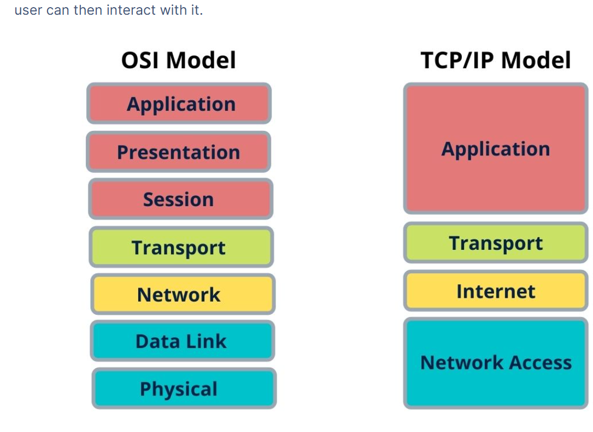

# UNIT 1

1.IMPORTANCE OF INFOSEC

Information is a company's most important asset, differentiating successful businesses and providing competitive leverage. To protect this asset, organizations implement a formal **information classification and handling policy**—a vital component of overall security policy.

### Categories of Information

1. **Internal Use Only:** Least restricted, intended for employees/contractors but not the public. Examples include general memos and meeting requests. Protection investment is minimal compared to the risk of disclosure.
2. **Confidential:** Intended for internal use on a **need-to-know basis**. Examples include R&D plans, customer lists, and financial forecasts. Loss can violate privacy or reduce competitive advantage. Disclosure to external parties requires a **Non-Disclosure Agreement (NDA)**.
3. **Specialized/Secret:** Most restricted, intended for only a few people. Examples include trade secrets, formulas, passwords, and encryption keys. Disclosure can cause severe competitive damage.

### Regulatory Mandates

In many sectors, protecting information is **mandatory** due to legal and regulatory requirements, which carry penalties for non-compliance.

- **Healthcare** must comply with **HIPAA** to protect Protected Health Information (PHI).
- **Financial Institutions** must comply with **FFIEC** and **GLBA** to protect customer PII and records.
- **Publicly Traded Companies** must comply with **Sarbanes-Oxley Act (SOX)** to protect against false financial information.

### Information Classification

Information is classified into categories based on its **importance, sensitivity, and vulnerability** to control access and manage its handling. Classification dictates the resources deployed for control, following models like the U.S. government's five levels (e.g., Unclassified to Top Secret).

Classification governs numerous handling aspects, including:

- **Labeling** (headers/watermarks)
- **Distribution** (who sees it)
- **Storage** and **Encryption**
- **Disposal** (shredding/wiping)
- **Transmission** methods

Ultimately, strong security controls build **mutual trust**, allowing organizations to safely provide authorized access to customers, partners, and vendors—a capability that is now a business **necessity** in the digital age.

---

## **2.Comparison of Academic and Government Security Models**

| Basis | **Academic (Wide-Open) Security Model** | **Government (Closed & Locked) Security Model** |
| --- | --- | --- |
| **Primary Environment** | Universities, research institutions | Government, military, defense organizations |
| **Security Philosophy** | Open access and trust-based | Strict access control and zero-trust |
| **Access Control** | Minimal or no authentication | Strong authentication and authorization |
| **User Trust Level** | Users are trusted by default | Users are untrusted by default |
| **Network Accessibility** | Freely accessible networks | Highly restricted and controlled networks |
| **Data Sharing** | Encourages information sharing | Data access is strictly need-to-know |
| **Security Controls** | Few security mechanisms | Multiple layered security controls |
| **Monitoring & Auditing** | Minimal logging and monitoring | Extensive monitoring and auditing |
| **Encryption Usage** | Rarely used | Widely used for data protection |
| **Network Design Focus** | Collaboration and experimentation | Confidentiality, integrity, and availability |
| **Flexibility** | Highly flexible and open | Highly rigid and policy-driven |
| **Risk Tolerance** | High tolerance for risk | Very low tolerance for risk |
| **Firewall Usage** | Rare or non-existent | Mandatory firewalls and gateways |
| **Impact of Failure** | Usually low impact | Very high impact (national security) |
| **Examples** | Early ARPANET, university networks | Military and intelligence networks |

---

## **3.Why ROI and ALE Are Ineffective for Security Justification**

Justifying investment in information security using **Return on Investment (ROI)** and **Annualized Loss Expectancy (ALE)** has proven to be ineffective due to the unique nature of security risks and benefits.

---

### **Limitations of ROI in Security Justification**

ROI is traditionally used to measure the **financial gain** obtained from an investment. However, information security does not usually generate direct revenue. Instead, it focuses on **preventing losses**, such as data breaches, reputational damage, and service disruptions. Since it is difficult to demonstrate a clear monetary gain from preventing an event that may or may not occur, ROI does not translate well to security investments. As a result, security spending often appears as a cost rather than a value-generating investment.

---

### **Limitations of ALE in Security Justification**

Annualized Loss Expectancy (ALE) attempts to quantify risk by combining the **probability of a security incident** with the **estimated cost of that incident**. However, ALE relies heavily on assumptions and guesswork. Estimating the likelihood of attacks and the financial impact of breaches is highly uncertain. Additionally, security incidents do not occur evenly year after year, making ALE values unreliable and difficult to defend. This uncertainty weakens ALE as a solid justification for budgeting decisions.

---

### **Unpredictable Nature of Security Incidents**

Security threats are dynamic and constantly evolving. New vulnerabilities, attack techniques, and threat actors make it nearly impossible to accurately predict future losses. Both ROI and ALE fail to account for this unpredictability, leading to inaccurate or misleading financial justifications.

---

### **Intangible and Indirect Benefits of Security**

Many benefits of security—such as customer trust, brand reputation, regulatory compliance, and business continuity—are **intangible** and cannot be easily expressed in monetary terms. ROI and ALE focus only on measurable financial outcomes and ignore these critical but non-quantifiable benefits.

---

4.Relationship b/w threats, security and Vulnerability

### . Threat (The Danger)

A **threat** is the *potential* cause of harm to an asset. It is an agent, situation, or motivation that could potentially damage or destroy assets or disrupt operations. Threats are external to the system's security flaws.

- **Key Question:** *What could possibly happen?*
- **Examples:** A malicious hacker, a disgruntled employee, a severe weather event (natural), or the spread of malware.

### 2. Vulnerability (The Weakness)

A **vulnerability** is a **flaw, weakness, or gap** in a system's security procedures, design, implementation, or internal control that a threat can exploit to gain unauthorized access or cause harm. Vulnerabilities are internal to the system.

- **Key Question:** *How can it happen?*
- **Examples:** Unpatched software, weak passwords, misconfigured firewall rules, or lack of employee security training.

### 3. Attack (The Action)

An **attack** is the **realization** (or attempted realization) of a threat. It is the specific action taken by a threat agent to exploit a vulnerability.

- **Key Question:** *The act of making it happen.*
- **Examples:** A hacker using an exploit kit to target an unpatched server (DDoS attack), a phishing email attempt, or an employee purposefully downloading proprietary data.

---

## 🔗 The Interdependency

For a security breach or incident to successfully occur, **all three elements must intersect**:

1. If a **vulnerability** exists but there is **no threat** to exploit it, no attack will happen. (e.g., A bug in an old system you no longer use).
2. If a **threat** exists, but the system has **no vulnerability** that the threat can exploit, the attack will fail. (e.g., A hacker tries a known exploit on a fully patched server).
3. The **attack** is simply the method used by the threat agent to capitalize on the vulnerability.

---

## **5.Components of Building a Security Program**

Building an effective security program requires a **systematic and well-structured approach** that defines authority, establishes policies, assesses risks, plans actions, executes controls, and ensures continuous improvement. Each component plays a critical role in ensuring that security objectives are achieved and sustained.

---

### **1️⃣ Authority**

Authority is the foundation of a security program. A **security program charter** defines the purpose, scope, responsibilities, and authority of the security organization. It formally authorizes the security team to protect information assets, manage risks, monitor threats, and respond to incidents. This authority must be approved by executive management to ensure organizational support. A **resourcing plan** complements this by defining how personnel—employees, contractors, consultants, or service providers—will be allocated to operate and sustain the security function. 

---

### **2️⃣ Framework**

The security framework  implements security through three key components: security policies, standards, and guidelines. 

Policies define management’s intent, outlining what needs protection and why. 

Standards translate these policies into specific, technology-dependent requirements to ensure consistency across systems and platforms. 

Guidelines offer practical instructions for users and administrators on complying with policies. Together, these elements ensure clarity, consistency, and alignment between business objectives and technical security measures.

---

### **3️⃣ Assessment**

Assessment evaluates the organization’s current security posture. A **risk analysis** identifies assets, threats, vulnerabilities, and the potential impact of security incidents. A **gap analysis** compares the current state of security with the desired state defined by standards or policies, identifying deficiencies. **Remediation planning** then consolidates these findings into a prioritized plan of actions to address risks and gaps, guiding the organization toward an improved security posture.

---

### **4️⃣ Planning**

Planning converts assessment outcomes into actionable initiatives. A **security roadmap** outlines what actions will be taken, when they will occur, and in what order, often over a multi-year timeline. The **security architecture** defines how security technologies and controls fit together at a high level, ensuring coherence and integration. 

---

### **5️⃣ Action**

The action phase involves executing the planned security initiatives. **Procedures** define how tasks and processes are carried out consistently and reliably by personnel. An **incident response plan** defines how to detect, respond to, and recover from security incidents, minimizing damage and downtime. This component turns strategy into real operational security.

---

### **6️⃣ Maintenance**

Maintenance ensures the long-term effectiveness of the security program. **Policy enforcement** ensures compliance with security rules through cooperation between security teams, management, and HR. **Security awareness and training programs** educate employees and stakeholders about secure behaviour, reducing human-related risks. **Ongoing guidance** supports business operations by integrating security into daily decision-making and adapting controls as business needs evolve. This continuous effort keeps the security program relevant and effective.

---

---

6.Justification: Why the Defender’s Job Is Harder Than the Attacker’s

The attacker needs to exploit only one weakness in a system to succeed, whereas the defender must attempt to protect against all possible vulnerabilities. Since no system can be perfectly secure, achieving complete protection is practically impossible.

Attackers operate without rules or constraints. They can exploit unexpected paths, misuse trust relationships, and use destructive techniques that were never anticipated during system design. For example, an attacker may bypass security controls entirely by abusing human trust or using unconventional attack methods. In contrast, defenders must follow policies, legal constraints, and operational limitations while ensuring that systems remain functional, cost-effective, and accessible to legitimate users.

Since perfect security is impossible, defenders focus on **risk management** instead of absolute protection. They use risk assessments to prioritize which threats to mitigate, transfer (via insurance), or accept—reducing risk to acceptable levels rather than trying to eliminate it entirely.

---

7.PRINCIPLE OF TRANSITIVE SECURITY

## **Equivalent (Transitive) Security Principle**

The principle of **equivalent security**, also known as **transitive security**, states that **all security controls in a system should complement one another and provide a comparable level of protection**. The overall security of a system is determined by its **weakest control**, not its strongest one. If one control is significantly weaker than the others, attackers will target that weakness to bypass the entire security system.

---

## **Justification of the Principle**

Security controls are typically deployed in layers, such as firewalls, authentication mechanisms, access controls, encryption, monitoring systems, and physical security. If these controls are not equally strong, an attacker does not need to defeat all of them—only the weakest one. For example, using strong encryption to protect data is ineffective if user authentication is weak or passwords are poorly managed. In such a case, attackers can simply gain access through compromised credentials rather than breaking the encryption.

This principle is called **transitive security** because the security of one component depends on the security of the others. Trust is effectively transferred across the system. If one trusted component is compromised, the attacker may gain indirect access to other components, even if they are well protected individually.

---

## **Example to Illustrate Equivalent Security**

Consider a building protected by biometric access, surveillance cameras, and strong door locks, but with a weak window. An intruder will ignore the strong defenses and enter through the window. Similarly, in network security, a highly secure firewall does not provide sufficient protection if internal systems lack proper patching or monitoring.

---

8.Concept of weakest link

The concept of the **weakest link in security** states that the overall security of a system is only as strong as its **least secure component**. No matter how advanced or robust other security controls are, an attacker will always target the weakest point to gain unauthorized access. This weakest link could be a vulnerable system, an outdated software component, poor configuration, weak passwords, or even human behavior.

In many cases, **people** are considered the weakest link in security due to lack of awareness, susceptibility to social engineering, or failure to follow security policies. For example, strong encryption and firewalls provide little protection if users fall victim to phishing attacks and reveal credentials. Similarly, a well-secured network can be compromised through an unsecured endpoint or misconfigured access control.

---

9.THREAT VECTOR

### **What is a Threat Vector?**

A **threat vector** is the **path, method, or means** by which a threat actor gains access to a system, network, or asset in order to exploit a vulnerability. It describes **how an attack is carried out**, not the attacker or the damage itself. Threat vectors can be technical, physical, or human-based and represent the entry points attackers use to compromise security.

Examples of threat vectors include phishing emails, malware downloads, unsecured network ports, weak passwords, misconfigured cloud services, and social engineering attacks.

---

### **How to Identify Threat Vectors**

Identifying threat vectors involves a systematic analysis of assets, vulnerabilities, and attack paths. The key steps are:

### **1️⃣ Asset Identification**

The first step is to identify and classify **critical assets** such as data, systems, applications, networks, and users. Understanding what needs protection helps determine which assets attackers are most likely to target and through which vectors.

### **2️⃣ Vulnerability Assessment**

Next, vulnerabilities in systems, applications, configurations, and processes are identified using vulnerability scans, audits, and configuration reviews. Each vulnerability represents a potential entry point that can become a threat vector if exploited.

### **3️⃣ Threat Modeling**

Threat modeling involves analyzing how an attacker could realistically exploit vulnerabilities to reach assets. This includes mapping possible attack paths such as external access points, internal lateral movement, and privilege escalation. Models like STRIDE or attack trees are commonly used.

### **4️⃣ Review of Past Incidents and Threat Intelligence**

Historical security incidents, attack logs, and threat intelligence reports provide insight into **common and emerging attack vectors**. Reviewing phishing attempts, malware infections, or breach reports helps identify likely vectors relevant to the organization.

### **5️⃣ Monitoring and Testing**

Continuous monitoring, penetration testing, and red-team exercises help uncover real-world threat vectors by simulating attacker behavior. Logs, alerts, and abnormal activity patterns often reveal previously unnoticed attack paths.

---

10.Lifecycle of Malicious Mobile Code

### **1️⃣ Find**

In this stage, the attacker or malicious code **searches for vulnerable systems**. This may involve scanning networks, identifying unpatched software, weak security settings, or unsuspecting users. The goal is to locate a target that can be compromised.

---

### **2️⃣ Exploit**

Once a vulnerable target is found, the malicious code **takes advantage of the weakness**. This could involve exploiting a software flaw, tricking a user into executing a file, or abusing misconfigured permissions to gain access.

---

### **3️⃣ Infect**

After successful exploitation, the malicious code **installs itself on the system**. It may modify files, run malicious processes, establish persistence, or connect to a command-and-control server to carry out further actions.

---

### **4️⃣ Repeat**

In the final stage, the infected system is used to **search for new vulnerable targets**, allowing the malicious code to spread and continue the cycle by finding, exploiting, and infecting additional systems.

---

11.Email worms and their working

## **Email Worms**

### **What are Email Worms?**

**Email worms** are a type of **malicious software (malware)** that spread automatically through **email systems**. They propagate by sending copies of themselves as email attachments or links to other users, usually without the user’s knowledge. Unlike viruses, email worms **do not require a host program** and can spread rapidly across networks.

---

## **Working of Email Worms**

### **1️⃣ Infection of Initial System**

An email worm typically enters a system when a user **opens a malicious email attachment** or clicks on an infected link. The attachment may appear as a document, image, or executable file disguised as legitimate content.

---

### **2️⃣ Execution and Payload Activation**

Once opened, the worm **executes itself** on the victim’s system. It may install malicious files, modify system settings, or establish persistence to remain active after reboot.

---

### **3️⃣ Email Harvesting**

The worm scans the infected system to **collect email addresses** from sources such as contact lists, address books, cached emails, or documents. This allows it to identify new targets.

---

### **4️⃣ Automatic Propagation**

Using the harvested addresses, the worm **automatically sends copies of itself** to new victims. These emails often use social engineering techniques such as fake subject lines, urgent messages, or trusted sender names to trick users into opening them.

---

### **5️⃣ Repeat and Spread**

Each newly infected system repeats the same process, causing the worm to **spread exponentially** across email networks and the internet.

---

## **Impact of Email Worms**

- Rapid network congestion
- Spread of additional malware
- Data theft or system damage
- Email server overload

---

## **12.Trojans (Trojan Horses)**

### **What are Trojans?**

A **Trojan** (or **Trojan Horse**) is a type of **malicious software** that disguises itself as a **legitimate or useful program** to trick users into installing or executing it. Unlike viruses or worms, Trojans **do not self-replicate**. Their success depends on **social engineering**, where users are deceived into running the malicious code.

---

## **Working of Trojans**

### **1️⃣ Disguise as Legitimate Software**

Trojans are commonly disguised as genuine applications such as software updates, free utilities, cracked software, email attachments, or media files. The user believes the program is safe and intentionally installs or opens it.

---

### **2️⃣ Execution by the User**

Once the user executes the Trojan, it **activates its malicious payload**. Since the user initiated the execution, the Trojan often runs with the same privileges as the user, allowing it to bypass basic security controls.

---

### **3️⃣ Malicious Payload Activation**

After execution, the Trojan performs its intended malicious actions. This may include creating backdoors, stealing credentials, logging keystrokes, modifying system files, downloading additional malware, or disabling security software.

---

### **4️⃣ Establishing Persistence**

Many Trojans modify system settings or startup processes so that they **remain active even after system reboot**. This allows continuous control or monitoring of the infected system.

---

### **5️⃣ Communication with Attacker**

Advanced Trojans connect to a **command-and-control (C2) server**, allowing attackers to remotely control the infected system, exfiltrate data, or issue further commands.

---

## **Common Types of Trojans**

- **Backdoor Trojans** – Allow remote access
- **Banking Trojans** – Steal financial data
- **Remote Access Trojans (RATs)** – Full system control
- **Downloader Trojans** – Fetch additional malware

---

## **Remote Access Trojans (RATs)**

**Remote Access Trojans (RATs)** are a type of Trojan that allow an attacker to gain **unauthorized remote control** of a victim’s system. Once installed, a RAT enables the attacker to perform actions as if they were physically present at the infected machine. These actions may include viewing or stealing files, monitoring keystrokes, capturing screenshots, activating webcams or microphones, and executing commands remotely. RATs often communicate with a **command-and-control (C2) server**, allowing continuous monitoring and control. They are commonly delivered through phishing emails, malicious downloads, or fake software updates and pose a serious threat to privacy and system integrity.

---

## **Backdoor Trojans**

**Backdoor Trojans** are malicious programs designed to **bypass normal authentication and security mechanisms** to provide attackers with hidden access to a system. Unlike RATs, which provide full remote control interfaces, backdoor Trojans primarily focus on creating a **secret entry point** into the system. Once installed, they allow attackers to re-enter the system at any time without the user’s knowledge, often using hidden services or modified system files. Backdoor Trojans are frequently used to install additional malware, steal data, or maintain long-term access to compromised systems.

---

## **Key Difference (Exam Tip)**

- **RATs** provide **active remote control and monitoring**
- **Backdoor Trojans** provide **hidden persistent access** for future attacks

---

13.NETWORK LAYER ATTACKS

## **Network Layer Attacks**

**Network Layer attacks** target the **Network Layer (Layer 3) of the OSI model**, which is responsible for logical addressing, routing, and packet forwarding. These attacks aim to **intercept, alter, reroute, or disrupt data packets** as they travel across a network. By exploiting weaknesses in routing protocols, IP addressing, or packet handling mechanisms, attackers can compromise data confidentiality, integrity, and availability.

Common objectives of network layer attacks include:

- Unauthorized data interception
- Traffic redirection
- Network disruption (DoS)
- Identity spoofing

Examples of network layer attacks include **IP spoofing, packet sniffing, route poisoning, ICMP flooding, and man-in-the-middle attacks**.

---

## **Packet Sniffing**

### **What is Packet Sniffing?**

**Packet sniffing** is a network layer attack in which an attacker **captures and analyzes data packets** traveling over a network. A packet sniffer is a tool that puts a network interface card (NIC) into **promiscuous mode**, allowing it to receive all packets on the network segment, not just those addressed to it.

Packet sniffing can be **legitimate** when used by network administrators for troubleshooting, but it becomes malicious when used to **steal sensitive information** such as usernames, passwords, session cookies, emails, and confidential data.

---

### **How Packet Sniffing Works**

1. **Access to the Network**
    
    The attacker gains access to the same network segment as the victim, either physically or remotely.
    
2. **Promiscuous Mode Activation**
    
    The attacker configures the NIC to capture all packets passing through the network rather than only intended packets.
    
3. **Packet Capture**
    
    Tools like Wireshark or tcpdump capture raw packets containing headers and payload data.
    
4. **Packet Analysis**
    
    Captured packets are analyzed to extract sensitive information, especially when data is transmitted in plaintext.
    
5. **Data Exploitation**
    
    The attacker uses the stolen information for identity theft, unauthorized access, or further attacks.
    

---

### **Types of Packet Sniffing**

- **Passive Sniffing**
    
    Occurs on hub-based or shared networks where traffic is broadcast to all devices.
    
- **Active Sniffing**
    
    Used on switched networks by manipulating traffic using techniques like ARP poisoning or MAC flooding.
    

---

### **Impact of Packet Sniffing**

- Theft of login credentials
- Loss of data confidentiality
- Session hijacking
- Privacy violations

---

**14.Protocol Anomaly Attack** is a type of network attack in which an attacker **exploits weaknesses, ambiguities, or improper handling of standard network protocols** by sending **malformed, unexpected, or non-standard packets**. These packets technically violate protocol specifications or use them in unusual ways, causing network devices or systems to behave incorrectly.

Such attacks take advantage of the fact that many systems do not strictly validate protocol behavior and may crash, hang, or become unstable when they encounter abnormal protocol usage.

---

## **How a Protocol Anomaly Attack Works**

1. The attacker studies the protocol specifications (such as TCP/IP, HTTP, ICMP).
2. Specially crafted packets are created that:
    - Have invalid headers
    - Contain overlapping or incorrect fields
    - Use unexpected flag combinations
3. These malformed packets are sent to the target system.
4. The target system may:
    - Crash
    - Consume excessive resources
    - Misinterpret data
    - Become vulnerable to further attacks

---

## **Examples of Protocol Anomaly Attacks**

- **TCP flag abuse** (illegal flag combinations)
- **Malformed IP packets**
- **Fragmentation attacks** (overlapping fragments)
- **Ping of Death** (oversized ICMP packets)
- **Malformed HTTP requests**

---

## **15.How Attackers Generate Malformed Packets**

Attackers generate **malformed packets** by deliberately crafting network packets that **violate protocol standards** or contain **unexpected values**. These packets are designed to exploit weaknesses in how operating systems, firewalls, or applications **parse and process network traffic**.

---

### **1️⃣ Manipulating Protocol Headers**

Attackers manually alter protocol header fields such as IP, TCP, or UDP headers. This includes using:

- Invalid or reserved flag combinations
- Incorrect header lengths
- Illegal sequence or acknowledgment numbers

Many systems fail to properly validate these fields, leading to crashes, errors, or undefined behavior.

---

### **2️⃣ Creating Incorrect Packet Sizes**

Attackers generate packets with:

- Oversized payloads
- Mismatched length fields
- Truncated data

For example, an attacker may specify a small packet length in the header but include a larger payload, confusing the receiving system and causing buffer overflows or denial-of-service conditions.

---

### **3️⃣ Abusing Packet Fragmentation**

Packets are intentionally fragmented incorrectly by:

- Sending overlapping fragments
- Reordering fragments
- Omitting required fragments

When the target system attempts to reassemble these fragments, it may consume excessive resources or crash due to faulty reassembly logic.

---

### **4️⃣ Violating Protocol State Rules**

Attackers send packets that **break protocol state logic**, such as:

- TCP packets without completing the handshake
- Unexpected FIN or RST packets
- Data packets sent before a session is established

Systems that do not strictly enforce protocol states may misinterpret such packets.

---

### **5️⃣ Using Packet Crafting Tools**

Attackers commonly use specialized tools to generate malformed packets, such as:

- Custom packet generators
- Fuzzing tools
- Low-level packet crafting utilities

These tools allow full control over packet structure, flags, timing, and payload.

---

## **16.Advanced Persistent Threats (APTs)**

An **Advanced Persistent Threat (APT)** is a **sophisticated, long-term cyberattack** in which an attacker gains unauthorized access to a network and **remains undetected for an extended period**. APTs are typically carried out by **well-funded and skilled attackers**, such as nation-states or organized cybercriminal groups, with the goal of **stealing sensitive information, spying, or sabotaging systems** rather than causing immediate damage.

APTs are called **advanced** because they use complex techniques like zero-day exploits, custom malware, and social engineering; **persistent** because attackers maintain continuous access over time; and **threats** because they pose serious risks to critical assets. Attackers often move laterally within the network, escalate privileges, and carefully avoid detection while exfiltrating data slowly.

Detecting APTs is difficult because they blend in with normal network activity. Defending against APTs requires **layered security**, continuous monitoring, threat intelligence, regular patching, and strong incident response capabilities.

---

1. Application Layer Attacks

The Application layer (Layer 7 of the OSI model) is where users interact with software, making it a primary target for attackers who seek to exploit coding flaws or misconfigurations to steal data, hijack sessions, or compromise the entire system.1

Here are the most significant Application Layer attacks:

---

## 💻 Common Application Layer Attacks

### 1. Cross-Site Scripting (XSS)

XSS attacks inject malicious client-side scripts (often JavaScript) into web pages viewed by other users.2

- **Mechanism:** The attacker finds a vulnerability (often an unsanitized input field) on a legitimate website and injects code.3 When an unsuspecting user visits the site, the browser executes the malicious script, trusting the site's origin.4
- **Impact:** Session hijacking (stealing cookies), unauthorized actions on the user's behalf, or redirecting the user to malicious sites.5
- **Classification:** Injection Attack.

### 2. SQL Injection (SQLi)

SQLi is a technique where an attacker interferes with the queries that an application makes to its database.6

- **Mechanism:** The attacker inserts malicious SQL commands into an application's input field (e.g., a login or search bar). If the application doesn't properly sanitize the input, the database executes the malicious command.7
- **Impact:** Viewing, modifying, or deleting sensitive data (like customer records, passwords, or financial information), or gaining administrative access to the database.8
- **Classification:** Injection Attack.9

### 3. Cross-Site Request Forgery (CSRF or XSRF)

CSRF tricks a logged-in user into performing an unintended action on a web application they are currently authenticated to.10

- **Mechanism:** An attacker sends a user a link or embeds a hidden HTML element on a malicious page. When the user clicks the link (or loads the page), their browser automatically sends a request to the legitimate site, complete with the user's session cookies, making the request appear valid.11
- **Impact:** Transferring funds, changing email addresses, purchasing items, or changing a password without the user's knowledge.12
- **Classification:** Forgery Attack.

### 4. Denial-of-Service (DoS) and Distributed Denial-of-Service (DDoS)

While DoS/DDoS attacks can target multiple layers, Application Layer DDoS attacks specifically focus on overwhelming a service or application resource, rather than just saturating the network bandwidth.13

- **Mechanism:** The attacker sends a high volume of complex, resource-intensive requests (e.g., database queries, complex searches, or login attempts) that force the server to allocate maximum processing power, memory, or database connections.
- **Impact:** The legitimate application slows down significantly or crashes entirely, denying service to real users.
- **Classification:** Availability Attack.

### 5. XML External Entity (XXE) Injection

This attack targets applications that parse XML input, exploiting a vulnerability in how the XML parser handles external entity references.14

- **Mechanism:** The attacker includes external entity references within the XML data sent to the server.15 If the parser is misconfigured, it can be forced to disclose files from the server's file system or execute remote code.
- **Impact:** Disclosure of confidential data, Server-Side Request Forgery (SSRF), or Denial-of-Service.
- **Classification:** Injection Attack.

### 6. Broken Authentication and Session Management

This category encompasses flaws in an application's functions related to managing user identities and sessions.

- **Mechanism:** An attacker exploits weak password recovery schemes, predictable session tokens, or insecure logout mechanisms to bypass authentication or impersonate a user.
- **Impact:** An attacker gains full control of a user's account, accessing or modifying their private data.
- **Classification:** Authentication Bypass/Impersonation.

### 7. Insecure Direct Object Reference (IDOR)

IDOR occurs when a web application exposes a direct reference to an internal implementation object (like a file or database key) and fails to verify that the user is authorized to access it.16

- **Mechanism:** The attacker modifies a parameter in the URL (e.g., changing `user_id=123` to `user_id=124`) to access another user's account or private data.
- **Impact:** Unauthorized viewing or modification of other users' accounts, files, or sensitive records.17
- **Classification:** Authorization Bypass.

The **3 Ds of Security** is a common conceptual model used to explain the **core objectives of a security program**. It emphasizes how security controls work together to protect assets and respond to attacks.

---

## **The 3 Ds of Security**

### **1️⃣ Deter**

**Deterrence** aims to **discourage attackers** from attempting an attack in the first place. The idea is to make the system appear **difficult, risky, or costly** to attack.

**How it works:**

- Warning banners
- Security policies
- Visible surveillance (CCTV)
- Strong authentication requirements
- Legal notices and penalties

If attackers believe they are likely to be caught or blocked, they may abandon the attack and move on to easier targets.

---

### **2️⃣ Detect**

**Detection** focuses on **identifying attacks or suspicious activity** as they occur. Since no system can be perfectly secure, detection ensures that breaches are discovered quickly.

**How it works:**

- Intrusion Detection Systems (IDS)
- Log monitoring and SIEM
- Network traffic analysis
- File integrity monitoring
- Alerts and alarms

Early detection reduces the damage an attack can cause.

---

### **3️⃣ Defend (or Delay)**

**Defense** involves **actively stopping, limiting, or slowing down an attack** to protect assets and buy time for response.

**How it works:**

- Firewalls and access controls
- Encryption
- Anti-malware tools
- Network segmentation
- Rate limiting and DoS protection

Defense mechanisms prevent unauthorized access and contain the impact of attacks.

---

## **Why the 3 Ds Matter**

- Attackers may bypass one control, but not all
- Combined, they provide **layered security**
- They support risk reduction rather than absolute prevention

## **CIA Triad**

### **1️⃣ Confidentiality**

Confidentiality ensures that **information is accessible only to authorized individuals or systems**. Its goal is to prevent unauthorized disclosure of data.

**How it is achieved:**

- Authentication and authorization
- Encryption (data at rest and in transit)
- Access control lists (ACLs)
- Data classification and permissions

**Example:**

Only HR staff can access employee salary records.

---

### **2️⃣ Integrity**

Integrity ensures that **information remains accurate, complete, and unaltered** during storage, processing, or transmission. Unauthorized modification or deletion of data is prevented or detected.

**How it is achieved:**

- Hashing and checksums
- Digital signatures
- Version control
- File integrity monitoring

**Example:**

Financial records are protected from unauthorized changes.

---

### **3️⃣ Availability**

Availability ensures that **information and systems are accessible to authorized users when needed**. It focuses on minimizing downtime and service disruption.

**How it is achieved:**

- Redundancy and failover systems
- Regular backups
- Load balancing
- Protection against DoS attacks

**Example:**

An online banking system remains accessible even during peak usage or failures.

---

## **Why the CIA Triad is Important**

- Provides a **balanced approach** to security
- Helps in designing security policies and controls
- Guides risk assessment and mitigation
- Forms the basis of most security frameworks
---

What are the ways in which security controls can be implemented
Security controls are implemented using a multi-layered approach often described in two ways: by **how** they are applied (Category) and by **what** they are intended to do (Function).

For a DevOps engineer or security student, understanding this matrix is the key to building a "Defense in Depth" strategy.

---

### 1. Implementation by Category (The "How")

This describes the nature of the control itself.

|**Category**|**Description**|**Examples**|
|---|---|---|
|**Technical (Logical)**|Hardware, software, or firmware mechanisms.|Firewalls, **Encryption**, MFA, **IDS**, Antivirus.|
|**Administrative (Managerial)**|Policies, procedures, and guidelines governing behavior.|Security training, **Incident Response Plans**, Hiring policies.|
|**Physical**|Tangible measures to protect facilities and assets.|Guards, **CCTV**, Biometric locks, Server room fences.|

---

### 2. Implementation by Function (The "When")

This describes the timing of the control relative to a security event.

- **Preventive:** Designed to stop an incident from occurring in the first place.
    
    - _Examples:_ Using `HttpOnly` flags on cookies, **Input Sanitization** in your Python code, or a locked server room door.
        
- **Deterrent:** Discourages an attacker from attempting a strike.
    
    - _Examples:_ "Unauthorized Access Prohibited" login banners or visible security cameras.
        
- **Detective:** Identifies and alerts when an incident is happening or has happened.
    
    - _Examples:_ **Traceroute** anomalies, **Log Monitoring** in your PostgreSQL DB, or smoke detectors.
        
- **Corrective:** Limits the damage and restores the system after an incident.
    
    - _Examples:_ **Data Backups**, terminating a malicious process, or patching a vulnerability after a breach.
        
- **Compensating:** A "backup" control used when the primary control isn't feasible.
    
    - _Example:_ If you can't update an old legacy server, you might place it behind an extra-strict firewall instead.
        

---

### 3. Practical Implementation Steps

In a professional environment (like your work with **ArgoCD** and **GitHub**), implementation follows a specific lifecycle:

1. **Risk Assessment:** Identify the most critical assets (e.g., your database or private code).
    
2. **Selection:** Choose a mix of controls. _Example: To protect a database, you use Technical (Encryption) + Administrative (Access Policies) + Physical (Locked Rack)._
    
3. **Deployment:** Activating the controls. In DevOps, this is often done via **Infrastructure as Code (IaC)** like Terraform or Ansible.
    
4. **Testing & Verification:** Running **Penetration Tests** or audits to ensure the controls actually work.
    
5. **Continuous Monitoring:** Using tools like **SIEM** to ensure the controls stay effective as the network changes.
    

---

> **Peer Note:** In your **IDS project**, you are effectively building a **Detective Technical Control**. If your model identifies an attack, its "Corrective" partner might be a script that automatically updates a firewall rule to block the attacker's IP.

Would you like to see how to write a **Security Policy (Administrative Control)** for your team's GitHub repository?

---

# UNIT 2

What is Authentication. Explain  types of authentication systems 
### What is Authentication?

**Authentication** is the security process of verifying the identity of a user, device, or system. Simply put, it answers the question: _"Are you actually who you claim to be?"_ It is the very first step in network security. Before a system decides what you are allowed to do (Authorization) or tracks what you are doing (Accounting), it must absolutely confirm your identity.

Authentication generally relies on proving one or more of three factors: **Something you know**, **Something you have**, or **Something you are**.

Here is an explanation of the primary systems available today based on those factors:

---

### 1. Username and Password Combinations (Including Kerberos)

This is the most common and traditional form of authentication, based entirely on **"Something you know."**

- **The Basics:** A user provides a public identifier (the username) and a secret string of characters (the password) that only they should know. The system checks this against its database to grant access.
    
- **The Vulnerability:** Passwords can be guessed, stolen via phishing, or intercepted if sent across a network in plain text.
    
- **The Kerberos Solution:** To fix the interception problem, enterprise networks (like Microsoft Active Directory) use the **Kerberos** protocol. Instead of transmitting your actual password over the network, Kerberos uses a trusted third-party server called a Key Distribution Center (KDC). When you log in, the KDC verifies your password locally and hands your computer a temporary, encrypted "Ticket." Your computer then uses this ticket—not your password—to securely prove your identity to other servers and services on the network.
    

### 2. Certificates or Tokens

This category moves away from human memory and relies on **"Something you have."** Because humans are terrible at creating and remembering strong passwords, these systems use cryptography and physical possession to prove identity.

- **Digital Certificates:** These are secure, cryptographic files installed directly on a user's laptop or mobile device. They use a Public Key Infrastructure (PKI). When the user tries to connect to the corporate VPN, the server silently checks for this certificate. If the device has the correct math (the private key), it is authenticated instantly without the user typing anything.
    
- **Hardware and Software Tokens:** These are physical devices (like a YubiKey or an RSA keychain fob) or smartphone apps (like Google Authenticator). They generate a Time-Based One-Time Password (TOTP)—a unique 6-digit code that changes every 30 to 60 seconds. Even if a hacker steals your password, they cannot log in because they do not physically possess the token generating the current code.
    

### 3. Biometrics

This is the most advanced form of authentication, relying on **"Something you are."**

- **The Mechanism:** Instead of a password or a token, biometric systems measure unique physical or behavioral characteristics of the human body. The system takes a scan, converts it into a digital mathematical template, and compares it to the template saved on file.
    
- **Common Examples:** Fingerprint scanners, facial recognition (like Apple's FaceID), retina/iris scans, and voice recognition.
    
- **The Security Trade-off:** Biometrics are incredibly convenient and practically impossible to "forget" or hand over to a phishing site. However, they carry a unique risk: if a biometric database is compromised and a hacker steals your digital fingerprint data, you cannot simply "reset" your fingerprint the way you can reset a compromised password.
    

---

**What is Certificate based auth. Expand on the working of with an example of a client connecting to an https server using SSL/TLS
### What is Certificate-Based Authentication?

**Certificate-Based Authentication** is a method of verifying identity using a digital file (a certificate) instead of a password.

Think of a digital certificate like a digital passport or driver's license. It is issued by a trusted third party called a **Certificate Authority (CA)**. This certificate binds an identity (like a website domain name, a person, or a device) to a mathematical cryptographic key.

It relies on **Asymmetric Cryptography**, meaning it uses a pair of keys:

- **Public Key:** Shared openly inside the certificate. Anyone can see it. It is used to lock (encrypt) data.
    
- **Private Key:** Kept securely hidden on the server or device. It is never shared. It is the _only_ thing that can unlock (decrypt) data encrypted by the public key.
    

---

### How It Works: The SSL/TLS Handshake

When you type `https://www.bank.com` into your browser, a complex, split-second cryptographic dance occurs before any web page data is actually loaded. This is called the **TLS Handshake**.

Here is exactly how the client (your browser) uses certificate-based authentication to verify the server (the bank's website):

**Step 1: The Introduction (Client Hello)**

- Your browser sends a message to the server saying, "I want to connect securely. Here are the encryption versions and cipher suites I support."
    

**Step 2: Presenting the ID (Server Hello & Certificate)**

- The server responds, picks the strongest encryption method they both support, and says, "Let's use this one."
    
- Crucially, the server also sends over its **Digital Certificate**. This certificate contains the server's Public Key, the domain name (`bank.com`), and the digital signature of the CA that issued it.
    

**Step 3: Verifying the ID (The CA Check)**

- This is the actual authentication step. Your browser has a pre-installed list of trusted Certificate Authorities (like DigiCert, Let's Encrypt, or GlobalSign).
    
- The browser checks the digital signature on the server's certificate against its trusted list. It verifies that the certificate hasn't expired, hasn't been revoked, and actually belongs to `bank.com`.
    
- _If the check fails, your browser throws a massive red warning screen saying "Your connection is not private."_
    

**Step 4: The Secret Exchange (Key Generation)**

- Once the browser trusts the certificate, it needs a way to send data quickly. Asymmetric encryption (public/private keys) is highly secure but too slow for streaming video or downloading large files.
    
- So, the browser generates a new, temporary **symmetric key** (a single "session key" used for both encrypting and decrypting).
    
- The browser encrypts this session key using the server's **Public Key** (found in the certificate) and sends it across the internet.
    

**Step 5: Proving Ownership (Decryption)**

- Because the session key was locked with the public key, the _only_ way to unlock it is with the server's hidden **Private Key**.
    
- The server decrypts the message and retrieves the session key. By successfully doing this, the server proves it is the legitimate owner of the certificate.
    

**Step 6: Secure Communication**

- Now, both the browser and the server have the same symmetric session key. The handshake is complete. All HTTP traffic (passwords, bank balances, cookies) is now symmetrically encrypted, sent back and forth securely, and the padlock appears in your URL bar.
    

---

Explain the working of symmetric key cryptography
### What is Symmetric Key Cryptography?

**Symmetric Key Cryptography** (also known as secret-key cryptography) is the oldest and most straightforward method of encrypting data.

The defining characteristic of this system is that it uses the **exact same key to both encrypt and decrypt the data**.

Think of it like a physical padlock and a standard metal key. You use the key to lock your diary inside a box. If you want your friend to read the diary, you have to mail them the locked box _and_ give them a physical copy of that exact same key. If they don't have the identical key, they cannot open the box.

---

### How It Works: A Step-by-Step Scenario

Imagine Alice wants to send a highly confidential financial file (the **Plaintext**) to Bob over the internet.

**Step 1: The Secret Key Generation**

- Alice and Bob must first agree on a single, shared secret key. This is just a complex string of digital bits (e.g., a 256-bit key).
    

**Step 2: Encryption**

- Alice takes her Plaintext file and runs it through a mathematical algorithm (a cipher) using the secret key.
    
- The algorithm scrambles the file into unreadable gibberish. This scrambled data is called the **Ciphertext**.
    

**Step 3: Transmission**

- Alice sends the Ciphertext to Bob over the public internet. If a hacker intercepts the transmission, all they see is mathematical noise. They cannot read the file because they do not have the secret key.
    

**Step 4: Decryption**

- Bob receives the Ciphertext. He runs it back through the same mathematical algorithm, using his copy of the **identical secret key**.
    
- The algorithm reverses the scrambling process, turning the Ciphertext back into the original, readable Plaintext.
    

---

### Key Characteristics

- **Speed and Efficiency:** Symmetric algorithms are incredibly fast and require very little processing power. Because the math is relatively straightforward, they are the absolute best choice for encrypting massive amounts of data, like an entire hard drive or a continuous video stream.
    
- **Common Algorithms:** The global standard today is **AES** (Advanced Encryption Standard). You will often see it listed as AES-128 or AES-256 (referring to the length of the key). Other examples include ChaCha20 and the outdated DES/3DES.
    

### The Major Flaw: The Key Distribution Problem

The massive vulnerability of symmetric cryptography is not the math—it is logistics.

If Alice and Bob are on opposite sides of the world, how does Alice securely get the secret key to Bob in the first place? If she emails him the key, a hacker could intercept the email, grab the key, and then unlock all future messages. The key must remain completely secret, which makes securely sharing it over an insecure network extremely difficult.

---

AVAILABILITY RISKS WITH STORAGE INFRA

---
DATABASE SECURITY

Database security refers to the collective measures, tools, and protocols designed to protect a database from unauthorized access, malicious attacks, and accidental corruption. Since databases often store an organization’s most sensitive information—such as customer records, financial data, and intellectual property—securing them is a critical component of any cybersecurity strategy.

Effective database security follows the principle of **Defense in Depth**, layered across the physical, network, and application levels.

---

### **Core Pillars of Database Security**

- **Access Control & Authentication:** This ensures that only verified users can log in. It includes enforcing strong password policies, **Multi-Factor Authentication (MFA)**, and integrating with centralized identity providers (like LDAP or Active Directory).
- **Authorization (RBAC):** Using **Role-Based Access Control**, users are granted the "Principle of Least Privilege." For example, a marketing clerk should be able to read customer emails but should not have the authority to delete the entire database or view credit card numbers.
- **Data Encryption:**
    - **In-Transit:** Protecting data as it moves between the application and the database using TLS/SSL.
    - **At-Rest:** Encrypting the physical files on the disk (Transparent Data Encryption) so that even if the hard drives are stolen, the data remains unreadable.
- **Auditing and Monitoring:** Maintaining detailed logs of who accessed the data, when they accessed it, and what queries they ran. This is vital for detecting suspicious behavior and ensuring compliance with regulations like GDPR or HIPAA.
- **Data Masking and Redaction:** This hides sensitive data from users who don't need to see it. For instance, a customer support agent might see a credit card number as `XXXX-XXXX-XXXX-1234`.

---

Client-server Architecture

In database systems, the **Client–Server architecture** is a distributed computing model that divides tasks between two main types of entities: the **Client** (the requester) and the **Server** (the provider).

This architecture is the industry standard for enterprise applications because it centralizes data management, ensuring security, consistency, and the ability to serve multiple users simultaneously.

---

### **1. Core Components**

- **The Client (Front-end):** This is the user-facing application (like a web browser, a mobile app, or a desktop tool like SQL Developer). It handles the **Presentation Logic**—displaying data to the user and collecting their inputs.
- **The Server (Back-end):** This is a powerful machine running the **Database Management System (DBMS)** like MySQL, Oracle, or SQL Server. It handles the **Data Storage Logic** and the **Processing Logic**, such as executing queries, managing security, and ensuring data integrity.
- **Communication Link:** The network (LAN, WAN, or Internet) that connects the client and server using standard protocols like **TCP/IP** and database-specific drivers (JDBC, ODBC).

---

### **2. Common Architecture Tiers**

Database designs are usually categorized by how many layers sit between the user and the data.

### **A. Two-Tier Architecture (Client-Server)**

The client communicates **directly** with the database server.

- **Fat Client:** The client machine does most of the "thinking" (business logic) and only asks the server for raw data.
- **Thin Client:** The client only handles the display; the server does all the processing.
- *Best for:* Small-scale applications or internal tools where security and speed are prioritized over serving thousands of users.

### **B. Three-Tier Architecture (Web-based)**

This adds a middle layer—the **Application Server**—between the client and the database.

1. **Presentation Tier:** The User Interface (Client).
2. **Application Tier:** The "Middleware" that holds the business rules and logic.
3. **Data Tier:** The Database Server.
- *Best for:* Large-scale web applications. It is more secure because the client never touches the database directly; it only talks to the application server.

---

What is Authorization & What is RBAC

In the context of database and application security, **Authorization** is the process of determining what an authenticated user is allowed to do. While **Authentication** verifies *who* you are (e.g., via a password), **Authorization** determines *what* permissions you have once you are inside the system.

### **1. What is Authorization?**

Authorization happens after a user is successfully identified. It acts as a gatekeeper that checks the user's rights against a set of defined rules.

- **Key Question:** "Does this user have permission to access this resource or perform this action?"
- **Examples of Actions:** Read, Write, Edit, Delete, or Execute.
- **Granularity:** Authorization can be broad (access to the whole database) or granular (access to a specific row in a specific table).

---

### **2. Role-Based Authorization (RBAC)**

**Role-Based Access Control (RBAC)** is a method of regulating access to computer or network resources based on the roles of individual users within an enterprise. In this model, permissions are not assigned directly to users; instead, they are assigned to **Roles**, and users are then assigned to those roles.

### **The Core Components of RBAC**

- **Users:** The individuals who need access to the system.
- **Roles:** A job function or title (e.g., Manager, Analyst, HR, Administrator).
- **Permissions:** Specific rights to perform operations (e.g., "Delete_Record," "View_Salary").
- **Sessions:** A mapping between a user and their active roles during a specific login.

### **How it Works (The Workflow)**

1. **Define Permissions:** The system admin defines what actions can be taken (Read, Write, etc.).
2. **Create Roles:** Permissions are grouped into roles. For example, the "Auditor" role might only have "Read" permissions for all tables.
3. **Assign Users:** Users are added to roles. If a new employee joins the Accounting team, they are simply added to the "Accountant" role, and they instantly inherit all necessary permissions.

---

### **3. Benefits of RBAC**

- **The Principle of Least Privilege:** Users are only given the access necessary to perform their jobs, reducing the "attack surface" if an account is compromised.
- **Simplified Management:** Instead of managing 1,000 individual users' permissions, an admin manages 10 roles. If a person's job changes, the admin just changes their role assignment.
- **Improved Compliance:** It is easier for auditors to see who has access to sensitive data by looking at the role definitions rather than checking every single user account.
- **Reduced Human Error:** Since permissions are standardized into roles, there is less chance of accidentally giving a low-level user high-level access.

---

Explain how database monitoring helps in identifying potential security issues.

### **1. Detection of Permission Overstepping**

Monitoring allows administrators to identify users who are attempting to exceed their assigned security rights. By keeping a log of permission usage, the system can flag unauthorized attempts to access sensitive data **before** significant damage occurs.

### **2. Forensic Analysis and Damage Assessment**

If data has already been tampered with or breached, audit logs provide a "paper trail." This helps administrators determine:

- The exact **extent of the loss**.
- The specific **data changes** that occurred.
- The identity of the user associated with the modification.

### **3. Monitoring Privileged Users (Admins)**

Auditing serves as a check on those with the highest levels of access, such as System Administrators. Since these users often require full permissions to manage the database, monitoring their logins and specific actions prevents them from "casually snooping" in sensitive tables (like `EmployeeSalary`).

### **4. Tracking Login Patterns**

At a minimum, monitoring successful and failed login attempts provides a baseline for accountability. A high frequency of failed login attempts, for instance, could indicate a brute-force attack or an unauthorized user attempting to guess credentials.

---

### **5. Identifying Circumvention Attempts**

The text highlights a specific security risk: users disabling the audit function to hide their tracks. Monitoring helps identify this issue by **auditing the auditing functionality itself**. Any attempt to disable or re-enable logs is recorded, flagging potential malicious intent.

---

### **Challenges to Effective Monitoring**

The text also notes why monitoring can be difficult to maintain:

- **Performance Impact:** Tracking too much information can slow down the database.
- **Storage Constraints:** Audit logs consume significant disk space.
- **Analysis Fatigue:** High volumes of data make it difficult for administrators to find "items of interest" within thousands of log entries.

**Would you like me to explain how "Database Triggers" mentioned in the text can be used to manually create these audit logs?**

---

### **Comparison of Full Backup and Differential Backup (Recovery Complexity)**

| **Aspect** | **Full Backup** | **Differential Backup** |
| --- | --- | --- |
| **Definition** | Complete backup of all data at a given time | Backup of data changed since the last full backup |
| **Number of backups needed for recovery** | Only **one backup** (latest full backup) | **Two backups** (latest full backup + latest differential) |
| **Recovery process** | Simple and straightforward | Slightly more complex than full backup |
| **Recovery time** | Faster, as only one backup is restored | Slower than full backup but faster than incremental |
| **Risk during recovery** | Low risk, fewer steps involved | Moderate risk due to dependency on full backup |
| **Data dependency** | Independent | Dependent on the last full backup |
| **Failure impact** | Failure of one backup affects only that backup | If full backup is corrupted, recovery fails |
| **Administrative effort** | Minimal | Moderate |
| **Reliability during restore** | High | High (provided full backup is intact) |

---

---

In the context of database backups, a **Transaction Log (Txn Log) Backup** is a specialized backup that captures all the changes (Inserts, Updates, Deletes) made to the database since the last log backup.

While a **Full Backup** is a snapshot of the entire database, a **Txn Log Backup** is like a video recording of everything that happened between snapshots.

---

### 1. How It Works

Modern databases (like SQL Server or Oracle) don't write data directly to the main data files immediately. Instead, every change is first written to a **Transaction Log** file.

- A **Full Backup** copies the data files.
- A **Txn Log Backup** copies only the log records and then "truncates" (clears) the log so the file doesn't grow until it crashes your server.

---

### 2. Why Do You Need It?

There are two critical reasons why Txn Log backups are used in professional environments:

### **A. Point-in-Time Recovery (PITR)**

This is the "Time Machine" feature. If a developer accidentally runs a `DELETE` command without a `WHERE` clause at 2:05 PM, a Full Backup from 12:00 AM isn't enough—you'd lose 14 hours of work.
With Txn Log backups (e.g., every 15 minutes), you can restore the 12:00 AM backup and "replay" the logs up until exactly **2:04:59 PM**, saving almost all your data.

### **B. Log Management**

In "Full Recovery" mode, the database will never delete old logs on its own because it assumes you want them for a backup. If you don't take Txn Log backups, the log file will grow until it fills your entire hard drive, causing the database to stop working. Taking a backup is the only "healthy" way to shrink it.

### **Difference Between Backup Creation Objectives and Recovery Objectives**

| **Aspect** | **Backup Creation Objectives** | **Recovery Objectives** |
| --- | --- | --- |
| **Meaning** | Define how and when backups are taken | Define how quickly and how much data must be recovered |
| **Primary focus** | Data protection and data capture | Business continuity and service restoration |
| **Key concern** | Frequency, type, and storage of backups | Downtime and data loss tolerance |
| **Typical metrics** | Backup frequency, backup window, backup size | RTO (Recovery Time Objective), RPO (Recovery Point Objective) |
| **Time perspective** | Preventive (before failure occurs) | Corrective (after failure occurs) |
| **Impact on business** | Ensures data is available for recovery | Determines how fast business operations resume |
| **Decision drivers** | Storage cost, network bandwidth, system load | Business criticality, SLA requirements |
| **Example** | Daily full backups and hourly incremental backups | System must be restored within 2 hours with max 15 minutes data loss |

---

## **1. Role of Databases in Application Support**

Databases play a **central role in supporting applications** by providing a reliable, secure, and scalable mechanism for storing and managing data. Most modern applications—such as banking systems, e-commerce platforms, hospital management systems, and learning management systems—depend on databases for their core functionality.

Databases store application data such as user information, transactions, configurations, and logs in a **structured format**, allowing fast retrieval and updates. They ensure **data integrity and consistency** through constraints, transactions, and concurrency control. Databases also support **security** by enforcing authentication, authorization, and access controls at the database level rather than relying solely on the application.

Additionally, databases enable **scalability and recoverability**. As applications grow, databases can handle increasing data volumes and users. Backup and recovery mechanisms ensure that applications can be restored after failures. Thus, databases act as the **backbone of application support**, ensuring performance, reliability, and security.

---

## **2. OLTP vs Data Warehousing**

### **Difference Between OLTP and Data Warehousing**

| **Aspect** | **OLTP (Online Transaction Processing)** | **Data Warehousing** |
| --- | --- | --- |
| **Purpose** | Support day-to-day business operations | Support reporting and decision making |
| **Type of data** | Current, operational data | Historical, consolidated data |
| **Operations** | Frequent INSERT, UPDATE, DELETE | Mostly SELECT (read-heavy) |
| **Query complexity** | Simple, short transactions | Complex analytical queries |
| **Performance focus** | Fast transaction response time | Fast query and aggregation performance |
| **Data volume** | Moderate but grows rapidly | Very large, long-term data storage |
| **Users** | Applications and operational users | Analysts, managers, decision makers |
| **Example** | Order processing, banking transactions | Sales trends, business analytics |

---

### **Explanation**

**OLTP systems** are designed to handle a large number of **real-time transactions** efficiently. They are optimized for speed, consistency, and concurrency. Examples include ATM transactions, online order placement, and ticket booking systems.

**Data warehouses**, on the other hand, are designed for **data analysis and reporting**. They collect data from multiple OLTP systems, store it in a centralized repository, and support complex queries used for business intelligence and decision support.

Running heavy analytical queries on OLTP systems can degrade performance; hence, data warehouses are used to **separate operational workloads from analytical workloads**.

---

DB SECURITY LAYERS

### **1. Server-Level Security**

Server-level security is fudamental to database security because a database is only as secure as the server hosting it. If the server is compromised, database security mechanisms become ineffective, making it essential to implement security controls at the physical and system level first.

In small environments, securing a single server may be enough, but large organizations often use multiple, geographically distributed or clustered servers, increasing the attack surface. Therefore, consistent server-level security controls are required.

Access control is critical—only authorized users and applications should have server access. Since most database administration can be done remotely, physical access should be strictly limited. Additionally, strong physical security is necessary to prevent unauthorized access to servers and backups, as physical access can bypass logical security controls.

---

### **2. Network-Level Security**

Network-level security controls how data travels to and from the database and prevents unauthorized devices from even reaching the database server.

- **Firewalls:** Using hardware or software firewalls to restrict traffic so that only specific IP addresses (like those of the Application Servers) can communicate with the database on its specific port (e.g., TCP 1433 or 1521).
- **Air-Gapping/Isolation:** Placing the database in a "Private Subnet" that has no direct access to the public internet.
- **Intrusion Detection/Prevention (IDS/IPS):** Monitoring network traffic for patterns that look like database attacks, such as unusual spikes in query volume or known exploit signatures.
- **VPNs and Tunnels:** Requiring encrypted tunnels for any administrative access to the database from outside the local network.

---

### **3. Data Encryption**

Encryption ensures that even if an attacker manages to bypass the network and server security, the data they steal remains unreadable and useless.

- **Encryption at Rest (TDE):** Transparent Data Encryption (TDE) encrypts the actual physical files stored on the hard drive or backup tapes. This protects against the physical theft of hardware.
- **Encryption in Transit:** Using protocols like **TLS/SSL** to encrypt the communication between the client (application) and the server. This prevents "sniffing" attacks where a hacker intercepts data as it travels across the wire.
- **Field-Level Encryption:** Encrypting specific highly sensitive columns (like Social Security Numbers or Credit Card info) before they are even written to the database, so even a database admin cannot see the raw values.

---

### **4. Operating System Security**

The database is an application running on an **Operating System (OS)** like Linux or Windows. If the OS is compromised, the database sitting on top of it is also at risk.

- **Hardening the OS:** Disabling unnecessary OS services, closing unused ports, and removing default "Guest" accounts.
- **File System Permissions:** Restricting access to the database's data files at the OS level so that only the "Database Service Account" has permission to read or write to them.
- **Logging and Auditing:** Monitoring OS-level logs for failed login attempts to the server itself or unauthorized changes to system configuration files.
- **Antivirus/EDR:** Running Endpoint Detection and Response tools to catch malware or ransomware before it can encrypt or exfiltrate the database files.

---

Explain What is Object Level Security In databases and explain the below Objects used for DB security
Views
Stored Procedures
Triggers

**Object-level security** is the practice of restricting access to specific components within a database (like tables, views, or rows) rather than the entire database. It ensures that users can only interact with the data they are specifically authorized to see or modify.

---

### **1. Views**

A **View** is a "virtual table" that displays the results of a pre-defined SQL query. It does not store data itself but pulls it from underlying base tables.

- **Security Use:** Views are used to hide sensitive columns or rows. For example, you can create a view of an `Employees` table that shows names and departments but hides salaries and social security numbers. You then give the user permission to access the **View** but deny them access to the **Base Table**.

### **2. Stored Procedures**

A **Stored Procedure** is a prepared collection of SQL code that can be saved and reused. It allows users to perform complex actions without giving them direct access to the data.

- **Security Use:** Instead of giving a user "Update" permissions on a table (which might allow them to change any record), you give them "Execute" permission on a specific stored procedure. This procedure can contain logic to ensure they only update their own records or follow specific business rules, preventing manual tampering with raw data.

### **3. Triggers**

A **Trigger** is a specialized piece of code that automatically "fires" or executes in response to a specific event on a table, such as an `INSERT`, `UPDATE`, or `DELETE`.

- **Security Use:** Triggers are primarily used for **Auditing** and **Data Integrity**. If a user changes a record, a trigger can automatically write the old value, the new value, the timestamp, and the user's ID into a separate audit log table. This creates an unalterable trail of accountability that the user cannot bypass.

---

---

Using Application Security

Application Security = One database login for the entire app, security rules enforced in application code

Database Security = Granular permissions for each user at database level

### **Core Principles of Application-Level Security**

- **Simplified Management:** It eliminates the need to manage database-level permissions for thousands of internet users. The database only sees the application; the application sees the users.
- **The "Service Account" Model:** The application uses a single login and password with broad permissions. The database honors all requests from this account, trusting the application to have already "vetted" the user.
- **Business Rule Enforcement:** Complex logic—such as allowing updates only during specific hours or calculating permissions based on other data—is handled by the application's program logic rather than rigid database settings.
- **Reduced Attack Surface:** By limiting the number of actual database accounts (logins), you limit the number of entry points for hackers to attempt to exploit.

---

### **Real-Life Tech Application: An Online Bookstore**

The text uses a **Web-based Bookstore** (like Amazon) to illustrate this concept in action:

1. **The Scenario:** A bookstore has three distinct groups: Unregistered Users (public), Registered Users (customers), and Staff.
2. **The Implementation:** * **Unregistered Users:** The application logic detects they aren't logged in and only shows them book titles and descriptions.
    - **Registered Users:** The application verifies their login and allows them to see their order history and personal data.
    - **Staff:** The application recognizes their internal credentials and grants them the ability to modify book costs and prices.
3. **The Database View:** Throughout all these different interactions, the **Database Server** only ever sees one login: the **Web Server account**. It doesn't know about the individual customers or staff members; it simply fulfills the queries sent by the bookstore application.

---

Database Backup and Recovery

## **1. Role of Backups in Database Security**

Backups play a **critical role in database security** by ensuring that data can be recovered in the event of loss, corruption, or unauthorized modification. Even with strong access controls and security mechanisms, databases remain vulnerable to failures such as human errors, software bugs, system crashes, and malicious attacks. Backups act as the **last line of defense** when preventive controls fail.

They help maintain **data availability and integrity**, which are key security objectives. In case data is accidentally deleted or altered, backups provide a reliable way to restore the database to a known good state. Thus, backup and recovery are essential components of a comprehensive database security strategy.

---

## **2. Causes of Data Loss**

Data loss in databases can occur due to several reasons, not limited to hardware failure. **Accidental human errors**, such as incorrect deletions or updates, are common causes. **Flawed application logic** may write incorrect data, while **database or operating system bugs** can corrupt stored information.

Additionally, **malicious users or attackers** may intentionally modify or destroy data by bypassing security controls. System crashes, power failures, and configuration errors can also result in data loss. Since these issues cannot be fully prevented, backups are necessary for recovery.

---

## **3. Constraints in Backup Implementation**

Implementing an ideal backup solution is often challenging due to **real-world constraints**. Technical resources such as **storage capacity, network bandwidth, CPU time, and disk I/O** are usually limited. Frequent or large backups may affect system performance and user experience.

Human resource constraints also play a role, as skilled and experienced database administrators may be limited. Additionally, **performance requirements, high user load, and limited maintenance windows** may restrict the time available for backups. These constraints force organizations to balance between protection level and operational feasibility.

---

MAC vs IP

| **MAC Address** | **IP Address** |
| --- | --- |
| MAC Address stands for Media Access Control Address. | IP Address stands for Internet Protocol Address. |
| MAC Address is a six byte hexadecimal address. | IP Address is either a four-byte (IPv4) or a sixteen-byte (IPv6) address. |
| A device attached with MAC Address can retrieve by ARP protocol. | A device attached with IP Address can retrieve by RARP protocol. |
| NIC Card's Manufacturer provides the MAC Address. | Internet Service Provider provides IP Address. |
| MAC Address is used to ensure the physical address of a computer. | IP Address is the logical address of the computer. |
| MAC Address operates in the data link layer. | IP Address operates in the network layer. |
| MAC Address helps in simply identifying the device. | IP Address identifies the connection of the device on the network. |
| MAC Address of computer cannot be changed with time and environment. | IP Address modifies with the time and environment. |
| MAC Addresses can't be found easily by a third party. | IP Addresses can be found by a third party. |
| It is a 48-bit address that contains 6 groups of 2 hexadecimal digits, separated by either hyphens (-) or colons(.).
Example:
00:FF:FF:AB:BB:AA or 00-FF-FF-AB-BB-AA | IPv4 uses 32-bit addresses in dotted notations, whereas IPv6 uses 128-bit addresses in hexadecimal notations.
Example:
IPv4: 192.168.1.1
IPv6:  FFFF:F200:3204:0B00 |
| No classes are used for MAC addressing. | IPv4 uses A, B, C, D, and E classes for IP addressing. |
| MAC Address sharing is not allowed. | In IP address multiple client devices can share the IP address. |
| MAC address help to solve IP address issue. | IP addresses never able to solve MAC address issues. |
| MAC addresses can be used for broadcasting. | The IP address can be used for broadcasting or multicasting. |
| MAC address is hardware oriented. | IP address is software oriented. |
| While communication, Switch needs MAC address to forward data. | While communication, Router need IP address to forward data. |

---

ARP

**Address Resolution Protocol (ARP)** is a fundamental networking protocol used to map a known **IP address** (Logical Address) to an unknown **MAC address** (Physical Address) on a local area network.

In order for a data packet to travel across a network, it needs both a destination IP (to know which device it's going to) and a destination MAC (to know which physical hardware interface to enter). ARP acts as the "bridge" between Layer 3 and Layer 2 of the OSI model.

---

### **How ARP Works (Step-by-Step)**

Imagine **Host A** (192.168.1.5) wants to send data to **Host B** (192.168.1.10) on the same network, but Host A does not know Host B's MAC address.

### **1. The ARP Cache Check**

Before sending anything, Host A looks at its own **ARP Cache** (a temporary table in its RAM). If the mapping of 192.168.1.10 to a MAC address is already there, it uses it immediately. If not, it moves to the next step.

### **2. The ARP Request (Broadcast)**

Host A creates an **ARP Request** packet. This packet essentially asks: *"Who has IP address 192.168.1.10? Tell 192.168.1.5."*

- Because Host A doesn't know where Host B is, it sends this as a **Broadcast** (destination MAC: `FF:FF:FF:FF:FF:FF`).
- Every device on the local network segment receives this message.

### **3. The ARP Reply (Unicast)**

All devices receive the broadcast, but they examine the IP address in the request.

- Devices that are **not** 192.168.1.10 simply discard the packet.
- **Host B** recognizes its own IP address. it then sends an **ARP Reply** directly back to Host A.
- This reply is a **Unicast** (sent only to Host A) and contains Host B's MAC address (e.g., `00:AA:BB:CC:DD:EE`).

### **4. The ARP Cache Update**

Host A receives the reply, takes Host B's MAC address, and stores it in its **ARP Cache**. Now, Host A can finally encapsulate the original data and send it directly to Host B.

---

### **Key Characteristics of ARP**

### **Important Security Note: ARP Spoofing**

ARP was designed for efficiency, not security. It is "stateless," meaning a device will accept an ARP Reply even if it never sent a Request. This allows a hacker to send a fake ARP Reply claiming their MAC address belongs to the Default Gateway (Router). This is known as **ARP Spoofing** or **Man-in-the-Middle (MITM)** attack, where the hacker intercepts all traffic leaving the network.

---

OSI MODEL
OSI Model
The OSI Model was develop by ISO. The OSI model is not a protocol, it is a model for understanding and designing architecture that is flexible, robust and interoperable.

**Application Layer (Layer 7)**

### **Function:**

The Application layer is the topmost layer of the OSI model. It provides the interface between the software applications and the network, enabling applications to communicate with each other. This layer facilitates network services to end-users directly.

### **Key Services:**

1. **Network Virtual Terminal**: Allows a user to log on to a remote host. This makes the remote machine appear to be the local host.
2. **File Transfer, Access, and Management (FTAM)**: Allows a user to access files in a remote host (to retrieve, read, write, and manage files remotely).
3. **Mail Services**: Provides the basis for email forwarding and storage.
4. **Directory Services**: Provides distributed database sources and access for global information about various objects and services.

### **Protocols:**

- **HTTP (HyperText Transfer Protocol)**: Used for accessing web pages on the World Wide Web.
- **FTP (File Transfer Protocol)**: Used for transferring files between client and server.
- **SMTP (Simple Mail Transfer Protocol)**: Used for sending emails.
- **DNS (Domain Name System)**: Translates domain names into IP addresses.

### **Presentation Layer (Layer 6)**

### **Function:**

The Presentation layer is responsible for the translation, encryption, and compression of data. This layer ensures that the data sent by the application layer of one system can be read by the application layer of another system. It acts as a translator for the network.

### **Key Services:**

1. **Translation**: Converts data from the application layer into a format suitable for transmission and vice versa. This includes character encoding (e.g., ASCII to EBCDIC) and data serialization.
2. **Encryption/Decryption**: Ensures data security by encrypting data before transmission and decrypting it upon receipt.
3. **Compression**: Reduces the size of the data to be transmitted, which conserves bandwidth and improves transmission speed.

### **Protocols:**

- **SSL/TLS (Secure Sockets Layer/Transport Layer Security)**: Provides encryption for secure data transmission over the internet.
- **MIME (Multipurpose Internet Mail Extensions)**: Used to encode and interpret data in email.
- **JPEG, GIF, PNG**: Formats for image encoding and compression.

Session Layer  (Layer 5)

The Session Layer is the 5th layer in the Open System Interconnection (OSI) model. This layer allows users on different machines to establish active communications sessions between them. It is responsible for establishing, maintaining, synchronizing, terminating sessions between end-user applications. This layer handles and manipulates data which it receives from the Application Layer as well as from the Presentation Layer.

Following are some of the functions which are performed by Session Layer –

- Session Layer works as a dialog controller through which it allows systems to communicate in either half-duplex mode or full duplex mode of communication.
- This layer is also responsible for token management, through which it prevents two users from simultaneously  attempting the same critical operation.
- This layer allows synchronization by allowing the process of adding checkpoints, which are considered as synchronization points to the streams of data.
- This layer is also responsible for session checkpointing and recovery.
- This layer basically provides a mechanism of opening, closing and managing a session between the end-user application processes.

---

Transport Layer (4th Layer)
The transport Layer is the second layer in the [**TCP/IP model**](https://www.geeksforgeeks.org/tcp-ip-model/) and the fourth layer in the [**OSI model**](https://www.geeksforgeeks.org/layers-of-osi-model/). It is an end-to-end layer used to deliver messages to a host. It is termed an end-to-end layer because it provides a point-to-point connection rather than hop-to-hop, between the source host and destination host to deliver the services reliably.  A l4 header is added to the data in this layer. The unit of data encapsulation in the Transport Layer is a segment.

Responsibilities of Transport Layer

 1. Service Point Addressing: As a result of computers running many programs at once, data is transmitted from one source to the destination, connecting not only one computer to another, but also different processes. The header with the address known as a  port address is added by the transport layer. The transport layer is in charge of sending the message to the appropriate process, whereas the network layer is in charge of sending data from one computer to another.

### 2. Segmentation and reassembly

The message is split up into numerous segments by the transport layer when it receives it from the top layer. Each segment is given a unique sequence number. The transport layer reassembles the message based on sequence numbers once it has reached its destination.

### 3. Connection control

The transport layer can be either connectionless or connection- oriented. A connectionless transport layer treats each segment as an independent packet and delivers it to the transport layer at the destination machine. A connection- oriented transport layer makes a connection with the transport layer at the destination machine first before delivering the packets. After all the data are transferred, the connection is terminated.

1. Flow control: The transport layer is responsible for flow control. However, the flow control at this layer is performed end-to-end rather than a across a single link.
2. Error control: The transport layer is responsible for error control. However, error control at this layer is performed process-to-process rather than across a single link. The sending transport layer makes sure that the entire message arrives at the receiving transport layer without error (damage, loss, or duplication).

---

Network Layer (layer 3)

The main responsibility of the Network layer is to carry the data packets from the source to the destination without changing or using them. If the packets are too large for delivery, they are fragmented i.e., broken down into smaller packets. It decides the route to be taken by the packets to travel from the source to the destination among the multiple routes available in a network (also called routing).

Routers operate at layer 3.  this layer adds a layer 3 header containing the source and destination IP addresses to the data received from the Transport layer

Thus the combination of

Data+ l4 header+l3 header is called a packet.

Responsibility of network layer 

Logical addressing: The network layer uses logical address commonly known as IP address to recognize devices on the network. An IP address is a universally unique address which enables the network layer to identify devices outside the sender's network. At every hop the network layer of the intermediate node check the IP address in the header, if its own IP address does not match with the IP address of the receiver found in the header, the intermediate node concludes that it is not the final node but an intermediate node and passes the packet to the data link layer where the data is forwarded to the next node

Routing: When independent networks or links are connected to create internetworks (network of networks) on a large network, the connecting devices (called routers or switches) route or switch the packets to their final destination. One of the functions of the network layer is to provide this mechanism

---

Data Link Layer ( layer 2)

Dll provides node to node connectivity and data transfer (from pc to switch,switch to router)

It  defines how data is formatted from transmission over a medium ( ex: Copper UTP cables)

Uses layer 2 addressing. Switches operate at layer 2 of the OSI model.

At this layer a L2 trailer is added at the start and L2 header is attached at the end. 

The combination of 

L2 trailer+Data+ l4 header+l3 header+L2 trailer is called a frame.

Responsibilities of DLL

Framing

The packet received from the Network layer is known as a frame in the Data link layer. At the sender’s side, DLL receives packets from the Network layer and divides them into small frames, then, sends each frame bit-by-bit to the physical layer. It also attaches some special bits (for error control and addressing) at the header and end of the frame. At the receiver’s end, DLL takes bits from the Physical layer organizes them into the frame, and sends them to the Network layer. 
Addressing: The data link layer encapsulates0

the source and destination’s MAC address/ physical address in the header of each frame to ensure node-to-node delivery. MAC address is the unique hardware address that is assigned to the device while manufacturing. 

---

TCP IP MODEL

TCP IP

The TCP/IP model is a fundamental framework for computer networking. It stands for Transmission Control Protocol/Internet Protocol, which are the core protocols of the Internet. This model defines how data is transmitted over networks, ensuring reliable communication between devices. It consists of four layers: the Link Layer, the Internet Layer, the Transport Layer, and the Application Layer. Each layer has specific functions that help manage different aspects of network communication, making it essential for understanding and working with modern networks.

### **1. Network Access Layer**

It is a group of applications requiring network communications. This layer is responsible for generating the data and requesting connections. It acts on behalf of the sender and the Network Access layer on the behalf of the receiver. During this article, we will be talking on the behalf of the receiver.

The packet’s network protocol type, in this case, TCP/IP, is identified by network access layer. Error prevention and “framing” are also provided by this layer. [**Point-to-Point Protocol (PPP)**](https://www.geeksforgeeks.org/point-to-point-protocol-ppp-frame-format) framing and Ethernet IEEE 802.2 framing are two examples of data-link layer protocols.

### 2. Internet Layer

The main responsibility of the Network layer is to carry the data packets from the source to the destination without changing or using them. If the packets are too large for delivery, they are fragmented i.e., broken down into smaller packets. It decides the route to be taken by the packets to travel from the source to the destination among the multiple routes available in a network (also called routing).

Routers operate at layer 3.  this layer adds a layer 3 header containing the source and destination IP addresses to the data received from the Transport layer

Thus the combination of

Data+ l4 header+l3 header is called a packet.

Responsibility of network layer 

Logical addressing: The network layer uses logical address commonly known as IP address to recognize devices on the network. An IP address is a universally unique address which enables the network layer to identify devices outside the sender's network. At every hop the network layer of the intermediate node check the IP address in the header, if its own IP address does not match with the IP address of the receiver found in the header, the intermediate node concludes that it is not the final node but an intermediate node and passes the packet to the data link layer where the data is forwarded to the next node

3 Transport layer

he transport Layer is the second layer in the [**TCP/IP model**](https://www.geeksforgeeks.org/tcp-ip-model/) and the fourth layer in the [**OSI model**](https://www.geeksforgeeks.org/layers-of-osi-model/). It is an end-to-end layer used to deliver messages to a host. It is termed an end-to-end layer because it provides a point-to-point connection rather than hop-to-hop, between the source host and destination host to deliver the services reliably.  A l4 header is added to the data in this layer. The unit of data encapsulation in the Transport Layer is a segment.

Responsibilities of Transport Layer

 1. Service Point Addressing: As a result of computers running many programs at once, data is transmitted from one source to the destination, connecting not only one computer to another, but also different processes. The header with the address known as a  port address is added by the transport layer. The transport layer is in charge of sending the message to the appropriate process, whereas the network layer is in charge of sending data from one computer to another.

### 2. Segmentation and reassembly

The message is split up into numerous segments by the transport layer when it receives it from the top layer. Each segment is given a unique sequence number. The transport layer reassembles the message based on sequence numbers once it has reached its destination.

### 4. Application Layer

The Application layer is the topmost layer of the OSI model. It provides the interface between the software applications and the network, enabling applications to communicate with each other. This layer facilitates network services to end-users directly.

### **Key Services:**

1. **Network Virtual Terminal**: Allows a user to log on to a remote host. This makes the remote machine appear to be the local host.
2. **File Transfer, Access, and Management (FTAM)**: Allows a user to access files in a remote host (to retrieve, read, write, and manage files remotely).
3. **Mail Services**: Provides the basis for email forwarding and storage.
4. **Directory Services**: Provides distributed database sources and access for global information about various objects and services.

### **Protocols:**

- **HTTP (HyperText Transfer Protocol)**: Used for accessing web pages on the World Wide Web.
- **FTP (File Transfer Protocol)**: Used for transferring files between client and server.
- **SMTP (Simple Mail Transfer Protocol)**: Used for sending emails.
- **DNS (Domain Name System)**: Translates domain names into IP addresses.

---

# UNIT 3
## **1. Switch vs Hub (Security and Performance)**

A **hub** is a basic networking device that operates at the **physical layer (Layer 1)** of the OSI model. It broadcasts incoming data packets to **all connected devices**, regardless of the intended destination. This leads to **high network congestion**, frequent **packet collisions**, and poor performance. From a security perspective, hubs are weak because every connected device can see all network traffic, making **packet sniffing easy**.

A **switch**, on the other hand, operates primarily at the **data link layer (Layer 2)**. It intelligently learns **MAC addresses** of connected devices and forwards packets only to the intended recipient. This significantly reduces collisions and improves overall **network throughput and efficiency**. In terms of security, switches limit traffic visibility so that devices see only their own data, reducing the risk of unauthorized monitoring.

**In summary**, switches provide **better performance, reduced collisions, and improved security** compared to hubs, making hubs largely obsolete in modern networks.

---

## **2. ARP Poisoning Attack**

**ARP poisoning (ARP spoofing)** is a network attack in which an attacker exploits the **Address Resolution Protocol (ARP)** to intercept traffic on a switched network. ARP is used to map IP addresses to MAC addresses within a local network.

In an ARP poisoning attack, the attacker sends **forged ARP replies** to other devices on the network, falsely associating the attacker’s MAC address with the IP address of a legitimate host, such as the victim or the default gateway. As a result, network traffic intended for the victim is redirected to the attacker.

The attacker can then **monitor, modify, or forward the intercepted traffic**, effectively performing a **man-in-the-middle attack**. When the victim is the default gateway, the attacker can capture **all traffic entering and leaving the local network segment**, making the attack especially severe.

Although switched networks reduce casual sniffing, ARP poisoning demonstrates that **switches cannot completely prevent traffic interception**.

---

ROUTING PROTOCOLS

**Distance Vector (DV)** protocols are a category of dynamic routing protocols that determine the best path to a network based on two primary factors: the **distance** (a metric like hop count) and the **vector** (the direction or exit interface).

A common analogy for Distance Vector routing is a **road sign**: it tells you which way to turn and how many miles are left to your destination, but it doesn't provide a complete map of the entire country.

---

### **How Distance Vector Protocols Work**

1. **Neighbor-Based Updates:** A router running a DV protocol does not know the entire network topology. It only knows what its directly connected neighbors tell it. This is often called **"Routing by Rumor."**
2. **Periodic Updates:** These protocols traditionally send their entire routing table to their neighbors at fixed intervals (e.g., every 30 seconds for RIP), regardless of whether the network has changed.
3. **The Bellman-Ford Algorithm:** Most DV protocols use this mathematical algorithm to calculate the shortest path. It compares the "cost" reported by a neighbor plus the cost to reach that neighbor to find the lowest total metric.

---

### **Key Characteristics**

- **Metric (Distance):** Usually measured in **Hops**. A "hop" is one router that the data must pass through.
- **Direction (Vector):** The next-hop IP address or the local exit interface used to reach the destination.
- **Convergence:** DV protocols are generally slower to "converge" (update all routers after a change) compared to Link-State protocols.

---

### **Common Distance Vector Protocols**

- **RIP (Routing Information Protocol):** The most well-known DV protocol. It uses a maximum hop count of **15**. A destination 16 hops away is considered unreachable.
- **IGRP (Interior Gateway Routing Protocol):** An older, Cisco-proprietary protocol (now obsolete) that used bandwidth and delay as metrics.
- **EIGRP (Enhanced IGRP):** An advanced or **"Hybrid"** protocol. While it uses distance vector logic, it behaves like a Link-State protocol by only sending triggered updates and maintaining a topology table.

---

### **Major Limitations and Solutions**

Because routers only "hear" about the network from neighbors, they are prone to **Routing Loops** (where data bounces back and forth forever). To prevent this, DV protocols use:

- **Split Horizon:** A rule that says a router should not advertise a route back out the same interface it learned it from.
- **Route Poisoning:** When a network fails, the router sets the metric to "infinity" (16 for RIP) so everyone knows it is down.
- **Hold-down Timers:** A period where a router will ignore any new information about a recently failed route to allow the network to stabilize.

---

LINK STATE PROTOCOLS
**Link-state protocols** are a category of dynamic routing protocols where every router maintains a complete and identical map of the entire network topology.

Unlike Distance Vector protocols, which "route by rumor" and only know what their neighbors tell them, a Link-state router sees the whole "roadmap." It knows exactly how every router is connected and the cost of every link, allowing it to make pathing decisions independently.

---

### **How Link-State Protocols Work**

The operation of a Link-state protocol follows a strict four-step process to ensure every router has the same information.

1. **Neighbor Discovery:** Routers send small "Hello" packets to find out who is directly connected to them. Once a neighbor is found, they form an **adjacency**.
2. **LSA Flooding:** Each router creates a **Link-State Advertisement (LSA)**. This packet contains the status of its own links (up/down) and the cost (bandwidth). It "floods" this LSA to all other routers in the network.
3. **Building the LSDB:** Every router collects every LSA from every other router and stores them in a **Link-State Database (LSDB)**. Because everyone floods their info to everyone else, every router’s LSDB is a perfect mirror of the others.
4. **The SPF Calculation:** Each router runs the **Dijkstra (Shortest Path First)** algorithm against its LSDB. It puts itself at the root of a "tree" and calculates the mathematically shortest path to every other destination in the network.

---

### **Key Characteristics**

- **Fast Convergence:** When a link fails, the update is flooded immediately. Routers don't have to wait for periodic timers, so the network recovers in milliseconds.
- **Triggered Updates:** Updates are only sent when something **changes** (a link goes down or a new one comes up), which saves bandwidth compared to protocols that send their whole table every 30 seconds.
- **Resource Intensive:** Because every router has to store the entire network map and run complex math (Dijkstra), these protocols require more **CPU and RAM** than Distance Vector protocols.
- **Hierarchical Design:** Large networks are often broken into "Areas" (like OSPF Area 0) to keep the LSDB size manageable and prevent a single link flap from causing the entire global network to recalculate.

---

### **Common Examples**

- **OSPF (Open Shortest Path First):** The most popular interior gateway protocol (IGP) for enterprise networks. It is an open standard and highly scalable.
- **IS-IS (Intermediate System to Intermediate System):** Frequently used by Service Providers and ISPs. It is very similar to OSPF but even more robust at extremely large scales.

---

### **Distance Vector vs Link-State Routing Protocols**

| **Aspect** | **Distance Vector Routing** | **Link-State Routing** |
| --- | --- | --- |
| **Routing approach** | Routers share routing tables with neighbors | Routers share link-state information with all routers |
| **Network knowledge** | Knows only distance and next hop | Maintains complete network topology |
| **Algorithm used** | Bellman-Ford algorithm | Dijkstra’s Shortest Path First (SPF) algorithm |
| **Update method** | Periodic full table updates | Event-driven updates (only on change) |
| **Convergence speed** | Slow | Fast |
| **Routing loops** | Prone to routing loops | Almost loop-free |
| **Scalability** | Suitable for small networks | Suitable for large networks |
| **Resource usage** | Low CPU and memory usage | Higher CPU and memory usage |
| **Accuracy** | Less accurate during convergence | Highly accurate and consistent |
| **Examples** | RIP | OSPF, IS-IS |

---

    **Intrusion Detection and Prevention Systems**   

## **True Positive (TP)**

A **True Positive** occurs when a security system **correctly identifies a real threat**.

### Example:

- An IDS detects a **SQL injection attack**
- The attack is genuinely occurring
- The alert is raised correctly

📌 **Meaning:**

> Attack exists, and the system detects it correctly.
> 

---

## **False Positive (FP)**

A **False Positive** occurs when a security system **flags legitimate activity as an attack**.

### Example:

- A web application firewall blocks a user’s normal search query
- The query is mistaken for an SQL injection attempt
- No actual attack is happening

📌 **Meaning:**

> No attack exists, but the system reports one.
> 

🔴 **Impact:** Wastes time, causes alert fatigue.

---

## **True Negative (TN)**

A **True Negative** occurs when a security system **correctly identifies normal activity** as safe.

### Example:

- A user logs in normally
- The IDS does not raise any alert
- Activity is legitimate

📌 **Meaning:**

> No attack exists, and no alert is raised.
> 

---

## **False Negative (FN)**

A **False Negative** occurs when a security system **fails to detect a real attack**.

### Example:

- An attacker uses a new, unknown exploit
- The IDS does not recognize it
- No alert is raised

📌 **Meaning:**

> Attack exists, but the system fails to detect it.
> 

🔴 **Impact:** Most dangerous, as attacks go unnoticed.

---

**Promiscuous Mode** is a specialized state for a Network Interface Card (NIC) that allows it to capture and read **every** data packet that arrives at its physical port, regardless of whether the packet is addressed to that specific device.

In standard "non-promiscuous" mode, a NIC is "loyal" to its own address. It inspects the destination MAC address of every incoming frame and immediately drops anything that doesn't match its own MAC or a broadcast/multicast address. In promiscuous mode, this hardware filter is disabled, and every single bit of data passing through the network segment is passed up to the operating system's CPU for processing.

---

### **Key Uses of Promiscuous Mode**

- **Packet Sniffing and Analysis:** This is the most common use. Tools like **Wireshark** or `tcpdump` require promiscuous mode to be enabled so they can "listen in" on the wire and provide a complete picture of all network conversations, not just the ones involving the host computer.
- **Network Intrusion Detection (IDS):** Security systems like Snort use this mode to monitor entire network segments. By "seeing" all traffic, they can detect suspicious patterns, such as port scans or malware signatures, that are targeting other machines on the network.
- **Virtualization:** In environments like VMware or VirtualBox, the physical NIC of the host machine often needs to be in promiscuous mode. This allows it to receive traffic destined for the various MAC addresses of the "Guest" Virtual Machines running inside it.
- **Network Troubleshooting:** Engineers use it to diagnose connectivity issues. For example, if two devices are failing to communicate, a third device in promiscuous mode can capture the traffic to see if the packets are being corrupted, malformed, or lost at a specific point in the path.
- **Bridges and Taps:** Software-based bridges (often used in Linux networking) use promiscuous mode to "hear" frames on one segment so they can decide whether to forward them to another.

## **Intrusion Prevention System (IPS)**

An **Intrusion Prevention System (IPS)** is a security device or software that **monitors network traffic in real time**, detects malicious activity, and **automatically blocks or prevents attacks** before they reach target systems. Unlike IDS, which only alerts, an IPS is **inline** and can take immediate action.

### **How IPS Works**

1. **Traffic inspection:** IPS sits inline with network traffic and inspects packets.
2. **Detection methods:** Uses signatures (known attacks), anomaly/behavior analysis, and sometimes protocol analysis.
3. **Decision:** Compares traffic against rules/policies.
4. **Prevention:** If malicious, the IPS can drop packets, reset connections, block IPs, or rate-limit traffic.
5. **Logging & alerting:** Records events and alerts administrators.

### **Examples**

- Blocking a SQL injection attempt in real time.
- Dropping packets from an IP performing a brute-force attack.

---

## **IPS vs Firewall (Tabular Comparison)**

| **Aspect** | **IPS** | **Firewall** |
| --- | --- | --- |
| **Primary purpose** | Detect and **prevent** intrusions | Control traffic based on rules |
| **Placement** | Inline (actively inspects traffic) | Perimeter or internal segments |
| **Traffic analysis depth** | Deep packet inspection (L7 aware) | Usually L3/L4 (some NGFW do L7) |
| **Action on threats** | Blocks, drops, resets connections | Allows or denies based on policy |
| **Detection methods** | Signatures, anomalies, behavior | Rule-based (IP, port, protocol) |
| **Awareness of attacks** | High (attack-specific) | Limited (unless NGFW features) |
| **False positives impact** | Can block legitimate traffic | Typically just blocks per rules |
| **Example** | Blocks SQL injection | Blocks traffic from port 23 |

Network Hardening

Explain in detail the Below in Topic Network Hardening
Patching
ACLs
Switch Secuity Practices

Network hardening is the process of securing a computer network by reducing its vulnerabilities. It involves a combination of hardware and software updates, policy changes, and configuration best practices.

Here is a detailed breakdown of Patching, ACLs, and Switch Security Practices.

---

### **1. Patching (Vulnerability Management)**

Patching is the process of applying updates to software, firmware, or operating systems to fix security vulnerabilities, bugs, or performance issues. In a network context, this applies to routers, firewalls, switches, and the servers that support them.

- **Security Vulnerability Fixes:** Most patches are released to close "exploits" that hackers use to gain unauthorized access. If a router’s firmware is not patched, an attacker can use a known vulnerability to take control of the entire network.
- **The Patching Lifecycle:** Effective hardening requires a formal process:
    1. **Scanning:** Identifying which devices are out of date.
    2. **Testing:** Applying the patch in a non-production environment to ensure it doesn’t "break" existing network services.
    3. **Deployment:** Rolling out the patch across the live network.
    4. **Verification:** Confirming the patch was successfully applied.
- **Automation:** In large-scale environments, manual patching is impossible. Tools like WSUS (for Windows) or specialized network management systems (NMS) automate this to ensure no device is left exposed.

---

### **2. ACLs (Access Control Lists)**

ACLs are a set of rules applied to network interfaces that filter incoming or outgoing traffic. They act as a "stateless" firewall within your routers and switches.

- **Packet Filtering:** ACLs inspect the headers of packets (Source IP, Destination IP, Port Number, and Protocol) to decide whether to **Permit** or **Deny** the traffic.
- **Standard vs. Extended ACLs:**
    - **Standard:** Filters based only on the Source IP address.
    - **Extended:** Much more precise; can filter by source/destination, specific ports (like blocking port 80 for web traffic), and protocols (TCP/UDP).
- **The "Implicit Deny":** A fundamental rule of ACL hardening is that at the end of every list, there is an invisible "Deny All" rule. If traffic isn't explicitly permitted, it is blocked.
- **Placement Strategy:** To save network resources, Extended ACLs are usually placed as close to the **source** of the traffic as possible to stop "bad" data from traveling across the backbone.

---

### **3. Switch Security Practices**

Switches are often the most overlooked part of network hardening. Because they operate at Layer 2 (Data Link), they are susceptible to unique attacks like MAC flooding or DHCP spoofing.

- **Port Security:** This limits the number of MAC addresses that can connect to a single physical port. You can "bind" a specific computer's MAC address to a port so that if a stranger plugs in a laptop, the port automatically shuts down.
- **Disabling Unused Ports:** Any physical port on a switch that is not currently in use should be administratively shut down. This prevents an intruder from simply walking into a conference room and plugging into the network.
- **VLAN Hygiene:** * **Management VLAN:** Never use the default "VLAN 1" for managing switches. Move management traffic to a separate, isolated VLAN.
    - **Native VLAN:** Change the default native VLAN to an unused ID to prevent "VLAN Hopping" attacks.
- **DHCP Snooping:** This prevents "Rogue DHCP servers" from being plugged into the network. The switch is configured to only trust DHCP responses coming from a specific, authorized port (where the real server is).
- **DAI (Dynamic ARP Inspection):** This protects against ARP poisoning, where an attacker tries to intercept traffic by pretending to be the "Default Gateway."
---

1.Explain the working of Routing protocols in a network

### What is a Routing Protocol?

A **Routing Protocol** is a set of rules and algorithms that routers use to communicate with one another. Instead of a network administrator manually typing in every single path (Static Routing), routing protocols allow routers to dynamically discover the network topology, share that information with their neighbors, and automatically calculate the fastest, most efficient path for data packets to travel from a source to a destination.

### How Routing Protocols Work (The Four Phases)

Regardless of the specific protocol being used, they generally all follow these four fundamental steps:

**1. Network Discovery**

When a router is first turned on, it only knows about the networks that are directly plugged into its physical interfaces. The routing protocol's first job is to identify these directly connected networks and prepare to share them.

**2. Information Sharing (Advertisement)**

The router begins sending "hello" packets or routing updates out of its interfaces to discover neighboring routers. Once neighbors are found, the routers exchange their known network information. They use specific **Metrics** (rules for measuring the "cost" of a path, such as bandwidth, delay, or the number of routers crossed) to describe how far away a network is.

**3. Building the Routing Table**

As the router receives these updates from its neighbors, it runs a mathematical algorithm to calculate the absolute best path to every known destination. It stores these winning paths in its **Routing Table**. When a user data packet arrives, the router looks at the destination IP address, checks its Routing Table, and immediately forwards the packet out the correct interface.

**4. Maintenance and Convergence**

Networks are dynamic; cables get cut, and routers lose power. Routing protocols constantly send background heartbeat messages. If a router stops responding, its neighbors detect the failure, remove that route from their tables, calculate an alternate backup path, and flood this updated information across the network. When all routers have the updated, synchronized map, the network has reached a state of **Convergence**.

---

### The Two Main Categories of Routing Protocols

**1. Interior Gateway Protocols (IGP)**

Used to route traffic _inside_ a single organization's network (an Autonomous System).

- **Distance Vector Protocols (e.g., RIP):** These are simpler. They determine the best path based strictly on "Hop Count" (the number of routers a packet must pass through). They operate on "routing by rumor," only knowing what their direct neighbors tell them.
  
- **Link-State Protocols (e.g., OSPF):** These are more advanced. Every single router builds a complete, detailed map of the entire network. They calculate the best path based on the actual speed (bandwidth) of the links, making them much faster and more efficient for large enterprise networks.

**2. Exterior Gateway Protocols (EGP)**

Used to route traffic _between_ different organizations or Internet Service Providers.

- **Border Gateway Protocol (BGP):** This is the only major EGP in use today. It is literally the routing protocol that runs the global Internet, making decisions based on network policies and organizational rules rather than just raw speed.
    

---

2. What is a firewall ? Explain it's core functions
### What is a Firewall?

A **Firewall** is a network security device (which can be either physical hardware or software) that acts as a barrier between a trusted internal network and an untrusted external network, such as the public internet.

Its primary purpose is to monitor and control incoming and outgoing network traffic based on a predetermined set of security rules. You can think of it as a digital security guard standing at the single entry and exit point of a building, inspecting everyone's ID before allowing them to pass.

### Core Functions of a Firewall

To score full marks on an exam, you should break down exactly _how_ the firewall inspects and controls this traffic. Here are its core functions:

**1. Packet Filtering (Access Control)**

- **The Function:** This is the most basic function of a firewall. It inspects the header of every single data packet attempting to cross the network boundary.
    
- **How it works:** It looks at the Source IP address, Destination IP address, Protocol (TCP/UDP), and Port number. It then compares this information against its Access Control List (ACL). If the packet matches a "Permit" rule, it goes through. If it matches a "Deny" rule (e.g., block all traffic trying to enter Port 23 for Telnet), the packet is silently dropped.
    

**2. Stateful Inspection (Session Monitoring)**

- **The Function:** Modern firewalls do not just look at isolated packets; they remember the _state_ of the conversation.
    
- **How it works:** When an internal user requests a webpage, the firewall records that outgoing request in a "state table." When the web server replies, the firewall checks its table. Because it knows this incoming traffic is part of an already established, legitimate conversation started from the inside, it allows it through. If a random packet arrives from the outside that is _not_ part of an established session, the firewall blocks it.
    

**3. Network Address Translation (NAT)**

- **The Function:** Firewalls hide the internal structure of your network from the outside world.
    
- **How it works:** Internal networks use private IP addresses (which cannot be routed on the public internet). When internal traffic leaves the building, the firewall strips away the private IP address and replaces it with the company's single, public-facing IP address. To the outside world, it looks like all traffic is coming directly from the firewall, making it impossible for attackers to target specific internal computers.
    

**4. Application-Layer Inspection (Proxying)**

- **The Function:** Advanced firewalls (often called Proxy Firewalls or Next-Generation Firewalls) look deeper than just the IP addresses and ports; they inspect the actual _contents_ (payload) of the packet.
    
- **How it works:** Even if traffic is allowed on port 80 (HTTP/Web), the firewall can look inside the web traffic to ensure no malicious commands or viruses are hidden inside the download. If it spots a malware signature inside a permitted protocol, it blocks the file.
 

**5. Logging and Auditing**

- **The Function:** A firewall acts as the primary data collector for network security investigations.
    
- **How it works:** It records every permitted connection, every blocked attack, and every administrative change. If a breach occurs, administrators use the firewall logs to trace exactly what IP address the attacker used, what time they attacked, and what internal servers they tried to reach.
---

## 3.BEST PRACTICES OF FIREWALLS

Based on the text provided, here are the four core best practices for designing and deploying a secure firewall architecture:

### 1. Eliminate Alternate Routing Paths (Establish a Chokepoint)

- **The Principle:** All network traffic must be forced to travel through the firewall.
    
- **The Application:** You must ensure there are no "backdoors" or alternative network routes that bypass the firewall. If an alternative path exists, attackers will simply route around your defenses, making the firewall completely useless.
    

### 2. Enforce Strict Authorization (Default Deny)

- **The Principle:** The firewall should permit _only_ traffic that is explicitly authorized.
    
- **The Application:** The firewall must be carefully configured to accurately differentiate between good and bad traffic. If rules are left too broad and permit unneeded or dangerous communications, the system's effectiveness is severely diminished.
    

### 3. Design for a "Fail Closed" State

- **The Principle:** If the firewall experiences a critical failure or traffic overload, it must default to a "deny" state.
    
- **The Application:** In an emergency, security takes priority over availability. It is a better practice to completely sever network communications (interrupting business) than to fail into an "open" state that leaves the internal systems exposed to the internet.
    

### 4. Harden the Firewall Itself (Self-Defense)

- **The Principle:** The firewall must be configured to withstand direct attacks against its own operating system or hardware.
    
- **The Application:** Because the firewall is the primary shield and has no other systems standing in front of it for protection, the appliance itself must be heavily fortified to prevent attackers from simply disabling it or taking it offline.
    

---

##  4. Additional Capabilites of Modern Firewall
Modern firewalls—specifically Next-Generation Firewalls (NGFWs) and Unified Threat Management (UTM) appliances—have evolved far beyond simply blocking IP addresses and ports. They act as comprehensive security gateways.

Here is an expansion on those specific additional capabilities:

### 1. App & Web Malware Blocking

Instead of just blocking bad IP addresses, modern firewalls actively monitor the behavior of the data passing through them.

- **The Capability:** They use techniques like "Sandboxing." If a user downloads an unknown file from a website, the firewall intercepts it, executes the file in an isolated virtual environment (the sandbox), and watches what it does.
    
- **The Application:** If the file attempts to encrypt the virtual hard drive or alter system registries, the firewall instantly classifies it as malware and drops the download before it ever reaches the user's actual computer. It also blocks malicious scripts (like JavaScript) from executing directly within the browser.
    

### 2. Antivirus, Intrusion Detection, and Intrusion Prevention

Modern firewalls consolidate what used to be three separate physical appliances into a single engine.

- **Gateway Antivirus:** The firewall scans incoming traffic (like HTTP traffic or FTP downloads) against a continuously updated database of known malware signatures, blocking infected files in transit.
    
- **Intrusion Detection System (IDS):** Passively monitors network traffic for suspicious patterns or known exploit signatures (e.g., someone trying to exploit a known vulnerability in a Windows server) and alerts administrators.
    
- **Intrusion Prevention System (IPS):** Takes the IDS a step further by actively dropping the malicious packets and blocking the attacker's IP address the moment the exploit attempt is detected.
    

### 3. Web Content (URL) Filtering and Caching

Organizations use this capability to enforce corporate policies and secure the network from web-based threats.

- **URL Filtering:** The firewall cross-references every website a user tries to visit against a massive, cloud-based categorization database. Administrators can block entire categories of sites (e.g., "Gambling," "Adult Content," or "Known Malicious Domains") regardless of the specific URL.
    
- **Web Caching:** To save bandwidth, the firewall can temporarily store copies of frequently accessed web pages or images. When the next user requests the same page, the firewall serves it locally instead of fetching it from the internet again.
    

### 4. E-Mail (Spam) Filtering

While many organizations now use cloud email (like Google Workspace or Microsoft 365), firewalls can still inspect email traffic (SMTP, POP3, IMAP) passing through the network perimeter.

- **The Capability:** They analyze incoming emails for spam characteristics, phishing attempts, and malicious attachments.
    
- **The Application:** By stripping out malicious attachments or blocking the spam at the gateway, the firewall prevents the junk from ever hitting the internal email server or the end-user's inbox, significantly reducing the risk of an employee clicking a dangerous link.
    

### 5. Enhance Network Performance

Firewalls do not just secure traffic; they also optimize how it flows.

- **Quality of Service (QoS) and Traffic Shaping:** The firewall can prioritize certain types of traffic over others. For example, it can guarantee high bandwidth and low latency for VoIP phone calls or Zoom meetings, while throttling the speed of non-essential traffic like YouTube streaming or large file downloads.
    
- **Load Balancing:** Some advanced firewalls can distribute incoming internet traffic across multiple internal servers, ensuring no single server gets overwhelmed, which keeps the applications running smoothly.
    

---

## 5.What is AAA why AAA?. Explain RADIUS and TACACS and diff b/w them

Here is a clear, structured breakdown of the AAA framework and the two primary protocols used to implement it.

### What is AAA?

**AAA** (pronounced "Triple-A") stands for **Authentication, Authorization, and Accounting**. It is a standard architectural framework used in network security to control access to computer resources, enforce policies, and audit usage.

It breaks down into three distinct steps:

- **Authentication (Who are you?):** The process of verifying a user's or device's identity. This usually involves checking credentials like a username/password, a digital certificate, or a biometric scan.
    
- **Authorization (What are you allowed to do?):** Once the user is authenticated, this determines their privileges. It decides which specific routers, servers, or files the user can access and whether they have read, write, or execute permissions.
    
- **Accounting (What did you do?):** The process of tracking and logging the user's activity while they are connected to the network. This records when they logged in, what commands they executed, how much data they transferred, and when they logged out.
    

### Why AAA?

Before AAA, administrators had to manually configure usernames, passwords, and permissions on every single router, switch, and server in the company.

Here is why organizations use a centralized AAA framework:

- **Centralized Management:** Administrators can manage thousands of users from a single centralized server rather than configuring individual network devices. If an employee leaves the company, their access is revoked in one place, instantly locking them out of the entire network.
    
- **Scalability:** It allows enterprise networks to grow easily. New routers or switches simply point to the AAA server to handle login requests.
    
- **Compliance and Auditing:** The "Accounting" piece provides a strict, tamper-proof audit trail. If a network goes down, administrators can look at the AAA logs to see exactly which user ran the command that caused the outage.
    
- **Standardization:** It provides a uniform security policy across different types of hardware and operating systems.
    

---

### Explain RADIUS and TACACS+

To actually build a AAA system, networks use specific communication protocols to send the login requests from the router to the central server. The two most common are RADIUS and TACACS+.

**1. RADIUS (Remote Authentication Dial-In User Service)**

- RADIUS is an open-standard protocol originally designed in the 1990s for dial-up internet providers to authenticate users and track their billing (accounting).
    
- It is heavily used today for network access, particularly for Wi-Fi authentication (like 802.1X enterprise networks) and VPN logins.
    
- It combines the Authentication and Authorization steps into a single process.
    

**2. TACACS+ (Terminal Access Controller Access-Control System Plus)**

- TACACS+ is a protocol originally developed by Cisco specifically for managing the administrators who configure routers and switches (device administration).
    
- Unlike RADIUS, TACACS+ strictly separates Authentication, Authorization, and Accounting into three completely independent processes. This allows an engineer to be authenticated, but then require the server to authorize every single command they type in real-time.
    

---

### Difference Between RADIUS and TACACS+

|**Feature**|**RADIUS**|**TACACS+**|
|---|---|---|
|**Origin / Standard**|Open standard (IETF). Supported by almost all vendors.|Originally Cisco proprietary (though mostly an open standard now).|
|**Primary Use Case**|**Network Access:** Authenticating end-users connecting to Wi-Fi, VPNs, or dial-up.|**Device Administration:** Authenticating IT staff logging into routers, switches, and firewalls.|
|**Transport Protocol**|Uses **UDP** (Ports 1812 for Auth, 1813 for Accounting). Fast, but not guaranteed delivery.|Uses **TCP** (Port 49). Highly reliable and ensures packet delivery.|
|**Encryption**|**Partial:** Only the user's password is encrypted in the packet; the username and payload remain in plaintext.|**Full:** Encrypts the entire payload of the packet, hiding usernames and all other data.|
|**AAA Architecture**|**Combined:** Authentication and Authorization are bundled together in the same transaction.|**Separated:** Authentication, Authorization, and Accounting are treated as completely independent processes.|
|**Command Authorization**|Cannot authorize individual commands. The user either has access or they don't.|Can authorize users on a per-command basis (e.g., User A can run `show int`, but not `reboot`).|

---

## 6.Explain what is SNMP  and how to protect SNMP communications

### What is SNMP?

**SNMP (Simple Network Management Protocol)** is a standard protocol used by IT and network administrators to monitor, configure, and manage devices on a network.

Instead of logging into every single router, switch, server, or printer manually, an administrator uses a central dashboard (an SNMP Manager) to gather performance metrics and detect faults across the entire infrastructure.

**How it works (The 3 Core Components):**

1. **SNMP Manager (The Brain):** The central software (like SolarWinds, PRTG, or Zabbix) that polls devices for information.
    
2. **SNMP Agent (The Reporter):** A small piece of software running on the network device (the router or server) that collects local data (like CPU usage, bandwidth, or temperature) and sends it back to the Manager.
    
3. **MIB (Management Information Base):** The structured database on the device that organizes all this trackable information into specific variables called OIDs (Object Identifiers).
    

**Common SNMP Commands:**

- **GET:** The Manager asks the Agent for a specific piece of data (e.g., "What is your current CPU load?").
    
- **SET:** The Manager tells the Agent to change a configuration (e.g., "Shut down Port 4").
    
- **TRAP:** The Agent proactively alerts the Manager that something went wrong (e.g., "Alert: A fan just failed!").
    

---

### The Security Problem with SNMP

SNMP Versions 1 and 2c were built for functionality, not security. They use a rudimentary password system called a **"Community String."** * By default, devices ship with the read-only string set to `"public"` and the read-write string set to `"private"`.

- Worse, **SNMPv1 and v2c send all data—including these community strings—in cleartext over the network.** If an attacker intercepts the traffic, they can easily read the password and use it to map out your network or completely reconfigure your routers.
    

---

### How to Protect SNMP Communications

To secure SNMP and prevent attackers from hijacking network devices, security engineers implement the following defenses:

**1. Upgrade to SNMPv3 (The Most Important Step)**

SNMP Version 3 is the modern, secure standard. It introduces a robust security model that fixes the massive flaws of v1 and v2c by providing:

- **Authentication:** Verifies that the request is actually coming from the legitimate SNMP Manager, not an attacker spoofing an IP address.
    
- **Encryption (Privacy):** Encrypts the payload of the packet (using protocols like AES) so that even if the traffic is intercepted, the attacker cannot read the data or the passwords.
    
- **Integrity:** Uses hashing (like SHA) to ensure the packet was not altered while traveling across the network.
    

**2. Restrict Access using ACLs (Access Control Lists)**

Never expose SNMP (UDP Ports 161 and 162) to the public internet. Internally, configure firewalls or router ACLs so that the network devices will _only_ respond to SNMP requests originating from the specific IP address of the central SNMP Manager.

**3. Change Default Community Strings (If stuck on v2c)**

If legacy devices force you to use SNMPv2c, immediately change the default `"public"` and `"private"` community strings. Treat these strings exactly like highly complex administrative passwords.

**4. Disable "Read-Write" (RW) Access**

In most environments, SNMP is only used for monitoring (reading data). Unless you explicitly need your central dashboard to make configuration changes to your routers, disable SNMP **Read-Write** access completely. Only allow **Read-Only (RO)** access. This ensures that even if an attacker compromises SNMP, they can only view data, not modify the network routing.

**5. Use a Dedicated Management Network (Out-of-Band Management)**

Isolate all SNMP traffic onto its own highly secure, separate network (a Management VLAN) that regular users and external traffic cannot access.

---

## 7.Explain echo and traceroute and scenario to use it
Here is a breakdown of what `echo` and `traceroute` are, how they function under the hood, and practical scenarios for using them in infrastructure and development environments.

### What is the Echo Protocol (RFC 862)?

The **Echo Protocol**, defined in RFC 862, is one of the oldest and simplest network protocols in existence. It does exactly what its name implies: it listens for incoming data and simply "echoes" (transmits) that exact same data back to the sender.

Operating on **Port 7** for both TCP and UDP, it serves as the network equivalent of shouting into a canyon and waiting to hear your own words bounce back.

Here is how it functions under the hood:

- **TCP Echo:** The server listens on TCP port 7. Once a client connects and sends a stream of data, the server sends that exact stream back until the client decides to terminate the connection.
    
- **UDP Echo:** The server listens on UDP port 7. When it receives a standalone datagram, it immediately sends a reply datagram containing the identical payload back to the source IP.
    

---

### Scenarios of Usage

Historically, the Echo protocol was an essential tool for network engineers and system administrators. While its use has heavily declined, it was originally designed for the following scenarios:

#### 1. Basic Network Stack Verification

Before complex diagnostic tools existed, an engineer could use the Echo protocol to verify that a remote machine's operating system and TCP/IP stack were functioning correctly. If a server successfully echoed data back, the engineer knew the machine was online, routing correctly, and actively processing Layer 4 traffic.

#### 2. Troubleshooting Firewall and Routing Rules

If a network engineer was setting up a new router or firewall and wanted to test if traffic was successfully passing through it, they could send a custom payload to an Echo server on the other side. If the exact payload returned, they knew their routing tables and access control lists (ACLs) were properly configured to allow two-way communication.

---

### 2. `traceroute` (Network Path Mapping)

**What it is:** `traceroute` (known as `tracert` on Windows) is a network diagnostic tool used to track the exact pathway (the routing path) a packet takes across an IP network from your machine to a final destination server.

**How it works:** It exploits the **Time-to-Live (TTL)** field in IP packet headers.

1. It sends a packet with a TTL of 1. The very first router it hits decreases the TTL to 0, drops the packet, and sends back an "ICMP Time Exceeded" message. `traceroute` records this first router's IP address.
    
2. It then sends a packet with a TTL of 2, which makes it to the second router before expiring.
    
3. It repeats this process, incrementing the TTL by 1 each time, until the packet finally reaches the destination. This systematically maps every single "hop" (router or gateway) along the journey and records the latency (in milliseconds) between each one.
    

**Real-World Scenario: Pinpointing Network Bottlenecks**

Suppose you have a payment processing service running inside an AWS ECS cluster that suddenly starts timing out when trying to connect to an external fintech API.

A standard `ping` command will only tell you that the connection is failing, but it will not tell you _where_. By running a `traceroute` to the API's IP address, you can watch the packet leave your container, hit the AWS NAT gateway, travel through various internet service providers, and eventually fail. If the trace successfully traverses the internet but suddenly drops at the very last hop, you immediately know the issue is not your AWS infrastructure, but likely a misconfigured firewall on the external API's end blocking your traffic.

---

**Next Step:** Since network troubleshooting relies heavily on these underlying protocols, would you like to explore how **ICMP (Internet Control Message Protocol)** is utilized by these tools, and why some modern firewalls block it entirely?

---
##  8.The Evolution of Firewalls
Based on the text provided, the evolution of firewalls moves from basic routing rules to highly intelligent systems capable of inspecting the actual contents of network traffic.

Here is the breakdown of the four generations exactly as described in your text:

### 1. First-Generation: Packet Filters

- **How it works:** Functions as a simple permit/deny engine, much like an access control list (ACL).
    
- **Operating Layer:** Primarily Layer 3 (Network), capable of reading up to Layer 4 (Ports).
    
- **Key Characteristics:** It makes decisions based strictly on headers—looking only at the predefined source IP, destination IP, TCP, and UDP ports.
    
- **Limitations:** It lacks "intelligence" and cannot evaluate the actual traffic passing through those ports.
    

### 2. Second-Generation: Stateful Firewalls

- **How it works:** Keeps track of active network sessions in a memory table.
    
- **Operating Layer:** Effectively Layer 4.
    
- **Key Characteristics:** Also known as circuit gateways, these firewalls remember when an IP connects to another IP on a specific port. High-availability (HA) pairs can even swap these session tables to maintain connections if one firewall fails.
    
- **Security Benefit:** By tracking the state of the session, they can successfully block man-in-the-middle (MITM) attacks.
    

### 3. Third-Generation: Application Firewalls

- **How it works:** Looks inside the network traffic streams to decode data for specific, preconfigured applications (like HTTP, DNS, FTP, and Telnet).
    
- **Operating Layer:** Layer 7 (Application Layer).
    
- **Key Characteristics:** Built with the World Wide Web in mind, these are highly effective at blocking website-specific attacks like cross-site scripting (XSS) and SQL injection.
    
- **Limitations:** They cannot decrypt traffic, making them blind to encrypted protocols like HTTPS and SSH.
    

### 4. Fourth-Generation: Next-Generation Firewalls (NGFW) / UTM

- **How it works:** Features the intelligence to look deep inside packet payloads and understand exactly how applications function.
    
- **Operating Layer:** True Layer 7 devices.
    
- **Key Characteristics:** They utilize application-layer gateways to ensure traffic is "well-formed" (patterned predictably according to the protocol).
    
- **Unified Threat Management (UTM):** These devices combine standard firewalling with advanced features like antivirus, intrusion detection and prevention (IDS/IPS), and network content filtering into one industrial-strength appliance.
    

---

## 9.Expand on the Capabilities of 4th Gen Firewalls

Fourth-Generation Firewalls, commonly known as **Next-Generation Firewalls (NGFW)** or **Unified Threat Management (UTM)** systems, represent a massive leap from just looking at IP addresses and ports. They treat traffic as dynamic, complex applications rather than just streams of blind data.

When building modern, highly secure infrastructure, these are the core capabilities that make 4th Generation firewalls the industry standard:

### 1. Deep Packet Inspection (DPI)

While older firewalls only looked at the "envelope" (the headers containing IP and port information), NGFWs open the envelope and read the "letter" (the actual payload).

- **The Capability:** They inspect the data packet byte-by-byte to ensure it doesn't contain malicious code, malware signatures, or policy violations.
    
- **The Application:** If an external user sends a perfectly formatted HTTP request to a web server, a 3rd Gen firewall lets it through. A 4th Gen firewall analyzes the payload, recognizes an embedded SQL Injection attempt targeting the backend database, and drops the packet.
    

### 2. SSL/TLS Decryption (The "HTTPS" Solution)

The text you provided highlighted a major flaw in 3rd Generation firewalls: they were blind to encrypted traffic like HTTPS.

- **The Capability:** 4th Gen firewalls can perform secure "Man-in-the-Middle" decryption. They decrypt incoming SSL/TLS traffic, inspect the payload for threats using DPI, re-encrypt it, and send it to its final destination.
    
- **The Application:** This is critical for modern infrastructure where almost all traffic is encrypted. It prevents attackers from hiding malware inside standard HTTPS streams.
    

### 3. Application Awareness and Control

NGFWs do not rely on ports to identify traffic. They know that attackers often disguise malicious traffic by sending it over standard, allowed ports (like tunneling a peer-to-peer file share over Port 80).

- **The Capability:** They use application signatures and behavioral analysis to identify exactly what the application is, regardless of the port, protocol, or evasive tactics used.
    
- **The Application:** You can create a highly granular rule that says, "Allow users to access the corporate AWS S3 bucket interface, but strictly block the ability to upload files."
    

### 4. Integrated Intrusion Prevention Systems (IPS)

Instead of having a firewall box and a separate IPS box, 4th Gen devices combine them into a single engine.

- **The Capability:** The IPS actively monitors the network for known exploit signatures and anomalous behavior. When a threat is detected, the firewall doesn't just send an alert; it actively terminates the connection and drops the malicious packets in real-time.
    

### 5. Identity and User Awareness

Older firewalls mapped rules strictly to IP addresses. In modern dynamic environments, IP addresses change constantly.

- **The Capability:** NGFWs integrate directly with identity directories (like Active Directory or LDAP).
    
- **The Application:** Security policies can be tied to specific users or user groups rather than IPs. You can create a rule that says, "Only the DevOps Engineering group can SSH into the production cluster," and the firewall enforces this regardless of what IP address the engineer is logging in from.
    

### 6. Cloud Threat Intelligence

4th Gen firewalls rarely rely solely on their local database.

- **The Capability:** They are continuously connected to global threat intelligence networks. If a firewall in another country detects a brand-new zero-day malware variant, the signature is automatically updated across all NGFWs globally within minutes.
    
---

## 10 **What is NAT and compare static nat and dynamic nat in a Tabular format

### What is NAT (Network Address Translation)?

**Network Address Translation (NAT)** is a process used by a router or firewall to translate private, internal IP addresses into public, routable IP addresses (and vice versa) as data packets travel between a local network and the internet.

Because the world ran out of IPv4 addresses years ago, we cannot give every single laptop, phone, and smart TV its own unique public IP address. Instead, your internal network uses "private" IP addresses that only work inside your building. When your devices need to talk to the internet, NAT acts like a receptionist—it takes your internal request, stamps it with the building's single public IP address, sends it out, and then routes the reply back to your specific internal device. This conserves public IP addresses and provides a basic layer of security by hiding your internal network structure from the outside world.

Scenario where NAT is used
## Scenario: Hiding the Internal Topology of a Corporate Network

Imagine a company called "SecureCorp" that has 500 employee workstations and 50 internal development servers. All these devices use private IP addresses (e.g., `10.0.x.x`).

### 1. The Security Problem: Direct Exposure

Without NAT, every one of those 550 devices would need a public IP address to access the internet. This is a security nightmare because:

- **Attack Surface:** Every single machine would be directly reachable/routable from the public internet.
    
- **Scanning:** An attacker could easily scan the entire IP range to map out exactly how many servers the company has and what OS they are running.
    

### 2. The NAT Solution: IP Masquerading

SecureCorp sets up a **Firewall/Gateway running NAT**.

- **Outgoing Traffic:** When an employee at `10.0.1.45` visits a website, the NAT gateway intercepts the packet. It strips away the private IP and replaces it with the company’s single public IP (e.g., `203.0.113.10`). It notes this in a **Translation Table**.
    
- **Incoming Traffic:** The internet only sees traffic coming from `203.0.113.10`. It has no idea the internal machine `10.0.1.45` even exists.
    

### 3. The Security Benefits

In this scenario, NAT provides several layers of protection:

- **Obfuscation (Security by Obscurity):** An external attacker cannot "see" the internal network structure. The entire company looks like a single device from the outside.
    
- **Stateful Filtering:** Because the NAT gateway only allows incoming packets that match an entry in its Translation Table (packets that were _requested_ by an internal user), it acts as a **natural hardware firewall**. It automatically drops unsolicited "probes" or connection attempts from the internet.
    
- **Prevention of Direct Inbound Attacks:** An attacker cannot initiate a connection directly to a specific workstation because private IPs are not routable over the public internet.

---

### 11 Static NAT vs. Dynamic NAT

Here is the direct comparison of the two primary types of NAT, formatted for quick exam reference:

| **Feature**               | **Static NAT**                                                                                                                              | **Dynamic NAT**                                                                                                                                                                    |
| ------------------------- | ------------------------------------------------------------------------------------------------------------------------------------------- | ---------------------------------------------------------------------------------------------------------------------------------------------------------------------------------- |
| **Mapping Type**          | **One-to-One:** One specific private IP is permanently mapped to one specific public IP.                                                    | **Many-to-Many:** A pool of private IPs is mapped to a pool of public IPs.                                                                                                         |
| **IP Allocation**         | **Fixed / Permanent:** The translation never changes. The internal device always uses the same external IP.                                 | **First-Come, First-Served:** An internal device grabs an available public IP from the pool only when it needs to send traffic.                                                    |
| **Primary Use Case**      | **Hosting Servers:** Used for internal web, email, or FTP servers that must be reachable from the outside internet.                         | **General Internet Access:** Used for internal employees or devices that just need to browse the web or download files.                                                            |
| **Traffic Initiation**    | **Bidirectional:** Traffic can be initiated from the inside (server reaching out) or the outside (internet users connecting to the server). | **Unidirectional (Mostly):** Traffic is typically initiated from the inside out. External users cannot easily initiate a connection to a dynamically assigned internal device.     |
| **Public IP Requirement** | **High:** Requires you to purchase a dedicated public IP address for every single internal server you want to expose.                       | **Moderate:** Requires purchasing a pool of public IPs, but fewer than the total number of internal devices (since not everyone needs the internet at the exact same millisecond). |

_(Note: There is a third type called **PAT** or **NAT Overload**, which maps thousands of internal private IPs to just a **single** public IP using port numbers. This is what your home Wi-Fi router uses!)_

---

## 12 **What are the strengths and weakness of firewalls

### Strengths of Firewalls (Why we need them)

**1. Centralized Perimeter Defense (Chokepoint)**

- **The Strength:** A firewall acts as a single, centralized chokepoint for all traffic entering or leaving the network. Instead of trying to secure every individual laptop and server one by one, administrators can enforce broad, network-wide security policies at the boundary.
    

**2. Access Control and Traffic Filtering**

- **The Strength:** They excel at blocking unauthorized access from the public internet. By strictly enforcing rules (like blocking all Telnet traffic or dropping packets from known malicious IP addresses), they automatically stop the vast majority of automated internet background noise and basic attacks before they ever reach the internal network.
    

**3. Network Visibility and Auditing**

- **The Strength:** Because all traffic must pass through the firewall, it provides an invaluable logging mechanism. It records exactly who is trying to access the network, what ports they are targeting, and when. This data is critical for compliance auditing and forensic investigations after a suspected breach.
    

**4. Network Address Translation (NAT)**

- **The Strength:** As we discussed earlier, firewalls hide the internal architecture of your network. By translating private IPs to public IPs, attackers cannot map out or directly target your internal servers from the outside world.
    

---

### Weaknesses of Firewalls (What they cannot do)

**1. The Insider Threat**

- **The Weakness:** A traditional firewall sits at the perimeter facing the internet. It is completely blind to attacks originating _inside_ the network. If an angry employee plugs a USB drive loaded with malware into a corporate desktop, or two internal servers attack each other, the perimeter firewall will never see or stop it.
    

**2. Bypassing the Perimeter (Rogue Access)**

- **The Weakness:** A firewall only inspects traffic that actually goes through it. If an employee connects a rogue Wi-Fi router to the internal network, or uses a personal cellular hotspot, they create a backdoor that completely bypasses the firewall's protection.
    

**3. Blind to Encrypted Traffic**

- **The Weakness:** Unless the firewall is specifically configured for "SSL/TLS Decryption" (which is resource-heavy and complex), it cannot read the contents of encrypted HTTPS traffic. An attacker can easily slip a malicious payload or steal corporate data right past the firewall simply by encrypting the connection.
    

**4. Misconfiguration Risks**

- **The Weakness:** A firewall is only as smart as the human who configured its Access Control List (ACL). If an administrator accidentally creates a rule that is too permissive (e.g., leaving a database port open to the public), the firewall will happily allow attackers to walk right in, thinking it is legitimate traffic.
    

**5. Performance Bottlenecks**

- **The Weakness:** Because it acts as a chokepoint and inspects every packet, a firewall can become a massive bottleneck. During heavy traffic loads (or a DDoS attack), the firewall can max out its CPU and memory, slowing down the entire organization's internet connection or crashing completely.
    

---

## 13. **Write a short note on network based IDS

### What is a Network-Based IDS (NIDS)?

A **Network-Based Intrusion Detection System (NIDS)** is a passive security tool placed at strategic points within a network to monitor traffic to and from all devices. Its primary job is to inspect packets in real-time, looking for suspicious activity, known malware signatures, or policy violations, and then generate an alert for administrators if it spots an attack.

### Key Characteristics of a NIDS

**1. Passive Monitoring (Out-of-Band)**

- **How it works:** Unlike a firewall, which traffic must physically flow _through_, a NIDS typically sits "out-of-band." It is connected to a special port on a network switch (called a SPAN port or Mirror port) that sends it a _copy_ of all the network traffic.
    
    
- **The Benefit:** Because it only analyzes copies of the packets, a NIDS does not slow down network performance. If the NIDS crashes, the network keeps functioning perfectly.
    

**2. Detection, Not Prevention**

- **How it works:** An IDS is strictly a _detective_ control. If it sees an attack, it will log the event and send an alarm to the security team. It does **not** have the ability to drop packets, block the attacker's IP, or stop the attack from happening (that is the job of an Intrusion _Prevention_ System - IPS).
  

### How a NIDS Detects Attacks

A NIDS generally uses two different methods to spot an intrusion:

- **Signature-Based Detection:** It compares the network traffic against a massive database of known malware and attack patterns (signatures). If a packet matches a known threat (like a specific string of code used in a SQL Injection), it triggers an alert. It is highly accurate but completely blind to brand new, "zero-day" attacks.
    
- **Anomaly-Based Detection:** It establishes a baseline of what "normal" network traffic looks like (e.g., normal bandwidth usage, normal login times). If traffic suddenly deviates from this baseline (e.g., a server suddenly sending 50GB of data to an unknown overseas IP at 3:00 AM), it flags it as an anomaly. This can catch zero-day attacks but often generates many false alarms (false positives).
    

### Strengths and Weaknesses

- **Strengths:** Provides broad visibility across the entire network from a single strategic location. It is also completely invisible to attackers on the network because it does not have a standard IP address that can be probed or attacked.
    
- **Weaknesses:** It is completely blind to encrypted traffic (like HTTPS) unless the traffic is decrypted first. It also cannot see what is happening locally on a specific computer (like a user inserting a malicious USB drive); it only sees the traffic traveling across the network cables.
    

---

## 14 **Write a short note on HOST based ids

## What is a Host-Based IDS (HIDS)?

A **Host-Based Intrusion Detection System (HIDS)** is a security software agent installed directly on an individual computer, server, or endpoint (the "host"). Instead of watching network cables, a HIDS looks deeply inward. Its primary job is to monitor the internal operating system and log files of that specific machine to detect malicious activity or policy violations.

### Key Functions of a HIDS

**1. File Integrity Monitoring (FIM)**

- **How it works:** This is arguably the most critical feature of a HIDS. It takes a cryptographic hash (a digital fingerprint) of vital operating system files and configuration files. If an attacker or a piece of malware (like a rootkit) secretly alters one of those core files, the hash changes. The HIDS immediately notices the discrepancy and triggers an alarm.
  

**2. Log and Process Analysis**

- **How it works:** The HIDS actively reads the host's event logs (like Windows Event Viewer or Linux Syslog). It monitors which users are logging in, what applications are running in memory, and what system calls are being made.
    

**3. Advanced Anomaly Detection**

- **How it works:** Modern HIDS agents often leverage machine learning algorithms to establish a baseline of normal behavior for the host. By training a model on standard system activity, the HIDS can detect subtle intrusions—such as a legitimate background process suddenly acting erratically, or fileless malware running purely in the system's RAM—without needing to rely on static virus signatures.
    

### Strengths and Weaknesses

- **Strengths:** * **Visibility into Encrypted Data:** Because the HIDS lives on the endpoint where data is eventually decrypted for the user, it can analyze payloads that were hidden from the network firewall or NIDS.
    
    - **Catches Local Attacks:** It can detect threats that never cross the network, such as an employee plugging a malicious USB drive directly into a server.
        
- **Weaknesses:** * **Resource Intensive:** Because it is software running on the host, it consumes local CPU and RAM, which can slow down older servers.
    
    - **Vulnerable to Host Compromise:** If an attacker successfully gains full "Root" or "Administrator" privileges on the machine, the very first thing they will do is disable or manipulate the HIDS agent so it stops reporting their activity.
        

| **Feature**                    | **NIDS (Network-Based IDS)**                                                                                  | **HIDS (Host-Based IDS)**                                                                                                         |
| ------------------------------ | ------------------------------------------------------------------------------------------------------------- | --------------------------------------------------------------------------------------------------------------------------------- |
| **Scope & Focus**              | Monitors an entire network segment or subnet.                                                                 | Monitors a single, specific machine (server, laptop, or virtual machine).                                                         |
| **Placement**                  | Placed at strategic network choke points (e.g., behind firewalls, on core switches using SPAN/mirror ports).  | Installed directly as a software agent on the host's Operating System.                                                            |
| **What it Analyzes**           | Raw network packets passing over the wire (headers, payloads, traffic patterns).                              | System calls, application logs, file system changes (File Integrity Monitoring), and running processes.                           |
| **Handling Encrypted Traffic** | **Blind to encrypted traffic** (like HTTPS/TLS) unless a dedicated decryption proxy is placed in front of it. | **Can analyze encrypted data** because it reads the data directly on the machine _after_ the OS has decrypted it.                 |
| **Resource Consumption**       | Runs on its own dedicated hardware or virtual appliance; zero impact on the servers it monitors.              | Consumes CPU, memory, and storage directly on the host machine; can potentially impact system performance.                        |
| **Strengths**                  | Detecting broad network sweeps, DDoS attempts, port scans, and malware spreading between machines.            | Detecting privilege escalation, unauthorized file modifications, insider threats, and malicious changes to system configurations. |
| **Management & Scaling**       | Easier to deploy centrally. One NIDS sensor can monitor thousands of devices.                                 | Harder to scale. Requires installing, updating, and managing a software agent on every single machine in the fleet.               |
| **Compromise Risk**            | If a single server is hacked, the NIDS remains safe and continues logging the attacker's network activity.    | If the host OS is compromised, the attacker can often disable or tamper with the HIDS agent to hide their tracks.                 |

---

## 15 Write a short note on SIEM in Context of Information security

**SIEM (Security Information and Event Management)** is a specialized security solution that provides a centralized "bird's-eye view" of an organization's entire IT infrastructure. It acts as the central brain of a Security Operations Center (SOC) by collecting, analyzing, and correlating data from various sources.

---

### Core Functions of SIEM

1. **Data Aggregation:** It collects logs and event data from across the network—including servers, firewalls, **PostgreSQL** databases, and even your **ArgoCD** activity.
    
2. **Correlation:** This is the "intelligence" phase. If a server sees three failed logins (Log A) and then suddenly starts sending massive amounts of data to an unknown IP (Log B), the SIEM connects the dots and flags it as a potential breach.
    
3. **Alerting:** When a correlation rule is triggered, the SIEM sends an immediate notification to security analysts.
    
4. **Compliance & Reporting:** It stores long-term logs to satisfy legal and regulatory requirements (like ensuring you have a record of who accessed sensitive data three months ago).
    

---

### Why SIEM is Essential

- **Log Management:** Without a SIEM, you would have to log into every server individually to check for issues.
    
- **Detecting "Low and Slow" Attacks:** Some hackers move very slowly to avoid triggering local **NIDS** alerts. A SIEM can look at patterns over weeks or months to spot these subtle anomalies.
    
- **Incident Response:** It provides a timeline of exactly how an attacker moved through the network, which is vital for forensic investigations.
    

---

### Popular SIEM Tools

- **Splunk:** The industry leader, known for powerful search and visualization.
    
- **ELK Stack (Elasticsearch, Logstash, Kibana):** A popular open-source alternative that you could technically run within your **Kubernetes/WSL** environment.
    
- **Microsoft Sentinel:** A cloud-native SIEM that integrates deeply with AWS and Azure.
    

---

## 16 What are the security Threats and IDS can detect and prevent

To clarify a quick technical point before diving in: a strict IDS (Intrusion Detection System) only _detects_ threats and sends an alert. It is an IPS (Intrusion Prevention System) that actively drops the packets to _prevent_ the attack. However, modern security appliances almost always combine these into a single engine.

Here is a breakdown of the specific threats these systems are designed to catch and stop:

### 1. Attacks or Misuse

This is a broad category that covers both malicious external hacking and internal policy violations by authorized users.

- **The Threat:** An external attacker running an automated script to brute-force SSH passwords, or an internal employee trying to access a restricted finance server they do not have authorization for.
    
- **How it is detected:** The system flags repeated, rapid authentication failures or detects internal traffic attempting to cross segmented network boundaries in violation of corporate policy.
    

### 2. Network Protocol Attacks

Attackers exploit the inherent rules of how foundational protocols (like TCP, UDP, or ICMP) are supposed to work to cause outages or map the network.

- **The Threat:** Sending excessively large or malformed "ping" requests (ICMP Ping of Death) to crash a router, or flooding a server with UDP packets to consume all its bandwidth.
    
- **How it is detected:** The system understands normal protocol behavior. If it sees traffic that violates protocol standards (RFCs) or a sudden, massive spike in a specific type of protocol traffic, it drops the packets.
    

### 3. Flag Exploits

TCP packets use "flags" (like SYN, ACK, FIN, RST) to manage the state of a connection. Attackers manipulate these flags to sneak past simple firewalls or trick servers into revealing information.

- **The Threat:** A "Christmas Tree Attack" involves sending a packet with the FIN, URG, and PSH flags all turned on. Because this combination never happens in normal network traffic, older systems get confused and respond with an error, inadvertently telling the attacker that the port is open and vulnerable.
    
- **How it is detected:** The system inspects the TCP header. If it sees impossible, illegal, or highly suspicious flag combinations, it instantly blocks the source IP.
    

### 4. Fragmentation and Reassembly Attacks

Networks regularly chop large packets into smaller "fragments" to send them efficiently. Attackers use this normal process to hide malware.

- **The Threat:** An attacker slices a malicious payload into tiny fragments. A basic firewall inspects each fragment individually, sees nothing wrong, and lets them through. Once they reach the target server, the server reassembles them, and the malware executes. In attacks like "Teardrop," the fragments are intentionally designed to overlap, which causes the receiving server to crash when it tries to put them back together.
    
- **How it is detected:** A modern IDS/IPS intercepts the fragments, holds them in its own memory, reassembles the complete packet to inspect the full payload, and only forwards it to the target if it is safe.
    

### 5. Application Attacks

These attacks bypass the network layer entirely and target the Layer 7 software running on the servers.

- **The Threat:** Exploiting vulnerabilities in web servers (HTTP), databases (SQL), or domain routing (DNS). This includes Buffer Overflows, Cross-Site Scripting (XSS), or SQL Injections.
    
- **How it is detected:** The system utilizes Deep Packet Inspection (DPI) to look inside the payload of the traffic for malicious commands, such as an HTTP request trying to force a database to drop a table.
    

### 6. Content Obfuscation

Because intrusion detection systems look for specific malware signatures, attackers deliberately scramble or encode their attacks to make them look like harmless gibberish.

- **The Threat:** An attacker might use Base64 encoding, Hexadecimal encoding, or URL encoding to hide an SQL injection string. If the IDS just reads it as plain text, the attack slips right past.
    
- **How it is detected:** The system runs traffic through a **Normalization Engine**. This engine decodes and translates the obfuscated traffic back into standard plaintext before inspecting it, ensuring the hidden malware is exposed and blocked.
    

---

## 17. Explain Anamoly Detection Model of IDS and it's pros, cons

Unlike Signature-Based Detection, which relies on a dictionary of known bad behaviors (like an antivirus scanner), an **Anomaly-Based Detection** model (often called Heuristic or Behavior-Based Detection) looks for the _unknown_.

Instead of asking, "Is this traffic definitely malicious?" it asks, "Is this traffic abnormal for our specific network?"

### How It Works

1. **The Learning Phase:** When first deployed, the IDS spends time passively observing the network. It builds a statistical **baseline** of what "normal" looks like. It learns when users log in, how much bandwidth the accounting department uses, what protocols the database servers use to communicate, and average CPU loads.
    
2. **The Monitoring Phase:** Once the baseline is established, the IDS compares all real-time traffic against it.
    
3. **The Trigger:** If activity deviates significantly from the baseline (e.g., a server that normally sends 5MB of data a day suddenly starts exporting 50GB of data to an unknown IP address at 3:00 AM), the IDS flags it as an anomaly and triggers an alert.
    

---

### The Pros (Advantages)

- **Detects Zero-Day Attacks:** This is its biggest advantage. Because it does not rely on a database of known threats, it can catch brand-new, never-before-seen malware or exploits simply because they cause the system to behave strangely.
    
- **Catches Insider Threats:** A signature-based system won't flag a legitimate employee using their actual credentials. But an anomaly-based system _will_ flag that employee if they suddenly start trying to access restricted HR files they have never opened before.
    
- **Customized Security:** Every corporate network is unique. This model molds its defense specifically to the exact traffic patterns and workflows of your organization, rather than relying on generic rules.
    

### The Cons (Disadvantages)

- **Extremely High False-Positive Rate:** This is the biggest drawback. Perfectly innocent, but unusual, activities will trigger alarms. If an administrator runs a massive network backup on a Wednesday instead of a Sunday, or if a marketing campaign causes a sudden, massive spike in web traffic, the IDS will likely flag it as an attack.
    
- **The "Training Period" Vulnerability:** The system requires time to build its baseline. If the network is already compromised by a stealthy attacker _during_ the learning phase, the IDS will record that malicious activity as "normal" and ignore it forever.
    
- **Resource Intensive:** Analyzing statistical deviations in real-time across millions of packets requires significantly more processing power, memory, and advanced machine learning algorithms compared to simply matching text strings in a signature database.
    
- **Difficult to Tune:** Setting the "sensitivity" threshold is a constant balancing act. If it is too sensitive, security teams get alert fatigue from constant false alarms. If it is too loose, real attacks slip through.
    

---

## 18 Explain signature based Detection Model of IDS and it's pros, cons
If anomaly-based detection is looking for "unusual" behavior, **Signature-Based Detection** (also known as Knowledge-Based or Misuse Detection) is looking for exactly what it already knows is bad.

Think of it like a digital bouncer holding a stack of "Wanted" posters. If a packet of data walks up and its face perfectly matches one of the posters, the bouncer throws it out.

### How It Works

1. **The Database:** The IDS is loaded with a massive database containing the "signatures" of known threats. A signature can be a specific string of code in a payload, a known malicious IP address, a specific sequence of TCP flags, or the file hash of a known virus.
    
2. **The Inspection:** As network traffic flows through the IDS, the system inspects every single packet and compares it against its database.
    
3. **The Trigger:** If the traffic matches a signature perfectly (e.g., a packet contains the exact byte sequence used by the "WannaCry" ransomware), the IDS instantly triggers an alert.
    

---

### The Pros (Advantages)

- **Extremely Low False-Positive Rate:** Because it only alerts when it sees an exact match for known malware or a known attack pattern, legitimate network traffic is rarely flagged by mistake. When an alarm goes off, security teams know it is almost certainly a real threat.
    
- **Highly Actionable Alerts:** When a signature matches, the IDS tells you exactly what the attack is. The alert will say, "SQL Injection Attempt via Apache Struts vulnerability," which tells the engineering team exactly what needs to be patched.
    
- **Fast and Resource Efficient:** Comparing text strings or file hashes against a database is a computationally lightweight process. It requires far less memory and CPU power than the complex statistical math used in anomaly detection, meaning it can process massive volumes of traffic at very high speeds.
    

### The Cons (Disadvantages)

- **Completely Blind to Zero-Day Attacks:** This is its fatal flaw. If a hacker writes a brand-new piece of malware that has never been seen before, there is no signature for it. The attack will sail right past the IDS because the system doesn't know it's supposed to look for it.
    
- **Easily Evaded by Obfuscation:** Attackers know how signature detection works. If they take a known virus and encrypt it, change a few lines of code, or use content obfuscation, the file's signature changes. The IDS will no longer recognize it, even though the core malware is the same.
    
- **Requires Constant Updates:** The system is only as good as its last update. To remain effective, the signature database must be constantly downloaded and refreshed (often multiple times a day) to keep up with the thousands of new threats discovered globally.
    
- **Database Bloat:** As the database of known threats grows into the millions, the system has more signatures to check against, which can eventually start to slow down network performance if the hardware is not powerful enough.
    

---

## 19 What are the IDS Deployment Considerations

Deploying an Intrusion Detection System (IDS) is not as simple as plugging an appliance into a rack and turning it on. If poorly configured, an IDS can slow down the entire network, overwhelm security teams with useless alarms, and run out of hard drive space.

Here is a breakdown of the core deployment considerations to ensure the system is actually effective:

### 1. Increasing Inspection Speed

An IDS has to open and analyze millions of packets per second. If it cannot keep up with the network traffic, it will either drop packets (missing attacks) or create a massive bottleneck that slows down business operations.

- **Targeted Rulesets:** Do not force the IDS to check every packet against every signature. If a specific network segment only contains Linux web servers, turn off the thousands of signatures looking for Windows IIS vulnerabilities. This drastically reduces the CPU load.
    
- **Traffic Bypassing (Filtering):** Do not inspect traffic that you already know is 100% safe and extremely heavy. For example, configure the IDS to ignore the massive nightly storage backups running between internal servers.
    
- **SSL Offloading:** Decrypting HTTPS traffic is incredibly processor-intensive. Instead of making the IDS do the math to decrypt the traffic, place it behind a Load Balancer or Proxy that handles the decryption. The IDS then inspects the fast, plain-text traffic.
    

### 2. Decreasing False Positives

"Alert Fatigue" is one of the biggest risks in cybersecurity. If an IDS generates 5,000 alerts a day and 4,990 of them are false alarms, the security team will start ignoring the dashboard, and a real attack will slip through.

- **Environmental Tuning:** A false positive often happens when an IDS flags traffic as an attack against a vulnerability that doesn't exist in your environment. By feeding the IDS an asset inventory, it learns to ignore attacks targeting systems you don't even own.
    
- **Threshold Adjustments:** For anomaly-based rules, fine-tune the triggers. For example, instead of alerting on a single failed SSH login (which happens constantly due to human error), configure the IDS to only alert if there are 10 failed logins within 60 seconds.
    
- **Proper Baselining:** Give anomaly-detection engines sufficient time to learn the network during normal business cycles (including month-end reporting or heavy traffic days) before turning on the alerting feature.
    

### 3. Using Efficient Logging and Alerting

When an actual attack happens, the engineering team needs to know immediately, and they need hard evidence to investigate.

- **SIEM Integration:** Never rely solely on the IDS's internal hard drive for logs. Send all IDS logs to a centralized Security Information and Event Management (SIEM) system (like Splunk or the ELK stack). This ensures logs are safely stored, easily searchable, and correlated with firewall and server logs.
    
- **Severity Tiers:** Not all alerts require waking up an engineer at 2:00 AM. Configure the alerting engine to log low-level anomalies silently for later review, but trigger an immediate SMS or PagerDuty notification for critical signatures (like a detected ransomware payload).
    
- **Actionable Context:** A log entry that just says "Intrusion Attempt Blocked" is useless. Efficient logging ensures every alert includes the Source IP, Destination IP, the exact rule that was triggered, the timestamp, and a copy of the malicious packet payload so the security analyst can verify the threat.
    

---

20 Explain What is SIEM and the tasks it can perform 
### What is SIEM?

**SIEM (Security Information and Event Management)** is essentially the central nervous system for an organization's security operations.

In a modern enterprise, you have firewalls, intrusion detection systems (IDS), web servers, databases, and thousands of employee laptops all generating massive amounts of security data every second. It is impossible for a human to read all of it. A SIEM is a centralized software platform (like Splunk, IBM QRadar, or the ELK Stack) that collects all of this scattered data, translates it into a single language, and looks for hidden patterns that indicate a cyberattack is happening.

Here is an expansion of the core tasks a SIEM performs:

### 1. Data Aggregation

A SIEM acts as a massive digital vacuum cleaner.

- **The Task:** It pulls in data from completely different sources across the entire network—AWS cloud infrastructure, Cisco routers, Windows active directory servers, and individual employee laptops.
    
- **The Value:** Instead of a security engineer having to log into 15 different dashboards to piece together what happened during an attack, all the data is collected and stored in one central, searchable repository.
    

### 2. Logs (Collection and Normalization)

Logs are the raw material that fuels the SIEM.

- **The Task:** Every device generates logs (records of what happened), but they all speak different languages. A Linux server outputs syslog, while a Windows server outputs Windows Event Logs. The SIEM ingests these raw logs and **normalizes** them—parsing the different formats into a single, standardized table (e.g., pulling out the "Source IP" from a Windows log and a Linux log and putting them in the exact same column).
    

### 3. Real-Time Data Processing

Security cannot wait for a daily report to run at midnight.

- **The Task:** As logs are generated by the network devices, they are streamed directly into the SIEM in real-time.
    
- **The Value:** The system continuously monitors this live feed of data. If a hacker breaches a firewall, the SIEM processes that event the millisecond the log arrives, enabling the security team to respond while the attack is actively occurring rather than reading about it the next day.
    

### 4. Analysis (Event Correlation)

This is where the SIEM proves its true value over a simple log storage drive.

- **The Task:** The SIEM uses complex mathematical rules and machine learning to correlate (connect) seemingly unrelated events across different systems.
    
- **The Example:** One failed login on a VPN is normal. A firewall blocking an IP address is normal. A database server exporting a large file is normal. But if the SIEM sees a failed VPN login, followed immediately by a successful login from that same blocked IP address, followed 30 seconds later by a massive database export—the SIEM connects these three isolated logs and recognizes it as a coordinated data theft.
    

### 5. Alerts

Once the analysis engine detects a threat, it must take action.

- **The Task:** The SIEM generates automated notifications based on severity.
    
- **The Value:** For a low-level anomaly, it might just update a visual dashboard. For a critical, high-confidence threat (like ransomware spreading), it can instantly trigger an alert via SMS, PagerDuty, or Slack to wake up the engineering team, while simultaneously triggering an automated script to block the attacker's IP address.
    

---

**Next Step:** In modern infrastructure, building the pipeline that actually transports the logs from the servers to the SIEM is a major engineering task. Would you like me to explain how tools like **Logstash** or **Fluentd** act as the middlemen to collect and ship these logs?

---

# UNIT 4

## 1.Define the Operating System Security Model (Trusted Computing Base – TCB). Explain its significance in ensuring system security.

---

### Definition of Trusted Computing Base (TCB)

The **Trusted Computing Base (TCB)** is the complete set of hardware, firmware, and software components within an operating system that are responsible for enforcing the system's security policy.

In simple terms, it is the core "trusted" part of the system. If a component inside the TCB contains a flaw or is compromised, the security of the entire system is broken. Because of this, the TCB is designed to be as small and simple as possible so it can be rigorously tested and verified. Everything outside the TCB (like user applications) is considered "untrusted" and must rely on the TCB to perform secure operations.

### Significance of TCB in Ensuring System Security

The TCB is critical to system security for the following reasons:

- **Implements the Reference Monitor:** The TCB houses the Reference Monitor, which is the mechanism that intercepts and mediates **all** access requests from subjects (users/programs) to objects (files/memory). It ensures no unauthorized access occurs.
    
- **Tamper-Proof Isolation:** The TCB is isolated from the rest of the operating system. Untrusted applications cannot interfere with, modify, or bypass the TCB's security controls. It protects its own code and data structures.
    
- **Centralized Security Control:** By concentrating all critical security functions (like authentication, memory protection, and access control) into one specific area, it is much easier to manage and defend the system than if security functions were scattered everywhere.
    
- **Verifiability:** Because the TCB is kept intentionally small and separated from general OS functions (like the GUI or basic applications), security engineers can mathematically verify and thoroughly test its code for vulnerabilities.
    
- **Foundation of Trust:** It establishes a secure foundation. Even if a user downloads malicious software, as long as the TCB remains intact and uncompromised, the malware cannot bypass the system's core permissions to destroy the OS or access forbidden data.
    

---
Write a note on Monolithic Kernel and Microkernel Architecture

### 1. Monolithic Kernel (The "All-in-One" OS)

In a monolithic kernel, every single operating system service runs together in a single, massive block of code within a highly privileged area of memory called **Kernel Space**.

- **What is inside:** Memory management, CPU scheduling, the network stack, file systems, and every single device driver (mouse, keyboard, graphics card) are all bundled together.
    
- **Real-World Examples:** Linux, Unix, and MS-DOS.
    
- **The Pros (Speed):** Because everything lives in the same memory space, components can talk to each other instantly. When a program needs to write to a disk, the system does not have to jump through hoops to pass messages around; it just executes the function. It is incredibly fast and highly efficient.
    
- **The Cons (Instability):** Because every driver has total access to the system, a single bug in a third-party driver (like a faulty graphics card update) can cause a fatal crash that takes down the entire operating system. This is what causes a "Kernel Panic" in Linux or a "Blue Screen of Death" in Windows.
    

### 2. Microkernel Architecture (The "Bare Minimum" OS)

A microkernel takes the opposite approach. It strips the Kernel Space down to the absolute bare minimum required to keep the machine running. Everything else is pushed out into **User Space**, running as separate, isolated processes.

- **What is inside:** Only basic CPU scheduling, basic memory management, and Inter-Process Communication (IPC). The file systems, network stack, and device drivers all run as standard, unprivileged background applications.
    
- **Real-World Examples:** MINIX, QNX (used heavily in automotive and medical devices), and L4.
    
- **The Pros (Stability & Security):** It is incredibly resilient. If your network driver crashes, it does not touch the core OS. The microkernel simply restarts the network driver process in the background, and the system keeps running without the user even noticing.
    
- **The Cons (Performance Overhead):** Because all the services are separated, they have to constantly send messages to each other through the microkernel (via IPC) to get anything done. This constant "context switching" between User Space and Kernel Space creates a significant performance bottleneck.
    

### Summary Comparison

|**Feature**|**Monolithic Kernel**|**Microkernel**|
|---|---|---|
|**Location of Services**|All OS services run in privileged Kernel Space.|Most OS services run in unprivileged User Space.|
|**Performance**|Very high. Fast execution with minimal overhead.|Lower. Slowed down by constant message passing (IPC).|
|**Stability**|Vulnerable. A bug in one driver crashes the whole system.|Highly stable. A crashed driver can just be restarted.|
|**Codebase Size**|Massive (millions of lines of code).|Tiny (often just a few thousand lines of code).|
|**Primary Use Cases**|Desktop PCs, heavy enterprise servers, cloud infrastructure.|Embedded systems, medical devices, automotive computing (where a crash is fatal).|

---

## 2.Compare Monolithic Kernel and Microkernel architectures from a security perspective.

### Security Comparison: Monolithic Kernel vs. Microkernel

The core difference between these two architectures from a security standpoint comes down to the size of the **Trusted Computing Base (TCB)**.

|**Security Aspect**|**Monolithic Kernel**|**Microkernel**|
|---|---|---|
|**Size of TCB**|**Large.** The entire OS (file system, device drivers, network stack) is part of the TCB.|**Small.** Only essential functions (memory management, CPU scheduling, IPC) are in the TCB.|
|**Privilege Level**|All services run in highly privileged **Kernel Space**.|Most services (like drivers and file systems) run as unprivileged processes in **User Space**.|
|**Attack Surface**|**Wide.** More code running with elevated privileges means more potential vulnerabilities for an attacker to exploit.|**Narrow.** Less privileged code means fewer opportunities for an attacker to gain full system control.|
|**Fault Isolation**|**Poor.** A bug or malicious exploit in a single component (like a printer driver) can crash or compromise the entire system.|**Excellent.** If a service (like a network driver) is compromised or crashes, it does not bring down the core kernel. It can just be restarted.|
|**Security vs. Performance**|Prioritizes **Performance** over strict security isolation. Direct communication between components is fast.|Prioritizes **Security** over performance. Components must securely communicate via Inter-Process Communication (IPC), causing slight delays.|
|**Verifiability**|Very difficult to mathematically verify or thoroughly audit for security flaws due to millions of lines of code.|Much easier to rigorously test, audit, and mathematically verify because the core code base is minimal.|

---

---

## 3.PROBLEMS WITH TCP/IP

### Key Problems with the TCP/IP Protocol

- **Vulnerability to IP Spoofing:** Attackers can forge (spoof) their source IP address to exploit trust relationships between systems. This masks the attacker's true identity, making it very difficult for victims to block incoming Denial of Service (DoS) attacks.
    
- **Predictable Initial Sequence Numbers (ISNs):** TCP connections use a 32-bit ISN to guarantee the authenticity of the sender. The protocol recommends these numbers be randomly generated, but many systems implement them in a predictable way. This predictability allows attackers to easily guess the next number, impersonate legitimate systems, and take over connections.
    
- **Session Hijacking:** Because of the vulnerabilities mentioned above, an attacker can intercept a session key and inject their own traffic into an already established communication session. This is often combined with a DoS attack to silence the legitimate user, resulting in a Man-in-the-Middle attack.
    
- **Lack of Native Encryption and Authentication:** TCP/IP was built for connectivity, not security. Natively, it does not encrypt data or authenticate users, leaving communications completely exposed unless secondary security protocols (like IPSec or TLS) are added on top.
    
- **Vulnerability to SYN Flooding:** This flaw exploits the TCP "three-way handshake." When a server receives a connection request (SYN), it places it in a limited memory space called a "listen queue." An attacker can spam the server with thousands of SYN requests without ever completing the handshake. This instantly fills the listen queue with half-open connections, causing the server to freeze and reject all legitimate users.
    

---
## 4.What is a security Model
 Explain the Bell-LaPadula security model. Discuss its key principles.
Here is a breakdown of Security Models and the Bell-LaPadula model, structured clearly for your exam preparation.

### What is a Security Model?

A **Security Model** is a formal, abstract representation of a system's security policy.

Instead of just saying "keep the data safe," a security model provides the strict mathematical and logical rules that dictate exactly how **subjects** (users, programs, processes) are allowed to access and interact with **objects** (files, databases, memory). It translates high-level security goals (like confidentiality or integrity) into concrete technical specifications that developers can build into an Operating System's Trusted Computing Base (TCB).

---

### The Bell-LaPadula (BLP) Security Model

Developed in the 1970s for the US Department of Defense (DoD), the Bell-LaPadula model is the most famous security model in information security.

- **Primary Goal:** **Confidentiality**. It is strictly designed to prevent unauthorized individuals from reading classified information.
    
- **How it works:** It uses Mandatory Access Control (MAC). Every subject (user) is assigned a _clearance level_ (e.g., Unclassified, Secret, Top Secret), and every object (file) is assigned a _classification level_. The system then enforces strict rules based on these levels to prevent data leakage.
    

### Key Principles of Bell-LaPadula

To ensure that high-level secrets never flow down to low-level users, the model enforces three core rules:

**1. The Simple Security Property (ss-property): "No Read Up"**

- **Rule:** A subject at a lower clearance level cannot read an object at a higher classification level.
    
- **Example:** A user with "Secret" clearance cannot open and read a file labeled "Top Secret."
    

**2. The Star Property (*-property): "No Write Down"**

- **Rule:** A subject at a higher clearance level cannot write, append, or save information to an object at a lower classification level.
    
- **Example:** A user logged in with "Top Secret" clearance cannot copy text from a Top Secret document and paste it into an "Unclassified" email.
    
- **Significance:** This is the most critical rule of the model. It prevents a malicious program (like a Trojan horse) from silently reading high-level data and smuggling it down to a lower level where an attacker can access it.
    

**3. The Discretionary Security Property (ds-property)**

- **Rule:** Even if the mandatory MAC rules above are met, access is still governed by an access control matrix.
    
- **Example:** Just because two users both have "Top Secret" clearance does not mean they can read each other's files. They still must have a specific "need-to-know" permission to access that specific object.
    
    +1
    

---

**Next Step:** Because Bell-LaPadula only protects _Confidentiality_ (it doesn't care if a low-level user overwrites or destroys a high-level file), would you like to cover the **Biba Model** next, which flips these exact rules upside down to protect **Data Integrity**?

---

CLASSIC SECURITY MODELS

Explain the Bell-LaPadula security model. Discuss its key principles. (VERY COMMON) 
🔥 2️⃣ Explain the Biba integrity model. How is it different from Bell-LaPadula? (Comparison question — high scoring) 🔥 
3️⃣ Explain the Clark-Wilson security model. How is it suited for business environments? 🔥 
4️⃣ Explain the TCSEC (Orange Book) classification system. Discuss its security levels.

A
Yes ✅ — it is absolutely possible to frame **one structured master answer** that can be adapted to answer **all four questions**.

In exams, this is a smart strategy. You write a **combined structured explanation of Classic Security Models**, and then emphasize the required part depending on the question.

Below is a **single integrated 5–7 mark style master answer** that can be modified to answer any of the four HOT questions.

---

## ✅ 5.Master Answer: Classic Security Models and TCSEC

Classic security models such as **Bell-LaPadula, Biba, and Clark-Wilson** form the theoretical foundation of modern operating system security. These models influenced the development of the **Trusted Computing Base (TCB)** and the **TCSEC (Orange Book)** classification system.

The **Bell-LaPadula model (1976)** was designed to protect confidentiality, especially in military environments. It is based on data classification levels such as Confidential, Secret, and Top Secret. Its two main principles are:

**1. The Simple Security Property (ss-property): "No Read Up"**

- **Rule:** A subject at a lower clearance level cannot read an object at a higher classification level.
    
- **Example:** A user with "Secret" clearance cannot open and read a file labeled "Top Secret."
    

**2. The Star Property (*-property): "No Write Down"**

- **Rule:** A subject at a higher clearance level cannot write, append, or save information to an object at a lower classification level.
    
- **Example:** A user logged in with "Top Secret" clearance cannot copy text from a Top Secret document and paste it into an "Unclassified" email.
    
- **Significance:** This is the most critical rule of the model. It prevents a malicious program (like a Trojan horse) from silently reading high-level data and smuggling it down to a lower level where an attacker can access it.
    

**3. The Discretionary Security Property (ds-property)**

- **Rule:** Even if the mandatory MAC rules above are met, access is still governed by an access control matrix.
    
- **Example:** Just because two users both have "Top Secret" clearance does not mean they can read each other's files. They still must have a specific "need-to-know" permission to access that specific object.
    
    +1
    

This ensures that sensitive information does not leak to lower security levels.

The **Biba model** is considered the reverse of Bell-LaPadula because it focuses on **integrity instead of confidentiality**. While Bell-LaPadula protects secrets, Biba protects data accuracy and reliability. Its main rules are:

-**1. The Simple Integrity Axiom: "No Read Down"**

- **Rule:** A subject at a higher integrity level cannot read an object at a lower integrity level.
    
- **Why:** You do not want a highly trusted application (like a banking transaction processor) reading untrusted, potentially malicious input from a low-level web form without verifying it first. Reading "dirty" data corrupts the "clean" subject.
    

**2. The Star Integrity Axiom (*-Axiom): "No Write Up"**

- **Rule:** A subject at a lower integrity level cannot write to or modify an object at a higher integrity level.
    
- **Why:** This is the core of integrity protection. A standard user (Low Integrity) should never be able to modify an Operating System configuration file (High Integrity).
    

**3. The Invocation Property**

- **Rule:** A subject at a lower integrity level cannot request service from (invoke) a subject at a higher integrity level.
    
- **Why:** A malicious user program cannot force a highly trusted system program to execute a command on its behalf.
    

Thus, Bell-LaPadula protects confidentiality, whereas Biba protects integrity.

| **Feature**                  | **Bell-LaPadula (BLP)**                          | **Biba Model**                                       |
| ---------------------------- | ------------------------------------------------ | ---------------------------------------------------- |
| **Primary Goal**             | **Confidentiality** (Keep secrets safe)          | **Integrity** (Keep data accurate/pure)              |
| **Simple Rule (Reading)**    | **No Read Up** (Cannot read higher secrets)      | **No Read Down** (Cannot read lower/untrusted data)  |
| **Star Rule (Writing)**      | **No Write Down** (Cannot leak secrets downward) | **No Write Up** (Cannot corrupt higher trusted data) |
| **Primary Threat Addressed** | Data Leakage / Espionage                         | Data Corruption / Unauthorized Modification          |
| **Common Use Case**          | Military, Intelligence Agencies                  | Financial Systems, Healthcare, Databases             |

The **Clark-Wilson model** is more practical and business-oriented. It focuses on maintaining integrity through **well-formed transactions**. It ensures that:

- Transactions are performed in proper sequence.
    
- Only authorized users perform operations.
    
- Data modifications follow defined procedures.
    

Clark-Wilson is better suited for commercial and business environments such as banking systems because it supports structured transaction processing.

These models influenced the development of the **TCSEC (Trusted Computer System Evaluation Criteria)**, also known as the Orange Book. TCSEC classified operating systems into levels from **D (Minimal Protection) to A1 (Verified Design)**.

- **D** – Minimal or no protection.
    
- **C1/C2** – Discretionary protection with access controls.
    
- **B1/B2/B3** – Mandatory access control with security labeling.
    
- **A1** – Formally verified secure system.
    

Although TCSEC was influential, it was later considered unsuitable for modern client/server and networked systems due to its rigidity and heavy military orientation.

In conclusion, Bell-LaPadula ensures confidentiality, Biba ensures integrity, Clark-Wilson supports business transaction integrity, and TCSEC formalized system security classifications based on these foundational principles.

---

---

## 6.Explain the Reference Monitor concept. Discuss its role in operating system security.

### What is a Reference Monitor?

The **Reference Monitor** is an abstract security concept within an Operating System. It acts as the ultimate, centralized gatekeeper that intercepts and mediates **all** access requests made by subjects (users, processes, or programs) to objects (files, memory, hardware, or network ports).

Before any user or program is allowed to read, write, or execute a file, the Reference Monitor checks the system's security policy (like the rules of Bell-LaPadula or Biba) to determine if that specific action is authorized. If it is authorized, access is granted; if not, access is strictly denied.

### The Three Golden Rules (Properties)

For an examiner to give you full marks, you must mention that a Reference Monitor is only valid if it strictly enforces these three fundamental properties:

1. **Tamper-Proof:** The Reference Monitor must be protected from any modification or interference by unauthorized subjects. It is usually isolated deep within the OS kernel so malicious code cannot alter its rules.
    
2. **Always Invoked (Non-Bypassable):** There must be absolutely no "backdoors" or alternate routes around it. Every single request for access must pass through the Reference Monitor, without exception.
    
3. **Verifiable (Small and Simple):** The code that makes up the Reference Monitor must be small and simple enough that security engineers can rigorously test and mathematically verify that it works flawlessly. If it is too complex, hidden bugs or vulnerabilities could exist.
    

---

### Its Role in Operating System Security

The Reference Monitor plays a foundational role in keeping an Operating System secure:

- **Enforces Access Control Models:** Whether an OS uses Discretionary Access Control (DAC), Mandatory Access Control (MAC), or Role-Based Access Control (RBAC), the Reference Monitor is the actual engine that enforces those theoretical rules in real-time.
    
- **Centralized Auditing:** Because every single access request is forced to go through this one chokepoint, it is the perfect place to generate security logs. It records who tried to access what, and whether they succeeded or failed, creating a reliable audit trail.
    
- **Prevents Privilege Escalation:** By strictly checking permissions on every request, it prevents a standard user application from tricking the OS into granting it Administrator or "Root" privileges.
    
- **Forms the Security Kernel:** In practical implementation, the Reference Monitor is built into the OS as the **Security Kernel**. It represents the most trusted hardware and software components of the entire system.
    

---

## 7. 4 PILLARS OF TRUSHWORTHY COMPUTING

### The Four Pillars of Trustworthy Computing

**1. Security (Resilience and Protection)**

- **Expansion:** A trustworthy system must be fundamentally resilient against malicious attacks. This goes beyond just installing antivirus software; the system must be "Secure by Design, Secure by Default, and Secure in Deployment." It means the software architecture actively protects the Confidentiality, Integrity, and Availability (CIA) of the user's data, ensuring it cannot be easily corrupted, stolen, or taken offline by an attacker.
    

**2. Privacy (User Control and Transparency)**

- **Expansion:** Users must have absolute transparency and control over their personal information. A trustworthy system explicitly asks for consent before collecting data, clearly explains how that data will be used, and provides easy ways for the user to opt out. Furthermore, it guarantees that any data stored locally or transmitted across a network is safeguarded against unauthorized surveillance or tracking.
    

**3. Reliability (Dependability and Uptime)**

- **Expansion:** A system is useless if it is not available when you need it. Reliability means the software and hardware function consistently and predictably under normal and heavy loads. It involves building in "fault tolerance" so that if one minor component crashes, it does not bring down the entire system. It also requires swift disaster recovery mechanisms so operations can resume quickly after an unexpected failure.
    

**4. Business Integrity (Vendor Responsibility)**

- **Expansion:** To complete your cut-off sentence: _"...acts in a timely and responsible manner."_ This pillar focuses on the ethics and responsiveness of the company that built the system. If a critical vulnerability is discovered, a trustworthy vendor does not hide it; they responsibly disclose the flaw, issue a security patch immediately, and communicate openly with their customers to help them secure their systems.
    

---

## 8.Explain what is hypervisor and why is it necessary to protect the hypervisor

### What is a Hypervisor?

A **Hypervisor** (also known as a Virtual Machine Monitor or VMM) is software, firmware, or hardware that creates, runs, and manages Virtual Machines (VMs).

It sits between the physical server hardware and the virtual machines, acting as a traffic cop. It takes the physical resources of the server (CPU, RAM, storage, network) and securely divides and allocates them among multiple isolated "Guest" operating systems running simultaneously.

- **Type 1 (Bare-Metal):** Runs directly on the physical hardware (e.g., VMware ESXi, Microsoft Hyper-V).
    
- **Type 2 (Hosted):** Runs as an application on top of an existing Operating System (e.g., Oracle VirtualBox, VMware Workstation).
    

### Why is it Necessary to Protect the Hypervisor?

Protecting the hypervisor is arguably the most critical security task in a virtualized or cloud environment for the following reasons:

- **The "God-Level" Access (Single Point of Failure):** The hypervisor has absolute control and visibility over every VM it hosts. If an attacker manages to compromise the hypervisor, they instantly own and control **every single guest OS** running on that physical server.
    
- **Preventing VM Escape:** The core security feature of a hypervisor is logical isolation—ensuring VM "A" cannot see or interact with VM "B." If the hypervisor is left unprotected or unpatched, an attacker who compromises one guest VM can exploit a vulnerability to "escape" their isolated environment, interact directly with the hypervisor, and pivot to attack the other VMs.
    
- **Data Interception and Theft:** Because all virtual memory allocation, storage read/writes, and virtual network traffic must pass through the hypervisor, a compromised hypervisor allows an attacker to silently monitor, copy, or alter the data of any hosted VM without the guest OS ever knowing.
    
- **Resource Starvation (Denial of Service):** An attacker who gains access to the hypervisor management console can maliciously reallocate physical resources. They could assign all CPU and RAM to a rogue VM, starving the legitimate VMs and causing a massive Denial of Service (DoS) across the organization's infrastructure.
    
- **Hidden Rootkits:** Because the hypervisor boots before the virtual machines do, a malware infection at the hypervisor level (like a hypervisor rootkit) is completely invisible to the antivirus software running inside the guest operating systems.
    

---

## 9.STEPS TAKEN TO SECURE A VIRTUAL ENVIRONMENT

### 1. Protecting the Guest OS

Even though a Virtual Machine is software, it must be defended exactly as if it were a physical piece of hardware sitting on a desk.

- **Standard OS Hardening:** The guest OS requires regular patch management, updated antivirus/anti-malware software, and a host-based firewall, just like a physical machine.
    
- **Disable Host Interaction Features:** Features that make virtualization convenient—like copy/paste clipboard sharing between the host and the guest, or USB device passthrough—create bridges that malware can use to escape the VM. These should be strictly disabled in a secure environment.
    
- **Least Privilege Access:** Users logging into the Guest OS should only have the minimum permissions necessary. A compromised standard user account inside the VM should not be able to escalate privileges to alter the VM's virtual hardware settings.
    

### 2. Protecting Virtual Storage

Virtual machines are ultimately just large files (like `.vmdk` or `.vhd` files) sitting on a hard drive. If an attacker copies these files, they steal the entire server, including its OS, applications, and data.

- **Encryption at Rest:** The virtual disk files must be encrypted. This ensures that even if an attacker manages to steal the physical hard drives or copy the VM files from the datastore, they cannot mount or read the data without the decryption key.
    
- **Snapshot Security:** VM snapshots capture the exact state of a machine at a point in time, including everything stored in active memory (RAM) like passwords or decryption keys. Snapshots must be heavily guarded, encrypted, and deleted as soon as they are no longer needed.
    
- **Strict Access Controls:** Only authorized hypervisor administrators should have access to the directories and datastores where the VM files are physically kept.
    

### 3. Protecting Network Storage

In enterprise environments, VMs are rarely stored on the hypervisor's local hard drive. They are stored on massive network storage arrays (like SAN or NAS) using protocols like iSCSI or NFS so they can be easily moved between physical servers.

- **Traffic Isolation:** Storage network traffic must be physically or logically completely separated from standard user network traffic. This is usually done using dedicated physical switches or strictly isolated VLANs. You do not want a standard user intercepting the raw data blocks of your database server as they travel across the wire.
    
- **Authentication for Storage Targets:** The storage array must be configured to demand authentication (like using the CHAP protocol for iSCSI) before it allows a hypervisor to connect to a datastore. This prevents a rogue machine from plugging into the network and mounting the organization's entire virtual infrastructure.
    
- **LUN Masking/Zoning:** This ensures that only specific, authorized hypervisors can even "see" that the storage volumes exist on the network, effectively hiding the data from unauthorized devices.
    

---

## 10.What is Cloud Computing, It's types(Paas, Saas, IaaS), benefits of Cloud computing

### What is Cloud Computing?

**Cloud Computing** is the on-demand delivery of IT resources—such as computing power, storage, databases, and networking—over the internet ("the cloud"). Instead of buying, owning, and maintaining physical data centers and servers, organizations rent access to these services from a cloud provider on a pay-as-you-go basis.

### The Three Main Types of Cloud Computing (Service Models)

The easiest way to explain these on an exam is by looking at _who manages what_.

**1. Infrastructure as a Service (IaaS)**

- **Concept:** The most basic cloud model. The provider supplies the raw, foundational IT infrastructure—virtual machines, networking, and storage. You are responsible for installing the Operating System, configuring the environment, and managing the applications.
    
- **Example:** Provisioning raw virtual servers on AWS (like EC2 instances) to build out the underlying nodes for a Kubernetes cluster.
    

**2. Platform as a Service (PaaS)**

- **Concept:** Designed specifically for developers. The provider manages the underlying infrastructure (servers, storage, OS, and middleware), allowing developers to focus entirely on writing code and deploying applications without worrying about server maintenance or capacity planning.
    
- **Example:** Using managed database services or running automated CI/CD deployment pipelines where the backend server configuration is completely handled by the provider.
    

**3. Software as a Service (SaaS)**

- **Concept:** A complete, fully managed software solution delivered to the end-user over the internet. The provider manages everything from the hardware up to the application interface. Users typically access it via a web browser.
    
- **Example:** Web-based email (Gmail), customer relationship management (Salesforce), or hosted note-taking and documentation platforms.
    

### Security and Operational Benefits of Cloud Computing

- **Scalability and Elasticity:** Cloud resources can instantly scale up to handle traffic spikes and scale back down when demand drops. This is highly beneficial for fluctuating workloads, like a containerized microservice e-commerce system that needs extra compute power during a holiday sale.
    
- **Cost Efficiency:** It shifts IT spending from a Capital Expenditure (CapEx - buying expensive physical servers upfront) to an Operational Expenditure (OpEx - paying only for the exact compute/storage resources consumed per hour or minute).
    
- **High Availability and Disaster Recovery:** Cloud providers operate massive global networks of secure data centers. Data can be easily mirrored across multiple geographic regions, ensuring that if one data center goes offline, the system remains available.
    
- **Agility and Speed of Deployment:** Developers can spin up new environments in minutes rather than waiting weeks for IT departments to purchase and rack physical hardware.
    
- **Centralized Security Controls:** Major cloud providers invest heavily in baseline security, offering built-in tools for identity management, encryption, and threat detection that would be too expensive for a single company to build from scratch.
    
---

## 11. Explain the Best Practices of Data Storage
Effective data storage is about more than just buying massive hard drives; it requires a strategic architecture that balances performance, security, and disaster recovery.

Here is an expansion on the core best practices across the physical, logical, and human elements of enterprise data storage:

### 1. Zoning (Storage Area Networks)

In enterprise environments, servers and storage drives are often connected via a high-speed Storage Area Network (SAN). Zoning is the practice of dividing this network into isolated segments.

- **The Practice:** Administrators configure the SAN switches so that specific servers can only "see" and communicate with specific storage drives (LUNs).
    
- **The Value:** If a web server is compromised by an attacker or hit by a runaway script, zoning prevents that server from reaching across the network and deleting or corrupting the sensitive databases belonging to the finance department. It strictly enforces network isolation at the storage level.
    

### 2. Arrays (Redundant Storage)

A storage array groups multiple physical hard drives together to act as a single, massive logical drive.

- **The Practice:** Never rely on a single physical disk for critical data. Implement RAID (Redundant Array of Independent Disks) architectures. For example, using RAID 10 (mirroring and striping) or RAID 6 (dual parity). Additionally, enterprise arrays should have dual power supplies and dual storage controllers.
    
- **The Value:** If a physical hard drive inevitably mechanically fails, the array uses the data on the surviving disks to mathematically rebuild the lost information without any downtime or data loss.
    

### 3. Servers (Multipathing and High Availability)

Servers act as the gateway between the users and the stored data. If the server fails, the storage becomes inaccessible, even if the drives themselves are perfectly healthy.

- **The Practice:** Configure servers with redundant network interfaces (Multipath I/O). Run critical applications on a cluster of High Availability (HA) servers.
    
- **The Value:** If a cable is accidentally cut or a network switch dies, Multipathing ensures the server automatically routes traffic through a secondary cable to reach the storage array. If an entire server catches fire, the HA cluster instantly shifts the workload to a standby server, ensuring users maintain continuous access to the data.
    

### 4. Staff (Access Control and Training)

The most advanced storage technology in the world can be undone by human error or malicious intent.

- **The Practice:** Enforce the Principle of Least Privilege (PoLP) and Separation of Duties. A junior database administrator should not have the permissions to format the core storage array. Require Multi-Factor Authentication (MFA) to access storage management consoles, and maintain immutable audit logs of exactly who accessed or altered what data.
    
- **The Value:** This protects the infrastructure from accidental deletions ("fat-fingering" a command) and minimizes the blast radius if an employee's credentials are stolen by a phishing attack.
    

### 5. Offsite Data Storage (Disaster Recovery)

Storing backups in the same server room as your primary data is a recipe for catastrophic data loss.

- **The Practice:** Maintain at least one completely isolated copy of your data geographically far away from your primary data center. This can be achieved through asynchronous replication to a secondary data center, automated backups to a secure cloud provider (like AWS S3 or Azure Blob), or securely transporting physical magnetic tapes to a bank vault.
    
- **The Value:** This is the ultimate safety net. If a natural disaster (hurricane, fire, flood) physically destroys your primary building, or if a site-wide ransomware attack encrypts every server on the local network, the offsite data remains untouched and can be used to rebuild the business.
    

---

## 12. Expand on the below confidentiality risks associated with Cloud computing and how they are remediated
1.Data leakage, theft, exposure, forwarding
2.Storage persistence
3.Storage platform attacks 
4. Hijacking

Here is the exact breakdown of those four specific cloud confidentiality risks, paired directly with their remediations. This format is perfect for scoring full marks on an exam, as it clearly defines the problem and immediately provides the technical solution.

### Cloud Confidentiality Risks and Remediations

**1. Data leakage, theft, exposure, forwarding**

- **The Risk:** This occurs when sensitive data is accessed by unauthorized parties. It can happen maliciously (an attacker stealing credentials or an insider forwarding corporate data to a personal email) or accidentally (an administrator misconfiguring a cloud storage bucket, like an AWS S3 bucket, leaving it open to the public internet).
    
- **Remediation:** Implement **Data Loss Prevention (DLP)** tools to monitor and block sensitive data from being forwarded or downloaded. Enforce strict Identity and Access Management (IAM) with the Principle of Least Privilege, and use automated cloud security posture management (CSPM) tools to continuously scan for and instantly close publicly exposed storage buckets.
    

**2. Storage persistence (Data Remanence)**

- **The Risk:** When you delete a file or release a virtual hard drive back to the cloud provider, the physical bits are not immediately destroyed. The storage space is simply marked as "available" and reassigned to the next customer. If the drive isn't properly wiped, the new tenant could use forensic data recovery tools to extract your "deleted" confidential data.
    
- **Remediation:** The ultimate defense is **Crypto-Shredding** via Encryption at Rest. If you encrypt all your cloud storage using keys that you control, you don't need to worry about the physical disk. When you want to destroy the data, you simply delete the encryption key. Even if the persistent data remains on the provider's disk, it is mathematically impossible for the next tenant to read it.
    

**3. Storage platform attacks**

- **The Risk:** Instead of attacking a single virtual machine, attackers target the underlying cloud storage infrastructure itself (the APIs, management interfaces, or massive network storage arrays like SAN/NAS). If an attacker finds a vulnerability in the cloud provider's storage platform, they could bypass tenant isolation and access the data of multiple organizations at once.
    
- **Remediation:** Secure all storage APIs with strong authentication (like OAuth tokens) and place them behind an API Gateway or Web Application Firewall (WAF). Furthermore, implementing Client-Side Encryption (encrypting the data _before_ it ever leaves your network) ensures that even if the cloud storage platform is completely compromised, the attacker only gets unreadable ciphertext.
    

**4. Hijacking (Account or Session Hijacking)**

- **The Risk:** Attackers steal a cloud administrator's credentials (via phishing or password reuse) or intercept an active web session token (via Man-in-the-Middle attacks or Cross-Site Scripting). The attacker then logs into the cloud management console, effectively becoming the administrator, giving them total access to view or steal any confidential data hosted in the environment.
    
- **Remediation:** Strictly enforce **Multi-Factor Authentication (MFA)** for all cloud access to neutralize stolen passwords. Enforce short session timeouts, require re-authentication for critical actions (like deleting a database or changing permissions), and ensure all management traffic is secured using TLS encryption.
    

---

## 13. What are integrity risks and explain the below integrity risks ascciated with Cloud computing
1.Malfunctions
2.Phishing 
3.Data corruption and data tampering

### What are Integrity Risks?

In Information Security, **Integrity** is the guarantee that data remains accurate, complete, and consistent over its entire lifecycle. It means the data has not been altered, modified, or destroyed by unauthorized users or accidental errors.

An **Integrity Risk** is any threat that could compromise the trustworthiness of your data. If an integrity breach occurs, you can no longer trust that your files, databases, or system logs are correct.

---

### Integrity Risks in Cloud Computing

**1. Malfunctions**

- **The Risk:** Cloud providers operate at a massive scale, relying on millions of physical hardware components and incredibly complex software (like hypervisors and distributed storage platforms). A hardware failure (like a dying hard drive) or a software bug (like an error in a database synchronization script) can accidentally flip bits, drop data packets, or corrupt files. Because the customer does not control the physical hardware, they are entirely at the mercy of the cloud provider's fault-tolerance and error-checking mechanisms to prevent these malfunctions from destroying data accuracy.

**The Remediation:**

- **Architectural Redundancy:** Do not rely on a single piece of hardware or a single data center. Deploy infrastructure across Multiple Availability Zones (Multi-AZ) or multiple geographic regions. If one zone experiences a massive hardware failure, the system automatically fails over to the healthy zone.
    

**2. Phishing**

- **The Risk:** While phishing is usually associated with stealing passwords (Confidentiality), it is a severe Integrity risk. If an attacker uses a deceptive email to trick a cloud administrator into handing over their login credentials, the attacker gains legitimate, high-level access to the cloud environment. Once inside, they can maliciously alter financial records, change configuration settings, or deploy ransomware that encrypts and completely corrupts the organization's cloud-hosted data.
**The Remediation:**

- **Strict Multi-Factor Authentication (MFA):** Mandate MFA for every single user accessing the cloud environment, especially administrators. Even if a phishing email successfully steals a password, the attacker cannot log in without the physical token or biometric approval.

**3. Data Corruption and Data Tampering**

- **The Risk:** This covers both accidental and deliberate unauthorized changes to data.
    
    - **Data Corruption** often happens accidentally in the cloud during transmission. If an internet connection drops while uploading a massive database to a cloud storage bucket, the resulting file may be incomplete or corrupted.
        
    - **Data Tampering** is a deliberate, malicious act. An attacker (or a rogue insider at the cloud provider) might bypass access controls to modify critical information. A classic example is an attacker altering cloud system audit logs to cover their tracks after a breach, or secretly modifying the source code of a hosted application to introduce a backdoor.
    **The Remediation:**
    **Transit and At-Rest Encryption:** Force all data transfers to use TLS (Transport Layer Security) to prevent corruption or man-in-the-middle tampering during upload/download. Ensure all databases and storage buckets are encrypted at rest using keys managed by a dedicated Key Management Service (KMS).

---

## 14.What are availability risks and explain the below availability risks ascciated with Cloud computing
1.Denial of service
2.Slowness
3.Outage 
4. HA failure
5. Backup Failure
   
This perfectly completes the CIA triad for your exam prep! Here is a clear definition of Availability risks, followed by the breakdown of those five specific cloud threats.

### What are Availability Risks?

In Information Security, **Availability** guarantees that authorized users have timely, reliable, and uninterrupted access to data, networks, and computing resources whenever they need them.

An **Availability Risk** is any threat—whether malicious, accidental, or environmental—that could cause a system to go offline, become unacceptably slow, or lose its ability to recover from a failure.

---

### Availability Risks in Cloud Computing

**1. Denial of Service (DoS / DDoS)**

- **The Risk:** In a Distributed Denial of Service (DDoS) attack, malicious actors flood a cloud-hosted application or network with an overwhelming amount of junk traffic. Because cloud systems are designed to auto-scale, a DDoS attack can consume massive amounts of compute and network bandwidth, blocking legitimate users from accessing the service. Even worse, if the cloud auto-scales to absorb the attack, it can cause an EDoS (Economic Denial of Service), leaving the victim with a massive, unexpected cloud computing bill.

**The Remediation:**

- **Edge Protection (CDN and WAF):** Deploy a Content Delivery Network (like AWS CloudFront) and a Web Application Firewall (WAF) in front of your compute resources. These edge services absorb volumetric attacks and filter malicious HTTP requests before they ever reach your internal servers.
    
- **Rate Limiting:** Configure your API gateways or load balancers to strictly limit the number of requests a single IP address can make per second.

**2. Slowness (Performance Degradation)**

- **The Risk:** Availability isn't just about whether a system is "up" or "down"; it is also about usability. Slowness occurs when cloud resources are heavily congested. In a public cloud, this is often caused by the "Noisy Neighbor" effect, where another tenant on the same physical hardware consumes excessive CPU or network I/O, starving your virtual machines of the resources they need to respond quickly to your users.
**The Remediation:**

- **Caching Layers:** Implement in-memory data stores (like Redis) to cache frequently accessed database queries. This drastically reduces latency and takes the load off the primary database.
    
- **Horizontal Autoscaling:** Configure dynamic scaling policies (like Kubernetes HPA) that automatically spin up additional replica pods or virtual machines the moment CPU or memory utilization crosses a specific threshold (e.g., 70%).

**3. Outage**

- **The Risk:** A complete disruption of service where the cloud infrastructure becomes totally inaccessible. Outages can be caused by physical events at the provider's data center (power grid failures, severed fiber-optic cables, natural disasters) or by massive logical errors (like a core routing protocol failure or a botched system update by the cloud provider that takes an entire region offline).
**The Remediation:**

- **Multi-Region Architecture:** Do not deploy your entire infrastructure into a single geographic cloud region. Design the system to run in active-active or active-passive modes across multiple regions (e.g., US-East and EU-West). If a massive power failure takes down US-East, global traffic is automatically routed to EU-West via DNS failover.
    
- **Infrastructure as Code (IaC):** Maintain your entire infrastructure configuration in code using tools like Terraform. If a region is completely destroyed, you can use your Terraform modules to automatically spin up an identical, fresh production environment in a surviving region within minutes.

**4. HA (High Availability) Failure**

- **The Risk:** Cloud environments are built to be resilient by distributing workloads across multiple isolated data centers (Availability Zones). High Availability (HA) failure happens when this redundancy breaks down. This usually occurs because an organization misconfigured their load balancers or database replication, meaning that when the primary server fails, the system fails to automatically switch (failover) to the backup server, resulting in total downtime.
**The Remediation:**

- **Strict Health Checks:** Load balancers must be configured with deep, application-level health checks. If a server is running but the application software is frozen, a simple "ping" will show it as healthy. The health check must verify that the actual service (like an inventory microservice) is returning a valid HTTP 200 OK response.
    
- **Multi-AZ Deployment:** Distribute your database clusters and compute nodes evenly across at least three distinct Availability Zones within a region to ensure local datacenter redundancy.    

**5. Backup Failure**

- **The Risk:** Backups are the ultimate safety net for availability. If a database is corrupted or hit by ransomware, you rely on backups to restore service. Backup failure happens when automated backup jobs silently fail, storage targets run out of space, or the backup files themselves become corrupted. If a disaster strikes and the organization realizes they haven't successfully backed up their data in months (or they never tested the restoration process), the data may be permanently lost, and availability cannot be restored.
    

---

## 15.Describe the different phases of Secure Software Development Lifecycle (SSDL)

The **Secure Software Development Lifecycle (SSDL)** integrates security testing and principles into every single phase of the software development process, rather than just bolting a firewall onto the finished product at the very end. This "shift-left" approach catches vulnerabilities early when they are cheapest and easiest to fix.

### Phases of the Secure Development Lifecycle (SSDL)

**1. Security Requirements and Planning**

- **The Goal:** Define what "secure" means for this specific project before a single line of code is written.
    
- **Key Activities:** Security teams analyze the business requirements to determine the legal and compliance needs (like GDPR or HIPAA). They establish security gates, decide which encryption standards will be used, and perform an initial risk assessment to understand the data classification (e.g., will this app handle credit cards or just public blog posts?).
    

**2. Secure Design and Architecture**

- **The Goal:** Build a secure blueprint. A flaw in the design cannot be fixed by writing good code.
    
- **Key Activities:** This phase heavily involves **Threat Modeling** (like the STRIDE model) to identify potential attack vectors before the software exists. Architects ensure the system relies on secure design principles, such as the Principle of Least Privilege, separation of duties, and strict input validation strategies.
    

**3. Secure Implementation (Coding)**

- **The Goal:** Write clean, secure code that strictly adheres to the design blueprint.
    
- **Key Activities:** Developers follow secure coding guidelines (like avoiding deprecated functions or hardcoded passwords). This phase utilizes **Static Application Security Testing (SAST)** tools that automatically scan the raw source code as it is being written to flag known vulnerabilities (like SQL injection flaws or buffer overflows) in real-time. Manual peer code reviews are also conducted here.
    
    +1
    

**4. Security Testing (Verification)**

- **The Goal:** Actively attack the compiled application to see how it holds up in a running environment.
    
- **Key Activities:** Once the code is compiled and running in a test environment, security teams use **Dynamic Application Security Testing (DAST)** to throw malformed data at the application and monitor how it responds. This phase also includes rigorous vulnerability scanning and often involves bringing in ethical hackers for formal **Penetration Testing** to try and break the system.
    
    +1
    

**5. Secure Release and Deployment**

- **The Goal:** Ensure the environment hosting the application is as secure as the application itself.
    
- **Key Activities:** The infrastructure (servers, containers, cloud environments) is hardened. A final security review is conducted to ensure all critical bugs found in testing were actually fixed. The team also finalizes the Incident Response Plan so they know exactly what to do if the application is breached on day one.
    

**6. Maintenance and Operations (Response)**

- **The Goal:** Defend the application against new, emerging threats over its entire lifespan.
    
- **Key Activities:** Once the software is live, it requires continuous monitoring. Security teams watch audit logs for suspicious activity, continuously run vulnerability scans against the live environment, and release security patches as new zero-day vulnerabilities are discovered in third-party libraries.
    

---

## 16.Explain different HTTP based authentication methods
This is a classic web security topic that is guaranteed to show up when discussing application security. Understanding how web browsers and APIs verify who you are is fundamental.

Here is a structured, exam-ready breakdown of the four primary HTTP-based authentication methods, moving from the weakest to the strongest.

### 1. HTTP Basic Authentication

- **How it works:** The client takes the username and password, joins them with a colon (`username:password`), encodes the string using **Base64**, and sends it to the server in the HTTP `Authorization` header.
    
- **Security Implications (Very Weak):** Base64 is merely _encoding_, not encryption. Anyone who intercepts the network traffic can instantly decode it back to plain text and steal the password. Therefore, Basic Authentication is completely insecure and should **never** be used unless it is wrapped inside a secure, encrypted TLS/HTTPS connection.
    
    +2
    

### 2. HTTP Digest Authentication

- **How it works:** Designed to fix the glaring flaw in Basic Authentication. Instead of sending the password over the network, the server sends the client a random, one-time value called a _nonce_. The client combines the username, password, nonce, and the requested URI, and runs it through a cryptographic hash function (historically MD5, but modern implementations use SHA-256). The client sends this resulting hash to the server.
    
    +1
    
- **Security Implications (Moderate):** Because a hash is a one-way mathematical function, an attacker sniffing the network never sees the actual password. The nonce also protects against **Replay Attacks** (an attacker copying the hash and trying to use it later). While better than Basic, it is largely considered a legacy protocol today because modern web applications require more flexible security.
    

### 3. Bearer Authentication (Token-Based / JWT / OAuth)

- **How it works:** This is the modern standard for web applications and APIs. The user logs in once using their credentials. The server verifies them and issues a cryptographic **Token** (often a JSON Web Token, or JWT). For all subsequent requests, the client simply includes this token in the HTTP header: `Authorization: Bearer <token>`.
    
- **Security Implications (Strong):** The server does not need to check a database for a password on every single click, making it highly scalable and stateless. However, whoever "bears" (holds) the token is granted access. If an attacker steals the token via a Cross-Site Scripting (XSS) attack, they can perfectly impersonate the user until the token expires.
    

### 4. Mutual TLS (mTLS) / Client Certificate Authentication

- **How it works:** This happens at the network transport layer before the HTTP application layer even gets involved. In standard HTTPS, the client verifies the server's certificate. In **mTLS**, the server _also_ demands that the client present a valid X.509 digital certificate to prove its identity before establishing the connection.
    
    +1
    
- **Security Implications (Extremely Strong):** This is the gold standard for high-security environments, Zero Trust architectures, and backend API-to-API communication (like microservices talking to a database). Because it relies on cryptographic keys physically stored on the client's machine or server, it is practically immune to phishing and credential theft.
    

---

## 17. What are the key security issues that a system administrator must keep in mind regarding client application security.

### 1. Running Privileges

- **The Core Concept:** An application should only be granted the absolute minimum permissions necessary to function, known as the **Principle of Least Privilege**.
    
- **The Administrator's Role:** If an application is compromised by an attacker, the attacker inherits the permissions of that application. If an app is running with full Administrator or "Root" privileges, the attacker instantly owns the entire machine.
    
- **Separation of Privileges:** As the text notes, an administrator should decouple privileges. For example, the backend application service might need higher privileges to interact with the OS, but the user-facing GUI should be restricted to the lowest possible privileges to minimize the attack surface.
    

### 2. Application Administration

Administrators must tightly secure the interfaces used to configure the software. If an attacker gains access to the administration interface, they control the application. The text breaks this down into three methods:

- **INI / Configuration Files:** The most basic control method using text files. The administrator must lock these down using the operating system's built-in file access controls (like NTFS permissions in Windows) so standard users cannot read or modify them.
    
- **GUIs (Graphical User Interfaces):** The visual control panel. The administrator must secure the communication channel between the GUI and the core application, and ensure the GUI itself runs with the least possible privileges.
    
- **Web-Based Control:** Allows administration via a web browser from anywhere. While highly convenient and cross-platform, the administrator must heavily secure this remote interface (usually via TLS encryption and strong authentication) because it is exposed over the network.
    

### 3. Application Updates (Patch Management)

Keeping software patched is arguably an administrator's most critical defensive task. The text categorizes four ways to handle updates, along with their specific risks:

- **Manual Updates:** The admin physically downloads and installs the patch on every machine.
    
    - _Risk:_ Extremely time-consuming and inefficient, making it the least preferred method for large organizations.
        
- **Automatic Updates:** The application checks the internet and updates itself automatically.
    
    - _Risk 1 (Bandwidth):_ If 1,000 computers download the same update simultaneously, it will crush the corporate network's bandwidth.
        
    - _Risk 2 (System Instability):_ Vendor patches are sometimes rushed and contain bugs. If an update automatically installs without the admin testing it first, it could crash the entire company's workflow.
        
- **Semi-Automated Updates:** The golden standard for enterprises. The administrator downloads the update once, tests it to ensure it doesn't break anything, and then pushes it out to all client machines from a central server.
    
- **Physical Updates:** Patches delivered via physical media (like a USB or CD).
    
    - _Risk:_ A malicious actor could supply a forged update containing a Trojan.
        
    - _Remediation:_ The administrator must verify the integrity of the file by checking its size and cryptographic signature (like a CRC32 or SHA hash) against the official vendor's website before installing it.
        

---

## 18.Explain various reason for remote administration
Expand on the below
Relocated servers
Outsourced services
Physical distance

2. Write a short note on Remote Administration use Web Interfaca

This is another highly practical topic for your exam. Remote administration is the backbone of modern IT, but it introduces massive security risks if not handled correctly.

Here is the expanded breakdown of both topics, structured perfectly for your exam preparation.

### 1. Reasons for Remote Administration

In modern enterprise environments, system administrators rarely sit in the same room as the servers they manage. Remote administration allows IT staff to configure, monitor, and troubleshoot systems over a network connection rather than being physically present at the keyboard.

- **Relocated Servers:** Organizations increasingly move their physical hardware out of local office closets and into centralized, purpose-built data centers (or cloud environments like AWS/Azure). These facilities offer enterprise-grade cooling, redundant power grids, and strict physical security. Because the hardware has been relocated off-site, local administrators must use remote tools to manage the infrastructure from the corporate headquarters.
    
- **Outsourced Services:** Many companies choose not to maintain a full-time, in-house IT department. Instead, they outsource their IT operations to third-party Managed Service Providers (MSPs). Because the outsourced IT team works for a different company and sits in a different building, they require secure remote administration access (usually via a VPN) to maintain the client's network, apply patches, and support users.
    
- **Physical Distance:** Global enterprises have branch offices spread across different cities or countries. It is financially and logistically impossible for an administrator to travel thousands of miles to a remote office just to restart a frozen server, configure a router, or reset a user's password. Remote administration bridges this physical distance, allowing a centralized IT team to support a globally distributed network instantly and efficiently.

---

### 2. Short Note: Remote Administration Using a Web Interface

**Concept:** Web-based remote administration allows an IT professional to manage an application, server, or network device (like a firewall or load balancer) directly through a standard web browser. Instead of typing commands into a terminal or installing specialized management software, the administrator interacts with a graphical dashboard hosted on the device's built-in web server.

**Key Advantages:**

- **Platform Independence:** Because it relies on standard web technologies (HTML/CSS/JS), the administrator can manage the system from any operating system (Windows, macOS, Linux) that has a web browser.
    
- **Accessibility:** It does not require installing dedicated "thick client" software on the admin's laptop, meaning they can log in and fix critical issues from virtually anywhere.
    

**Security Concerns & Mitigation:**

Because these interfaces are highly accessible, they are prime targets for attackers and require strict security controls:

- **Encryption is Mandatory:** The interface must _never_ use plain HTTP. It must be secured with HTTPS (TLS encryption) to ensure that the administrator's login credentials and configuration commands cannot be intercepted or sniffed over the network.
    
- **Strong Authentication:** Because web interfaces are vulnerable to automated credential-stuffing and brute-force attacks, they must enforce strict password policies and require Multi-Factor Authentication (MFA).
    
- **Network Isolation:** A management web interface should almost never be exposed to the public internet. It should be locked down so it is only accessible from a dedicated, secure internal management network (Management VLAN) or through a corporate VPN.
    

---

## 19.Explain the key components Involved in conducting a Physical Vulnerability assessment

### The Foundation of a Physical Vulnerability Assessment

Before assessing specific areas, an organization must first classify its assets and quantify their value. The assessment begins with a **simple walk-through** to spot obvious security lapses (like an active Wi-Fi connection in a public lobby). For every vulnerability found, the assessor must ask: _Is there a legitimate business need for this?_ If the risk outweighs the business need, it must be remediated.

The assessment is divided into four main components:

### 1. Buildings (Perimeter and Entry Security)

This phase evaluates the physical structure and the controls managing human access.

- **Exterior Checks:** Assessors look for unlocked doors or windows, poor lighting that aids attackers, and areas of concealment (like large bushes under windows).
    
- **Interior Access:** Assessors test if they can "tailgate" (follow an employee through a secure door) without being challenged. They check if loading docks are left unattended and ensure that visitors are forced to prominently display ID badges that are collected when they leave.
    

### 2. Computing Devices and Peripherals

This phase focuses on the physical hardware sitting on desks and in data centers.

- **Workstations:** Assessors verify that unattended computers have their screens locked or are logged off.
    
- **Servers:** Critical servers must be in locked rooms with card readers to create an audit trail. If a server cannot be physically isolated, it must be logically segmented on the network.
    
- **Hardware Hardening:** Assessors check that computer cases have physical locks, BIOS settings are protected with complex passwords, booting from USB/CD drives is disabled, and unused network ports are turned off. Monitors must also be positioned to prevent attackers from watching administrators type passwords.
    

### 3. Documents

This component checks how well employees handle classified, physical information.

- **Information Leakage:** Assessors actively look for "Eyes Only" documents left on desks, sticky notes with passwords attached to monitors, and sensitive papers left sitting on communal printers or faxes.
    
- **Proper Disposal & Handling:** They check the trash to see if confidential data was thrown away instead of properly shredded. They also test if they can easily "shoulder-surf" employees reading sensitive documents, highlighting the need for corporate espionage training.
    

### 4. Records and Equipment

This area covers historical physical data and secondary office hardware.

- **Records:** Unlike standard documents, records include financial and HR paperwork (timesheets, receipts, accounts payable). Assessors ensure these are locked in file cabinets with strictly controlled access.
    
- **Equipment & Mobile Devices:** Assessors evaluate the security of copiers, modems, and portable devices. A key vulnerability check is whether executives leave unlocked smartphones or tablets unattended on their desks, which would give an attacker full access to corporate email even if the primary computer is locked.
    

---

## 20. Explain the factors taken into account while choosing Site Location for Security.
The golden rule of site selection is: **Survivability is more important than cost.** Saving money by building in a flood zone or high-crime area will ultimately cost an organization vastly more when disaster strikes.

Here is a clear, structured expansion of the factors an organization must evaluate when choosing a secure site location, perfectly formatted for your exam preparation.

### 1. Accessibility (Commutability and Evacuation)

- **The Concept:** A site must balance daily usability with emergency readiness.
    
- **The Expansion:** If a location is too remote, employees will struggle to commute. However, if it is _too_ accessible (like sitting directly on a major public highway), it becomes an easy target for physical attacks. Furthermore, you must evaluate how easily people can **leave** the site. In the event of a fire, bomb threat, or natural disaster, there must be clear, unobstructed evacuation routes to get employees out safely and quickly.
    

### 2. Lighting

- **The Concept:** Proper illumination is a primary physical deterrent against break-ins and ensures employee safety, especially for 24/7 operations.
    
- **The Expansion:** Attackers prefer the cover of darkness. The site must be thoroughly lit to eliminate shadows and hiding spots (like bushes or blind alleys).  Windows with reflective coatings should face north-south to prevent blinding sun glare in heavy traffic areas, and exterior lighting must be angled so it doesn't blind employees as they exit the building at night.
    

### 3. Proximity to Other Buildings

- **The Concept:** You inherit the risks of your neighbors.
    
- **The Expansion:** Physical security does not end at your property line. If you share a building or are situated immediately next door to a hazardous chemical plant or a targeted political organization, their physical incidents (fires, protests, explosions) instantly become your emergencies. Conversely, sharing a complex with a law enforcement agency actively lowers your risk profile.
    

### 4. Proximity to Law Enforcement and Emergency Response

- **The Concept:** The speed at which help can arrive dictates the severity of an incident.
    
- **The Expansion:** If you choose to build in an area with a historically high crime rate, you must evaluate the local police and fire department response times. If an emergency unit takes 30 minutes to arrive because the site is physically isolated or traffic is perpetually gridlocked, that latency might result in total data center destruction or severe harm to employees.
    

### 5. RF and Wireless Transmission Interception

- **The Concept:** Protecting "airborne" data from local eavesdroppers.
    
- **The Expansion:** In dense metropolitan areas, the airwaves are flooded with signals. If your site is physically close to other buildings, attackers can easily sit across the street and use antennas to sniff your Wi-Fi, intercept cordless phone calls, or hijack Bluetooth devices. To mitigate this, sites should avoid heavily trafficked frequency ranges if possible, and **all** sensitive wireless traffic must be strictly encrypted.
    

### 6. Utilities Reliability (The "Last Mile" Problem)

- **The Concept:** A data center or office is completely useless without power, water, and connectivity.
    
- **The Expansion:** You must evaluate the reliability of the local power grid and internet service providers.
    
    - **Power & Cooling:** While UPS (Uninterruptible Power Supply) batteries and diesel generators can keep servers running during a blackout, data centers also require massive amounts of **water** for their AC/cooling units. If the local water supply is cut off, the servers will rapidly overheat and physically melt down, regardless of how much backup electricity you have.
        
    - **The Last Mile:** Even if you have multiple internet providers, they often share the exact same physical underground trench entering your building (the "last mile"). If that trench is damaged, all redundant connections fail simultaneously.
        

### 7. Construction and Excavation

- **The Concept:** Accidental destruction of critical infrastructure by local development.
    
- **The Expansion:** The infamous "backhoe failure" occurs when a nearby construction crew accidentally digs up and severs your building's primary fiber-optic communications cable or water main. Before selecting a site, organizations must review city records for past, present, and planned construction in the immediate vicinity to accurately gauge the risk of accidental, catastrophic outages.
    

---

## 21. **What r the diff  factors you should consider when securing your assets with physical security devices.
This section of your textbook highlights a massive truth in Information Security: **If an attacker has physical access to your hardware, your software security no longer matters.** All the firewalls and encryption in the world cannot stop someone who can simply pick up the server and walk out the front door.

Here is the structured expansion of the physical security factors you need to know for your exam, based directly on your text.

### 1. Locks (The Fundamental Deterrent)

* **The Concept:** Locks are no longer just for the front door of the building; they apply to the micro-level of individual assets.
* **The Expansion:** Any high-value item small enough to "grow legs and walk away" requires physical restraint. This includes smartphones, tablets, and even USB drives. During a vulnerability assessment, finding unsecured devices on desks is a critical failure. The remediation isn't just buying a lock; it requires **educating the employee** (the asset owner) on why securing their device is a mandatory company policy.

### 2. Doors and File Cabinets

* **The Concept:** Physical barriers must actually be functional and access strictly controlled.
* **The Expansion:** An assessor shouldn't just look at a door to see if it has a lock; they must physically test it to ensure it functions and can withstand force. A broken lock is a false sense of security. Furthermore, file cabinets containing sensitive physical data must be locked whenever unattended, and the physical keys must be heavily guarded—leaving the key in the top drawer of the desk defeats the entire purpose of the lock.

### 3. Laptops (High-Risk Mobile Assets)

* **The Concept:** Laptops are the ultimate physical security risk because they contain highly confidential corporate data but are designed to leave the secure perimeter of the office.
* **The Expansion:**
* **In the Office:** Laptops should be physically tethered to the desk or docking station using cable locks.
* **In Transit:** Most laptop thefts happen right in front of the owner. Employees must maintain visual contact with their devices at all times, especially at airport security checkpoints (even stopping the conveyor belt if necessary). Employees should also use discreet bags (like standard backpacks) rather than obvious, branded laptop bags that scream "Steal Me."
* **The Golden Rule of Physical Security:** As the text perfectly illustrates, OS passwords and software safeguards are useless if the physical device is stolen. An attacker with unlimited physical access can easily bypass digital security, such as using a bootable Linux USB drive to completely wipe and reset a Windows Administrator password.

### 4. Data Centers, Wiring Closets, Network Rooms

* **The Concept:** Protecting the core infrastructure and the "nervous system" of the corporate network.
* **The Expansion:** Whether it is a massive data center or a small wiring closet holding a single network switch, these rooms perform the same critical function and require the exact same access controls. They must be permanently locked. If the company cannot afford automatic electronic entry tracking (like RFID badge readers), they are required to maintain a manual, written access log to create an audit trail of exactly who entered the room and when.

---

22 Explain different types of entry control mechanisms used in physical security. 
 Here is a structured, exam-ready expansion of the five core entry control mechanisms used in physical security.

### 1. Building Access Control Systems

- **The Concept:** Electronic or mechanical systems designed to restrict physical entry to authorized personnel only.
    
- **The Expansion:** In modern facilities, this usually involves smart cards, RFID badges, or magnetic swipe cards that interact with electronic door locks. A major challenge arises in multi-tenant buildings where an organization might have a different, incompatible access system than the main building lobby. To solve this, employees might need to carry multiple cards, or the organization must invest in multi-technology readers. Furthermore, a secure access system must ensure that public traffic is physically routed around secure suites (such as utilizing a public "Z-corridor" to reach the elevators) so unauthorized individuals never cross the secure perimeter.
    

### 2. Mantraps

- **The Concept:** A physical security mechanism specifically designed to completely eliminate "tailgating" or "piggybacking" (when an unauthorized person closely follows an authorized person through a secure door).
    
- **The Expansion:** A mantrap consists of a small physical space with two interlocking doors. The first door must open, the person steps inside, and the first door must firmly close and lock before the second door will open. It physically forces entry to exactly one person at a time. Because they impede the fast flow of traffic, they are typically reserved for the most critical areas, such as data centers or cash-handling vaults.
    

### 3. Building and Employee IDs

- **The Concept:** The foundational layer of visual identity verification.
    
- **The Expansion:** Access control systems only verify that a valid _card_ was swiped; they do not verify who is actually holding the card. Therefore, organizations mandate that physical ID badges featuring the employee's photo be visibly displayed at all times. This creates a "challenge culture" where employees are trained to stop and question anyone walking through the office without a badge. It also mitigates insider threats; if an employee is terminated, their ID is immediately revoked and collected, ensuring guards or coworkers do not mistakenly let them back into the building out of habit.
    

### 4. Biometrics

- **The Concept:** Authenticating an individual based on their unique physical or behavioral characteristics (verifying "Something You Are").
    
- **The Expansion:** Biometrics provide a much higher level of security than ID cards because a physical trait cannot be easily lost, stolen, or shared with a coworker.
    
    - **Physical traits** include fingerprint scanning, retina/iris scans, hand geometry, and facial recognition.
        
    - **Behavioral traits** include voice recognition or keystroke dynamics (typing rhythms).
        
    - Modern advancements have made biometrics cheaper and highly accurate—for example, advanced fingerprint scanners now read the blood corpuscles beneath the skin, bypassing issues with worn-down exterior fingerprints.
        

### 5. Security Guards

- **The Concept:** The dynamic, human element of physical security.
    
- **The Expansion:** Unlike a locked door or a camera, a security guard is a proactive resource. They provide a strong visual deterrent, but their real value lies in their ability to actively monitor, detect, and respond to dynamic threats (such as trespassing, vandalism, or assault) in real-time. Guards can physically challenge suspicious individuals, verify IDs, and enforce organizational policies. Because they hold significant authority, all security personnel must undergo strict background checks and hold the appropriate state or regional licenses.
    

---

**Next Step:** This wraps up physical access controls. Would you like to shift to the environmental side of physical security, such as **Fire Suppression Systems** (Water vs. Gas) and **HVAC controls**, or are you ready to review a different Information Security domain entirely?

---

Write a short note on hypervisor machine and why is it necessary to protect a machine
A **hypervisor**, also known as a **Virtual Machine Monitor (VMM)**, is a specialized layer of software, firmware, or hardware that allows one physical machine (the "host") to run multiple, independent operating systems (the "guests") simultaneously.

Since you work with **WSL** (which runs on a Type-1 hypervisor) and **Kubernetes**, you are essentially interacting with hypervisor technology every time you boot your dev environment.

---

### Why Protection is Necessary

The hypervisor is the most critical component in a virtualized infrastructure because it acts as the "God-mode" layer. Protecting it is non-negotiable for the following reasons:

#### 1. Preventing "VM Escape"

This is the "nightmare scenario" in cloud security. A **VM Escape** occurs when an attacker breaks out of their guest virtual machine and gains access to the hypervisor itself.

- **The Risk:** Once they control the hypervisor, they can see, edit, or delete **every other VM** on that physical server.
    

#### 2. Protecting Data Confidentiality (Side-Channel Attacks)

Because multiple VMs share the same physical CPU and RAM, sophisticated attackers can use "side-channel attacks" (like Spectre or Meltdown) to "listen" to the electrical or timing signals of the hardware.

- **The Risk:** An attacker in one VM could potentially steal encryption keys or passwords from another VM (like your PostgreSQL credentials) simply by sharing the same physical processor.
    

#### 3. Single Point of Failure

The hypervisor manages all resource allocation. If it is compromised or crashes (due to a Denial of Service attack), every single application running on that server—from your **ArgoCD** instance to your **ML models**—will go offline instantly.

#### 4. "Hyperjacking"

This is an attack where a hacker installs a malicious, hidden hypervisor beneath the existing operating system.

- **The Risk:** Because the malicious hypervisor sits _below_ the OS, traditional antivirus and IDS tools running inside Windows or Linux cannot see it. It can monitor everything you do without ever being detected.
    

---

### How to Protect a Hypervisor Machine

|**Strategy**|**Action**|
|---|---|
|**Hardening**|Disable all unnecessary services (like SSH or web consoles) on the host machine.|
|**Patching**|Regularly update the hypervisor (e.g., Hyper-V or ESXi) to fix security vulnerabilities.|
|**Network Isolation**|Keep the "Management Network" (where you control the hypervisor) on a completely separate, encrypted VLAN.|
|**Zero Trust**|Use Multi-Factor Authentication (MFA) for anyone attempting to log into the host management console.|

---

> **Peer Note:** In your **WSL** setup, Windows uses a "lightweight" utility VM. While this is very convenient for your Python and DevOps work, remember that any security vulnerability you introduce in your Linux environment is technically isolated, but keeping your **Windows Updates** current is what actually patches the underlying hypervisor that keeps that isolation strong.

Would you like to know how to check the status of the **Hyper-V** or **WSL** hypervisor settings on your Windows machine?

---

What are the security benefits of IPv6 protocol
While the primary driver for IPv6 was the exhaustion of addresses, it introduced several architectural changes that significantly improved the security landscape compared to IPv4.

Here are the specific security benefits of the IPv6 protocol:

### 1. Mandatory IPsec Support

Unlike IPv4, where **IPsec** (Internet Protocol Security) is an optional "bolt-on" addition, it was designed as a core requirement for IPv6.

- **What it does:** It provides a standardized framework for **encryption** and **authentication** at the network layer.
    
- **Security Benefit:** It ensures that end-to-end communication can be encrypted and verified without needing to rely on application-level security (like SSL/TLS) for every single interaction.
    

### 2. Elimination of "Scan-ability"

In IPv4, an attacker can scan every single IP address in a subnet in seconds to find vulnerable devices.

- **The Math:** An IPv4 subnet usually has 254 addresses. An IPv6 subnet has $2^{64}$ addresses (over 18 quintillion).
    
- **Security Benefit:** It is computationally impossible for a hacker to "ping sweep" an entire IPv6 network to find active hosts. This makes **reconnaissance** much harder for attackers.
    

### 3. SEND (SEcure Neighbor Discovery)

IPv4 is vulnerable to **ARP Spoofing**, where an attacker tricks your computer into sending traffic to their machine instead of the router.

- **The IPv6 Fix:** IPv6 replaces ARP with the Neighbor Discovery Protocol (NDP). It uses **SEND** (Secure Neighbor Discovery) to cryptographically sign messages.
    
- **Security Benefit:** This prevents local network attacks like **Man-in-the-Middle (MitM)** and "Neighbor Advertisement" spoofing.
    

### 4. Direct End-to-End Connectivity (No NAT)

IPv4 uses **NAT (Network Address Translation)** to hide many devices behind one IP. While some think NAT is a "security feature," it actually breaks the security model by making it difficult to trace the origin of an attack.

- **Security Benefit:** With IPv6, every device has a unique global address. This makes **incident response** and **forensics** much easier, as security teams can trace malicious traffic directly back to the specific compromised device.
    

### 5. Privacy Extensions

In the early days of IPv6, a device's address was partially based on its physical hardware (MAC address), which meant you could be tracked across the internet.

- **The Solution:** Privacy extensions (RFC 4941) allow devices to generate **random, temporary IP addresses** that change periodically.
    
- **Security Benefit:** This prevents "User Tracking" and makes it difficult for an attacker to target your specific machine over a long period.
    

---

### Comparison: IPv4 vs IPv6 Security

|**Security Feature**|**IPv4**|**IPv6**|
|---|---|---|
|**IPsec**|Optional / Add-on|Integrated / Built-in|
|**Address Scanning**|Very easy|Practically impossible|
|**Local Spoofing**|Vulnerable (ARP)|Protected (SEND)|
|**Traceability**|Hidden by NAT|Direct (Unique IDs)|

---

> **Peer Tip:** Even though IPv6 is "more secure" by design, it introduces new risks. For example, since every device has a **Public IP**, you can no longer hide behind your router's NAT. You must ensure your **firewalls** and **Network ACLs** are strictly configured to block unsolicited inbound traffic to your local devices.

Would you like me to show you how to check the **IPv6 firewall rules** on your Linux/WSL system?

---

Describe the different phases of  Secure Development Life Cycle

The **Secure Development Life Cycle (SDLC)** is a framework that integrates security into every stage of software development. Instead of treating security as a final "check" before release, it "shifts left," embedding protections into the earliest planning stages to reduce costs and vulnerabilities.

Here are the standard phases and the security activities associated with each:

### 1. Planning & Risk Assessment

In this initial phase, the team determines the scope of the project and evaluates the overall risk profile.

- **Security Activity:** Identify high-level security goals and compliance requirements (e.g., GDPR, HIPAA).
    
- **Key Question:** What kind of sensitive data (like your **PostgreSQL** user data) will this application handle, and what is the impact if it is breached?
    

### 2. Requirements Analysis

Security requirements are gathered alongside functional requirements.

- **Security Activity:** Define "Abuse Cases" (how an attacker might misuse a feature) and set security benchmarks.
    
- **Example:** If a functional requirement is "User can reset password," the security requirement is "Password reset links must expire in 15 minutes and require MFA."
    

### 3. Design & Architecture

This is often considered the most critical phase for long-term security.

- **Security Activity:** **Threat Modeling**. Using frameworks like **STRIDE**, developers identify potential entry points and design defenses (like the **Onion Model**) into the architecture.
    
- **Key Focus:** Establishing trust boundaries and choosing secure-by-default configurations.
    

### 4. Implementation (Coding)

Developers write the actual code while following secure coding standards.

- **Security Activity:** **SAST (Static Application Security Testing)**. Automated tools scan the source code for common flaws like SQL injection or hardcoded secrets.
    
- **Your Context:** In your **Python** work, this would involve using libraries like `bandit` to check for security issues in your scripts.
    

### 5. Verification (Testing)

The application is run in a test environment to see how it behaves under stress.

- **Security Activity:** **DAST (Dynamic Application Security Testing)** and **Penetration Testing**.
    
- **Key Focus:** Checking for vulnerabilities that only appear when the code is running, such as session management flaws or insecure API endpoints.
    

### 6. Deployment & Release

The software is moved into production (often via **ArgoCD** or **GitHub Actions** in your case).

- **Security Activity:** Environment hardening and secret management.
    
- **Key Focus:** Ensuring that the production server, database, and cloud infrastructure are configured with the "Principle of Least Privilege."
    

### 7. Maintenance & Incident Response

Security continues long after the code is live.

- **Security Activity:** Continuous monitoring, patching, and vulnerability disclosure programs.
    
- **Key Focus:** Staying ahead of "Zero-day" threats and ensuring that **application updates** are deployed quickly when new bugs are found.
    

---

### Summary of the "Shift-Left" Impact

|**Traditional SDLC**|**Secure SDLC (SSDLC)**|
|---|---|
|Security is a "gate" at the very end.|Security is a "thread" woven through every phase.|
|Vulnerabilities are expensive to fix.|Vulnerabilities are caught early and fixed cheaply.|
|Security is the "Security Team's" job.|Security is a shared responsibility of all developers.|

Would you like to see how to integrate a **SAST tool** into your **GitHub Actions** pipeline to automate security during the Implementation phase?

---

Write a short note on Remote Administration using a Web Interface
Remote administration via a **Web Interface** (often called "clientless" remote access) allows you to manage servers or desktops directly through a web browser (Chrome, Firefox, Edge) without needing to install dedicated client software like an RDP or VNC viewer.

For someone working in **DevOps** and **Cloud**, this is a critical concept, as many modern tools (like your **ArgoCD** dashboard) are essentially web-based administration interfaces.

---

### How It Works

Instead of a direct connection between your computer and the server, a **Web Gateway** sits in the middle.

1. The gateway connects to the remote machine using standard protocols (**SSH**, **RDP**, or **VNC**).
    
2. It translates that session into **HTML5/JavaScript** and streams it to your browser.
    
3. You interact with the browser, and the gateway sends your mouse/keyboard inputs back to the server.
    

---

### Key Benefits

- **Clientless Access:** You can administer your servers from any device (laptop, tablet, or even a public computer) as long as it has a modern browser.
    
- **Firewall Friendly:** Since all traffic is sent over **HTTPS (Port 443)**, it easily passes through corporate or hotel firewalls that might block standard SSH (Port 22) or RDP (Port 3389) ports.
    
- **Centralized Security:** You can place the web interface behind a Single Sign-On (**SSO**) provider with **MFA**, providing a uniform security layer for all your remote assets.
    

---

### Popular Tools & Examples

|**Tool**|**Primary Use**|
|---|---|
|**Cockpit**|A clean, web-based dashboard for managing **Linux** servers (monitoring logs, managing storage, and users).|
|**Webmin**|A powerful, older web interface for deep system administration of Unix/Linux systems.|
|**Apache Guacamole**|An open-source, clientless gateway that lets you access SSH, RDP, and VNC via a browser.|
|**Windows Admin Center**|Microsoft's browser-based management tool for Windows Servers and Clusters.|
|**Cloud Consoles**|The **AWS Management Console** or **ArgoCD UI** are the ultimate examples of web-based remote admin for cloud infrastructure.|

---

### Security Considerations

While convenient, exposing a web interface to the internet is risky:

- **Brute Force:** Since it’s a website, it’s an easy target for automated login attempts.
    
- **Vulnerabilities:** A bug in the web interface code could lead to **Remote Code Execution (RCE)**.
    
- **Best Practice:** Always run these interfaces over **HTTPS**, use **MFA**, and consider placing them behind a **VPN** or a **Zero Trust Proxy** (like Cloudflare Tunnel) rather than exposing them directly to the public internet.
    

---

**### ****Key Differences Between IDS and IPS****

|****Feature****|****Intrusion Detection System (IDS)****|****Intrusion Prevention System (IPS)****|
|---|---|---|
|****Functionality****|Detects and alerts on malicious activities.|Detects, alerts, and blocks malicious activities in real-time.|
|****Action****|Does not take action, only provides alerts.|Actively blocks or neutralizes threats to prevent damage.|
|****Response Time****|Passive monitoring; alerts after the fact.|Real-time, active prevention of threats.|
|****Use Case****|Useful for monitoring and alerting about potential threats.|Suitable for preventing breaches in real-time.|
|****Example****|Alerting about traffic spikes during non-burst times.|Blocking malware in real-time based on a known signature.|

### ****Conclusion****